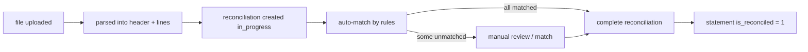

# Cash & Bank

Everything that touches a bank account: the bank/branch/account registry, the book-side cash movements, the imported statements they get matched against, the auto-match rules that do the matching, the period-end reconciliation, and the cash-flow forecast that projects open AR + AP forward.

> **Where do I begin?** Stand up the three-tier registry first ([Banks](#banks) → [Bank Branches](#bank-branches) → [Bank Accounts](#bank-accounts)) and link each account to its GL combination. Once an account exists you can post a [Bank Transaction](#bank-transactions) (the book side), import a [Bank Statement](#bank-statements) (the bank side), and run a [Reconciliation](#bank-reconciliations) to match them — driven by the [Auto-Match Rules](#auto-match-rules) you configure once. [Cash Forecasts](#cash-forecasts) read off open AR/AP and don't need any cash-screen setup.

---

## Table of contents

1. [Banks](#banks)
2. [Bank Branches](#bank-branches)
3. [Bank Accounts](#bank-accounts)
4. [Bank Transactions](#bank-transactions)
5. [Bank Statements](#bank-statements)
6. [Auto-Match Rules](#auto-match-rules)
7. [Bank Reconciliations](#bank-reconciliations) *(see deep-dive: [bank-reconciliation.md](./deep-dives/bank-reconciliation.md))*
8. [Cash Forecasts](#cash-forecasts)

---

## Banks

### What it is

Top of the cash-management hierarchy: the legal entity you keep money with (e.g. *HSBC*, *Citibank*, *DBS Singapore*). Pure registry — no balances, no transactions — just the parent the [Branches](#bank-branches) hang off.

> **Example:** Operator adds `HSBC` with `swift_code = HSBCGB2L`, `country_code = GB`, address of the registered HQ. Two HSBC branches and three accounts get created under it later.

### How records get created

| Method | When |
|---|---|
| Banks screen | The normal path — `POST /erp/cash/banks` from the UI. |
| API | Same endpoint for integrations. |

### Fields

| Field | Required | Notes |
|---|---|---|
| Name | Yes | UNIQUE per tenant (controller rejects duplicates with a clear 422 before hitting the DB). |
| SWIFT / BIC Code | Optional | Free-text, up to 20 chars. Not validated against any registry. |
| Country Code | Optional | 2-letter ISO. Auto-uppercased on save (`gb` → `GB`). |
| Address | Optional | Free-text. |
| Active | Default `true` | Pause without deleting. |

### Actions

- **List / search** — sidebar → Cash & Bank → Banks. Filter by active flag.
- **Create / Edit / Delete** — manager-or-above. Delete is **blocked** if any branch still references the bank ("Bank has branches; delete them first.").

### Gotchas

- The 3-level hierarchy (Bank → Branch → Account) replaces what was a flat `bank_accounts` table in earlier sprints. If you imported a legacy export, you may need synthetic "Branch 1" rows to attach the old accounts to.
- Name uniqueness is **case-sensitive** at the DB layer — `HSBC` and `hsbc` can both exist in the same tenant. Pick a casing convention.

---

## Bank Branches

### What it is

A specific branch under a bank, identified by an institution code that varies by country — IFSC (India), sort code (UK), ABA/routing number (US), BSB (Australia). Stored generically as `branch_code`.

> **Example:** Under `HSBC`, operator adds branch `HSBC Canary Wharf` with `branch_code = 400515` (UK sort code) and the branch address. All three GBP operating accounts then live under this branch.

### How records get created

| Method | When |
|---|---|
| Bank Branches screen | The normal path. |
| API (`POST /erp/cash/bank-branches`) | Bulk-loaded from a treasury import. |

### Fields

| Field | Required | Notes |
|---|---|---|
| Bank | Yes | Must exist in the tenant. Controller validates the FK before insert. |
| Name | Yes | Branch display name. |
| Branch Code | Optional | IFSC / sort code / ABA / BSB. Free-text, up to 40 chars. |
| Address | Optional | Free-text. |
| Active | Default `true` | Pause without deleting. |

### Actions

- **List** — filter by bank or active flag.
- **Create / Edit / Delete** — manager-or-above. Delete is **blocked** if any account still references the branch ("Branch has accounts; delete them first.").

### Gotchas

- Branch codes are **not validated**. A typo in an ABA routing number won't be caught until the bank rejects an outgoing payment.
- Re-parenting a branch (changing `bank_id`) is allowed by the API but should be rare — the audit log records it, but downstream reports that group by bank will show the historical txns under the new bank.

---

## Bank Accounts

### What it is

A specific cash account under a branch — the thing that holds money. Has a currency, an opening balance, a link to the GL combination it posts to, and an optional signing limit. Every [Bank Transaction](#bank-transactions) is against exactly one of these.

> **Example:** Under branch `HSBC Canary Wharf`, operator creates account `HSBC-GBP-OP-001`, account_number `12345678`, IBAN `GB29 NWBK 6016 1331 9268 19`, type `checking`, currency `GBP`, linked to GL combination `01-1010-0000-000` (Cash – HSBC GBP Operating), opening balance £0.00, signing limit £50,000 (payments above that need a second approver).

### How records get created

| Method | When |
|---|---|
| Bank Accounts screen | The normal path — `POST /erp/cash/bank-accounts`. |
| API | Same endpoint for integrations. |

### Fields

| Field | Required | Notes |
|---|---|---|
| Bank Branch | Yes | Must exist in the tenant. |
| Account Number | Yes | UNIQUE per (tenant, branch, account_number). |
| IBAN | Optional | Free-text, up to 40 chars. Not validated against a checksum. |
| Account Name | Yes | Display name (e.g. "HSBC GBP Operating"). |
| Account Type | Default `checking` | ENUM: `checking` / `savings` / `credit_line` / `escrow`. Unknown values silently coerce to `checking` (model line 44). |
| Currency | Default `USD` | 3-letter ISO. Validated against the `currencies` master; unknown codes 422. Auto-uppercased. |
| GL Account Combination | Optional | The `account_combinations.id` the [sub-ledger auto-post](./deep-dives/journal-entries.md) will DR/CR for this account's transactions. Validated against the combinations table. |
| Opening Balance | Default `0` | Decimal(20,4). The starting book balance. |
| Signing Limit | Optional | Decimal(20,4). Threshold above which payments need an extra approver (enforced by the AP payment screens, not here). |
| Active | Default `true` | Pause without deleting. |

### Actions

- **List** — filter by branch, currency, or active flag.
- **Create / Edit** — manager-or-above. Editing checks the same FKs.
- **Delete** — manager-or-above. **Blocked** if any `bank_transactions` *or* `bank_statements` reference the account ("Account has transactions or statements; cannot delete.").

### Gotchas

- **Currency is set at creation and effectively immutable in practice** — the API allows updating it, but every existing transaction's `amount` was recorded in the old currency. Changing it after any txn is posted will misreport balances. Create a new account instead.
- The IBAN field has **no uniqueness constraint** — two accounts with the same IBAN won't fail at insert. Operationally you'll only notice when a wire returns ambiguously.
- A bank account without a `gl_account_combination_id` will still accept transactions, but the sub-ledger auto-post for `event_type = 'bank_transaction'` will have no DR target and skip the journal silently — see [GL Auto-Post](./deep-dives/journal-entries.md) for the warning behaviour.
- `account_type = 'credit_line'` is a *liability* account — your reports should sign-flip it when rolling up total cash.

---

## Bank Transactions

### What it is

A single book-side credit or debit on a [Bank Account](#bank-accounts). `amount` is **always positive**; `direction` (`in` / `out`) carries the sign. Every cash movement the company knows about lives here — a vendor payment, a customer payment, a manual bank fee, a transfer leg, an adjustment. These are the rows a [Reconciliation](#bank-reconciliations) matches the bank's [Statement Lines](#bank-statements) against.

> **Example:** AP team posts payment for vendor bill `BILL-2026-0419` of $3,200. The vendor-payments screen calls `BankTransaction::create()` with `direction = 'out'`, `amount = 3200.00`, `source_type = 'vendor_payment'`, `source_id = <payment_id>`. A sub-ledger journal is auto-posted (DR AP Clearing 3,200 / CR Cash 3,200). Two days later the bank statement arrives; auto-match links the statement line to this transaction and flips `reconciled = 1`.

### How records get created

| Method | When |
|---|---|
| Bank Transactions screen | Manual entry — bank fee, interest, internal transfer leg. `source_type = 'manual'`. |
| Vendor payment | AP screens post one with `source_type = 'vendor_payment'`, `source_id = <vendor_payment_id>`. |
| Customer payment | AR screens post one with `source_type = 'customer_payment'`, `source_id = <customer_payment_id>`. |
| Internal transfer | Two rows are created — `out` on the source account, `in` on the destination. `source_type = 'transfer'`. |
| Adjustment | Cash reconciliation correction. `source_type = 'adjustment'`. |

### Fields

| Field | Required | Notes |
|---|---|---|
| Bank Account | Yes | Must exist in the tenant. |
| Transaction Date | Yes | Date — not datetime. |
| Description | Optional | Up to 500 chars. |
| Amount | Yes | Decimal(20,4). **Must be > 0** — controller rejects zero or negative ("amount must be > 0 (direction carries the sign)."). |
| Direction | Yes | ENUM: `in` (inflow) / `out` (outflow). |
| Reference | Optional | Free-text — typically your internal cheque number / wire reference. |
| Source Type | Default `manual` | ENUM: `manual` / `customer_payment` / `vendor_payment` / `transfer` / `adjustment`. Unknown values coerce to `manual`. |
| Source ID | Optional | FK into the upstream document (vendor_payment / customer_payment / etc). Not constrained — informational. |
| Reconciled | Auto | `0` on create. Flipped to `1` by the reconciliation service when a statement line matches. Cannot be set directly via the API. |
| Reconciled At | Auto | Stamped when `reconciled` flips. |
| Notes | Optional | Free-text. |

### Lifecycle

```mermaid
flowchart LR
    OPEN[unreconciled] -->|match (auto or manual)| REC[reconciled]
    REC -->|unmatch| OPEN
```

CAS-guarded on both edges (`markReconciled` / `clearReconciled` only fire if the flag is currently in the expected state) so two concurrent auto-match runs can't double-count the same transaction.

### Actions

- **List** — filter by account, reconciled flag, date range.
- **Create** — writer-or-above. Posts the row and triggers the `event_type = 'bank_transaction'` sub-ledger template (DR Cash / CR Clearing or reverse, depending on direction) when a template is configured.
- **Edit / Delete** — writer-or-above, but **blocked once the txn is reconciled** ("Cannot edit a reconciled transaction; unmatch first.") and **blocked if a GL journal has been auto-posted** ("Cannot edit a bank transaction that has an auto-posted GL journal; reverse the journal first.").

### Gotchas

- Amount is always positive, sign is in `direction`. If you write `amount = -100, direction = 'in'` the API rejects with 422 — but if you write `amount = 100, direction = 'in'` for what was actually an outflow, the system will happily post it and your reconciliation will silently fail to match. Operator entry is the only check.
- The sub-ledger auto-post hard-codes `currency = 'USD'` when calling `SubLedgerPostingService::postFor` for bank transactions (controller line 49). A non-USD account will book a foreign-currency journal *labelled* USD until that hard-code is replaced — open a ticket if you see this in a non-USD tenant.
- `source_type` does **not** include `bank_statement_match`. Bank-statement matching writes to `bank_statement_lines.matched_transaction_id` (link), not to a new bank transaction.
- Deleting an unreconciled, non-posted transaction is fine; but if the journal was already posted, you must reverse the journal first — there is no "undo a post" button on this screen.

---

## Bank Statements

### What it is

A statement issued by the bank, imported (or manually typed) so its lines can be matched against the book-side [Bank Transactions](#bank-transactions). The header carries the opening/closing bank balance and the format; the lines are the individual credits and debits.

> **Example:** Treasury downloads the MT940 file from HSBC for account `HSBC-GBP-OP-001`, statement date 2026-06-08, opening £124,500.30, closing £119,170.42. Upload creates the header (`format = 'mt940'`) and 17 statement lines. A reconciliation against this statement auto-matches 14 of the 17 to existing bank_transactions; operator manually matches 2 more and creates 1 new transaction (a bank fee that wasn't on the books yet) before completing.

### How records get created

| Method | When |
|---|---|
| Bank Statements screen | Operator uploads a parsed file or types lines manually. `POST /erp/cash/bank-statements` creates the header (and optionally lines in the same call, wrapped in a single transaction). |
| Add lines | `POST /erp/cash/bank-statements/{id}/lines` appends to an existing un-reconciled statement, continuing the `line_no` sequence. |

### Fields (header)

| Field | Required | Notes |
|---|---|---|
| Bank Account | Yes | Must exist in the tenant. |
| Statement Date | Yes | Date. UNIQUE per (tenant, account, date) — duplicate uploads return a clear 422 before the DB UNIQUE fires. |
| Opening Balance | Default `0` | Decimal(20,4). What the bank says you started with. |
| Closing Balance | Default `0` | Decimal(20,4). What the bank says you ended with. |
| Imported File URL | Optional | Pointer to the parsed source file (S3 / local store). Informational only. |
| Format | Default `manual` | ENUM: `csv` / `mt940` / `bai2` / `manual`. Unknown values coerce to `manual`. |
| Is Reconciled | Auto | `0` on create. Flipped to `1` by [CashReconciliationService::complete](#bank-reconciliations) when **every** line on the statement has been matched. |
| Notes | Optional | Free-text. |

### Fields (per line)

| Field | Required | Notes |
|---|---|---|
| Line No | Auto | Continues the existing max line_no on append. |
| Transaction Date | Yes | Date. |
| Description | Optional | The bank's narration (up to 500 chars). |
| Amount | Yes | **Must be > 0**. `addLines` rejects zero or negative. |
| Direction | Yes | ENUM: `in` / `out`. Required — unlike header fields this is **not** silently defaulted; missing values fail validation. |
| Bank Reference | Optional | Bank's reference number for the line (FT reference, cheque number, etc.). |
| Matched Transaction | Auto | NULL until matched. CAS-guarded on the match — a second match attempt on an already-matched line is a no-op. |
| Matched At / By | Auto | Stamped when match succeeds. |

### Statement-import flow



### Actions

- **List** — filter by bank account. Index returns `line_count` and `matched_count` per statement so you can see the reconciliation progress at a glance.
- **Show** — header + every line, with the matched transaction's date and amount joined in.
- **Create** — manager-or-above. Header + optional lines in one atomic call (rollback on any bad line).
- **Add lines** — manager-or-above. Appends to an un-reconciled statement; refuses if `is_reconciled = 1`.
- **Edit / Delete** — manager-or-above. **Blocked once `is_reconciled = 1`**. Delete cascades to the statement lines.

### Gotchas

- The (tenant, account, date) UNIQUE means **re-uploading the same statement file** for the same day returns 422. If the first upload was partial and you want to retry, delete the existing un-reconciled statement first.
- File format is purely informational — the actual parsing happens **before** the API is called (the loader picks MT940 / BAI2 / CSV per tenant config and posts the normalised payload). The `format` value is a label so reports can group "MT940 imports last quarter".
- `format = 'manual'` is what the operator picks when typing lines by hand. There is no automatic parser for `format = 'manual'`.
- Statement lines have **no UNIQUE on `bank_reference`** — duplicate bank-side rows are possible if the bank sends a corrected file. The operator has to spot and remove them before matching.

---

## Auto-Match Rules

### What it is

Per-tenant configuration of how the auto-match step pairs statement lines to bank_transactions. Each rule says "match on amount within ± tolerance, and date within ± N days". Rules are tried in `priority ASC` order; first hit wins. A rule with `bank_account_id = NULL` applies to **every** account; a rule with an account_id applies only to that account.

> **Example:** Tenant has two rules: priority 10 `Exact match` (`match_by_amount=1, match_by_date=1, tolerance_amount=0, tolerance_days=0`) — applies to all accounts; priority 50 `2-day tolerance for vendor wires` (`tolerance_amount=0, tolerance_days=2`) — applies only to the GBP operating account. When auto-matching a statement line, the exact-match rule runs first; if it finds nothing, the tolerance rule fires. If no rules are configured at all, the service falls back to a built-in default: exact amount, same date, same direction.

### How records get created

| Method | When |
|---|---|
| Auto-Match Rules screen | The normal path — `POST /erp/cash/bank-reconciliation-rules`. |
| API | Same endpoint. |

### Fields

| Field | Required | Notes |
|---|---|---|
| Bank Account | Optional | NULL = applies to every account in the tenant. Otherwise validated as an existing account. |
| Name | Yes | Free-text label for the operator (e.g. "Exact match", "Vendor wires ± 2 days"). Not enforced unique. |
| Match by Amount | Default `1` | When set, the candidate transaction's `amount` must satisfy `ABS(amount - line.amount) <= tolerance_amount + 0.0001`. |
| Match by Date | Default `1` | When set, the candidate transaction's `transaction_date` must satisfy `ABS(DATEDIFF(transaction_date, line.transaction_date)) <= tolerance_days`. |
| Tolerance Amount | Default `0` | Decimal(20,4). Cannot be negative (controller 422). |
| Tolerance Days | Default `0` | Integer. Cannot be negative. |
| Priority | Default `100` | Lower = tried first. Ties resolved by `id ASC`. |
| Active | Default `true` | Inactive rules are skipped by the service. |

### How matching works

For each unmatched statement line on the open reconciliation, the [service](#bank-reconciliations) walks `activeForAccount(tenant, account)` in priority order, and for each rule SELECTs the **first** bank transaction that:

- belongs to the same `bank_account_id`,
- is currently `reconciled = 0`,
- has the **same `direction`** (in/in or out/out — directions never cross),
- (if `match_by_amount`) is within `tolerance_amount`,
- (if `match_by_date`) is within `tolerance_days`,

ordered by `ABS(DATEDIFF(transaction_date, line_date)) ASC, ABS(amount - line_amount) ASC, id ASC` — i.e. the **closest** date, then closest amount, then oldest record. The match is then committed via a CAS so two concurrent auto-match runs can't link the same transaction twice.

### Actions

- **List** — filter by account or active flag. Always returned in `(priority ASC, id ASC)` order.
- **Create / Edit / Delete** — manager-or-above. Negative tolerances are rejected at validation.

### Gotchas

- **No structured criteria JSON** — the model exposes only the four primitive knobs (`match_by_amount`, `match_by_date`, `tolerance_amount`, `tolerance_days`). Description-substring matching, counter-party matching, etc. aren't supported by the current service; if you need them, do manual matches.
- The fallback default ("exact match") only kicks in when **zero** active rules apply. If you have *any* rule on the account, the fallback does not run — so a single mis-configured high-priority rule can shadow what you wanted.
- A rule with both `match_by_amount = 0` and `match_by_date = 0` will match the **first unreconciled same-direction transaction on the account** — which is almost never what you want. The service does not guard against this; configure your rules carefully.
- Tolerance is applied with a `+ 0.0001` epsilon on amount to dodge BCD/float rounding noise.

---

## Bank Reconciliations

### What it is

The worklist for a period's match exercise. Created per `(bank_account, statement)`; records the book balance, the bank balance, the difference, and (once closed) the user who completed it. The actual match work happens against `bank_statement_lines` ↔ `bank_transactions`; this row is the wrapper that holds the close-out audit.

> **Example:** Treasury opens a reconciliation for account `HSBC-GBP-OP-001` against the 2026-06-08 statement. `book_balance = £119,250.42` (from the GL Cash combination), `bank_balance = £119,170.42` (from the statement), `difference = -£80.00`. They run auto-match (links 14 of 17 lines), manually match 2, post a missing £80 bank-fee transaction and manually match the 17th, then click **Complete**. Status flips `in_progress → completed`, `completed_by/at` stamped; because no statement lines remain unmatched, the parent statement also flips to `is_reconciled = 1`.

### How records get created

| Method | When |
|---|---|
| Bank Reconciliations screen | The normal path — `POST /erp/cash/bank-reconciliations`. |
| API | Same endpoint. |

### Fields

| Field | Required | Notes |
|---|---|---|
| Bank Account | Yes | Validated against the tenant. |
| Statement | Optional | If supplied, must belong to the same bank account (controller 422 if mismatched). The auto-match action requires a statement to be attached. |
| Reconciled Date | Default today | The period-end date the reconciliation covers. |
| Book Balance | Default `0` | What the GL says the cash account is at. Decimal(20,4). |
| Bank Balance | Default `0` | What the bank says the cash account is at. Decimal(20,4). |
| Difference | Auto | `bank_balance - book_balance`, rounded to 4dp. Recomputed on every balance update. |
| Status | Auto | `in_progress` on create. See lifecycle. |
| Completed By / At | Auto | Stamped on `complete`. |
| Notes | Optional | Free-text. |

### Lifecycle

```mermaid
flowchart LR
    IP[in_progress] -->|complete (CAS)| CO[completed]
    IP -->|cancel| CA[cancelled]
```

`transitionStatus()` is CAS-guarded by `status IN (allowedFrom)` — a second `complete` after the first one already won returns 422 ("Reconciliation changed state concurrently."). The `cancelled` terminal state exists in the ENUM but no controller action exposes it today; cancellation is by direct DELETE, which is permitted only when status is still `in_progress`.

### Actions

- **List** — filter by account, status.
- **Show** — header with account_number and currency joined in.
- **Create** — manager-or-above. New row starts `in_progress`.
- **Auto-Match** — writer-or-above. `POST /erp/cash/bank-reconciliations/{id}/auto-match`. Walks active rules, returns `{matched, skipped, total}`. Refuses if no statement is attached.
- **Manual Match** — writer-or-above. `POST /erp/cash/bank-reconciliations/match` with `{line_id, transaction_id}`. Validates same account, matching direction, both currently unmatched.
- **Unmatch** — writer-or-above. `POST /erp/cash/bank-reconciliations/unmatch` with `{line_id}`. Clears both sides of the link.
- **Complete** — manager-or-above (approver role). `POST /erp/cash/bank-reconciliations/{id}/complete`. CAS `in_progress → completed`. Also flips the parent statement to `is_reconciled = 1` **iff every line is matched**.
- **Delete** — manager-or-above. Only allowed while status is still `in_progress` ("Only in_progress reconciliations can be deleted.").

### Gotchas

- **Auto-match needs a statement.** Creating a reconciliation without `statement_id` is permitted, but `autoMatch` will reject ("Reconciliation has no statement attached to match against."). For "rolling" reconciliations done without a formal statement, you'll only have manual-match available.
- **Direction must agree.** The matcher refuses to pair an `in` statement line with an `out` bank transaction even if amount and date line up — the AR/AP side can't have got the sign wrong silently.
- **Completing does NOT require zero difference.** A reconciliation can be completed with a non-zero `difference` — the system records the gap rather than blocking the close. Operationally you should explain the gap in `notes` before clicking complete; auditors will read it.
- **Statement `is_reconciled` is only set when 100% matched.** If you complete a reconciliation with three lines still unmatched, the statement stays `is_reconciled = 0` and can still be edited.
- **Half-match orphan recovery.** If the CAS on `markReconciled` loses its race after the line was linked, the service tries to clear the line link too. If *that* also loses, the service logs a loud error (`autoMatch orphan: ...`) so the operator can repair the data — see `CashReconciliationService.php` line 67.
- **Unmatch drift logging.** Similarly, if you unmatch a line whose paired transaction was never marked reconciled (data drift from an older bug), `unmatch` still succeeds but logs `unmatch drift: ...` for the operator to investigate.

For the end-to-end statement-import → auto-match → completion walkthrough see [deep-dives/bank-reconciliation.md](./deep-dives/bank-reconciliation.md).

---

## Cash Forecasts

### What it is

A snapshot projection of cash inflows and outflows over a horizon, bucketed per due date. Built by reading open AR + open AP and grouping each invoice/bill into the date it's due on. Forecast lines are immutable once generated — re-run to refresh.

> **Example:** CFO clicks **Generate** with `as_of_date = 2026-06-09`, `horizon_days = 60`, `currency = GBP`. The service pulls every `customer_invoices` row with `status IN ('sent','partially_paid')` and `balance_due > 0` in GBP, plus every `vendor_bills` row with `status IN ('approved','partially_paid')` and `balance_due > 0` in GBP, clamps each due date into `[2026-06-09, 2026-08-08]` (past-due snaps to today, beyond-horizon is dropped), and inserts one forecast line per document. Reports then aggregate by `date_bucket` to draw the cash curve.

### How records get created

| Method | When |
|---|---|
| Cash Forecasts screen | The normal path — `POST /erp/cash/cash-forecasts/generate`. |
| API | Same endpoint. |

### Fields (header)

| Field | Required | Notes |
|---|---|---|
| As-of Date | Default today | The "start of forecast" date. |
| Horizon Days | Default `90` | Integer 1–3650. Anything outside that returns 422 at the controller. |
| Currency | Default tenant functional currency | 3-letter ISO. Auto-uppercased. The service **always filters by currency** so you never sum across currencies (generate one forecast per currency you need to see). Falls back to USD if neither the param nor `tenants.functional_currency` / `tenants.default_currency` is set. |
| Notes | Auto | Stamped with `"Open AR + AP (<CCY>) through <horizon_end>"`. |
| Created By | Auto | Stamped on insert. |

### Fields (per line)

| Field | Source | Notes |
|---|---|---|
| Source Type | ENUM | `open_ar` / `open_ap` / `manual`. The generator only emits `open_ar` and `open_ap`; `manual` lines exist in the schema but no UI action adds them today. Unknown values coerce to `manual`. |
| Source ID | The invoice / bill id | Informational. |
| Date Bucket | Clamped due date | `due_date` snapped into `[as_of_date, as_of_date + horizon_days]`. Invoices/bills without a due date are treated as due on `as_of_date`. Beyond-horizon documents are dropped, not bucketed at the edge. |
| Inflow | `customer_invoices.balance_due` | Only set for `open_ar` lines. Rounded to 4dp. |
| Outflow | `vendor_bills.balance_due` | Only set for `open_ap` lines. Rounded to 4dp. |
| Description | Auto | `"Customer invoice <number>"` or `"Vendor bill <number>"`. |

### Actions

- **List** — header listing returns line count, total inflow, total outflow per forecast.
- **Show** — header + lines, ordered by `date_bucket ASC`.
- **Generate** — writer-or-above. `POST /erp/cash/cash-forecasts/generate` with `{as_of_date?, horizon_days?, currency?}`. Wrapped in a single transaction — if any line insert fails, the whole forecast rolls back.
- **Delete** — manager-or-above. Cascades to the forecast lines.

### Gotchas

- **No `manual` / `recurring` / `payroll` source types are populated today.** The schema's `source_type` enum is `('open_ar','open_ap','manual')` and the generator only writes the first two. Recurring invoices and payroll obligations are *not* on the curve until you take them from another screen and feed them in manually (no UI for that yet).
- **Currency is mandatory, even if implicit.** You will never get a forecast that mixes GBP and USD — the generator hard-filters on one currency. Run it twice if you operate in two.
- **Past-due is "due now".** An invoice that was due 2026-03-15 with `as_of_date = 2026-06-09` snaps to a `date_bucket` of 2026-06-09 (the as-of), not the original due date. That keeps the curve clean but means you can't tell aged-past-due from due-today on the forecast alone — use the AR aging report for that.
- **No idempotency.** Generating twice in a row creates two forecast rows. There is no "regenerate-in-place"; delete the old one if you want a clean replacement.
- **Forecasts are immutable.** No edit endpoints for the header or lines. The expected workflow is: regenerate → compare → delete the old.

---

## Cross-references

- **Finance** — [GL Account Combinations](./finance.md#account-combinations) own the `gl_account_combination_id` each Bank Account links to. The sub-ledger template `event_type = 'bank_transaction'` posts the DR/CR for every bank transaction — see [Sub-Ledger Postings](./gl.md#sub-ledger-postings).
- **General Ledger** — `book_balance` on a [Reconciliation](#bank-reconciliations) is the period-end balance of the bank account's GL combination; differences post via manual journals.
- **Procurement** — [Vendor Payments](./procurement.md) write `bank_transactions` with `source_type = 'vendor_payment'`. Open vendor bills feed the `open_ap` lines on a [Cash Forecast](#cash-forecasts).
- **Sales & AR** — [Customer Payments](./sales-ar.md) write `bank_transactions` with `source_type = 'customer_payment'`. Open customer invoices feed the `open_ar` lines on a [Cash Forecast](#cash-forecasts).
- **Multi-Entity** — Each Bank Account belongs to a single tenant (legal entity); inter-company cash movements go through two transactions (one per entity) plus an [InterCompanyTransaction](./multi-entity.md) header.
- **Reports** — Cash-position and forecast-vs-actual reports read off `bank_transactions` (settled book balance) and `cash_forecast_lines` (projected) respectively.
