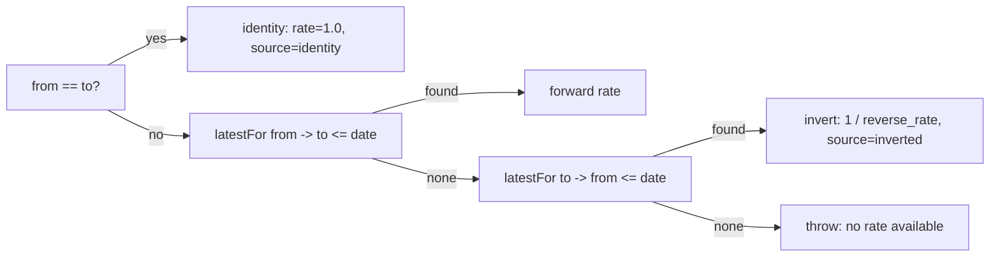
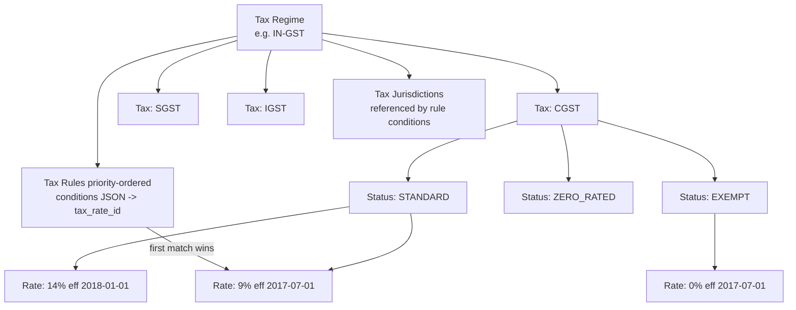
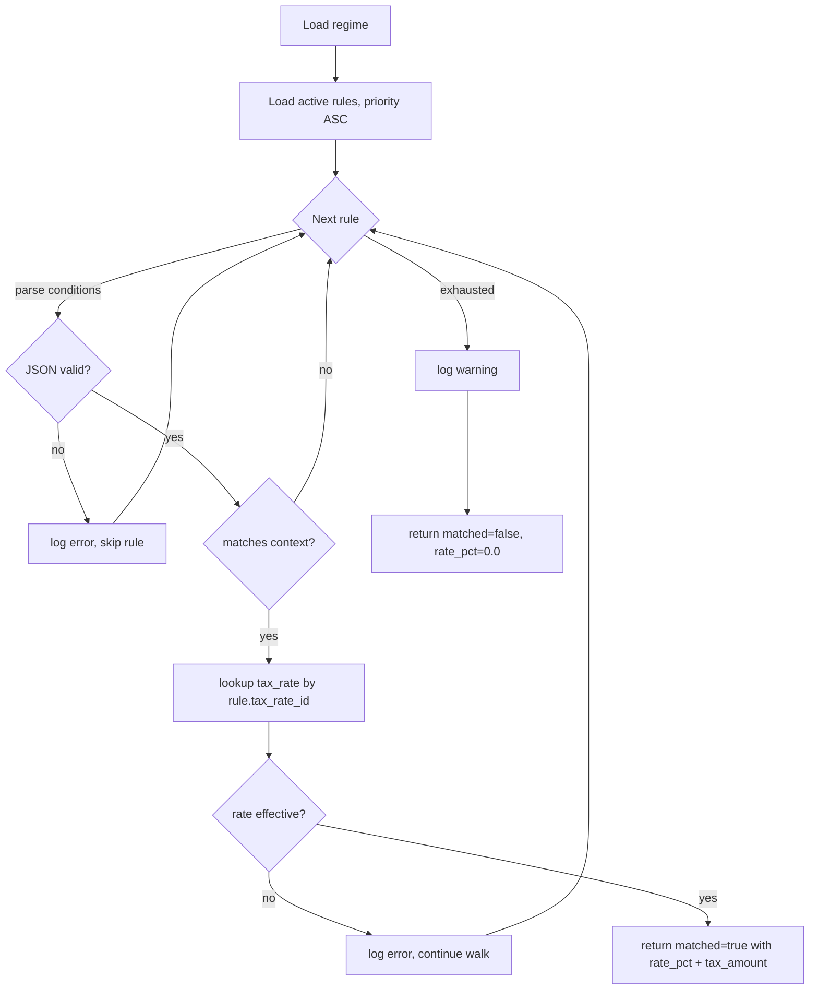
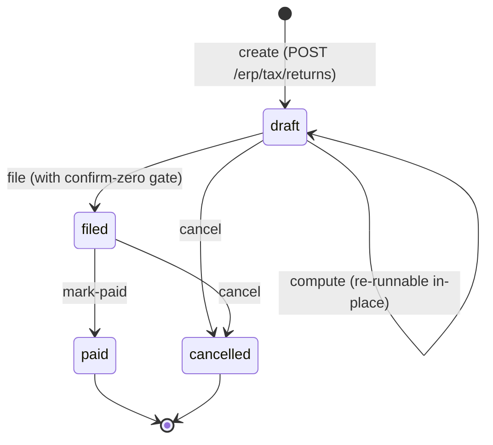
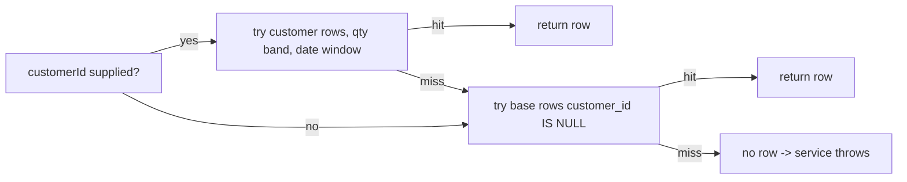
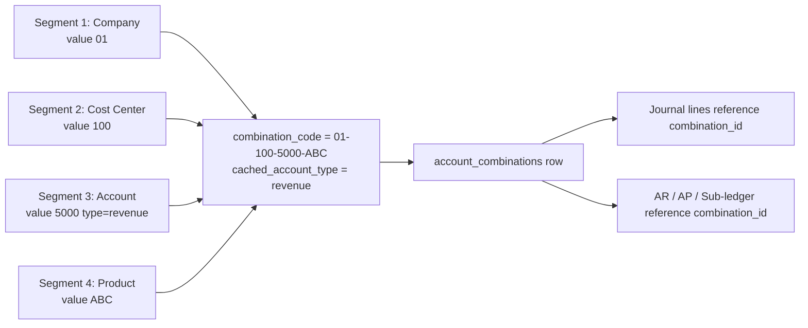

# Finance, Tax & Master Data

The shared backbone the rest of the ERP reads from. Currencies, FX rates, the tax-determination engine, payment terms, price lists, and the Chart-of-Accounts Key Flexfield all live here. Get these wrong on day 1 and every downstream invoice, journal, and report is wrong too — so this is the setup module to take seriously before you start posting transactions.

> **Where do I begin?** Activate the currencies you'll transact in ([Currencies](#currencies)) and load opening FX rates ([Exchange Rates](#exchange-rates)). Then build your Chart of Accounts: define [CoA Segments](#coa-segments) → seed [CoA Segment Values](#coa-segment-values) → generate [Account Combinations](#account-combinations) — every journal line in the [GL](./gl.md) will reference a combination. Finally, set up [Payment Terms](#payment-terms) (sales/AP both need them) and at least one default [Price List](#price-lists) per currency. Tax setup (regimes → taxes → statuses → rates → rules) can wait until you're ready to invoice; the [Tax Determination](#tax-determination) screen lets you dry-run before going live.

---

## Table of contents

1. [Currencies](#currencies)
2. [Exchange Rates](#exchange-rates)
3. [Tax Regimes](#tax-regimes)
4. [Taxes](#taxes)
5. [Tax Statuses](#tax-statuses)
6. [Tax Rates](#tax-rates)
7. [Tax Jurisdictions](#tax-jurisdictions)
8. [Tax Rules](#tax-rules)
9. [Tax Determination](#tax-determination)
10. [Payment Terms](#payment-terms)
11. [Price Lists](#price-lists)
12. [Price List Items](#price-list-items)
13. [CoA Segments](#coa-segments)
14. [CoA Segment Values](#coa-segment-values)
15. [Account Combinations](#account-combinations)

---

## Currencies

### What it is

The global registry of currency codes the platform understands. A shared table (not per-tenant) — tenants reference currencies by their three-letter code; only super-admin can mutate the registry. Reads are open to every user.

> **Example:** `USD` (symbol `$`, name "US Dollar", decimal_places 2), `INR` (symbol `₹`, name "Indian Rupee", decimal_places 2), `JPY` (symbol `¥`, name "Japanese Yen", decimal_places **0** — JPY has no fractional unit, so amounts round to whole yen).

### How records get created

| Method | When |
|---|---|
| Seeded | The major ISO-4217 currencies ship pre-loaded with the platform. |
| Manual (super-admin only) | Add a niche currency (e.g. crypto, regional accounting unit). |

### Fields

| Field | Required | Notes |
|---|---|---|
| Code | Yes | `CHAR(3)`, PRIMARY KEY. Always stored upper-case (auto-upper on write). |
| Symbol | Auto | Defaults to the code if not supplied. `VARCHAR(8)` — covers multi-char symbols like "kr". |
| Name | Auto | Defaults to the code if not supplied. |
| Decimal Places | Default 2 | `TINYINT UNSIGNED`. JPY = 0, BHD = 3, etc. Drives rounding everywhere a money column is presented. |
| Active | Default 1 | Inactivating a currency hides it from pickers without breaking historical records that reference it. |

### Actions

- **List** — filter by `is_active`. Sorted by code ASC.
- **Create / Update / Delete** — super-admin only. Reads are open to everyone.

### Gotchas

- The PK is the **code itself**, not an integer id. References from `exchange_rates.from_currency`, `price_lists.currency`, etc. are by `CHAR(3)`, so a typo in a code on insert creates an orphan reference at write time — there's no FK auto-correction.
- Decimal places is informational for display/rounding helpers; the underlying DECIMAL columns store all currencies at the same precision (typically 20,4). Don't try to "fix" JPY rounding by editing decimal_places later — historical rounding will look inconsistent.
- Inactivating a currency does **not** cascade-inactivate price lists or FX rates that reference it. Those keep working; the picker just hides the currency for new entries.
- Codes are always upper-cased on write (`strtoupper` in the model). Reads through `find($code)` also upper-case before lookup, so `find('usd')` resolves to `USD`. Don't rely on case to distinguish currencies.
- Deleting a currency the platform ships with is allowed (super-admin), but breaks every tenant that references it. Treat the registry as immutable in production; add, don't remove.

---

## Exchange Rates

### What it is

Per-tenant FX rates between two currencies on a specific date. The lookup service consumes the most recent rate at or before the conversion date — so you only need to load rates when they change, not every day.

> **Example:** USD→INR rate 83.25 effective 2026-05-01 (source `manual`). On 2026-05-15 a conversion of 100 USD looks up the most-recent rate ≤ 2026-05-15 → finds the 2026-05-01 row → returns 8,325 INR. On 2026-05-20 you load a new rate 83.40 effective 2026-05-20; conversions from that date forward use the new rate, older dates still use 83.25.

### How records get created

| Method | When |
|---|---|
| Manual (UI / API) | Treasurer types in the daily/monthly rate. |
| API ingestion (planned) | Hook into an external feed (e.g. central-bank rate). When the platform ingests programmatically, `source` = `api`. |
| Historical backfill | One-off bulk load (`source` = `historical`) for go-live cutover. |

### Fields

| Field | Required | Notes |
|---|---|---|
| From / To Currency | Yes | Both stored upper-case. Pair is unidirectional — see Inversion gotcha below. |
| Rate | Yes | `DECIMAL(20,10)` — supports both very small (cryptos) and very large rates. Stored as "1 unit of FROM = rate units of TO". |
| Effective Date | Default = today | The earliest date this rate applies. |
| Source | Default `manual` | Enum: `manual` / `api` / `historical`. Anything else gets coerced back to `manual` on write. |
| Notes | Optional | Free-text (e.g. "RBI reference rate"). |

### Lookup behaviour

`ExchangeRateService::convert` walks this decision tree:



- **Identity** when from == to: returns rate 1.0, no DB hit, source flagged `identity`.
- **Forward**: rate row exists for the pair in the requested direction.
- **Inverted**: only the opposite pair exists; service flips it (`1 / reverse_rate`) so a single direction in the table covers both. The result's `source` field is `inverted` and `rate_id` points to the **reverse** rate row.
- **Failure**: throws — service refuses to silently return the input amount when no rate exists.

### Actions

- **List** — filter by from/to currency. Sorted effective_date DESC.
- **Create / Update / Delete** — manage per-pair rate timeline.
- **Convert (`POST /erp/finance/fx/convert`)** — dry-run an FX conversion: `{ from, to, amount, on_date? }` → returns `{ rate, converted, effective_date, source, rate_id }`.

### Gotchas

- `latestFor` is **most-recent ≤ date**. A future-dated rate (effective_date in the future) does not affect today's lookups — useful for staging a rate change in advance without disturbing live conversions.
- The inverse-pair fallback writes `source=inverted` on the result so consuming code can tell "I used the inverse" from "I had a direct rate." Reconciliation reports should preserve this flag.
- A stored rate ≤ 0 on the **reverse** pair makes the inverter throw — there's no silent divide-by-zero or sign flip. Fix the bad row.
- Effective date is a date, not a datetime — you can't store mid-day rate changes. If you need intraday FX, you'll need two rows on the same date or model it differently.
- Tie-breaker when two rows share the same `effective_date` for the same pair: the higher `id` wins (the most recently created row). Treat that as an audit-detectable accident rather than a feature — never rely on it.
- The list endpoint returns rows sorted `effective_date DESC, id DESC` — the same order the lookup uses internally. The top row is what will be applied to a "today" conversion.
- For period-end revaluation of foreign-currency balances ([Cash & Bank](./cash-bank.md)), load one row per pair per period-end date (e.g. 2026-03-31, 2026-06-30, …). The lookup naturally finds the right rate for any in-period transaction.

---

## Tax Regimes

### What it is

The top of the Oracle E-Business-Tax-style hierarchy. A regime represents a single tax authority's framework: India GST, US Sales Tax, EU VAT, etc. Every [Tax](#taxes), [Status](#tax-statuses), [Rate](#tax-rates), and [Rule](#tax-rules) hangs off a regime.

### Tax hierarchy at a glance



A determination call names one regime. The engine walks that regime's rules in priority order; the first match's `tax_rate_id` resolves to a concrete Rate (under a Status, under a Tax, under the Regime).

> **Example:** `IN-GST` (name "India Goods & Services Tax", country IN, effective_from 2017-07-01). Its child taxes are `CGST`, `SGST`, `IGST`. A separate `US-SALES` regime (country US) holds state sales-tax structures; `EU-VAT` holds member-state VAT. A transaction picks **one** regime when calling [Tax Determination](#tax-determination) — rules walk only within that regime.

### How records get created

UI / API only. There's no seeding; every tenant defines the regimes they actually transact under.

### Fields

| Field | Required | Notes |
|---|---|---|
| Code | Yes | `VARCHAR(40)`. UNIQUE per tenant. Conventional pattern `COUNTRY-TAX` (e.g. `IN-GST`, `US-SALES`). |
| Name | Yes | Display name. |
| Country Code | Optional | `CHAR(2)`. Auto-uppercased. Informational — does **not** restrict which transactions can use the regime. |
| Description | Optional | Free-text. |
| Effective From | Optional | The date the regime came into force in the real world. Informational; the actual gating happens at [Tax Rates](#tax-rates). |
| Active | Default 1 | Inactive regimes refuse new rule creation but legacy rules still resolve. |

### Actions

- **List / Filter** by `is_active`. Sorted by code.
- **Create / Update / Delete** — manage the registry.

### Gotchas

- The hierarchy is strict: a Tax must belong to a Regime, a Status to a Tax, a Rate to a Status. Deleting a Regime with children fails at the FK level — clean up bottom-up.
- A regime with **zero rules** is a legitimate config (e.g. a no-tax placeholder for an exempt jurisdiction). [Tax Determination](#tax-determination) returns `matched=false` and logs a *warning* (not an error) in that case.

---

## Taxes

### What it is

A specific tax under a regime. Under `IN-GST` you'd have `CGST` (Central GST), `SGST` (State GST), `IGST` (Integrated GST). Under `US-SALES` you might have one row per state. A transaction can resolve to **one** tax via a matched [Tax Rule](#tax-rules); a separate determination call (or a multi-rule rule cascade) is needed when multiple taxes apply (e.g. CGST+SGST).

> **Example:** Under regime `IN-GST`:
> - `CGST` (Central GST), authority "Central Board of Indirect Taxes & Customs"
> - `SGST` (State GST), authority "State Govt of <state>"
> - `IGST` (Integrated GST), authority "CBIC"

### Fields

| Field | Required | Notes |
|---|---|---|
| Regime | Yes | FK → tax_regimes. |
| Code | Yes | `VARCHAR(40)`. UNIQUE per (tenant, regime). |
| Name | Yes | Display name. |
| Tax Authority | Optional | Free-text — used on filed returns / e-invoice payloads. |
| Active | Default 1 | Inactive taxes hide from new status creation. |

### Actions

- **List** — joins `tax_regimes` to surface `regime_code`. Filter by `regime_id` and `is_active`. Sorted by regime then tax code.
- **Create / Update / Delete** — standard CRUD.

### Gotchas

- Moving a tax to a different regime (PUT with new `regime_id`) does not migrate its existing statuses/rates — but those still point at this tax. So you can effectively reparent the whole sub-tree by editing one row. Useful for restructuring; dangerous if you forget to update determination rules that scoped by regime.

---

## Tax Statuses

### What it is

A status under a tax distinguishes how the tax applies to a transaction: `STANDARD` (regular rate), `EXEMPT` (no tax, often reported), `ZERO_RATED` (taxable at 0%, refundable input credit), `REDUCED` (concessional rate). Each status owns its own effective-dated rate timeline ([Tax Rates](#tax-rates)).

> **Example:** Under tax `CGST`:
> - `STANDARD` (is_default = 1) — the regular rate timeline (5%, 9%, 14% slabs)
> - `EXEMPT` — for goods that the law exempts; rate row at 0%
> - `ZERO_RATED` — for exports; reported separately on returns

### How records get created

UI / API. The "default" flag is mutually exclusive within a tax — see Invariant below.

### Fields

| Field | Required | Notes |
|---|---|---|
| Tax | Yes | FK → taxes. |
| Code | Yes | UNIQUE per (tenant, tax). Conventionally upper-case constant (`STANDARD`, `EXEMPT`, etc.). |
| Name | Yes | Display name. |
| Is Default | Default 0 | At most one default status per tax. The model enforces this atomically. |
| Active | Default 1 | |

### "Default status" invariant

At most one status per tax has `is_default = 1`. The model wraps **clear-other-defaults + INSERT/UPDATE** in a transaction (atomic) so:

- Toggling a status to default clears the flag on the prior default first.
- Moving a default status to a different tax (PUT changes `tax_id`) clears any pre-existing default on the new parent tax — preventing two-default rows on the new tax.
- A failed INSERT after the clear rolls back, so the tax never silently ends up with **zero** defaults.

### Actions

- **List** — filter by `tax_id`. Sorted by tax then code.
- **Create / Update / Delete** — standard.

### Gotchas

- The default flag is **not** what determination uses to pick a rate — [Tax Rules](#tax-rules) reference a `tax_rate_id` directly. The default is just a UI hint and a fallback hook for downstream features.
- Deleting a status with rates underneath will FK-fail. Drop the rates first.
- Reparenting a status (PUT changes `tax_id`) is supported. The model atomically re-evaluates the default invariant for the **new** parent — if the moved row is default and the new parent already has a default, the new parent's prior default is cleared. The old parent is **not** auto-bumped to a new default; that's a deliberate decision (the operator who moved a default knows what they're doing).
- A tax with zero statuses is legal but useless — no rate can hang off it, and determination won't surface it. The CRUD doesn't prevent this; it shows up as an empty rate timeline at the next layer.

---

## Tax Rates

### What it is

The effective-dated percentage under a status. Rates are time-bounded — a rate row covers `[effective_from, effective_to]` (effective_to is nullable = "open-ended"). [Tax Determination](#tax-determination) resolves a rule to a specific `tax_rate_id`; the rate must be active **and** effective on the request date or determination falls through to the next rule.

> **Example:** Under status `CGST/STANDARD`:
> - Rate `STANDARD-9` at 9.0000% effective 2017-07-01 to 2019-06-30
> - Rate `STANDARD-9` at 9.0000% effective 2019-07-01 to NULL (open-ended)
> (Two timeline rows because the rate was unchanged but the regime restructured — preserve the audit trail.)

### Fields

| Field | Required | Notes |
|---|---|---|
| Status | Yes | FK → tax_statuses. |
| Code | Yes | `VARCHAR(40)`. Human label; not necessarily unique. |
| Rate % | Yes | `DECIMAL(7,4)` — supports up to 999.9999%. |
| Effective From | Default = today | Start of the window. |
| Effective To | Optional | End of the window; NULL = open-ended. |
| Active | Default 1 | Toggling off disables this row independently of the date window. |

### Lookup behaviour

Two helpers, with **different filters** — pick the right one:

| Helper | Filters | Used by |
|---|---|---|
| `TaxRate::activeFor($statusId, $onDate)` | `status_id = ?` + active + window covers date | UI pickers, "show me the current rate for this status" |
| `TaxRate::activeRate($rateId, $onDate)` | `id = ?` + active + window covers date | [Tax Determination](#tax-determination) — looks up by id of the rate the matched rule points to |

### Actions

- **List** — filter by `status_id` and `is_active`. Sorted by status, then effective_from DESC.
- **Create / Update / Delete** — standard.

### Gotchas

- Determination looks up the **rate by its id** (`activeRate`), not by status. There was a prior bug where the wrong lookup (`activeFor` keyed on status) caused a rule that pointed at a specific rate id to silently resolve to a different rate under the same status. The current implementation in `TaxDeterminationService::determine` uses `activeRate` — preserve that.
- Effective windows are **inclusive** on both ends. A rate `effective_to = 2026-12-31` is still effective on 2026-12-31.
- If a rate is inactive (`is_active = 0`) on the request date, determination logs an error and **falls through** to the next rule — it does not stop. That keeps rule cascades robust against an admin temporarily disabling a rate; a misconfigured rule won't block invoice creation entirely, but the error log surfaces the issue.
- **Recovery rates** — `tax_recovery_rates` is a separate table keyed on `tax_rate_id` with a `percent_recoverable DECIMAL(7,4)` (default 100.0000) and optional `effective_from`. It models input-tax-credit eligibility: e.g. a 18% IGST that's 100% recoverable for B2B but only 50% recoverable for blocked credits. The determination service does not currently consume this — it's reference data for tax returns and reconciliation reports. See [Tax Returns deep-dive](./deep-dives/tax-returns.md).

---

## Tax Jurisdictions

### What it is

A geographic scope referenced by [Tax Rules](#tax-rules) conditions. Lets you write rules like "for shipments into California, use rate X." Jurisdictions are pure reference data — they don't store rates themselves.

> **Example:** `IN-MH` (name "Maharashtra", country IN, region_code MH); `US-CA` (name "California", country US, region_code CA, postal_pattern "9[0-5]{4}"); `EU-DE` (name "Germany", country DE).

### Fields

| Field | Required | Notes |
|---|---|---|
| Code | Yes | `VARCHAR(40)`. UNIQUE per tenant. |
| Name | Yes | Display name. |
| Country Code | Optional | `CHAR(2)`. Auto-uppercased on write. |
| Region Code | Optional | `VARCHAR(20)` — state / province / canton code. |
| Postal Pattern | Optional | `VARCHAR(60)`. Stored as-is; currently informational (no determination engine match against it). |
| Active | Default 1 | |

### Actions

- **List / Filter** by `is_active`. Sorted by code.
- **Create / Update / Delete** — standard.

### Gotchas

- Determination matches `jurisdiction_id` (numeric, set on the transaction context) — it does **not** auto-derive jurisdiction from a ship-to country / postal code at this layer. Whatever feeds determination must already have resolved the jurisdiction.
- `postal_pattern` is currently informational. Treat it as documentation until a future iteration wires it into automated jurisdiction picking.
- Jurisdictions are flat — there's no parent-child hierarchy. A "California + LA County" district would be modelled as two separate jurisdictions, both referenced by district-specific rules. Don't try to express the relationship in the model.
- Country code is `CHAR(2)` (ISO-3166 alpha-2). Codes are auto-uppercased on write. The field is informational for jurisdictions — `ship_to_country` matching on rules uses the rule's own `ship_to_country` field, not the jurisdiction's `country_code`.
- Deleting a jurisdiction referenced by an active rule's conditions doesn't FK-cascade — `applies_when_json` is opaque to the DB. The rule keeps its stale numeric id and will silently fail to match (since no transaction can have a context jurisdiction_id pointing at a deleted row). Audit rules against jurisdictions periodically.

---

## Tax Rules

### What it is

The determination rules walked by the engine. A rule says "in this regime, if the transaction context matches these conditions, apply this tax rate." Rules walk in `priority ASC` order; **first match wins**. The matched rule's `tax_rate_id` is the result.

> **Example:** Under regime `IN-GST`:
> - Priority 10 — name "IGST for inter-state", conditions `{"jurisdiction_id": <inter-state JID>}` → IGST 18% rate
> - Priority 20 — name "CGST default Maharashtra", conditions `{"jurisdiction_id": <MH JID>}` → CGST 9% rate
> - Priority 100 — name "Fallback CGST standard", conditions `{}` (empty = matches everything) → CGST 9% rate
>
> A transaction with `jurisdiction_id = <MH JID>` skips priority 10 (no match), matches priority 20, returns CGST 9%. A transaction with no jurisdiction supplied skips both and lands on the priority-100 fallback.

### Supported condition keys

Stored in `applies_when_json` (TEXT, JSON object). Every key is **optional** within the object; an omitted key = "no constraint on this dimension."

| Key | Match semantics |
|---|---|
| `item_id` | Numeric. Must equal the context's `item_id` exactly. Stored value ≤ 0 is treated as nonsense → rule does not match. |
| `item_category_id` | Same numeric semantics as `item_id`. |
| `customer_id` | Same. |
| `supplier_id` | Same. |
| `jurisdiction_id` | Same. References [Tax Jurisdictions](#tax-jurisdictions). |
| `ship_to_country` | String. Both sides uppercased before compare. Empty string = no constraint. |
| `min_amount` | Float. Context `amount` must be ≥ this value (with a 0.0001 buffer for float drift). |

An empty `applies_when_json` object (`{}`) or NULL = **matches everything** — your fallback / default rule.

### Worked priority example

Suppose under regime `US-SALES` you have:

| Priority | Name | Conditions JSON | Target rate |
|---|---|---|---|
| 10 | CA exempt food | `{"item_category_id": 7, "jurisdiction_id": 4}` | CA-FOOD-EXEMPT 0% |
| 20 | CA standard | `{"jurisdiction_id": 4}` | CA-STANDARD 7.25% |
| 50 | NY standard | `{"jurisdiction_id": 8}` | NY-STANDARD 4% |
| 100 | Fallback no-tax | `{}` | NO-TAX 0% |

| Context | Walk | Result |
|---|---|---|
| item_category 7, jurisdiction 4, amount 50 | matches rule 10 | CA-FOOD-EXEMPT 0% |
| item_category 9, jurisdiction 4, amount 50 | rule 10 fails (cat), rule 20 matches | CA-STANDARD 7.25% |
| jurisdiction 8 | rules 10/20 fail, rule 50 matches | NY-STANDARD 4% |
| jurisdiction 99 (unknown), amount 1 | rules 10/20/50 fail, rule 100 matches | NO-TAX 0% |

The fallback at priority 100 ensures every context resolves to *something* — even if it's the no-tax row. Without it, a typo in `jurisdiction_id` would silently fall through and the engine would log a warning. Layering a wildcard fallback at the lowest priority is the recommended pattern.

### Fields

| Field | Required | Notes |
|---|---|---|
| Regime | Yes | FK → tax_regimes. Walks are scoped to one regime per determination call. |
| Name | Yes | Display label for the audit trail. |
| Priority | Default 100 | `INT` — lower runs first. |
| Conditions (JSON) | Optional | Validated on write: must parse to an object, otherwise `RuntimeException` (no silent NULL — that would become a wildcard). |
| Tax Rate | Yes | FK → tax_rates. The rate to apply when this rule matches. |
| Active | Default 1 | |

### Actions

- **List** — joins `tax_regimes` + `tax_rates` for context. Filter by `regime_id` and `is_active`. Sorted by regime, then priority, then id.
- **Create / Update / Delete** — standard. The JSON conditions field accepts either a PHP/JS array (encoded on write) or a pre-encoded JSON string (re-parsed and re-encoded as validation).

### Gotchas

- **First match wins** — order matters. A wildcard fallback (priority 999, empty conditions) belongs **last**. A wildcard at priority 10 makes every more-specific rule below it dead code.
- A condition `{"item_id": 0}` does **not** match a context that omitted `item_id`. The engine treats stored 0 as garbage (rejected by the `<= 0` guard), so a rule with a 0 in any int-id field will never match anything. Use empty conditions `{}` for "no constraint."
- Writing invalid JSON throws a clear error — TaxRule::encodeConditions refuses to silently store NULL conditions because NULL means "match all" at read time, which would corrupt determination for an entire regime.
- A rule with corrupt JSON (somehow shipped through a backdoor migration) is **skipped at runtime** and logged at `error` level — the rest of the rule walk continues. The skipping prevents a corrupt rule from accidentally becoming a wildcard.

---

## Tax Determination

### What it is

The interactive screen (also the underlying API for invoice/PO posting) that resolves a transaction context to a concrete tax rate + amount. Walks the rules under the named regime in priority order; first matching rule wins.

> **Example:** Operator opens `/erp/tax/determine`, picks regime `IN-GST`, fills in: item_id=42, customer_id=7, jurisdiction_id=`<MH JID>`, amount=10000, on_date=2026-06-09. Determination walks the regime's rules → priority-20 rule "CGST default Maharashtra" matches → looks up its tax_rate_id → returns matched=true, rate_code "STANDARD-9", rate_pct 9.0000, tax_amount 900.0000.

### Request context

| Field | Required | Notes |
|---|---|---|
| `regime_id` | Yes | Determination walks rules under this regime only. |
| `amount` | Yes | The taxable amount; used for `min_amount` rule conditions and to compute `tax_amount`. |
| `item_id` | Optional | Numeric ≥ 1 to match rules conditioned on it. |
| `item_category_id` | Optional | Same. |
| `customer_id` | Optional | Same. |
| `supplier_id` | Optional | Same. |
| `jurisdiction_id` | Optional | Same. |
| `ship_to_country` | Optional | Uppercased compared. |
| `on_date` | Default today | Determines which rate row is effective. |

### Determination flow



### Response shape

On match:
```
{
  matched: true,
  rule_id, rule_priority,
  regime_id, regime_code,
  tax_id, tax_code,
  status_id, status_code,
  tax_rate_id, rate_code,
  rate_pct, taxable_amount, tax_amount,
  on_date
}
```

On no match: `{ matched: false, regime_id, regime_code, rate_pct: 0.0, taxable_amount, tax_amount: 0.0, on_date }`.

### Actions

- **Determine** — `POST /erp/tax/determine` with the context above. Dry-run safe; no writes.

### Worked example walks

| Scenario | Context | Likely walk | Result |
|---|---|---|---|
| Intra-state Indian sale | `regime=IN-GST, jurisdiction_id=<MH>, amount=10000` | priority 20 "CGST default Maharashtra" matches | matched=true, CGST 9%, tax_amount=900 |
| Inter-state Indian sale | `regime=IN-GST, jurisdiction_id=<INTER>, amount=10000` | priority 10 "IGST for inter-state" matches | matched=true, IGST 18%, tax_amount=1800 |
| Below-threshold sale | `regime=US-SALES, jurisdiction_id=<CA>, amount=5` | rule with `min_amount: 50` fails, fallback catches | matched=true, NO-TAX 0%, tax_amount=0 |
| Unknown jurisdiction | `regime=US-SALES, jurisdiction_id=<unknown>, amount=100` | rules 10/20/50 fail, fallback 100 catches | matched=true, NO-TAX 0% (warning if no fallback) |
| Empty regime | `regime=EU-VAT-PLACEHOLDER, amount=100` (no rules) | nothing to walk | matched=false, rate_pct=0 (warning logged) |

### Gotchas

- **Round-2 fix — no-match logging.** Previously, falling through every rule silently returned `matched=false, rate_pct=0.0` with no log line. A misconfigured regime would under-bill every invoice and operators saw nothing. The current code logs every fall-through.
- **Round-3 fix — fall-through is a warning, not an error.** A regime with intentionally zero rules (an "exempt jurisdiction placeholder") is a legitimate config, so spamming `error` on every transaction was wrong. Fall-through is now `warning`; **corrupt-JSON in a rule stays at `error`** because that's always a config bug to fix.
- **Rate lookup is by rate id, not by status.** `TaxRate::activeRate($rateId, $onDate)` looks up the specific rate the rule pointed at; the wrong helper (`activeFor`, keyed on status) would have caused a different rate under the same status to match. Don't refactor the determination service to use `activeFor`.
- A matched rule whose `tax_rate_id` is currently inactive/out-of-window does **not** stop the walk — the engine logs and continues to the next rule. That's intentional: it makes determination robust against an admin temporarily disabling a rate, at the cost of possibly resolving to a less-specific rule.
- Condition keys for int ids that are **present-but-NULL** in the JSON are treated as "no constraint" (same as omitted). Stored 0 is treated as nonsense and never matches.
- The response carries both numeric ids (`tax_id`, `status_id`, `tax_rate_id`) and human codes (`tax_code`, `status_code`, `rate_code`) — downstream auto-posting writes the id; auditor-facing screens render the code. Don't trust either side without checking the other matches.
- `tax_amount` is computed as `taxable_amount × rate_pct / 100`, rounded to 4 decimals. For multi-tax scenarios (CGST + SGST on one Indian intra-state sale), the caller invokes determination **twice** (once per regime/configuration that resolves to each tax) and sums — there's no "return multiple matches" mode.
- `min_amount` uses a 0.0001 buffer (`amount < threshold - 0.0001`) so a context amount of 999.9999 still matches a rule requiring `min_amount: 1000` after float rounding drift. Don't try to defeat this by setting `min_amount: 999.9999`; that's already covered.

---

## Tax Returns

### What it is

A periodic header that aggregates the tax a tenant owes (output) and paid (input) under a single tax regime for one reporting period — then carries that summary through `draft → filed → paid`. Real-world example: an Indian tenant runs monthly GST returns, so for regime `IN-GST` they create one `tax_returns` row per `tax_periods` window (e.g. "Jun FY27"), compute pulls every taxable `customer_invoice` and `vendor_bill` whose date falls in `[start_date, end_date]`, and the result becomes the basis for what is filed with the regulator.

### How records get created

Returns are created **one per (`regime_id`, `period_id`)** — the table has `UNIQUE KEY uq_tr_tenant_regime_period (tenant_id, regime_id, period_id)`, so you cannot accidentally open two parallel returns for the same VAT/GST period. Periods themselves are managed separately in `tax_periods`, keyed by `(tenant_id, regime_id, fiscal_year, period_number)`.

- **UI:** `app/js/pages/erp/tax-returns.js` — lists periods and returns, exposes "New Period" and "New Return" buttons (the "New Return" button is disabled until at least one period exists), and surfaces compute / file / mark-paid via the detail modal.
- **API:** `POST /erp/tax/returns` with `{ regime_id, period_id, currency?, notes? }`. `return_number` is auto-generated as `TR-{tenantId}-{00001}`.
- **Required role:** `super_admin`, `admin`, or `manager` (enforced by `TaxReturnsController::requireManage()`).

### Fields — `tax_returns`

| Field | Type | Notes |
|---|---|---|
| `return_number` | varchar(40) | Auto: `TR-{tenant}-{00001}`. UNIQUE per tenant (`uq_tr_tenant_return_no`). |
| `regime_id` | int | FK to `tax_regimes`. Part of the period UNIQUE. |
| `period_id` | int | FK to `tax_periods`. Part of the period UNIQUE. |
| `status` | enum | `draft`, `filed`, `paid`, `cancelled`. Default `draft`. |
| `output_tax_total` | decimal(20,4) | Sum of all line `output_amount`; written by `compute()`. |
| `input_tax_total` | decimal(20,4) | Sum of all line `input_amount`. |
| `recoverable_total` | decimal(20,4) | Sum of line `recoverable_amount` (input × recovery%). |
| `net_liability` | decimal(20,4) | `output_tax_total - recoverable_total`, rounded to 4dp. |
| `currency` | char(3) | Default `USD`; settable on create. |
| `filed_at` / `filed_by` | datetime / int | Stamped by `draft → filed`. |
| `paid_at` / `paid_by` | datetime / int | Stamped by `filed → paid`. |
| `notes` | text | Free text. |

### Fields — `tax_return_lines`

| Field | Type | Notes |
|---|---|---|
| `tax_rate_id` | int | FK to `tax_rates` — one line per rate. |
| `output_amount` | decimal(20,4) | `SUM(customer_invoice_lines.tax_amount)` for this rate, this period. |
| `input_amount` | decimal(20,4) | `SUM(vendor_bill_lines.tax_amount)` for this rate, this period. |
| `recoverable_amount` | decimal(20,4) | `input_amount × (percent_recoverable / 100)`. Defaults to 100% when no `tax_recovery_rates` row exists. |
| `net_amount` | decimal(20,4) | `output_amount - recoverable_amount`. |
| `source_invoice_count` | int | `COUNT(DISTINCT customer_invoice_id)` that contributed. |
| `source_bill_count` | int | `COUNT(DISTINCT bill_id)` that contributed. |

UNIQUE `(return_id, tax_rate_id)` — `compute()` upserts, so re-running replaces a rate's line rather than duplicating it. Lines for rates that no longer have activity are wiped at the start of every recompute.

### Fields — `tax_periods`

| Field | Notes |
|---|---|
| `(tenant_id, regime_id, fiscal_year, period_number)` | UNIQUE. |
| `name` | e.g. "Q1 FY26", "Jun FY27". |
| `start_date` / `end_date` | The window `compute()` aggregates over. |
| `status` | `open` or `locked`. |

### Lifecycle



All transitions are CAS inside `TaxReturn::transitionStatus()` — the `UPDATE … WHERE status IN (allowed)` runs as a single statement and the caller checks `rowCount() === 1`, so two concurrent file / mark-paid / cancel requests cannot both win. `filed_at/by` and `paid_at/by` are stamped atomically with the status change. `cancel` is the only transition with two valid starting states (draft OR filed); it explicitly refuses `paid`. There is **no reopen action** — once filed, the only way out is `mark-paid` or `cancel`. A return filed in error must be cancelled and a fresh one created (which means deleting the cancelled row first, because of the period UNIQUE).

### How "compute" works

`POST /erp/tax/returns/{id}/compute` → `TaxReturnService::compute()`. Only valid while the return is `draft`; calling it on a filed/paid/cancelled return throws "Only draft returns can be re-computed". The service runs inside a transaction with `SELECT … FOR UPDATE` on the return row.

Steps:

1. **Resolve in-scope rates.** Walks `tax_regimes → taxes → tax_statuses → tax_rates` to collect every `tax_rate.id` belonging to the return's regime. Anything outside the regime is ignored even if it appears on an invoice in the period.
2. **Wipe prior lines.** `TaxReturnLine::deleteForReturn()` clears all rows for this return — so a rate that no longer has activity disappears, rather than lingering as a stale zero line.
3. **Aggregate OUTPUT tax.** Sums `customer_invoice_lines.tax_amount` where the line's `tax_code_id` is in the regime's rate set AND `customer_invoices.invoice_date BETWEEN period.start_date AND period.end_date` AND `customer_invoices.status NOT IN ('draft','cancelled','void')`. Drafts are excluded because they have no legal tax obligation until issued.
4. **Aggregate INPUT tax.** Symmetric query against `vendor_bill_lines` + `vendor_bills.bill_date`.
5. **Apply recovery percentages.** Looks up `tax_recovery_rates.percent_recoverable` per `tax_rate_id`. If a rate has input tax but no row, it falls back to **100% recoverable** — but the rate ID is collected into `defaultedRateIds`, written to the audit log under `recovery_defaulted_rates`, and a `WARNING` is emitted: "*N tax_rate(s) defaulted to 100% recovery — no tax_recovery_rates row. Confirm before filing.*"
6. **Upsert lines + refresh header.** `net_liability = output_tax_total - recoverable_total` (not `output - input` — recovery is applied first).
7. **Audit.** Emits `tax_return.compute` with `rates_seen`, totals, and `recovery_defaulted_rates`.

### Actions

- **List periods** — `GET /erp/tax/periods` (filters: `regime_id`, `fiscal_year`, `status`).
- **Create period** — `POST /erp/tax/periods`. UNIQUE on `(regime, fiscal_year, period_number)`.
- **Delete period** — `DELETE /erp/tax/periods/{id}`. Refuses if any `tax_returns` row references the period.
- **List returns** — `GET /erp/tax/returns` (filters: `regime_id`, `period_id`, `status`).
- **Show return** — `GET /erp/tax/returns/{id}`. Returns header + `lines[]`.
- **Create return** — `POST /erp/tax/returns`. Always starts `draft`.
- **Compute** — `POST /erp/tax/returns/{id}/compute`. Draft-only.
- **File** — `POST /erp/tax/returns/{id}/file` with `{ "confirm_zero": true|false }`. Draft → filed. Terminal for re-compute.
- **Mark paid** — `POST /erp/tax/returns/{id}/mark-paid`. Filed → paid.
- **Cancel** — `POST /erp/tax/returns/{id}/cancel` with `{ "reason": "..." }`. Allowed from `draft` or `filed`; refused on `paid`/`cancelled`.
- **Delete** — `DELETE /erp/tax/returns/{id}`. Only for `draft` or `cancelled`. Lines removed first inside a transaction.

### Examples

1. **Monthly VAT return (happy path).** Create "Jun FY27" period for regime `IN-GST` → create return → `compute` → review lines → `file` with `{ "confirm_zero": false }` → after paying, `mark-paid`.
2. **Zero-activity period.** Compute writes zero lines, then `file` with `{ "confirm_zero": false }` is **rejected** with "*This return has no computed lines. Either run compute() first, OR re-submit with confirm_zero=true if the period truly has no taxable activity.*" Resubmit with `{ "confirm_zero": true }` and the audit log records `confirmed_zero: true`.
3. **Re-compute after late invoice.** A draft return was already computed, then a missed customer invoice gets back-dated. Just call compute again — `deleteForReturn()` wipes the old lines, the new aggregation runs. Once filed, this is no longer possible.
4. **Filed-by-mistake.** Cancel (`filed → cancelled`) with a reason, then `DELETE` the cancelled row so a fresh return can be created for the same period.

### Gotchas

- **One return per period per regime.** Duplicate `POST /erp/tax/returns` is rejected with 422.
- **Confirm-zero gate.** `file()` queries `COUNT(*) FROM tax_return_lines WHERE return_id = ?`. If the count is 0 and `confirm_zero` was not passed, file is refused. Catches the most common compliance break — filing without ever having called `compute()`.
- **Recovery defaults to 100%.** Missing `tax_recovery_rates` rows mean inputs are treated as fully recoverable. Logs a warning and records the rate ID in audit metadata. For UAE entertainment, India ITC restrictions on motor vehicles / club memberships, a missing recovery row will silently overstate input credit — review the warning before filing.
- **Status blacklist, not whitelist.** Compute filters source invoices/bills with `status NOT IN ('draft','cancelled','void')`. A new invoice status added later would automatically be **included** in the aggregation. If you add invoice statuses, audit the compute SQL.
- **Late transactions in a filed period.** Nothing on the period or return prevents new `customer_invoices` from being posted with `invoice_date` inside an already-filed period — the gate is `tax_periods.status` (`open` / `locked`). Lock the period before filing to prevent post-file drift.
- **Re-compute is draft-only.** Once filed, totals are frozen.
- **File-once.** No path back to draft. Cancel-and-recreate is the recovery path.
- **Cancelling does not reverse aggregates.** A cancelled return retains its `output_tax_total` / `net_liability` numbers. Reporting must filter on `status NOT IN ('cancelled')`.
- **No direct e-invoicing linkage.** Compute reads `customer_invoice_lines` + `vendor_bill_lines` only — it does **not** read `e_invoice_documents`. An invoice's tax flows into the return regardless of whether the IRN was generated; conversely, an e-invoicing failure won't block the return.

---

## Payment Terms

### What it is

Per-tenant terms that drive invoice due dates and early-payment discounts. AR invoices, AP bills, sales orders, and purchase orders all reference a term to derive `due_date` and an optional discount window.

> **Example:** Term `NET30` (days 30, discount_pct 0, discount_days 0) → invoice dated 2026-06-09 has due_date 2026-07-09. Term `2/10 NET 30` (days 30, discount_pct 2.0000, discount_days 10) → due_date 2026-07-09, **and** if the buyer pays on or before 2026-06-19 (10 days), they get a 2% discount.

### Fields

| Field | Required | Notes |
|---|---|---|
| Code | Yes | `VARCHAR(40)`. UNIQUE per tenant. |
| Name | Yes | Display name. |
| Days | Default 0 | Days from invoice date to due date. |
| Discount % | Default 0.0000 | `DECIMAL(7,4)`. Early-payment discount. |
| Discount Days | Default 0 | Window for the discount, measured from invoice date. |
| Description | Optional | Free-text. |
| Active | Default 1 | |

### Actions

- **List / Filter** by `is_active`. Sorted by code.
- **Find by code** — `PaymentTerm::findByCode` for upstream integrations.
- **Create / Update / Delete** — standard.

### Worked examples

| Term name | days | discount_pct | discount_days | Behaviour |
|---|---|---|---|---|
| `IMMEDIATE` | 0 | 0.0000 | 0 | Due same day. |
| `NET15` | 15 | 0.0000 | 0 | Due 15 days from invoice. |
| `NET30` | 30 | 0.0000 | 0 | Due 30 days from invoice. |
| `NET60` | 60 | 0.0000 | 0 | Due 60 days from invoice. |
| `2/10 NET 30` | 30 | 2.0000 | 10 | Due in 30; 2% discount if paid within 10. |
| `1/15 NET 45` | 45 | 1.0000 | 15 | Due in 45; 1% discount if paid within 15. |
| `EOM` (per-tenant convention) | 30 | 0.0000 | 0 | Modelled as days=30; due-date logic on the invoice screen interprets "end of month" — the term itself just stores days. |

### Gotchas

- The model doesn't enforce a relationship between Discount Days and Days — you can configure `days = 10, discount_days = 30` (a nonsense term that gives a discount after the bill is due). The UI surfaces this; the validator doesn't reject.
- Term lookups across invoices use `id`, not `code` — so renaming `NET30` → `N30` doesn't break historical references, but the human-facing code on those invoices will change too.
- Inactivating a term in use across open AR/AP doesn't unwind anything; existing documents keep their (now-inactive) term reference. The picker just hides it for new entries.
- "End of month" or "15th of next month" semantics aren't expressed in this model — they're implemented in the document's due-date calculation. If your tenant needs richer scheduling, that lives in the invoice/bill posting layer, not here.

---

## Price Lists

### What it is

A named, currency-scoped collection of priced items. Each price list pegs to one currency; the resolved unit price is in that currency. The "is_default" flag is **per (tenant, currency)** — exactly one default list per currency.

> **Example:** Price list `RETAIL-USD` (currency USD, effective 2026-01-01 → open, is_default=1) holds your standard USD retail pricing. `WHOLESALE-USD` (is_default=0) is a separate list for wholesale customers. `RETAIL-INR` (currency INR, is_default=1 within INR) is the same retail tier in rupees. The sales order picks the list explicitly; the default flag is a fallback for screens that don't pick.

### How records get created

UI / API. Cloning is not a built-in action — duplicate via export + import for now.

### Fields

| Field | Required | Notes |
|---|---|---|
| Code | Yes | UNIQUE per tenant. |
| Name | Yes | Display name. |
| Currency | Default USD | `CHAR(3)`. Auto-uppercased. Drives the currency of every line under this list. |
| Effective From / To | Optional | Date window for the **list itself**. PriceListService refuses to resolve a price outside the window even if an item line claims a longer window. |
| Is Default | Default 0 | At most one default per (tenant, currency). |
| Description | Optional | Free-text. |
| Active | Default 1 | Inactive lists refuse `priceFor` lookups with "Price list is inactive." |

### "Default per currency" invariant

Mirrors the [Tax Status](#tax-statuses) default pattern: `clearOtherDefaults` runs atomically with the insert/update. Moving a default list to a new currency (PUT changes `currency`) also clears the default on the *new* currency's prior default. A failed write rolls back so the bucket never ends up with zero defaults.

### Cascade on delete

Deleting a price list **cascades to its items**: PriceList::delete wraps `Database::delete('price_list_items', ...)` + `Database::delete('price_lists', ...)` in a transaction. An orphaned price list with no items, or stranded items with no list, are both Sev-1 — the atomicity prevents either.

### Actions

- **List / Filter** by currency or `is_active`. Sorted by code.
- **Show / Update / Delete** — standard.
- **Items** — `GET /erp/finance/price-lists/{id}/items` lists the lines under this list.
- **Price lookup** — `POST /erp/finance/price-lookup` runs `PriceListService::priceFor` for `{ price_list_id, item_id, customer_id?, qty, on_date? }`.

### Gotchas

- The list's effective window is the **outer gate**. An item-level row with `effective_from` in 2024 won't resolve a 2026 quote if the parent list expired in 2025. Operators have been bitten by this — surface the list dates prominently on the line entry screen.
- Changing the currency of a list with existing items does **not** convert their prices. The unit_price column is currency-agnostic; switching the list from USD to EUR re-labels existing prices as EUR without converting. Almost certainly not what you want — clone, don't mutate.
- A list that's flagged inactive throws at lookup time. Inactivate cautiously — every downstream sales order picker that referenced this list will start failing with "Price list is inactive."

---

## Price List Items

### What it is

One priced row per (price list, item, customer (nullable), min_qty). Resolution picks the **best match** for a (customer, qty) ask: customer-specific overrides win over base rows; within a scope, the highest `min_qty` ≤ requested quantity wins (largest volume break the buyer qualifies for).

> **Example:** Under list `RETAIL-USD` for item `WIDGET-100`:
> - Row A: customer NULL, min_qty 0, unit_price $9.50 (base price)
> - Row B: customer NULL, min_qty 100, unit_price $8.75 (volume break at 100+)
> - Row C: customer 12 (Acme), min_qty 0, unit_price $9.00 (Acme's negotiated rate)
> - Row D: customer 12 (Acme), min_qty 500, unit_price $8.25 (Acme's volume break)
>
> Quote 50 EA to Acme → row C ($9.00). Quote 750 EA to Acme → row D ($8.25). Quote 50 EA to walk-in (no customer) → row A ($9.50). Quote 200 EA to walk-in → row B ($8.75).

### Resolution precedence

`PriceListItem::resolve` tries scopes in order, returning the first winner:



Within a scope, the SQL is `min_qty <= qty AND effective windows OK ORDER BY min_qty DESC, id DESC LIMIT 1` — the highest qualifying volume break wins; ties break by most-recent id.

### Fields

| Field | Required | Notes |
|---|---|---|
| Price List | Yes | FK → price_lists. |
| Item | Yes | FK → items. |
| Customer | Optional | FK → companies. NULL = base row applies to everyone on this list. |
| Unit Price | Yes | `DECIMAL(20,4)`. In the parent list's currency. |
| Min Qty | Default 0.0000 | `DECIMAL(18,4)`. Volume break threshold. |
| Effective From / To | Optional | Date window for this specific row. The parent list's window is also checked. |
| Active | Default 1 | |

### NULL-safe uniqueness

The UNIQUE index covers (tenant, price_list_id, item_id, **cust_key**, min_qty) where `cust_key` is a STORED generated column = `IFNULL(customer_id, 0)`. This avoids MySQL's "NULL != NULL" loophole that would otherwise let two concurrent inserts both create the "base row" for the same (list, item, min_qty). Added in `setup/erp_v43.sql`.

### Actions

- **List for list** — `GET /erp/finance/price-lists/{id}/items`. Joins `items` and `companies` for context. Sorted by SKU, customer, min_qty.
- **Create / Update / Delete** — standard CRUD.
- **Lookup** — `POST /erp/finance/price-lookup` exercises the full PriceListService → returns `unit_price, matched_scope (base or customer_specific), matched_min_qty, extended`.

### Gotchas

- A lookup that finds **no qualifying row** raises a clear error (`No price found for item N on list M ...`). It does **not** silently return 0 — a free line would be wrong.
- The customer-specific scope **falls back to base rows** if no customer row qualifies. That fallback is per-call, not preserved across calls — switching a customer between "has overrides" and "uses base" needs no schema change.
- The date window on the row is **additional** to the list's window. Both must cover `on_date`. The list expiring is fatal; an item row expiring just causes that row to be skipped (the next-best row may still match).
- `min_qty` is a DECIMAL — fractional quantities (kg, m) work naturally. A line at `min_qty = 0.0000` is the baseline; never delete it without confirming there's another base for the (list, item).
- Customer-specific rows are scoped to a single `customer_id`. Need the same override for a group of customers? Either replicate the row per customer, or use a [Price Modifier](./sales-ar.md#price-modifiers) keyed on a customer attribute — modifiers can express "10% off for customers in segment X" without per-customer row duplication.
- A row whose `effective_to` has passed is silently skipped at lookup; the resolver falls through to the next-best row. The row is **not** auto-disabled — keep it for the audit trail unless you have a real reason to delete.

---

## CoA Segments

### What it is

The structural definition of your Chart of Accounts as a **multi-segment Key Flexfield**. Each tenant defines up to **6** segments (segment_no 1..6) — typically Company–Cost Center–Account–Product, but you can model up to two extra for line-of-business / intercompany / project / location. Every journal line in [GL](./gl.md) references an [Account Combination](#account-combinations), not a flat account.

> **Example seed (default 4-segment):**
> - Segment 1 — "Company" (`is_balancing_segment = 1`)
> - Segment 2 — "Cost Center" (`is_cost_center_segment = 1`)
> - Segment 3 — "Account" (`is_natural_account_segment = 1`)
> - Segment 4 — "Product" (no flags)
>
> A combination might be `01-100-5000-ABC` (Company 01 / Cost Center 100 / Account 5000 / Product ABC).

### Fields

| Field | Required | Notes |
|---|---|---|
| Segment No | Yes | `TINYINT UNSIGNED`. 1..6. UNIQUE per tenant. Drives ordering. |
| Segment Name | Yes | Display name (e.g. "Company", "Cost Center"). |
| Is Balancing Segment | Default 0 | The segment whose values represent legal entities — trial balance "balances" within a value. Typically segment 1. |
| Is Natural Account Segment | Default 0 | The segment whose values carry an `account_type` (asset/liability/etc.). Typically segment 3. The matched value's `account_type` is what populates `account_combinations.cached_account_type`. |
| Is Cost Center Segment | Default 0 | Drives cost-center reporting. |
| Is Intercompany Segment | Default 0 | Marks the segment that holds the counter-party LE value on intercompany journals. |
| Active | Default 1 | |

### Actions

- **List** — sorted by `segment_no`.
- **Find by segment_no** — `CoaSegment::findByNo` for tooling.
- **Create / Update / Delete** — standard.

### Recommended setup sequence

1. Decide segment layout on paper first — typically 4 segments for SMB tenants (Company / Cost Center / Account / Product), 5–6 for multi-LE / multi-LOB / project-driven shops.
2. Insert segments in `segment_no` order. Set exactly one balancing flag, one natural-account flag, one cost-center flag.
3. Seed values for each segment (start with the natural-account list — that's the longest and most carefully governed).
4. Validate by generating one **manual** combination via the UI; confirm `cached_account_type` populated correctly from the natural-account value.
5. Run `bulk-generate` with `per_segment_includes` narrowed to the postable subset (typically: balancing segment ids your tenant operates, all natural-account values, a single "default" cost center / product).
6. Only after all of the above, start posting journals.

### Gotchas

- **Reorganising segments mid-life is dangerous.** Existing `account_combinations` reference `segment_1_value_id`..`segment_6_value_id` by position. Re-numbering a segment in this table without rewriting every combination row breaks the meaning of every existing combination. Plan the segment layout before you generate combinations.
- Only **one** segment should be flagged `is_natural_account_segment` and only **one** should be `is_balancing_segment` — the model doesn't enforce this, but downstream reporting (trial balance, P&L) assumes it. Set it once at setup.
- Segments don't have to be contiguous in numbering (you can skip from 2 to 4), but the bulk-generator iterates 1..6 in order, so leaving gaps will surface as "Missing value for segment N" errors when generating combinations.
- The flags are independent — a segment can be both "balancing" and "intercompany" if your design needs it (rare but legal). The model doesn't enforce mutual exclusivity.
- Adding a 5th or 6th segment after combinations exist is an enormous undertaking — every existing combination would need a value for the new segment, retroactively. Plan to land on the final segment count at go-live.

---

## CoA Segment Values

### What it is

The list of legal values under each segment. The "Company" segment might have values `01`, `02`, `03` (one per legal entity). The "Account" segment carries the chart's natural-account list (1000-Cash, 2000-Accounts Payable, 5000-Revenue, etc.), and only here does `account_type` matter.

> **Example:** Under segment "Account":
> - Value `1000` (description "Cash", account_type `asset`)
> - Value `2000` (description "Accounts Payable", account_type `liability`)
> - Value `5000` (description "Revenue", account_type `revenue`)
> - Value `1000-PARENT` (description "All current assets", `is_summary = 1`, parent_value_id NULL) — summary node for rollups; **cannot post**

### Fields

| Field | Required | Notes |
|---|---|---|
| Segment | Yes | FK → coa_segments. |
| Value Code | Yes | UNIQUE per (tenant, segment). The "01" / "1000" / "ABC" piece of the combination code. |
| Description | Optional | Display name. |
| Parent Value | Optional | FK → coa_segment_values (same segment). Hierarchy for rollups. |
| Is Summary | Default 0 | Summary nodes are reporting-only — they cannot post and combinations refuse to include them. |
| Account Type | Optional enum | `asset` / `liability` / `equity` / `revenue` / `expense` / `statistical`. **Only meaningful on the natural-account segment.** Stored on other segments is allowed but ignored by the cache. |
| Is Enabled | Default 1 | Disabled values are excluded from picker/bulk-generate but historical combinations keep working. |
| Effective From / To | Optional | Date-window the value is usable for new combinations. |

### Lookup

`CoaSegmentValue::activeForSegment($segmentId, $onDate)` returns enabled values whose window covers `$onDate` (default today). Used by [Account Combinations](#account-combinations) bulk generation and value pickers.

### Actions

- **List** — joins `coa_segments` for context. Filter by `segment_id` and `is_enabled`.
- **Create / Update / Delete** — standard. Invalid `account_type` enum strings throw a `RuntimeException` (no silent NULL coercion on bogus input).

### Gotchas

- `is_summary = 1` is a **hard gate** — `AccountCombinationService::generate` throws "Segment N value 'X' is a summary node and cannot post" if you try to include one. That's correct: summary nodes are for rollup reporting, not posting.
- `parent_value_id` enables hierarchical rollups (e.g. all current-asset accounts under one parent for a balance-sheet group). The hierarchy is **only** for reporting — combinations still reference the leaf.
- Disabling a value used by an existing **enabled** combination doesn't auto-disable that combination — but the combination becomes stale (it references a disabled segment value). The bulk generator won't recreate it; existing journals still post to it because journal lines reference `combination_id` directly.
- The enum check on `account_type` is enforced at the model layer (RuntimeException) **and** at the DB (ENUM column). An invalid value never makes it in.

---

## Account Combinations

### What it is

A concrete CoA combination — one row per posting-valid (segment 1 value × segment 2 value × … × segment N value). Every journal line, AR invoice distribution, AP bill distribution, and sub-ledger event references a `combination_id`, not segment values. The denormalised `combination_code` (e.g. "01-100-5000-ABC") is the human-readable form, and `cached_account_type` is denormalised from the natural-account segment value for fast P&L vs balance-sheet filters.

> **Example:** Generate combination for values `{ 1: <Company 01>, 2: <CC 100>, 3: <Account 5000-Revenue>, 4: <Product ABC> }` → produces row `combination_code = "01-100-5000-ABC"`, `cached_account_type = "revenue"` (from segment 3, the natural-account segment). A sales-invoice revenue distribution then references `combination_id = <id of that row>`.

### How records get created

| Method | When |
|---|---|
| **Generate one** — `POST /erp/finance/account-combinations/generate` | Operator supplies an explicit map of `{ "1": valueId, "2": valueId, … }`. Returns the existing row if a combination with the same code already exists (**idempotent**). |
| **Bulk generate** — `POST /erp/finance/account-combinations/bulk-generate` | Cross-products values across every defined segment. Optional `per_segment_includes: { "1": [ids], "2": [ids], … }` narrows which values to include per segment. Capped at **5000** combinations per call. |
| Manual create | Direct `POST` of segment value ids and a `combination_code` — used by migrations and scripted seeders. |

### Combination assembly



The natural-account segment's value (segment 3 in this example) is what stamps `cached_account_type` on the combination — that's how a report can filter "all revenue combinations" without joining back to segment values.

### Generation behaviour

`AccountCombinationService::generate` walks every defined segment in `segment_no` order:

1. Validates the supplied valueId for each segment exists and **belongs to that segment** (refuses cross-segment misassignment).
2. Refuses **disabled** values (`is_enabled = 0`).
3. Refuses **summary** values (`is_summary = 1`).
4. Captures `account_type` from whichever segment has `is_natural_account_segment = 1` → stamps `cached_account_type`.
5. Joins value codes with `-` → that's the `combination_code`.
6. If a row with the same `combination_code` already exists, **returns it** (created=false). Otherwise inserts (created=true).
7. On a race where two callers both passed the existence check and both insert (UNIQUE violation, MySQL error 1062), the loser **re-fetches by code** and returns idempotent — no error surfaces.

### Bulk generation behaviour

`bulkGenerate` enumerates the cross-product, refuses up-front if it would exceed 5000 (cap), then inserts inside a single transaction. A mid-loop failure rolls the whole batch back — no half-generated cross-product is left behind. Returns `{ created, skipped, total }`.

### Fields

| Field | Required | Notes |
|---|---|---|
| Combination Code | Yes (auto on generate) | `VARCHAR(200)`. UNIQUE per tenant. Hyphen-joined value codes. |
| Segment 1..6 Value Id | Per segment defined | FK → coa_segment_values. Nullable for segments your tenant hasn't defined. |
| Description | Optional | Free-text. |
| Cached Account Type | Auto on generate | Enum mirror of the natural-account segment's value `account_type`. Used by reports to filter without joining back to segment values. |
| Is Enabled | Default 1 | Disabled combinations refuse new journal lines (downstream check); existing references keep working. |
| Effective From / To | Optional | Date window for new postings. |

### Actions

- **List** — filter by `is_enabled` or `account_type` (uses `cached_account_type`). Sorted by combination_code.
- **Generate** — single combination by explicit value map. Idempotent.
- **Bulk Generate** — cross-product, optionally filtered. All-or-nothing per call.
- **Show / Update / Delete** — standard CRUD on the row (but see Gotchas — segment value ids are not editable via PUT).

### Gotchas

- The PUT update path **does not change segment value ids** — `AccountCombination::update` only writes `combination_code`, `description`, `effective_from/to`, `is_enabled`, `cached_account_type`. To restructure a combination, create a new one and disable the old one; never edit segment values under a live combination, or every historical journal line referencing this row silently changes meaning.
- The CoA Flexfield **replaces a flat accounts table** — there is no `accounts` table. Anywhere old documentation says "post to account 5000," it now means "post to a combination whose natural-account segment value is 5000."
- `cached_account_type` is a denormalised mirror. It's **stamped on generate** and **not auto-refreshed** when the underlying segment value's `account_type` changes. If you change the type on a segment value, regenerate combinations that reference it. (Better: change the **code** instead of the type — types should be stable.)
- The bulk cap of 5000 is enforced **before** any insert — you'll get "Bulk generation would produce N combinations, exceeding the cap" before any DB write. Narrow the `per_segment_includes` filter.
- The idempotent-on-race fallback only catches MySQL errno 1062 (duplicate key). Other PDO errors still raise — by design.
- Bulk generation runs every individual `generate` inside one transaction. Any single failure (a disabled or summary value in the cross-product) rolls the whole batch back. The pre-flight in `bulkGenerate` filters summary nodes out of the cross-product to avoid this, but a value that gets **disabled mid-batch** by a concurrent admin could still break it. Run bulk generation in a maintenance window.
- The `combination_code` field is the user-facing identifier — operators search and report by code, not id. Re-running `generate` with the same value map always returns the same code (deterministic concat in segment_no order), so two callers cannot accidentally create two parallel rows for the same conceptual combination.

---

## Budgets

Budgets — header (name × fiscal_year × version × ledger) + lines (account_combination × period × cost_center? × project?) — are documented as part of the variance-reporting story in **[reports.md → Budgets](./reports.md#budgets)**. That's where the lifecycle (`draft → approved → locked`), `/revise` versioning, bulk import, and variance computation live. The Budgets screen lives operationally under Finance at `/erp/finance/budgets`; the documentation is grouped with Reports because variance reports are the primary consumer.

---

## Cross-references

- **GL** — every journal line references an [Account Combination](#account-combinations). The sub-ledger templates that auto-post events (AR invoices, AP bills, stock movements) resolve their DR/CR sides to combination ids. See [Journal Entries deep-dive](./deep-dives/journal-entries.md).
- **Items** — [Items](./items.md) reference categories that may appear in [Tax Rule](#tax-rules) conditions (`item_category_id`).
- **Sales & AR** — order pricing reads from [Price Lists](#price-lists) via `PriceListService`; invoice totals call [Tax Determination](#tax-determination) for the tax line; payment terms drive `due_date`.
- **Procurement (P2P)** — supplier-side equivalents: PO/AP both reference [Payment Terms](#payment-terms), and AP bill tax lines call [Tax Determination](#tax-determination) with `supplier_id` in the context.
- **Multi-Entity** — the [Multi-Entity & Consolidation](./multi-entity.md) module relies on the `is_balancing_segment` flag in [CoA Segments](#coa-segments) to identify legal entities and on [Exchange Rates](#exchange-rates) for revaluation.
- **Tax Returns** — see the [Tax Returns deep-dive](./deep-dives/tax-returns.md) for how determined tax amounts roll up into periodic filings.
- **Cash & Bank** — [Cash & Bank](./cash-bank.md) FX revaluation reads `ExchangeRateService::convert` for period-end mark-to-market.
