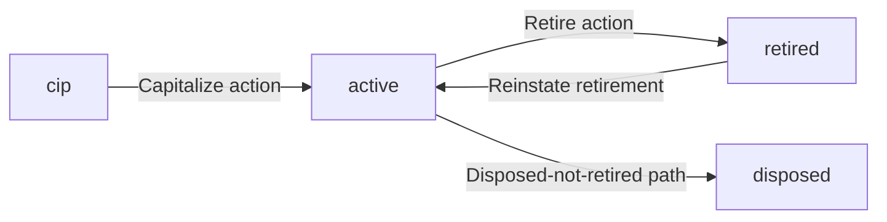
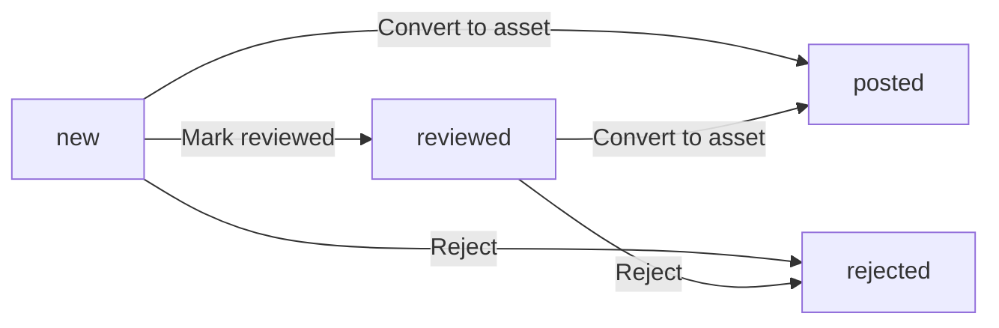
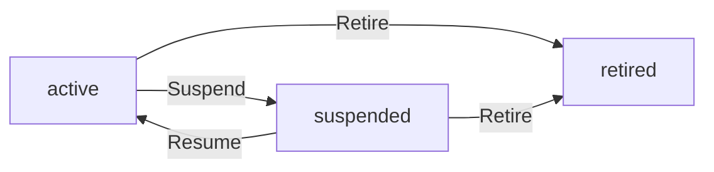
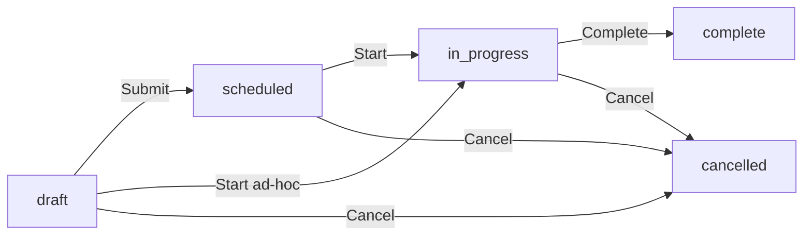

# Fixed Assets &amp; Maintenance

Capital expenditure tracking — from a vendor bill landing in the mass-additions queue, through CIP accumulation, capitalization into one or more depreciation books, periodic depreciation posting, location/custodian transfers, and finally retirement or disposal. Plus the recurring maintenance side of the same equipment: schedules, work orders, labor + parts cost roll-up, schedule advance on completion.

> **Where do I begin?** Set up your depreciation accounting first ([Asset Categories](#asset-categories) → [Asset Books](#asset-books)), THEN start landing costs ([Mass Additions](#mass-additions) or directly via [Assets](#assets) in CIP status). Once an asset has accumulated CIP costs, hit **Capitalize** to flip it to `active` — that's the moment depreciation schedules get generated and depreciation can be posted. Maintenance ([Schedules](#maintenance-schedules) → [Work Orders](#maintenance-work-orders)) can be configured the moment an asset is `active`; the bulk generator deliberately skips CIP assets because they aren't placed in service yet.

---

## Table of contents

1. [Assets](#assets)
2. [Asset Books](#asset-books)
3. [Asset Categories](#asset-categories)
4. [Mass Additions](#mass-additions)
5. [Retirements](#retirements)
6. [Maintenance Schedules](#maintenance-schedules)
7. [Maintenance Work Orders](#maintenance-work-orders)

---

## Assets

### What it is

The canonical record for each piece of capital equipment, real estate, or capitalised intangible. Holds the descriptive identity (asset_number, name, tag, serial, custodian, location) and the lifecycle status. The depreciation numbers live in [Asset Book Assignments](#asset-books) — one row per (asset, book) — so the same asset can be on a 5-year straight-line for Corporate and a different MACRS life for Tax.

> **Example:** A bottling line being built for the new plant. Operator creates `FA-7-0042` "Bottling Line A" in `cip` status under category `EQ-PLANT`. Over six weeks the AP team adds three vendor-bill costs to the CIP bucket ($120 000 chassis, $18 400 conveyor, $9 600 install labour). On 2026-05-15 the engineering lead hits **Capitalize** — the asset flips to `active`, two `asset_book_assignments` are created (one per active asset_book: Corporate + Tax), and 60 months of straight-line depreciation are pre-computed. Posting period 1 on 2026-05-31 books DR Depreciation Expense / CR Accumulated Depreciation through `JournalEntryService`.

### How records get created

| Method | When |
|---|---|
| Manual on the Assets screen | Direct entry — usually a CIP asset that the engineering team wants to start charging costs against. |
| From a Mass Addition | The AP / asset-accountant path. A queue entry from a vendor bill is converted into a new Asset (CIP) + a single linked `cip_costs` row in one transaction. See [Mass Additions](#mass-additions). |
| API (`POST /erp/assets/assets`) | Integration / bulk import. |

The `asset_number` is auto-numbered `FA-{tenant_id}-{NNNN}` if you don't pass one. Creation retries once on a `uq_asset_tenant_number` collision (errno 1062 specifically — not the wider SQLSTATE 23000) so two operators racing each other don't both fail.

### Fields

| Field | Required | Notes |
|---|---|---|
| Asset Number | Auto / manual | UNIQUE per tenant. Format `FA-{tenant_id}-{NNNN}`. |
| Name | Yes | Human label. |
| Description | Optional | Long text. |
| Category | Yes | Drives depreciation method, useful life, and GL combinations at capitalize time. See [Asset Categories](#asset-categories). |
| Status | Lifecycle | `cip` / `active` / `disposed` / `retired`. NOT editable from the regular update form — only the lifecycle actions mutate it. |
| Parent Asset | Optional | `parent_asset_id` self-FK. Components roll up to a parent assembly for reporting. |
| Location Text | Optional | Free-text current location. |
| Custodian Person | Optional | Person responsible (HR `persons` row). |
| Tag Number | Optional | Physical asset tag. |
| Serial Number | Optional | Manufacturer serial. |
| Acquired At | Optional | Acquisition date. |
| Placed In Service Date | Auto on capitalize | Stamped to the `placed_in_service_date` passed to capitalize (defaults to today). |
| Capitalized At | Auto on capitalize | Datetime stamp. |
| Disposed At | Auto on retire | Datetime stamp. |
| Notes | Optional | Free text. |

### Lifecycle



Each transition is CAS-protected: `Asset::transitionStatus` updates only if the row is still in one of the allowed `from` statuses. A second capitalize on the same asset returns `Asset is no longer CIP (concurrent capitalize?)` rather than double-creating book assignments.

The `disposed` status is reserved by the schema enum but the v1 retire path always lands in `retired`. Use `disposed` only for a future "lost / written off without proceeds journal" path if one is added — `retired` is the canonical terminal.

### Actions

- **List** — sidebar → Fixed Assets → Assets. Filter by status / category / custodian, or search by asset_number / name / tag / serial.
- **Drill in** — `GET /erp/assets/assets/{id}` returns the header plus `book_assignments` (with the full pre-computed depreciation schedule), `cip_costs` + `cip_total`, location/custodian `transfers` history, and the active `retirement` row if any.
- **Create / Edit** — manager role required. Edit mutates only descriptive fields (name, description, location, tag, serial, dates, notes, custodian, parent, category). Status is read-only here.
- **Add CIP cost** — `POST .../cip-costs`. Only allowed while status is `cip`. Single-currency rule: every CIP cost on an asset must share the currency of the existing rows; mixing 422s with the existing currency named in the error.
- **Remove CIP cost** — `DELETE .../cip-costs/{costId}`. Only while still `cip`.
- **Capitalize** — `POST .../capitalize`. Snapshots `SUM(cip_costs.amount)` into a new `asset_book_assignment` per active asset_book, copying category defaults (method, useful_life_months, salvage = cost × default_salvage_pct) unless `book_overrides` provides per-book values. Then triggers `AssetDepreciationService::generateSchedule` for each. CAS-flips status `cip` → `active`.
- **Transfer** — `POST .../transfer`. Records an audit row in `asset_transfers` (from_/to_ location_text, custodian_person_id, reason, transfer_date) and atomically updates `assets.location_text` / `custodian_person_id`. The update goes through `Asset::transitionStatus(['active'], 'active', extra={location_text, custodian_person_id})` so a concurrent retire can't silently mutate a retired asset.
- **Retire** — `POST .../retire`. See [Retirements](#retirements).
- **Delete** — only while `cip`. Active or retired assets refuse delete with 422 "Retire active assets instead."

### Gotchas

- **Capitalize requires accumulated CIP > 0.** A CIP asset with no `cip_costs` rows refuses capitalize with `Cannot capitalize — no CIP costs accumulated yet.`
- **At least one active asset_book must exist** before capitalize will work. The service throws `No active asset books configured for this tenant.` — see [Asset Books](#asset-books).
- **`book_overrides` is keyed by `book_id`.** Books not listed inherit category defaults; the indexing is an O(1) lookup per book, so you can override one of three books and leave the others to defaults.
- **Asset hierarchies are advisory.** `parent_asset_id` is a self-FK with an `idx_asset_tenant_parent` index for roll-up reports; nothing prevents you from making a circular chain. The product treats parent/child as a labelling convention.
- **Status enum has 4 values; only 3 are wired.** `disposed` is reserved (see Lifecycle).

---

## Asset Books

### What it is

A per-tenant book that holds the depreciation schedules. Same asset can be in multiple books with completely different depreciation — that's the core "Corporate for financials, Tax for IRS / HMRC, Group for consolidation" pattern from Oracle / Dynamics. Each book points to one `ledgers` row, so the depreciation journals it auto-posts land in the right legal entity.

> **Example:** Tenant 7 has three books: `CORP-USD` (type=corporate, ledger=US Primary, currency USD, monthly calendar), `TAX-MACRS-US` (type=tax, same ledger, USD), `GROUP-EUR` (type=group, ledger=Consolidation, EUR). When the bottling line is capitalised, three `asset_book_assignments` are created — the Corporate one for 60-month SL on USD 148 000, the Tax one configurable to MACRS once that method is implemented (currently 422s — see Gotchas), and the Group one for the EUR-translated cost.

### How records get created

UI / API — manager role required. There's no auto-creation; you stand books up once during ERP setup.

### Fields (book header — `asset_books`)

| Field | Required | Notes |
|---|---|---|
| Code | Yes | UNIQUE per tenant (`uq_ab_tenant_code`). |
| Name | Yes | |
| Type | Yes | `corporate` / `tax` / `group`. |
| Ledger | Yes | `ledger_id` — which GL the depreciation journals land in. |
| Depreciation Calendar | Optional | Free-text — `'monthly'` by default. Cosmetic; the service generates one row per month regardless. |
| Currency | Yes | ISO 4217, upper-cased on write. |
| Description | Optional | |
| Is Active | Default 1 | Inactive books are excluded from capitalize (`listActiveForTenant`). |

### Fields (per asset — `asset_book_assignments`)

| Field | Required | Notes |
|---|---|---|
| Asset | Yes | |
| Book | Yes | UNIQUE(tenant, asset, book) — exactly one row per (asset, book). |
| Acquisition Cost | Yes | Snapshot at capitalize time. Set from `SUM(cip_costs)` unless overridden. |
| Salvage Value | Yes | Defaults to `cost × category.default_salvage_pct`. |
| Useful Life Months | Yes | Min 1; defaults from category. |
| Method | Yes | `straight_line` / `double_declining` / `units_of_production` / `macrs`. |
| Date In Service | Yes | Defaults to capitalize's `placed_in_service_date`. Drives the period_start of period 1. |
| Accumulated Depreciation | Auto | Sum of all posted period amounts; advanced by `AssetBookAssignment::applyDepreciation`. |
| NBV | Auto | `acquisition_cost − accumulated_depreciation`; recomputed after every depreciation apply and after every direct cost/salvage update. |
| Currency | Yes | Pulled from the book's currency at create time. |
| Notes | Optional | |

### Depreciation schedule

`AssetDepreciationService::generateSchedule(book_assignment_id)` writes `useful_life_months` rows into `asset_depreciation_schedule`. Each row carries `period_no`, `period_start`, `period_end`, `depreciation_amount`, `accumulated_depreciation_after`, `nbv_after`. The last period absorbs the rounding residue so the final `accumulated_depreciation` equals exactly `(cost − salvage)`.

Regenerate is destructive on un-posted rows only: if **any** row in the schedule is already `posted = 1`, regenerate throws `Cannot regenerate — at least one schedule row is already posted. Cancel them first.`

### Posting a period

`POST /erp/assets/depreciation-schedules/{scheduleId}/post`:

1. Takes a `SELECT … FOR UPDATE` row lock on the schedule row so concurrent posts serialise.
2. Refuses if `posted = 1` already.
3. Refuses if the parent asset isn't `active`.
4. **Reinstate guard:** if the asset has a prior retirement that was reinstated, and this schedule row's `period_end` is on or before that historical `retirement_date`, refuses with a clear "regenerate the schedule before resuming" message — otherwise the operator would double-count against the historical write-off.
5. Requires the category to have both `default_depreciation_expense_combination_id` and `default_accumulated_depreciation_combination_id` configured.
6. Applies the depreciation to the book assignment (`accumulated_depreciation += amount`, `nbv = cost − accumulated_depreciation`).
7. Auto-posts a balanced journal via `JournalEntryService::create` + `::post`:
   - DR Depreciation Expense — `category.default_depreciation_expense_combination_id`
   - CR Accumulated Depreciation — `category.default_accumulated_depreciation_combination_id`
8. CAS-flips the schedule row to `posted = 1` with the journal_id.

### Actions

- **List books** — filter by type / is_active.
- **Create / Edit** — code, name, type, ledger, currency, calendar, description, is_active.
- **Delete** — refuses with 422 if any `asset_book_assignments` row references the book ("Asset book has assignments; deactivate instead").
- **Regenerate schedule** — `POST /erp/assets/book-assignments/{baId}/regenerate-schedule`. Wipes un-posted rows and re-computes. Used after changing acquisition_cost / salvage / life on an assignment.
- **Post depreciation period** — see above.

### Gotchas

- **Only `straight_line` is implemented in v1.** `double_declining`, `macrs`, `units_of_production` are valid enum values on the schema but `computeMonthlyDepreciation` raises `Depreciation method '{method}' is configured but not yet supported in v1 — choose 'straight_line' for now.` at generate-time. The error is loud-and-clear by design (so a Tax book that you set to MACRS doesn't silently fall back to SL).
- **NBV recompute reads the freshly-updated `accumulated_depreciation`.** The `applyDepreciation` SQL exploits MySQL's left-to-right SET evaluation: `accumulated_depreciation = accumulated_depreciation + ?, nbv = acquisition_cost - accumulated_depreciation` — the second assignment sees the post-update value, so the subtraction is correct without an extra `+ ?` (which would double-count).
- **Direct edits to `acquisition_cost` or `salvage_value` on the assignment** recompute NBV via a follow-up `UPDATE … SET nbv = acquisition_cost - accumulated_depreciation`. They do NOT auto-regenerate the schedule — call `regenerateSchedule` explicitly after such edits (and only if no rows are posted).
- **Currency on the assignment is locked to the book's currency** at create time. Multi-currency assets are modelled by having multiple books — not by mixing currencies inside one assignment.
- **The cost correction analogue doesn't exist here.** If you discover after posting period 1 that the acquisition_cost was wrong, you must (a) book a manual journal to reverse the posted depreciation, (b) edit the assignment, (c) regenerate the schedule. There's no first-class "asset cost correction" workflow yet.

---

## Asset Categories

### What it is

The defaults that drive depreciation method, useful life, salvage percentage, and the GL combinations used at capitalize, deprecation-post, and retire time. Every asset must belong to exactly one category.

> **Example:** Category `EQ-PLANT` — default method `straight_line`, life `60` months, salvage 5 % of cost, default asset combo `1500-PP&E-Equipment`, accumulated-depreciation combo `1599-AccumDep-Equipment`, depreciation-expense combo `5300-DepExpense-Plant`, gain-loss combo `7400-Gain-Loss-on-Disposal`. Every asset under `EQ-PLANT` inherits those numbers at capitalize time unless the operator passes book-level overrides.

### Fields

| Field | Required | Notes |
|---|---|---|
| Code | Yes | UNIQUE per tenant (`uq_ac_tenant_code`). |
| Name | Yes | |
| Description | Optional | |
| Default Depreciation Method | Yes | Same enum as the assignment. |
| Default Useful Life Months | Yes | Min 1. |
| Default Salvage % | Yes | Decimal — 0.05 means 5 % of acquisition_cost becomes salvage. |
| Default Asset GL Combo | Optional at create | **Required for retire** — the CR Asset leg of the disposal journal points here. |
| Default Accumulated Depreciation GL Combo | Optional at create | **Required for depreciation post AND retire**. |
| Default Depreciation Expense GL Combo | Optional at create | **Required for depreciation post**. |
| Default Gain/Loss GL Combo | Optional at create | **Required for retire** (used for both the gain and the loss leg). |
| Is Active | Default 1 | |

### Actions

- **List** — filter by is_active.
- **Create / Edit / Delete** — manager role required. No state machine.

### Gotchas

- **The GL combinations are nullable at category create time** so you can stand up a category for descriptive use before finance has the chart of accounts ready. But depreciation-post and retire will refuse loudly when the relevant combos are missing — the messages name exactly which combo is missing.
- **Default salvage is a percentage**, not an absolute. A 0.05 salvage_pct on a $100 000 asset yields $5 000 salvage, depreciable base $95 000. Override the absolute `salvage_value` per book at capitalize via `book_overrides` if a category-level percentage is wrong for a specific asset.
- **Useful life default is 60 months** if the operator doesn't set one — be careful when seeding categories.

---

## Mass Additions

### What it is

The review queue between AP / expense systems and the fixed-assets ledger. Each row is one candidate (a vendor-bill line, an expense, a stock-movement line) that the asset accountant decides should become a fixed asset — or shouldn't. Conversion creates a new Asset (in CIP) + one linked `cip_costs` row in a single transaction, and CAS-flips the queue row to `posted`.

> **Example:** Vendor bill VBILL-2026-0099 from a print-shop arrives with two lines: $4 200 "Office signage" and $480 "Installation labour". The AP clerk enqueues both lines as mass additions, suggesting category `FF-OFFICE` and pre-populating the vendor. Asset accountant reviews — accepts line 1 by converting it to a new Asset (creates `FA-7-0043` "Office signage" in CIP, copies the $4 200 into `cip_costs.amount` linked back to the bill line). Rejects line 2 with reason "Below cap threshold — expense". The clerk separately adds an Operating Expense for line 2.

### How records get created

| Method | When |
|---|---|
| Manual via `POST /erp/assets/mass-additions` | The default path in v1. AP user explicitly enqueues a bill line / expense for asset-accountant review. |
| Service call (`MassAdditionService::enqueue`) from another module | For future auto-population from VendorBillService after a capital-flagged match. **Not wired into VendorBillService in v1** — the capital-vs-expense judgment is operator-driven. |

`enqueue` is idempotent on `UNIQUE(tenant, source_type, source_id)` — calling it twice for the same (vendor_bill_line, 12345) returns the existing row silently rather than 422-ing.

### Fields

| Field | Required | Notes |
|---|---|---|
| Source Type | Yes | `vendor_bill_line` / `expense` / `stock_movement_line`. (CIP-cost source enum is wider — `po`/`manual` are valid there but not here.) |
| Source ID | Yes | FK to the upstream row. Combined with source_type gives the dedup UNIQUE. |
| Vendor | Optional | Snapshot of `companies.id` for the supplier — saves a join in the queue list. |
| Description | Optional | Free-text — usually the bill-line description. |
| Suggested Category | Optional | The convert flow uses this as the default if the operator doesn't override. |
| Amount | Yes | Must be > 0 (the controller 422s on `amount <= 0`). |
| Currency | Default USD | Upper-cased. |
| Status | Lifecycle | `new` / `reviewed` / `posted` / `rejected`. |
| Created Asset | Auto on convert | `created_asset_id` is stamped to the new asset's id when convert succeeds. |
| Reviewed By / At | Auto | Stamped on any non-`new` transition. |
| Notes | Optional | Reject reason gets stored here. |

### Lifecycle



`reviewed` is an explicit intermediate state for two-person workflows (AP clerk marks reviewed, asset accountant converts). Single-person teams can skip straight from `new` → `posted` via convert. `posted` and `rejected` are terminal.

### Actions

- **List** — filter by status. Default sort newest-first, capped at 500 rows.
- **Drill in** — `GET /erp/assets/mass-additions/{id}`.
- **Mark reviewed** — `POST .../{id}/review`. CAS `new` → `reviewed`.
- **Convert to asset** — `POST .../{id}/convert` with optional `{name, description, category_id, acquired_at, tag_number, serial_number, cost_date}`. category_id defaults to `suggested_category_id`; required if neither is set. Creates the Asset in `cip`, adds one `cip_costs` row mapping the queue's `source_type` to the CIP-cost source-type enum (`vendor_bill_line` → `vendor_bill`, `expense` → `expense`, `stock_movement_line` → `stock_movement`), then CAS-flips queue `[new, reviewed]` → `posted` with `created_asset_id` set. All in one transaction.
- **Reject** — `POST .../{id}/reject` with optional `reason`. CAS `[new, reviewed]` → `rejected`; reason is stored in `notes`.
- **Delete** — `DELETE .../{id}`. Refuses with 422 if status is `posted` ("Cannot delete a queue entry that produced an asset").

### Gotchas

- **No "merge with existing asset" workflow exists in v1.** Oracle Fixed Assets has this for componentisation (combine the install-labour bill into the existing chassis asset's CIP costs) — ROBUSTA convert always creates a new Asset. If the operator wants to roll the labour into an existing CIP asset, they should add it directly via `POST /erp/assets/assets/{id}/cip-costs` and delete the mass-addition queue row.
- **`amount` is naive currency.** The queue's currency isn't reconciled against the upstream document — if a USD bill line ends up enqueued as EUR by accident, capitalize will sum USD and EUR amounts unaware. The Assets controller's single-currency rule on CIP costs catches this only at *add-CIP-cost* time, not at convert time. Convert trusts the queue row.
- **Idempotent enqueue is silent.** Calling `enqueue` twice for the same source returns the existing row with its current status — including `rejected` or `posted`. A caller integrating with a vendor-bill stream should check the returned status before assuming the row is "fresh".

---

## Retirements

### What it is

The disposal record for an asset. Computes gain or loss as `(proceeds − NBV-at-retirement)` using the **corporate-book** NBV as the canonical book value, posts the disposal journal through `JournalEntryService`, and CAS-flips the asset to `retired`. Optional reinstate reverses the status flip (but does NOT reverse the journal — operator books a corrective JE manually).

> **Example:** `FA-7-0042` Bottling Line A — corporate-book NBV is now $73 000 after 36 months of depreciation (cost $148 000, accum dep $75 000). Plant manager sells it for $80 000 cash to a recycler. Operator hits **Retire** with `method=sale, proceeds=80000, bank_account_id=BANK-1, retirement_date=2029-05-15`. The service builds the journal: DR Cash 80 000, DR Accumulated Depreciation 75 000, CR Asset 148 000, CR Gain on Disposal 7 000. Status flips active → retired. If 18 months later the sale is reversed (dispute), operator hits **Reinstate** on the retirement — status goes retired → active, retirement row goes posted → reinstated with the reason logged; operator books the cash refund + write-back manually.

### How records get created

Only via `POST /erp/assets/assets/{id}/retire`. No bulk path; no scheduled retirement.

### Fields

| Field | Required | Notes |
|---|---|---|
| Asset | Yes | Path param. Must be `active`. |
| Retirement Date | Default today | Used as both `retirement_date` and the disposal journal's `entry_date`. |
| Method | Yes | `sale` / `scrap` / `donate` / `theft` / `obsolete`. |
| Proceeds | Default 0 | If > 0, **bank_account_id is required** so the cash receipt has somewhere to debit. |
| Bank Account | Required if proceeds > 0 | Used to pull the bank's `gl_account_combination_id` for the DR Cash leg. |
| NBV at Retirement | Auto | Snapshot from the chosen book assignment's `acquisition_cost − accumulated_depreciation`. |
| Gain/Loss | Auto | `proceeds − NBV`. Positive = gain, negative = loss. |
| Currency | Auto | Pulled from the book assignment. |
| Journal ID | Auto | Stamped after the disposal JE posts. |
| Status | Lifecycle | `posted` / `reinstated`. |
| Reason | Optional | |
| Notes | Optional | |

### Lifecycle


`posted` is the only state the retire path creates; `reinstated` is reached via the Asset Retirements screen's reinstate action and is terminal.

### Which book gets used

The corporate book — but resolved by walking **this asset's** `asset_book_assignments` and picking the one where `book.type = 'corporate'`. Falls back to the first assignment if no corporate book is assigned. This is deliberately not `AssetBook::listActiveForTenant`-driven — a foreign corporate book sorted first (or pointing to a since-deleted ledger) would otherwise silently break retire on assets that don't have a row in it.

### Journal lines

The disposal journal is hand-rolled (not template-driven) and posted via `JournalEntryService`:

| Side | Account combo | Amount | Condition |
|---|---|---|---|
| DR | Accumulated Depreciation | `accumulated_depreciation` | If accum dep > 0 |
| DR | Cash (bank's GL combo) | `proceeds` | If proceeds > 0 |
| DR | Gain/Loss combo | `-gain_loss` | If gain_loss < 0 (a loss) |
| CR | Asset combo | `acquisition_cost` | Always |
| CR | Gain/Loss combo | `gain_loss` | If gain_loss > 0 (a gain) |

Before submitting, the service balances DR vs CR locally — if abs(DR − CR) > 0.0001 it 422s with the exact numbers ("Retirement journal would be unbalanced (DR X, CR Y). Check the gain_loss account configuration and bank_account_id.") rather than letting the JE service throw a less-actionable "not balanced" error.

### Actions

- **List retirements** — `GET /erp/assets/asset-retirements`. Filter by asset_id, status.
- **Drill in** — `GET .../asset-retirements/{id}`.
- **Reinstate** — `POST .../asset-retirements/{id}/reinstate` with optional reason. CAS retirement.status `posted` → `reinstated` AND asset.status `retired` → `active` in one transaction; both must win or both roll back.
- **Retire (the action itself)** — `POST /erp/assets/assets/{id}/retire`. See above for the journal logic.

### Gotchas

- **Retire ignores all non-corporate books.** Their `accumulated_depreciation` snapshots stay frozen at the values they had when retire ran. There's no separate Tax-book disposal journal; you must handle the IRS / HMRC reporting on the Tax book out-of-band. This is consistent with the "Corporate is canonical for financials" architecture.
- **`bank_account_id` is required when proceeds > 0**, and the bank account must have `gl_account_combination_id` set — otherwise the service throws "Bank account is missing a GL combination; cannot post cash proceeds." Configure that on Cash & Bank → Bank Accounts before retiring with proceeds.
- **Asset Category must have all three combos** (`default_asset_combination_id`, `default_accumulated_depreciation_combination_id`, `default_gain_loss_combination_id`) for retire to work. The category-level missing-combo error names exactly what's missing.
- **Reinstate does NOT reverse the disposal journal.** The retirement row's `status` flips, the asset's `status` flips, but the GL entry from the original retire is still posted. Operator must book a corrective JE manually (out of scope for v1). After reinstate, the **depreciation post reinstate guard** kicks in — see the reinstate-guard note under [Asset Books](#asset-books).
- **The `assets.status='disposed'` enum value isn't reachable from the retire path.** All disposals land in `retired`. Treat `disposed` as reserved.

---

## Maintenance Schedules

### What it is

A recurring rule that says "every N months / N days / N hours / N meter units, generate a maintenance work order for this asset." The bulk generator scans active schedules and creates `scheduled` MWOs for every schedule whose `next_due_date` has arrived; the MWO complete action advances the schedule's `last_completed_*` and recomputes `next_due_*`.

> **Example:** Schedule `MS-7-0007` "Quarterly PM — Bottling Line A" — type `preventive`, asset `FA-7-0042`, frequency `months / 3`, status `active`, next_due_date 2026-07-15. On 2026-07-15 the operator hits Generate → an MWO `MWO-7-0119` is created with status `scheduled`, scheduled_date 2026-07-15, title "Quarterly PM — Bottling Line A — 2026-07-15". Technician starts and completes it; complete advances the schedule's last_completed_date to today and computes next_due_date 2026-10-15 (or the month-end clamp if today is the 31st).

### How records get created

Manual via `POST /erp/maintenance/schedules`. No auto-creation; you set up schedules per asset during commissioning.

### Fields

| Field | Required | Notes |
|---|---|---|
| Schedule Number | Auto | `MS-{tenant_id}-{NNNN}`. |
| Asset | Yes | Must exist for the tenant. |
| Type | Yes | `preventive` / `corrective` / `inspection` / `calibration`. |
| Name | Yes | Human label (becomes the basis of the generated MWO title). |
| Description | Optional | Copied to the MWO's description on generate. |
| Frequency Type | Yes | `hours` / `days` / `weeks` / `months` / `meter_units`. |
| Frequency Value | Yes | Min 1. |
| Next Due Date | Operator-set | Operator must hand-set the initial value; the service won't assume "today." |
| Next Due Meter | Operator-set | Used for `meter_units` schedules. |
| Last Completed Date | Auto | Stamped on every MWO complete. |
| Last Completed Meter | Auto | Stamped only when the completion supplies a meter reading (never null-clobbered). |
| Is Active | Default 1 | Boolean. |
| Status | Lifecycle | `active` / `suspended` / `retired`. |
| Notes | Optional | |

### Lifecycle



`retired` mirrors the asset retire concept and is terminal — once an asset is decommissioned, retire its schedules so generate stops picking them up.

### Next-due computation

`MaintenanceScheduleService::computeNextDue(schedule, last_completed_date, last_completed_meter)`:

- `meter_units` — `next_due_meter = last_completed_meter + frequency_value`. No date math, `next_due_date` stays null.
- `hours` — returns `{date: null, meter: null}`. The `DATE` column has no sub-day granularity, so we DON'T fake a date that would mis-schedule the next MWO. Operator advances these manually OR via a future meter-reading endpoint.
- `days` / `weeks` — `DateTimeImmutable->add(P{N}D)` or `P{N*7}D`.
- `months` — `DateTimeImmutable->add(P{N}M)` with **end-of-month clamp**: if the resulting day-of-month differs from the base (e.g. Jan 31 → Mar 3 PHP overflow), clamp to the LAST day of the intended target month. So a Jan 31 monthly schedule advances Feb 28 → Mar 31 → Apr 30 etc., not "skip Feb entirely."

### Bulk generate

`POST /erp/maintenance/schedules/generate` with optional `as_of_date` (default today) calls `bulkGenerateMwos`:

For every schedule where `status='active' AND is_active=1`:
- If `frequency_type IN ('meter_units','hours')` → `skipped_meter_only++` and continue (these need manual MWO creation or a future meter-reading endpoint).
- Else if `next_due_date IS NULL` → `skipped_no_due_date++` (operator never set the initial date; a schedule sitting active with NULL next_due for weeks is almost always a misconfiguration).
- Else if `next_due_date > as_of_date` → `skipped_not_due_yet++` (the legitimate "not due yet" case).
- Else create a `scheduled` MWO via the standard create path.

Idempotent via `UNIQUE(tenant_id, schedule_id, scheduled_date)` on `maintenance_work_orders`: re-running for the same as_of_date no-ops via the dup-key catch (`skipped_already_scheduled++`).

Return shape:
```
{
  "created": 4,
  "skipped_already_scheduled": 2,
  "skipped_meter_only": 1,
  "skipped_no_due_date": 1,
  "skipped_not_due_yet": 12
}
```

When `skipped_no_due_date > 0`, the service warn-logs so operators notice the misconfiguration vs the legitimate "not due yet" case. The frontend MWO-generate toast switches to a warning style when this counter is non-zero.

### Actions

- **List** — sidebar → Maintenance → Schedules. Filter by asset, status, type, is_active, due_on_or_before (date).
- **Create / Edit** — manager role required.
- **Delete** — refuses with 422 if any non-cancelled MWO references the schedule (`Cannot delete schedule — non-cancelled MWOs reference it.`). Cancel those MWOs first.
- **Generate MWOs** — `POST /erp/maintenance/schedules/generate`. Operator-triggered; ideally cron-triggered nightly in production.

### Gotchas

- **CIP-asset schedules silently generate zero MWOs.** Generate respects the asset's status implicitly via the `next_due_date IS NULL` skip — CIP assets typically haven't had operator-set initial due dates yet because they aren't placed in service. Set up maintenance schedules AFTER capitalize, when `placed_in_service_date` is known.
- **`hours` frequency is intentionally date-incompatible.** Schedules with `frequency_type='hours'` are excluded from the date-driven generator and `computeNextDue` returns `null` for both date and meter. A prior bug had `hours` schedules with `value < 24` getting `next_due_date = today` forever (the DATE column drops the sub-day component); now they're treated like meter_units — skipped by generate, operator advances manually.
- **Month overflow is clamped, not floor-divided.** Jan 31 + 1 month → Feb 28 (end-of-month), not Feb 1. Implemented with `DateTimeImmutable` + a day-of-month-differs detector, NOT `strtotime("+1 month")` (which would silently overflow to Mar 3).
- **Bulk generate is fully transactional.** A real error (FK violation, NOT NULL violation — anything other than errno 1062 dup-key) inside the loop rolls back the whole batch, not just the offending schedule. The dup-key check is narrowed to errno 1062 specifically — wider SQLSTATE 23000 catches would have silently counted FK violations as `skipped_already_scheduled`, masking real failures.
- **`next_due_date IS NOT NULL` filter** on the list view orders rows with NULL next_due_date last via `ORDER BY ms.next_due_date IS NULL, ms.next_due_date`. NULLs aren't hidden — they sort to the bottom.

---

## Maintenance Work Orders

### What it is

One occurrence of maintenance work on an asset — either generated from a schedule (`schedule_id` set) or authored ad-hoc for breakdowns / corrective work (`schedule_id NULL`). Has itemised lines for labor / parts / services / other; total_cost rolls up at complete time. Completing an MWO advances the parent schedule.

> **Example:** `MWO-7-0119` was generated from schedule `MS-7-0007` for 2026-07-15. Technician starts it (status scheduled → in_progress, started_at stamped). Records three lines: 4 hours labour @ $85, 1 filter @ $24, 1 belt @ $48 — total $412. Notes meter reading 14 832 km. Hits complete with `meter_at_completion=14832, downtime_hours=4`. MWO flips to `complete`, total_cost 412.00. Same transaction: schedule MS-7-0007's last_completed_date = today, next_due_date = today + 3 months (clamped), last_completed_meter = 14 832, next_due_meter = null (meter_units type wasn't used here).

### How records get created

| Method | When |
|---|---|
| Auto from bulk generate | The default path. `MaintenanceScheduleService::bulkGenerateMwos` writes one `scheduled` MWO per due schedule. |
| Manual ad-hoc | `POST /erp/maintenance/work-orders` with `schedule_id=null` (or omitted). Used for breakdowns / unscheduled corrective work — type usually `corrective` or `breakdown`. |
| Manual against a schedule | Same endpoint with `schedule_id` set. The same UNIQUE(tenant, schedule_id, scheduled_date) applies, so you can't accidentally double-create for the same (schedule, date). |

### Fields

| Field | Required | Notes |
|---|---|---|
| MWO Number | Auto | `MWO-{tenant_id}-{NNNN}`. UNIQUE per tenant. |
| Schedule | Optional | NULL = ad-hoc breakdown. |
| Asset | Yes | |
| Type | Yes | `preventive` / `corrective` / `inspection` / `calibration` / `breakdown`. Note: includes `breakdown` (the schedule enum doesn't). |
| Priority | Yes | `low` / `normal` / `high` / `urgent`. Defaults to `normal`. |
| Title | Yes | |
| Description | Optional | |
| Status | Lifecycle | `draft` / `scheduled` / `in_progress` / `complete` / `cancelled`. |
| Scheduled Date | Optional but UNIQUE | Part of UNIQUE(tenant, schedule_id, scheduled_date) when schedule_id is set. |
| Requested By | Default = creator | |
| Assigned To | Optional | The technician. |
| Started At / By | Auto | Stamped on start. |
| Completed At / By | Auto | Stamped on complete. |
| Cancelled At / By | Auto | Stamped on cancel. |
| Downtime Hours | Default 0 | Operator-set on complete. |
| Total Cost | Auto on complete | Rolled up from lines. |
| Meter At Completion | Operator-set on complete | Required when the parent schedule is `meter_units`. |
| Work Order ID | Optional | FK to a manufacturing work order — for cross-linking (rare). |
| Notes | Optional | |

#### Line fields (per `maintenance_work_order_lines`)

| Field | Required | Notes |
|---|---|---|
| MWO | Auto | Path param. |
| Line No | Auto | Auto-incremented per MWO if not supplied. UNIQUE per (mwo, line_no). |
| Type | Yes | `labor` / `part` / `service` / `other`. |
| Description | Yes | |
| Item | Optional | FK to `items` — for parts pulled from inventory. |
| Quantity | Default 1 | |
| Unit Cost | Default 0 | |
| Total Cost | Auto | `quantity × unit_cost`, recomputed on every line write. |
| Technician User | Optional | The person who performed this line. |
| Notes | Optional | |

### Lifecycle



Each transition is CAS-protected (`MaintenanceWorkOrder::transitionStatus(allowedFrom, toStatus, …)`); a second click after another operator acted returns 422 ("MWO changed state during …"). The `complete` transition is wrapped in a transaction together with the parent-schedule advance — see below.

### Complete: lines roll up + schedule advances

`MaintenanceWorkOrderService::complete`:

1. `findForUpdate` row-locks the MWO.
2. Refuses unless status is `in_progress`.
3. `MaintenanceWorkOrderLine::totalForMwo` rolls up — that becomes the MWO's `total_cost`.
4. CAS `in_progress` → `complete` with extras `{total_cost, downtime_hours, meter_at_completion?}`.
5. **If schedule_id is set** — `findForUpdate` row-locks the schedule:
   - If schedule's `frequency_type='meter_units'` and `meter_at_completion` wasn't supplied → throws (`meter_at_completion is required when completing an MWO for a meter_units schedule.`).
   - Computes `next_due_date` / `next_due_meter` via `computeNextDue` using today + the supplied meter.
   - Updates the schedule with `last_completed_date`, `next_due_date`. **Only includes `last_completed_meter` / `next_due_meter` in the update when the new value is non-null** — otherwise it would clobber prior meter baselines on time-based schedules that happened to have a meter recorded earlier.
   - If the schedule update returns zero rows affected, throws to roll the whole complete back (defense-in-depth — shouldn't happen given the row lock, but if it did, leaving the MWO `complete` with the schedule un-advanced would be the worst possible end state).

### Actions

- **List** — sidebar → Maintenance → Work Orders. Filter by asset, schedule, status, type.
- **Drill in** — returns header + lines.
- **Create** — manager role. Asset and title required. Optional schedule_id.
- **Edit** — refuses on `complete` / `cancelled`.
- **Delete** — only allowed on `draft` or `cancelled`. Lines are deleted in the same transaction.
- **Submit** — CAS `draft` → `scheduled`.
- **Start** — CAS `[draft, scheduled]` → `in_progress`; stamps `started_at` / `started_by`. (Permits start direct from draft for ad-hoc breakdowns that skip submit.)
- **Complete** — see above.
- **Cancel** — CAS `[draft, scheduled, in_progress]` → `cancelled` with optional reason.
- **Add / edit / remove line** — refuses on `complete` / `cancelled` MWOs.

### Gotchas

- **`UNIQUE(tenant, schedule_id, scheduled_date)` is what makes bulk-generate idempotent.** It also blocks you from manually creating a second MWO for the same (schedule, date) — 422 with "An MWO with that number or schedule+date already exists." When `schedule_id` is NULL, this constraint is effectively per-(tenant, NULL, date), which on MariaDB treats NULLs as distinct → multiple ad-hoc MWOs for the same date are allowed.
- **Complete on a `meter_units` schedule REQUIRES `meter_at_completion`** — otherwise the schedule would advance with a null `next_due_meter` and never fire another MWO. Surfaced as a hard 422 rather than silently leaving the schedule stuck.
- **Meter columns are write-only-when-supplied on complete.** A non-meter schedule that happened to record one historical meter reading keeps it — complete with no meter doesn't null-clobber it. Same for `next_due_meter`.
- **Schedule advance is inside the same transaction as the MWO complete.** A partial failure (failed audit log doesn't count — it's swallowed; but a failed schedule advance does) rolls back the MWO `complete` flip too. The end state is either "both advanced" or "neither advanced" — never "MWO complete but schedule still showing yesterday's due date."
- **`type` enum has 5 values; the schedule enum has 4.** `breakdown` exists only on MWOs because schedules don't pre-define breakdowns (those are by definition unplanned). Generated MWOs inherit the schedule's `type` (preventive / corrective / inspection / calibration); ad-hoc MWOs can additionally be `breakdown`.
- **MWO list ordering: `ORDER BY scheduled_date IS NULL, scheduled_date, id DESC`** — NULL scheduled_dates sort last, then by scheduled_date asc, then newest within the same date. Match the schedule list's same convention.

---

## Cross-references

- **Procurement** — Vendor bills are the most common upstream for [Mass Additions](#mass-additions). The capital-vs-expense decision is operator-driven in v1; see [procurement.md](./procurement.md) for the bill side.
- **Items** — Parts charged to an MWO line link back to the [Item Master](./items.md#item-master) via `item_id`. The line currently records a snapshot unit_cost; there's no automatic inventory issue tied to the line (that's a future hook).
- **GL** — Capitalize doesn't post a journal (the cost was already on the books from the upstream bills); depreciation posting and retirement do, via [Journal Entries](./deep-dives/journal-entries.md). Each [Asset Book](#asset-books) points to a single `ledger_id` so multi-entity organisations book each book's depreciation to the right legal entity.
- **Cash &amp; Bank** — Retirements with proceeds > 0 need a bank account with a `gl_account_combination_id` set; see [cash-bank.md](./cash-bank.md).
- **HR** — Custodian on Assets and `technician_user_id` on MWO lines reference `persons` and `users` respectively; see [hr.md](./hr.md).
- **Manufacturing** — `maintenance_work_orders.work_order_id` is an optional cross-link to a manufacturing [Work Order](./manufacturing.md#work-orders) — for the rare case where a maintenance task is part of a manufacturing run (e.g. line-changeover cleanup that consumes parts).
