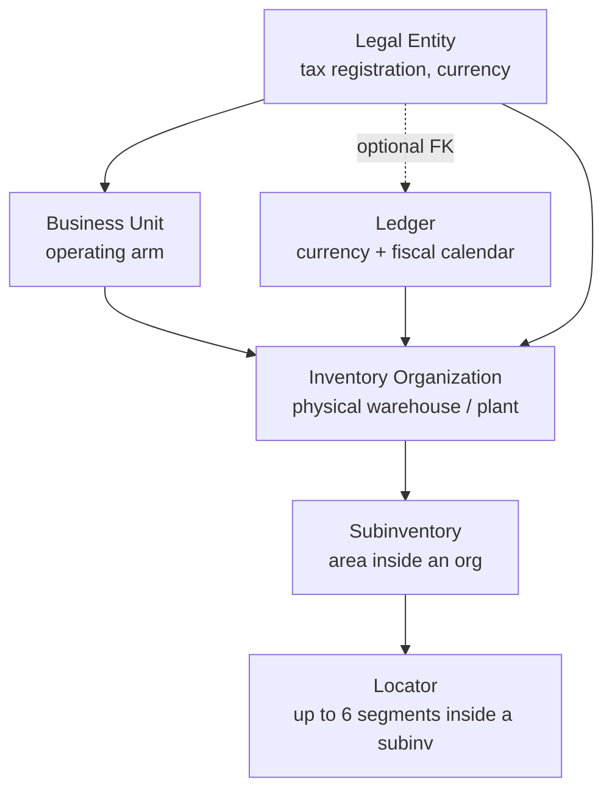

# Framework & Setup

The Oracle-style configuration substrate that every other ERP screen reads from. Profile options, validation lists, lookups, transaction types, the legal-entity → subinventory hierarchy, units of measure, and per-user access grants all live here.

> **Where do I begin?** Stand up the org hierarchy first — one [Legal Entity](#legal-entities), at least one [Business Unit](#business-units), one [Ledger](#ledgers), then your [Inventory Organizations](#inventory-organizations). Creating an Inventory Org auto-provisions its `_SYS_IN_TRANSIT` subinventory; add your real [Subinventories](#subinventories) and [Locators](#locators) next, then jump to [Items](./items.md). Most of the other screens here (Profile Options, Value Sets, Lookups, Transaction Types, Material Statuses, UOMs) ship with system seeds you can use as-is until you need to customise.

---

## Table of contents

**Oracle Framework**

1. [Profile Options](#profile-options)
2. [Profile Option Values](#profile-option-values)
3. [Value Sets](#value-sets)
4. [Value Set Values](#value-set-values)
5. [Key Flexfields](#key-flexfields)
6. [Key Flexfield Segments](#key-flexfield-segments)
7. [Lookups](#lookups)
8. [Transaction Types](#transaction-types)

**Org Hierarchy**

9. [Legal Entities](#legal-entities)
10. [Business Units](#business-units)
11. [Ledgers](#ledgers)
12. [Inventory Organizations](#inventory-organizations)
13. [Subinventories](#subinventories)
14. [Locators](#locators)
15. [Material Statuses](#material-statuses)

**UOM & Access**

16. [UOM Classes](#uom-classes)
17. [Units of Measure](#units-of-measure)
18. [UOM Class Conversions](#uom-class-conversions)
19. [User Inventory Access](#user-inventory-access)
20. [My Timezone](#my-timezone)

---

## The org hierarchy at a glance

A few cross-edges to keep in mind: an **Inventory Organization** carries FKs to all three of `business_unit_id`, `ledger_id`, and `legal_entity_id` directly (not implied through BU), and a **Ledger**'s `legal_entity_id` is nullable so a tenant can wire a ledger to many legal entities or to none at the start. Every level is tenant-scoped; `_SYS_IN_TRANSIT` is the only subinventory the system creates for you (when an Inventory Org is created), and it's the virtual bucket that 2-way [Inter-Org Transfers](./inventory.md#inter-org-transfers) park stock in between ship and receive.

---

## Profile Options

### What it is

The tenant configuration registry. One row per **knob** the application reads at runtime — "should issues be allowed below zero?", "what's the default buyer for POs?", "how should AR auto-number invoices?". Each profile option has a code, a name, a data type, and a `manageable_by` role gate; the actual setting is stored separately in [Profile Option Values](#profile-option-values) at one of four scopes (site / tenant / org / user) and resolved most-specific-wins.

> **Example:** Option `INV_NEGATIVE_BALANCE_ALLOWED` (boolean, default `false`). Set it at `tenant` level to `true` for cycle-count adjustments to be allowed to dip stock negative for one specific tenant. A picker user who works at org 12 has it overridden at `org` level to `false` — they still can't go negative on their lines even though the tenant default is permissive.

### How records get created

| Method | When |
|---|---|
| System seed (`tenant_id IS NULL`) | The product ships a baseline registry — these are visible to every tenant and cannot be edited or deleted via the API. |
| UI on the Profile Options screen | An admin defines a custom tenant-owned option (`POST /erp/setup/profile-options`). |
| API | Same endpoint; used by setup wizards and migrations. |

### Fields

| Field | Required | Notes |
|---|---|---|
| Code | Yes | UNIQUE per (tenant, code). The application looks up by code. |
| Name | Yes | Human-readable label. |
| Description | Optional | Free-text help. |
| Data Type | Default `string` | ENUM `string` / `number` / `boolean` / `date` / `json`. Callers cast the resolved string accordingly. |
| Default Value | Optional | Returned by `resolveValue` if nothing is set at any level. |
| Manageable By | Default `tenant_admin` | ENUM `super_admin` / `tenant_admin` / `user`. Drives who can call `PUT /{id}/value`. |
| Category | Optional | Grouping label for the UI (e.g. `INV`, `PO`, `AR`). |
| Is Active | Default `1` | Inactive options drop out of `listForTenant`. |

### Lifecycle

Profile options themselves are not stateful — they're a registry. The interesting state lives one screen down in [Profile Option Values](#profile-option-values).

### Actions

- **List** — sidebar → Setup → Profile Options. Optional `?category=` filter to scope.
- **Detail** — opens the option with its current value rows (all four levels) and the user-context-resolved value at the top.
- **Create** — admin role required. Adds a tenant-owned option; code conflicts with an existing tenant row return 422.
- **Edit** — tenant-owned only. System rows (`tenant_id IS NULL`) return 403 with the hint "override by setting a value at tenant level."
- **Delete** — tenant-owned only.
- **Set value** — `PUT /erp/setup/profile-options/{id}/value` with `{ level, level_id, value }`. Permission depends on `manageable_by`: `super_admin` options need super_admin; `tenant_admin` options need `super_admin` or `admin`; `user` options anyone can write to their own scope.

### Gotchas

- **Resolution order is user → org → tenant → site → `default_value`.** Most specific wins. A `null` value at a more specific level **does** override the broader level (it returns `null`, not "fall through").
- System-defined options (rows with `tenant_id IS NULL`) appear in your list and `findByCode` returns them transparently — but you cannot edit or delete the row. Override behaviour by setting a value at the tenant scope.
- `setValue` drops any `level_id` you send for `site` or `tenant` levels — they're scope-wide and the column is forced to NULL.
- Tenant scoping on `profile_option_values` is enforced in both the existence probe and the UPDATE WHERE — a stray (option_id, level, level_id) tuple from another tenant cannot be overwritten.

---

## Profile Option Values

### What it is

One row per (option, level, level_id) carrying the actual setting. The resolver in `ProfileOption::resolveValue` reads these in priority order.

### Fields

| Field | Required | Notes |
|---|---|---|
| Profile Option | Yes | FK to `profile_options`. |
| Tenant | Auto | Set from the calling tenant; site-level rows can have tenant NULL. |
| Level | Yes | ENUM `site` / `tenant` / `org` / `user`. |
| Level ID | Conditional | Required for `org` / `user`; ignored on `site` / `tenant`. |
| Value | Yes | Stored as text — caller casts per the option's `data_type`. |

### Actions

There is no standalone Values screen in the sidebar — values are managed via the Profile Options detail page's "Set value" action, which posts to `PUT /erp/setup/profile-options/{id}/value`. The detail view always shows all four levels for the option ordered `site, tenant, org, user` so an admin can see the override chain at a glance.

### Gotchas

- A site-level value lives in the same table — it's distinguished by `level = 'site'` and a NULL `level_id`. Listing values for an option includes site rows even though their `tenant_id` is NULL.
- The resolver only consults `org`/`user` rows when you pass an `orgId`/`userId` to `resolveValue`. The Profile Options detail page resolves with `Auth::id()` only, so the "resolved_value" you see in the UI ignores any org-level override unless you query a specific org programmatically.

---

## Value Sets

### What it is

Oracle's reusable validation list. A value set names a domain of allowed values plus how to validate them; lookups, key-flexfield segments, and DFF segments all point at value sets so the same list (`COUNTRY_CODES`, `YES_NO`, `POSITIVE_INTEGER`) is defined once.

> **Example:** Value set `INV_CYCLE_FREQUENCY` (validation type `independent`) with three values: `DAILY` / `WEEKLY` / `MONTHLY`. Reused by the cycle-count definition screen and by a DFF on the item-org assignment record.

### How records get created

| Method | When |
|---|---|
| System seed | The product ships common sets (e.g. `YES_NO`); they cannot be edited. |
| UI / `POST /erp/setup/value-sets` | Admin defines a tenant-owned set. |

### Fields

| Field | Required | Notes |
|---|---|---|
| Code | Yes | UNIQUE per tenant. |
| Name | Yes | Display label. |
| Description | Optional | |
| Validation Type | Default `independent` | ENUM `independent` (a fixed list of values) / `table` (driven from another table — wired in later sprints) / `format` (regex via `format_pattern`) / `number_range` (uses `min_value` / `max_value`). |
| Format Pattern | If `validation_type = format` | Regex stored as text. |
| Min Value / Max Value | If `validation_type = number_range` | Decimal range bounds. |
| Is Active | Default `1` | |

### Actions

- **List** — Setup → Value Sets.
- **Detail** — shows the set plus its [Value Set Values](#value-set-values).
- **Create / Edit / Delete** — admin role; system rows are read-only.

### Gotchas

- Even a tenant-owned `independent` value set is just a holder until you populate its values — saving the header is fine but the set won't validate anything until rows exist in `value_set_values`.
- System value sets are read-only end-to-end: you cannot add values, edit the header, or delete. The UI offers "clone as tenant set" rather than letting you scribble on the system row.

---

## Value Set Values

### What it is

One row per allowed code inside a value set. Carries an optional active-date window so a value can be retired without losing history (set `end_active_date` to yesterday and the UI will hide it but the existing references still resolve).

### Fields

| Field | Required | Notes |
|---|---|---|
| Value Code | Yes | The code stored on the referencing row. |
| Meaning | Yes | The human label shown in pickers. |
| Description | Optional | |
| Start Active Date | Optional | Inclusive lower bound. NULL = always-active. |
| End Active Date | Optional | Inclusive upper bound. NULL = never expires. |
| Sort Order | Default `0` | Drives display order in the picker. |
| Is Active | Default `1` | Hard on/off flag independent of dates. |

### Actions

- `GET /erp/setup/value-sets/{id}/values` — list.
- `POST /erp/setup/value-sets/{id}/values` — add a value (tenant set only).
- `PUT /erp/setup/value-sets/{id}/values/{valueId}` — edit.
- `DELETE /erp/setup/value-sets/{id}/values/{valueId}` — remove.

### Gotchas

- Cannot add values to a system value set — the controller returns 403 with the "clone it as a tenant set first" hint.
- `start_active_date` / `end_active_date` are advisory; they're stored but the resolver in core code currently filters only on `is_active`. Validation by date window is up to the consuming screen.

---

## Key Flexfields

### What it is

Registry of multi-segment business keys. Oracle's idea: instead of hardwiring a 5-segment Chart of Accounts, define a flexfield called `COA` and let the customer name the segments themselves (Company / Cost Centre / Account / Sub-Account / Future). The same machinery is reused for Item Categories, Asset Categories, etc.

> **Example:** Key flexfield `COA` (Chart of Accounts) with four segments: 1=Company (value set `COMPANY_CODES`), 2=Department (value set `DEPT_CODES`), 3=Account (value set `ACCOUNT_CODES`), 4=Subaccount (value set `SUBACCOUNT_CODES`). [Account Combinations](./gl.md) read this registry to know how many segments to ask for.

### How records get created

| Method | When |
|---|---|
| System seed | The product ships well-known codes (`COA`, `ITEM_CATEGORY`, `ASSET_CATEGORY`) so downstream features can rely on them. |
| UI / `POST /erp/setup/key-flexfields` | Admin defines a custom tenant flexfield. |

### Fields

| Field | Required | Notes |
|---|---|---|
| Code | Yes | UNIQUE per tenant. The application looks up by code. |
| Name | Yes | Display label. |
| Description | Optional | |
| Is Active | Default `1` | |

### Actions

- **List / Detail / Create / Edit / Delete** — admin role; system rows are read-only on edit/delete.
- **Manage segments** — opens the [Key Flexfield Segments](#key-flexfield-segments) sub-resource.

### Gotchas

- Sprint A1.2 ships the framework only. Concrete combinations (account combinations driven by `COA`, etc.) are added in later sprints — the registry is here, but creating a `COA` flexfield does not on its own light up GL screens.
- System flexfields cannot have segments added either. To customise (e.g. add a 5th COA segment) you'd need to clone the system flexfield to a tenant row first.

---

## Key Flexfield Segments

### What it is

One row per segment in a flexfield definition. Each segment names a column, picks its validation `value_set_id`, and flags whether the segment is required when the flexfield key is composed.

### Fields

| Field | Required | Notes |
|---|---|---|
| Flexfield | Yes (URL param) | FK to `key_flexfields`. |
| Segment No | Yes | Ordinal position (1, 2, 3, …). UNIQUE per flexfield. |
| Segment Name | Yes | Internal name (e.g. `COMPANY`). |
| Prompt | Optional | UI label shown above the segment input. |
| Value Set | Optional | FK to a `value_sets` row that validates the segment's input. |
| Is Required | Default `1` | If `0`, the segment can be blank. |
| Is Active | Default `1` | |

### Actions

- `GET /erp/setup/key-flexfields/{id}/segments` — list segments.
- `POST /erp/setup/key-flexfields/{id}/segments` — add (tenant flexfield only).
- `PUT /erp/setup/key-flexfields/{id}/segments/{segmentId}` — edit.
- `DELETE /erp/setup/key-flexfields/{id}/segments/{segmentId}` — remove.

### Gotchas

- Cannot add segments to a system flexfield (403).
- There's no UNIQUE on `(flexfield_id, segment_no)` enforced via the DB; the controller does not currently check for duplicates either — creating two segments with the same `segment_no` is technically possible, but downstream consumers will pick the first they see, so be careful.

---

## Lookups

### What it is

Per-tenant code/meaning lists used by dropdowns across the app — item statuses, payment terms, contact relationship types, anything that's a short controlled vocabulary that doesn't warrant its own table.

> **Example:** Lookup type `ITEM_STATUS`: codes `ACTIVE` (meaning "Active"), `INACTIVE` (meaning "Inactive"), `PENDING_REVIEW`. A tenant that wants a custom `BLOCKED` status adds one tenant-scoped row with type `ITEM_STATUS`, code `BLOCKED`, meaning "Blocked — credit hold." Tenant rows override system rows with the same (type, code).

### How records get created

| Method | When |
|---|---|
| System seed (`tenant_id IS NULL`) | Ships with the product — visible to every tenant. |
| `POST /erp/setup/lookups` | Admin adds a tenant-scoped row. |

### Fields

| Field | Required | Notes |
|---|---|---|
| Lookup Type | Yes | The list name (e.g. `ITEM_STATUS`). |
| Lookup Code | Yes | The code stored on referencing rows. |
| Meaning | Yes | Human label. |
| Description | Optional | |
| Sort Order | Default `0` | Drives display order. |
| Is Active | Default `1` | |

### Actions

- `GET /erp/setup/lookup-types` — list distinct lookup types with system/tenant counts.
- `GET /erp/setup/lookups?type=ITEM_STATUS` — **resolved** list: tenant rows mask system rows on the same (type, code) — this is what dropdowns should call.
- `GET /erp/setup/lookups/all?type=ITEM_STATUS` — interleaved list for the admin UI showing both layers, with an `is_system` flag per row.
- `POST` — create a tenant-scoped row. Conflict only if the same tenant already has a row with that (type, code); a tenant row colliding with a system row is **expected** (that's how overrides work).
- `PUT / DELETE` — tenant-scoped rows only; system rows return 403.

### Gotchas

- **`tenant_id` is NULLABLE on `lookups`.** A NULL row is system-seeded and visible to everyone; a tenant row with the same (type, code) overrides it in resolution. This is the override pattern, not a bug — do not try to "fix" it by backfilling `tenant_id`.
- The override is by **code**, not by id. Editing a tenant override row does not affect the system row's id; deleting the override re-exposes the system row.
- The resolved list endpoint joins on `(type, code)` via `NOT EXISTS` — if you delete the tenant row, the system row reappears in the same response the next call.

---

## Transaction Types

### What it is

Sub-types for inventory movements. Each posted [stock movement](./inventory.md#movements) references one transaction type so reports can split "PO receipt" from "customer return receipt" even though both are receipts. Type drives downstream behaviour: cost effect, approval requirement, and whether subinventory and material-status rules need to allow it.

> **Example:** A PO goods receipt writes the line with `transaction_type = 'RECEIPT_PO'`. A customer return receipt uses `RECEIPT_RETURN`. Both are category `receipt`, both increment On Hand, but the audit report and the AR adjustment hooks key off the specific sub-type.

### How records get created

| Method | When |
|---|---|
| System seed (`tenant_id IS NULL`, `is_system = 1`) | The standard 15 types ship out of the box (see below). |
| `POST /erp/setup/transaction-types` | Admin defines a custom tenant-scoped type. |

### System seeds shipped

| Category | Codes |
|---|---|
| Receipt | `RECEIPT_PO`, `RECEIPT_RETURN`, `RECEIPT_INTERNAL`, `RECEIPT_MISC` |
| Issue | `ISSUE_SO`, `ISSUE_WO`, `ISSUE_INTERNAL`, `ISSUE_SCRAP`, `ISSUE_MISC` |
| Transfer | `TRANSFER_SUBINV`, `TRANSFER_LOCATOR`, `TRANSFER_ORG` |
| Adjustment | `ADJUST_CYCLE`, `ADJUST_PHYSICAL`, `ADJUST_COST` |

### Fields

| Field | Required | Notes |
|---|---|---|
| Code | Yes | UNIQUE per tenant. |
| Category | Yes | ENUM `receipt` / `issue` / `transfer` / `adjustment`. Validated on both create and update — `PUT` with a bogus category returns 422. |
| Name | Yes | Display label. |
| Description | Optional | |
| Requires Approval | Default `0` | When set, the movement posts to `pending_approval` and waits for an approver. |
| Affects Cost | Default `1` | If `0`, the movement bypasses FIFO layer writes (useful for non-financial moves). |
| Is System | Auto | `1` only on shipped rows; the API forces `0` on tenant-created rows. |
| Is Active | Default `1` | |

### Actions

- **List** — Setup → Transaction Types. Optional `?category=` filter.
- **Detail / Create / Edit / Delete** — admin role; system rows (`is_system = 1` or `tenant_id IS NULL`) are read-only and blocked from delete.

### Gotchas

- **Both subinventory rules and material-status rules gate every line.** When a stock movement is posted, the service checks `subinventory_transaction_rules` AND `material_status_transaction_rules` for the transaction type — an explicit `is_allowed = 0` on either side blocks the line. Absence of a rule row = allowed. See `StockMovementService` for the enforcement code.
- `update` re-validates `category` against the ENUM list before write — this was a round-2 review fix (a PUT with `category = 'banana'` used to silently no-op; now it returns 422).
- The `is_system` column is set server-side on create and cannot be flipped via the API, so you cannot impersonate a system type by creating one with `is_system = 1` in the body.

---

## Legal Entities

### What it is

The top of the org hierarchy — your tax-registered company. Carries the registration number, tax id, country/currency, and is the boundary for inter-company transactions. Everything below (business units, ledgers, inventory orgs) attaches to a legal entity.

> **Example:** Legal entity "Robusta Coffee Co Ltd", legal_name "Robusta Coffee Company Limited", registration_number "12345678", tax_id "GB123456789", country_code `GB`, currency `GBP`, is_default = 1.

### How records get created

| Method | When |
|---|---|
| UI on the Legal Entities screen | Admin clicks Create. |
| `POST /erp/setup/legal-entities` | API. |

A tenant cannot operate without at least one legal entity — the first one is usually marked `is_default = 1` and seeded during onboarding.

### Fields

| Field | Required | Notes |
|---|---|---|
| Name | Yes | The short name shown in pickers. |
| Legal Name | Optional | Long form for printed documents. |
| Registration Number | Optional | Companies-house style id. |
| Tax ID | Optional | VAT / GSTIN / EIN as appropriate. |
| Country Code | Optional | ISO-3166 alpha-2 (e.g. `GB`, `US`, `IN`). |
| Currency | Optional | ISO-4217 (e.g. `GBP`, `USD`). |
| Address | Optional | Free-text. |
| Is Default | Default `0` | UI surfaces the default on every new-entity picker. |
| Is Active | Default `1` | |

### Actions

- **List / Detail** — detail includes `children` counts (business units / ledgers / inventory orgs / etc.) so you can see at a glance whether the row is safe to delete.
- **Create / Edit / Delete** — admin role.

### Gotchas

- **Delete is blocked if anything points at it.** The destroy controller calls `LegalEntity::childCounts` and returns 422 with the count breakdown if anything is non-zero. Detach children first (or deactivate via `is_active = 0`).
- `is_default` is informational on Legal Entities — it does not auto-demote siblings the way the Subinventory or Material Status defaults do. Setting two legal entities to default is allowed; the UI just picks the first one it finds.

---

## Business Units

### What it is

The operating arm under a legal entity. Procurement, sales, and HR transactions hang off business units; you can have several BUs under one legal entity (e.g. a UK Ltd with separate "Retail" and "Wholesale" BUs sharing one tax registration).

### How records get created

| Method | When |
|---|---|
| UI / `POST /erp/setup/business-units` | Admin role required. |

### Fields

| Field | Required | Notes |
|---|---|---|
| Legal Entity | Yes | FK; validated server-side on both create and update. |
| Code | Yes | Short identifier (≤30 chars). |
| Name | Yes | Display label. |
| Description | Optional | |
| Is Active | Default `1` | |

### Actions

- **List** — optional `?legal_entity_id=` filter.
- **Detail** — includes `children` counts (inventory orgs).
- **Create / Edit / Delete** — admin role; delete blocked if the BU has child inventory orgs.

### Gotchas

- **FK validation on update.** PUT with a bogus `legal_entity_id` returns 422 — the controller re-queries `LegalEntity::find` before writing (Sev-2 fix from round 2 review; previously the update silently set the column to a dangling id).
- There is no auto-demote on a "default BU" — the table has no `is_default` column. The picker on dependent screens orders by name.

---

## Ledgers

### What it is

A book of accounts: currency + fiscal calendar + (optional) legal-entity link. Inventory organizations attach to a ledger so their cost postings know which currency to land in and which calendar to lock periods against.

> **Example:** Ledger "Robusta UK GBP", code `UK-GBP`, currency `GBP`, legal_entity_id pointing at Robusta Coffee Co Ltd, fiscal_calendar_id pointing at the 12-period UK calendar.

### Fields

| Field | Required | Notes |
|---|---|---|
| Name | Yes | Display label. |
| Code | Yes | Short id (≤30 chars). |
| Currency | Default `USD` | ISO-4217. |
| Legal Entity | Optional | Nullable — a tenant can wire a ledger to many LEs or to none initially. |
| Fiscal Calendar | Optional | FK to `fiscal_calendars`. Drives [accounting periods](./gl.md). |
| Description | Optional | |
| Is Active | Default `1` | |

### Actions

- **List** — optional `?legal_entity_id=` filter.
- **Detail / Create / Edit / Delete** — admin role. Delete blocked if child inventory orgs exist.

### Gotchas

- `legal_entity_id` is nullable on Ledgers (unlike Inventory Orgs, where it's NOT NULL). Setup wizards typically create the ledger first, attach the LE later.
- `fiscal_calendar_id` is also nullable but a ledger without a calendar cannot have accounting periods generated — the GL screens will refuse to open until you wire one.

---

## Inventory Organizations

### What it is

The physical (or virtual) warehouse / plant. Carries the address, timezone, and the three FKs that tie it back to the org hierarchy: business unit, ledger, and legal entity. Stock lives **inside** an inventory org; nothing in the inventory or item-org screens makes sense without one.

> **Example:** Inventory org "Warehouse-A", code `WH-A`, business_unit_id = "UK Retail", ledger_id = "UK-GBP", legal_entity_id = "Robusta Coffee Co Ltd", city Manchester, country `GB`, timezone `Europe/London`, is_default = 1.

### How records get created

| Method | When |
|---|---|
| UI / `POST /erp/setup/inventory-organizations` | Admin role required. |

**Side effect on create:** the controller auto-provisions a system-managed subinventory `_SYS_IN_TRANSIT` of type `in_transit` for the new org. That subinv is what 2-way [Inter-Org Transfers](./inventory.md#inter-org-transfers) park stock in between ship and receive — don't try to delete it or you'll break 2-way transfers into the org.

### Fields

| Field | Required | Notes |
|---|---|---|
| Business Unit | Yes | FK; validated on create and update. |
| Ledger | Yes | FK; validated on create and update. |
| Legal Entity | Yes | FK; validated on create and update. |
| Code | Yes | Short id (≤30 chars). |
| Name | Yes | Display label. |
| Description | Optional | |
| Address / City / State / Country / Postal | Optional | Used on printed receipts and shipping documents. |
| Timezone | Default `UTC` | IANA identifier (e.g. `Europe/London`). Drives the timestamp display for users without their own [timezone](#my-timezone) preference set. |
| Is Default | Default `0` | The default org pre-fills item-org assignment pickers and similar. |
| Is Active | Default `1` | |

### Actions

- **List** — optional `?business_unit_id=` filter.
- **Detail** — includes `children` counts (subinventories, item-org assignments, etc.) and the org's `locator_segments` config (segment names per `segment_no`).
- **Create** — admin role; FK validation up front.
- **Edit** — admin role; **all three FKs are re-validated on update** (BU, ledger, LE). PUT with a bogus id returns 422 (Sev-2 fix from round 2 review).
- **Delete** — admin role; blocked if the org has subinventories.
- **Locator Segments Config** — sub-resource (see Locators below).

### Gotchas

- Auto-provisioned `_SYS_IN_TRANSIT` is created with `is_default = 0`. If you want a different default subinv (most setups do — usually a storage subinv), create it explicitly afterwards.
- An inventory org with a bogus FK was a real Sev-2: round-2 review found that PUT was silently accepting a dangling `business_unit_id`. The controller now calls `BusinessUnit::find` / `Ledger::find` / `LegalEntity::find` before each update.
- The `timezone` column has a non-null default of `UTC`. Leaving it blank in the UI is fine; the column will land as `UTC`. Setting it to a non-IANA value is not validated server-side (no `DateTimeZone` check on this column, unlike `users.timezone`), so be careful — bad values propagate to the frontend's timezone conversion library.

---

## Subinventories

### What it is

An area inside an inventory org. The unit at which stock is bucketed for On Hand purposes. User-named per client spec — you can call them `FG-RAW`, `RECEIVING_INSPECT`, `QUALITY_HOLD`, whatever fits your warehouse. The `type` column controls system behaviour.

> **Example:** Subinv `FG-RAW`, name "Finished Goods Raw Area", inventory_org_id = WH-A, type `storage`, is_default = 1. Plus subinv `_SYS_IN_TRANSIT` (auto-created) of type `in_transit`.

### How records get created

| Method | When |
|---|---|
| UI / `POST /erp/setup/subinventories` | Admin role. |
| Auto on inventory-org create | `_SYS_IN_TRANSIT` per org. |

### Fields

| Field | Required | Notes |
|---|---|---|
| Inventory Org | Yes | FK; validated. |
| Code | Yes | UNIQUE per org. |
| Name | Yes | Display label. |
| Description | Optional | |
| Type | Default `storage` | ENUM `storage` / `staging` / `in_transit` / `quarantine` / `scrap` / `consigned`. |
| Is Default | Default `0` | Setting `1` demotes any sibling that was previously default. |
| Is Active | Default `1` | |

### Actions

- **List** — optional `?inventory_org_id=` filter.
- **Detail** — includes the subinv's `rules` (per-transaction-type allow/deny).
- **Create / Edit** — admin role.
- **Delete** — admin role; blocked if locators exist under the subinv.
- **Manage rules** — `GET /{id}/rules`, `POST /{id}/rules` (upsert), `DELETE /{id}/rules/{ruleId}`.

### Gotchas

- **Single-default invariant.** Creating a second `is_default = 1` subinv inside the same org auto-demotes the first (the model issues a `UPDATE subinventories SET is_default = 0 WHERE tenant_id = ? AND inventory_org_id = ?` before the INSERT). Same pattern on update. This was tightened during the round-2 review.
- **Rules table lacks tenant_id in its UNIQUE key** — the model's `upsertRule` deliberately scopes both the probe and the update by `tenant_id` to prevent a controller mistake from flipping another tenant's rule. Don't bypass the model.
- `_SYS_IN_TRANSIT` is a regular row — there's no DB-level lock preventing deletion. The delete will fail only because the org's 2-way inter-org transfer service expects it; the failure mode is "transfer line refuses to post" rather than a friendly 422. Don't delete it.
- Type `consigned` subinventories hold vendor-owned stock. Stock in them shows in On Hand but is excluded from your asset valuation — vendor billing is recorded manually against the consuming PO at v1 (no auto-consumption trigger; see [Inventory → Issues gotcha](./inventory.md#issues)).

---

## Locators

### What it is

Sub-locations within a subinventory — bin / aisle / shelf granularity. The schema hard-provisions **six segment columns** (`segment_1` through `segment_6`); per org, the segments are named via the `locator_segments_config` sub-resource (the defaults are Aisle / Bin / Row).

> **Example:** Subinv `FG-RAW` uses three segments named Aisle / Bin / Row. A locator row has `segment_1 = 'A12'`, `segment_2 = 'B03'`, `segment_3 = '02'` — the UI renders it as "A12-B03-02".

### How records get created

| Method | When |
|---|---|
| UI / `POST /erp/setup/subinventories/{id}/locators` | Operator picks the subinv, fills the named segments. |

### Fields

| Field | Required | Notes |
|---|---|---|
| Subinventory | Yes (URL param) | FK; validated. |
| Segment 1 | Yes | At least the first segment must be present. |
| Segments 2–6 | Optional | Used per the org's locator segment config. |
| Description | Optional | Free-text display label override. |
| Is Active | Default `1` | |

### Locator Segments Config (sub-resource of Inventory Organization)

A separate registry under `/erp/setup/inventory-organizations/{id}/locator-segments` names the segments per org. Each row is `(segment_no, segment_name, is_active)`. The maximum is **6** (a class constant `LocatorSegmentsConfig::MAX_SEGMENTS`); attempting to create `segment_no = 7` returns 422.

### Actions

- **List** — `?subinventory_id=` or `?inventory_org_id=`.
- **List for subinv** — `GET /erp/setup/subinventories/{id}/locators` returns the subinv plus its segment config plus the locator rows.
- **Create / Edit / Delete** — admin role.

### Gotchas

- **6 segments is hard-coded in the schema.** If a customer needs more than 6 segments, the `locators` table needs a column-level migration — there's no soft cap to lift. The MAX is enforced in `LocatorSegmentsConfig::MAX_SEGMENTS` for the config registry and visible in the storeSegment 422.
- The config sub-resource lives on the Inventory Organization page, not the Locator page. A common confusion — operators look for "Locator Segment Config" on the Locator screen and don't find it.
- Locator delete does **not** check whether stock is currently parked at the locator. Removing a locator that On Hand still references will leave orphaned bucket rows. Move stock first or deactivate via `is_active = 0`.

---

## Material Statuses

### What it is

The status a lot or on-hand bucket carries that controls which transactions can act on it. Layered with subinventory rules — both the subinv rule **and** the material-status rule must allow a transaction type for the stock movement to post.

> **Example:** Status `QUARANTINE`: a `material_status_transaction_rules` row with transaction_type = `ISSUE_SO` and is_allowed = 0 means a lot in quarantine cannot be issued to a sales order, regardless of what the subinv's rules say.

### How records get created

| Method | When |
|---|---|
| System seed | The five standard statuses ship: `AVAILABLE` (`is_default = 1`), `QUARANTINE`, `EXPIRED`, `ON_HOLD`, `SCRAP`. |
| UI / `POST /erp/setup/material-statuses` | Admin defines a tenant status. |

### Fields

| Field | Required | Notes |
|---|---|---|
| Code | Yes | UNIQUE per tenant. |
| Name | Yes | Display label. |
| Description | Optional | |
| Is Default | Default `0` | New stock that doesn't specify a status uses the default. Setting `1` demotes any sibling. |
| Is System | Auto | `1` on shipped rows only; tenant rows always `0`. |
| Is Active | Default `1` | |

### Transaction Rules sub-resource

Each material status has a child set of rules keyed by `(material_status_id, transaction_type_id)`. Rule presence with `is_allowed = 0` blocks the line; absence of a rule = allowed (default open). Rules are upserted via `POST /erp/setup/material-statuses/{id}/rules`. System statuses' rules are read-only.

### Actions

- **List / Detail / Create / Edit / Delete** — admin role; system rows are read-only on edit/delete and on `delete` the model refuses regardless.
- **Manage rules** — `GET /{id}/rules`, `POST /{id}/rules` (upsert).

### Gotchas

- **Both rule tables gate every line.** A receipt to subinv X with transaction_type `RECEIPT_PO` checks `subinventory_transaction_rules(X, RECEIPT_PO)` and (if the destination lot/level carries a status) `material_status_transaction_rules(status, RECEIPT_PO)`. Either explicit `is_allowed = 0` blocks the line with a 422 — see `StockMovementService::assertSubinvRuleAllowed` and the material-status equivalent.
- The `upsertRule` model is NULL-safe on `tenant_id` via the MySQL `<=>` operator so system seeds (`tenant_id IS NULL`) can have their rules edited consistently — but the API only lets you write to tenant statuses.
- Setting a material status to `is_default = 1` issues a tenant-wide `UPDATE material_statuses SET is_default = 0 WHERE tenant_id = ?` before the insert/update. The single-default invariant is per tenant, not per org.

---

## UOM Classes

### What it is

A family of comparable units. KG / G / MG / LB / OZ all belong to the `WEIGHT` class; EA / DOZ / BOX all belong to `QUANTITY`. The class is the boundary for class-conversions — within a class, the system can convert any two UOMs via the base unit; across classes, you need an item-specific factor (because the conversion depends on the item: 1 KG of cement is not 1 KG of feathers in volume terms).

### How records get created

| Method | When |
|---|---|
| System seed | Ships with `WEIGHT`, `QUANTITY`, `VOLUME`, `LENGTH`, `TIME`. |
| `POST /erp/setup/uom-classes` | Admin defines a tenant class. |

### Fields

| Field | Required | Notes |
|---|---|---|
| Code | Yes | UNIQUE per tenant. |
| Name | Yes | Display label. |
| Description | Optional | |
| Is System | Auto | `1` on shipped rows. |
| Is Active | Default `1` | |

### Actions

- **List / Detail** — detail also returns the UOMs belonging to the class.
- **Create / Edit / Delete** — admin role; system rows read-only.

### Gotchas

- The class itself does not store the base UOM id directly — the base unit is identified by `is_base = 1` on the `uoms` table for that class. The conversion service uses `SELECT * FROM uoms WHERE class_id = ? AND is_base = 1 …` to find it. Multiple `is_base = 1` rows in the same class would break the hop-through-base resolver — keep exactly one.
- System classes are read-only end-to-end (the controller blocks edit and delete). You can add tenant UOMs to a system class via the UOMs screen.

---

## Units of Measure

### What it is

One unit of measure inside a UOM class. Code, name, class membership, and whether this is the class's base unit (used by the conversion resolver as the hub when no direct conversion exists).

> **Example:** Class `WEIGHT` ships with units `KG` (`is_base = 1`), `G`, `MG`, `LB`, `OZ`. Class `QUANTITY` ships `EA` (base), `DOZ`, `BOX`, `PACK`, `PAIR`. Class `LENGTH` ships `M` (base), `CM`, `MM`, `IN`, `FT`.

### How records get created

| Method | When |
|---|---|
| System seed | The product ships a comprehensive list per class. |
| `POST /erp/setup/uoms` | Admin defines a tenant UOM under a class. |

### Fields

| Field | Required | Notes |
|---|---|---|
| Class | Yes | FK; validated. |
| Code | Yes | Short code (≤20 chars). |
| Name | Yes | Display label. |
| Is Base | Default `0` | Exactly one per class should carry `1`. |
| Is System | Auto | `1` on shipped rows. |
| Is Active | Default `1` | |

### Actions

- **List** — `?class_id=` filter.
- **Detail / Create / Edit / Delete** — admin role; system rows read-only.
- **Convert** — `POST /erp/setup/uoms/convert` body `{ quantity, from_uom_id, to_uom_id, item_id? }`. Uses `UomConversionService::convert` which: same UOM → return as-is; item-specific factor first (the only path that crosses classes); then direct class conversion; then reverse (1/factor); then hop through the class's base unit. Cross-class without an item id throws "Cross-class UOM conversion requires an item-specific factor."

### Gotchas

- A UOM cannot move between classes after creation — the column is updateable but the conversion machinery assumes the class is stable. Don't reassign class on tenant UOMs without auditing item references.
- The conversion service guards against zero factors (`throw new RuntimeException('Zero conversion factor.')`) so a typo of `0` is caught immediately, not silently turned into a divide-by-zero.

---

## UOM Class Conversions

### What it is

The pairwise conversion table. One row per (from_uom_id, to_uom_id, factor) within a class. The resolver consults this table after the same-UOM and item-specific paths.

> **Example:** Class `WEIGHT`: rows `1 KG → 1000 G`, `1 KG → 2.20462 LB`, `1 LB → 16 OZ`. Class `QUANTITY`: `1 DOZ → 12 EA`. Asking "convert 3 DOZ to EA" → resolver finds the direct row → returns 36.

### How records get created

| Method | When |
|---|---|
| System seed (`tenant_id IS NULL`, `is_system = 1`) | The product ships standard conversions for shipped UOMs. |
| `POST /erp/setup/uom-class-conversions` | Admin adds / overrides. |

### Fields

| Field | Required | Notes |
|---|---|---|
| From UOM | Yes | FK; both UOMs must belong to the same class (validated). |
| To UOM | Yes | FK. |
| Class | Auto | Inferred from `from_uom_id`. |
| Conversion Factor | Yes | Must be > 0 (422 otherwise). |
| Is System | Auto | `1` on shipped rows. |
| Is Active | Default `1` | |

### Actions

- **List** — `?class_id=` filter.
- **Create / Edit / Delete** — admin role; system rows read-only.

### Gotchas

- Tenant rows override system rows on the same `(from_uom_id, to_uom_id)` — the lookup resolves tenant first, system as fallback. Useful when a customer wants a more precise factor than the shipped one.
- Reverse conversions are computed on the fly (1 / factor) — you do not need to add the inverse row. Adding it anyway is harmless until the two get out of sync, at which point the resolver picks the direct row first.

---

## User Inventory Access

### What it is

Per-user grants for org and (optionally) subinventory access. **Layered with RBAC**: the service layer enforces BOTH the RBAC permission for the action AND that the user has access (with the right read/write level) on the target org / subinv. Super_admin and tenant admins bypass this check.

> **Example:** User `alice@example.com` is a `picker` (RBAC). She's also granted access row `(org WH-A, subinv FG-RAW, read_write)`. She can post issues from FG-RAW. She's also granted `(org WH-B, subinventory_id NULL, read_only)` — she can view On Hand across all of WH-B but cannot post any movement there.

### How records get created

| Method | When |
|---|---|
| UI / `POST /erp/setup/user-inventory-access` | Admin role required. |

### Fields

| Field | Required | Notes |
|---|---|---|
| User | Yes | FK; validated against the same tenant. |
| Inventory Org | Yes | FK; validated. |
| Subinventory | Optional | If set, validated that it belongs to the chosen org. NULL = whole-org grant. |
| Access Level | Yes | ENUM `read_only` / `read_write`. |

### Resolution

`UserInventoryAccess::effective($tenantId, $userId, $orgId, $subinvId)` returns the most-specific access level: subinv-scoped row beats org-scoped row. NULL = no access at all. `canRead()` is "effective is not null"; `canWrite()` is "effective is `read_write`."

### Actions

- **List** — `?user_id=` filter.
- **Me** — `GET /erp/setup/me/access` returns the current user's grants.
- **Create / Edit / Delete (grant / update / revoke)** — admin role.

### Gotchas

- **Tenant scoping is mandatory on the resolver.** The model's `effective()` method takes `tenantId` as the first arg and uses it in every query. The schema's UNIQUE on `(user_id, inventory_org_id, subinventory_id)` does **not** include `tenant_id`, so an unscoped query could return a row belonging to another tenant. Do not call the internal queries directly — use the public methods.
- **MySQL NULL behaviour in UNIQUE** — multiple NULLs in `subinventory_id` are allowed by the unique index, so the controller explicitly probes for an existing grant before inserting. A second call with the same `(user, org, null)` returns 422 with "use PUT to update."
- A grant row with `subinventory_id IS NULL` grants access to the **whole org**, including subinvs you don't have an explicit row for. Subinv-scoped grants override the org-level grant only on that specific subinv.
- Super_admin and tenant admins skip this check entirely at the service layer — granting / revoking access for an admin user is essentially documentation. The enforcement only matters for non-admin roles.

---

## My Timezone

### What it is

Per-user IANA timezone for display purposes. All timestamps in the database are stored in UTC; the frontend converts to the user's timezone on render. Operators in different regions see the same movement timestamped in their own clock.

> **Example:** Stock movement posted at `2026-06-08T14:30:00Z`. Alice (timezone `Europe/London`, BST in summer) sees "8 Jun 2026, 15:30". Bob (timezone `Asia/Singapore`) sees "8 Jun 2026, 22:30". The database row is unchanged.

### Fields

| Field | Required | Notes |
|---|---|---|
| Timezone | Yes (on update) | IANA identifier (e.g. `Europe/London`, `America/New_York`). Default `UTC`. |

### Actions

- **Show** — `GET /erp/setup/me/timezone` returns the user's id, name, email, and timezone.
- **Update** — `PUT /erp/setup/me/timezone` body `{ timezone }`. Validated by constructing `new DateTimeZone($tz)` — invalid identifiers return 422.
- **List** — `GET /erp/setup/timezones` returns the full PHP `DateTimeZone::listIdentifiers()` set grouped by region (e.g. `Europe/*`, `America/*`).

### Gotchas

- **UTC storage, per-user display.** Don't trust user-entered "local" timestamps without converting first; the frontend's timezone helper is the only place the conversion happens.
- The `users.timezone` column has a NOT NULL default of `UTC`, so a user who never visits this screen is still safe — their timestamps render in UTC.
- IANA validation is on user updates only. The `inventory_organizations.timezone` column has no equivalent server-side validation — see the warning in [Inventory Organizations](#inventory-organizations).
- The frontend looks at `users.timezone` first, then falls back to the inventory org's timezone for movement rows where the user has no preference set.

---

## Cross-references

- **Inventory** — [Subinventories](#subinventories), [Locators](#locators), [Material Statuses](#material-statuses), and [Transaction Types](#transaction-types) defined here gate every line written by the [Inventory](./inventory.md) screens.
- **Items** — [Inventory Organizations](#inventory-organizations) and their default [Subinventories](#subinventories) are the targets of [Item-Org assignments](./items.md#item-org-assignments). UOM choice on items reads from [Units of Measure](#units-of-measure).
- **GL** — [Ledgers](#ledgers) carry the fiscal calendar; account combinations for the COA Key Flexfield are wired in the [GL](./gl.md) section.
- **Procurement / Sales** — [Business Units](#business-units) and [Inventory Organizations](#inventory-organizations) are the org context for POs and SOs.
- **Multi-Entity** — Inter-company transactions span [Legal Entities](#legal-entities); see [Multi-Entity & Consolidation](./multi-entity.md).
- **Platform** — Profile Options drive a lot of platform behaviour (locales, formatting, notification routing) — see [Platform](./platform.md).
- **Inter-Org Transfers** — Rely on the auto-provisioned `_SYS_IN_TRANSIT` subinventory per org for the 2-way mode. Deep-dive at [inter-org-transfers.md](./deep-dives/inter-org-transfers.md).
