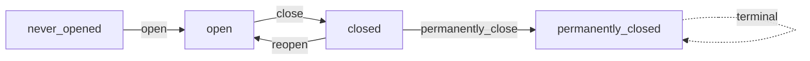
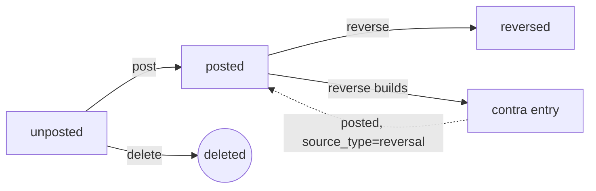
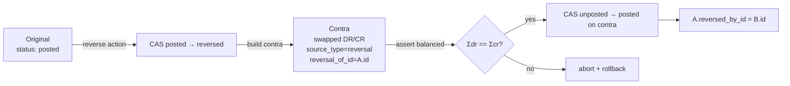

# General Ledger

The single source of truth for every dollar your company recognises, owes, owns, or spends. Everything that touches money — an invoice you send, a bill you receive, a stock receipt, a payroll run — ends up here as a balanced journal entry, dated into an accounting period, on a ledger.

> **Where do I begin?** Set up your reporting calendar first ([Fiscal Calendars](#fiscal-calendars)), then generate the [Accounting Periods](#accounting-periods) for the years you intend to report on and **open at least one period** per ledger. Once an open period covers a date, the rest of the ERP can post into it — manual [Journal Entries](#journal-entries), upstream events through [Journal Templates](#journal-templates), or reads from the [Trial Balance](#trial-balance). The audit trail of every auto-posted journal lives in [Sub-Ledger Postings](#sub-ledger-postings).

---

## Table of contents

1. [Fiscal Calendars](#fiscal-calendars)
2. [Accounting Periods](#accounting-periods)
3. [Journal Entries](#journal-entries) *(see deep-dive: [journal-entries.md](./deep-dives/journal-entries.md))*
4. [Trial Balance](#trial-balance)
5. [Journal Templates](#journal-templates)
6. [Sub-Ledger Postings](#sub-ledger-postings)
7. [Recurring Journals & Mass Allocations](#recurring-journals--mass-allocations)

---

## Fiscal Calendars

### What it is

A tenant-level definition of the **reporting calendar** — when the financial year starts and how each year is broken into reporting periods. Drives the [Accounting Periods](#accounting-periods) you can subsequently create against a ledger.

> **Example:** A US-incorporated tenant runs a January-start monthly calendar named `US-CAL-MONTHLY`. A UK subsidiary on the same database runs `UK-CAL-MONTHLY` with `start_month = 4` (HMRC tax year starts in April). A third calendar `BOARD-QUARTERLY` is `quarterly` and used by a separate management-reporting ledger.

### How records get created

| Method | When |
|---|---|
| UI screen at `/erp/gl/fiscal-calendars` → **New Calendar** | The normal path during initial setup. |
| `POST /erp/gl/fiscal-calendars` | Provisioning script when standing up a new tenant. |

### Fields

| Field | Required | Notes |
|---|---|---|
| Name | Yes | UNIQUE per tenant. Free-text label — `US-CAL-MONTHLY`, `FY-2026`, etc. |
| Start Month | Yes (default 1) | The calendar month that begins the fiscal year. Clamped to 1..12; values outside the range are coerced to the nearest endpoint at save. |
| Period Type | Yes (default `monthly`) | `monthly` / `quarterly` / `custom`. Unknown values fall back to `monthly`. |
| Description | Optional | Free-text. |
| Active | Default true | Pausing a calendar doesn't retroactively affect periods already created from it — those keep working. |

### Actions

- **List** — sidebar → ERP → GL → Fiscal Calendars. Filter by active/inactive.
- **Create / Edit / Delete** — admin-only; the screen is part of finance setup.

### Gotchas

- **Period type is a *labeling* convention, not a generator.** Selecting `monthly` does not auto-create 12 [Accounting Periods](#accounting-periods); periods are created explicitly per (ledger, fiscal_year) — the calendar just tells you what shape to use. A `custom` calendar means "I'll define irregular periods by hand."
- The `4-4-5` retail calendar is **not** an option in the current schema — use `custom` and define the boundaries yourself on each accounting period.
- Editing `start_month` after periods have already been created **does not move existing periods**. The change only affects future period creation.

---

## Accounting Periods

### What it is

A discrete reporting window — typically a month — on a single ledger, against which journal entries can be posted. Status gates posting: only `open` periods accept new posts, and the trial balance / financial statements aggregate over their `start_date..end_date` range. UNIQUE per `(tenant, ledger, fiscal_year, period_number)` — you can't accidentally create two "FY2026 / period 3" on the same ledger.

> **Example:** Ledger `USD-MAIN` for fiscal year 2026 has 12 periods named `Jan-2026` … `Dec-2026`, each spanning one calendar month. Closing the books for May consists of: (1) verify no unposted drafts dated 1–31 May, (2) close `May-2026`, (3) open `Jun-2026` if it isn't already, (4) future May-dated entries are now refused at post time.

### How records get created

| Method | When |
|---|---|
| UI at `/erp/gl/accounting-periods` → **New Period** | One-by-one during ledger setup. |
| `POST /erp/gl/accounting-periods` | Bulk-create the 12 months of a fiscal year via a setup script. |

There is no auto-generator from the fiscal calendar today — the periods are explicit rows.

### Fields

| Field | Required | Notes |
|---|---|---|
| Ledger | Yes | Must already exist for the tenant. |
| Fiscal Calendar | Yes | Sets the reporting shape; UI typically pre-filters periods by calendar. |
| Fiscal Year | Yes | Integer — `2026`. |
| Period Number | Yes | 1..N — for monthly calendars, 1..12. UNIQUE within (tenant, ledger, fiscal_year). |
| Name | Yes | Free-text label — `Jan-2026`, `FY26-Q2`, `P03-2026`. Up to 40 chars. |
| Start Date / End Date | Yes | The inclusive window. `end_date < start_date` is refused with 422. |
| Status | Lifecycle | `never_opened` / `open` / `closed` / `permanently_closed`. See below. |
| Closed At / Closed By | Auto on close | Stamped on the `→ closed` and `→ permanently_closed` transitions; cleared on reopen so the audit trail shows the *current* close. |

### Lifecycle



- `open` — entries can post for dates within `start_date..end_date`.
- `closed` — posting is refused (`No open accounting period covers <date>`). The period can still be reopened.
- `permanently_closed` — terminal. No transitions out. Cannot be reached directly from `open` — you must `close` first, then `permanently_close`. This deliberate two-step gate is enforced inside `PeriodService::permanentlyClose` so a single misclick can't lock the books forever.
- `closed_pending` is **not** a status in the current schema. Some legacy specs mention it; the implemented states are the four above.

### Close-time check

Closing a period scans for unposted journal entries whose `entry_date` falls inside `start_date..end_date` on the same ledger. If any exist, the close is refused with:

> *N unposted entries are dated in this period and would become un-postable. Pass force=true to close anyway.*

Pass `{"force": true}` on the close call to override (the operator's intent is now explicit and audit-logged). There is no automated "open invoices / unposted stock movements" checklist in the period close itself — those sub-ledger items are gated by their own modules; the GL gate is the unposted-draft check.

### Actions

- **List** — filter by ledger, status, or fiscal year.
- **Create** (`POST`) / **Edit** (`PUT`) / **Delete** (`DELETE`) — admin / manager role required. Delete is **refused** once a period leaves `never_opened` (it would erase the open/close audit), and also refused if any journal entry already references it.
- **Open** (`POST /{id}/open`) — `never_opened` *or* `closed` → `open`. Used to both first-open a freshly-created period and to reopen a closed one.
- **Close** (`POST /{id}/close`) — `open` → `closed`. Approver role required. Optional `force=true` body.
- **Permanently close** (`POST /{id}/permanently-close`) — `closed` → `permanently_closed`. Approver role required. Irreversible.

### Gotchas

- **Backdated entries are blocked once the covering period is closed.** Posting a journal for a date inside a `closed` (or stronger) period raises `No open accounting period covers <date> on this ledger`. To post a legitimate back-dated correction, an approver re-opens the period (audit-logged) → posts → closes again.
- **Overlapping open periods on the same ledger raise at post time.** If admin error creates two periods whose ranges both cover a date and both are `open`, `AccountingPeriod::findOpenCovering` throws `Multiple open periods cover <date>… Resolve the overlap before posting.` rather than silently picking one — non-deterministic posting would be worse than a hard failure.
- **Period close does *not* require the previous period to be closed.** You can have several months open simultaneously; the close order is operator-driven.
- **Reopen wipes the prior `closed_at` / `closed_by` stamps.** The audit trail tracks only the *current* close. The reopen itself is captured via the audit log entry (`opened` action).
- Permanently-closed periods cannot be reopened by any role — including super-admin. The CAS in `transitionStatus` only allows `closed → permanently_closed`, never the reverse.

---

## Journal Entries

### What it is

A balanced set of debits and credits on a ledger, dated into an accounting period. The atomic unit of GL bookkeeping. Most entries are auto-posted from upstream sub-ledger events (a customer invoice you send, a vendor bill you match, a stock receipt that lands); a smaller share are manual operator entries for accruals, reclasses, opening balances, and inter-company adjustments.

> **Example:** Closing-month accrual — a manual entry on `USD-MAIN`, dated 2026-05-31: DR Utilities expense $4 200, CR Accrued utilities payable $4 200. Two lines, balanced, source_type `manual`, period `May-2026`. Once posted, the trial balance shows the May expense; in June the operator either lets the accrual stand or `reverses` it to flip the debit and credit.

> **Auto-post example:** Sales rep sends invoice INV-2026-0042 ($1 000 + $80 tax). On send, `CustomerInvoiceService` calls `SubLedgerPostingService::postFor('customer_invoice', ...)`, which resolves the tenant's default `customer_invoice` template and creates a balanced 3-line journal: DR AR $1 080 / CR Revenue $1 000 / CR Tax payable $80. `source_type = customer_invoice`, `source_id = 42`. The link is recorded in [Sub-Ledger Postings](#sub-ledger-postings) so you can answer "did this invoice post?" in one query.

### How records get created

| Method | When |
|---|---|
| UI at `/erp/gl/journal-entries` → **New Entry** | Manual entries — accruals, reclasses, corrections. |
| `POST /erp/gl/journal-entries` | Headless integration. |
| Auto-post via `SubLedgerPostingService::postFor()` | The vast majority of entries. Every customer-invoice send, vendor-bill match, payment apply, stock movement post, payroll run mark-paid, work-order complete, bank-transaction post, and inter-company exchange routes through here when the tenant has a [Journal Template](#journal-templates) configured for the event. |
| `reverse` action | Creates a contra entry mechanically; see *Lifecycle* and *Actions* below. |

### Fields (header)

| Field | Required | Notes |
|---|---|---|
| Ledger | Yes | Must be active. Inactive ledgers refuse new entries. |
| Entry Number | Auto | `JE-{tenant_id}-{YYYYMMDD}-{0001}` — per-tenant, per-day sequence. UNIQUE per (tenant, entry_number). |
| Entry Date | Yes | Defaults to today. The "transaction" date the operator typed. |
| Posting Date | Set at post | The GL impact date — frozen on the `→ posted` transition and used to resolve the period and to filter the [Trial Balance](#trial-balance). Cannot precede `entry_date`. |
| Period Id | Set at post | Resolved from `AccountingPeriod::findOpenCovering(ledger, posting_date)`. Whitelisted as a settable column inside `transitionStatus` so a stray key can't silently update the wrong column. |
| Source Type | Default `manual` | See allowlist below. |
| Source Id | Optional | The upstream row's id when `source_type` is non-manual. |
| Currency | Default `USD` | Uppercased on save. |
| Exchange Rate | Default 1 | Multi-currency support; combined with per-line `currency_amount`. |
| Description | Optional | Free-text. |
| Status | Lifecycle | `unposted` / `posted` / `reversed`. |
| Reversal Of Id | On reversal contra | Points to the original entry being reversed. |
| Reversed By Id | On original at reverse-time | Points to the contra entry. Two-way navigation. |

#### `source_type` allowlist

```
manual, recurring, allocation, reversal,
customer_invoice, vendor_bill, customer_payment, vendor_payment,
stock_movement, bank_transaction, depreciation, asset_retirement,
payroll, payroll_run, work_order, expense_reimbursement,
adjustment, opening_balance, period_close, translation, elimination,
inter_company
```

The header insert validates against this list and silently coerces to `manual` if the caller passes anything else. **That coercion was a Sev-2 latent bug in B5** — earlier sprints added `payroll_run`, `work_order`, `inter_company`, `bank_transaction`, and `asset_retirement` to the column ENUM but did not extend the service-layer allowlist. Auto-posts for those source types were silently being labelled `manual`, breaking source-type filters on this screen and on [Sub-Ledger Postings](#sub-ledger-postings). The allowlist now matches the full ENUM and is kept in sync with every sprint that adds a new auto-posting source.

### Fields (line)

| Field | Required | Notes |
|---|---|---|
| Line No | Auto | 1-based ordinal within the entry. UNIQUE per (journal_id, line_no). |
| Account Combination | Yes | Must belong to the tenant; must be `is_enabled = 1` *both* at line save *and* at post time. |
| Debit | One-of | DECIMAL(20,4) ≥ 0. |
| Credit | One-of | DECIMAL(20,4) ≥ 0. |
| Currency Amount | Defaults to debit-or-credit | Original-currency amount before translation. Stored alongside the functional `debit`/`credit` for multi-currency reporting. |
| Currency | Default `USD` | Original currency. |
| Exchange Rate | Default 1 | Per-line override; falls back to header rate. |
| Description | Optional | Free-text annotation. |

**DB-level invariant** — `CHECK (debit = 0 OR credit = 0)`. A line carrying both a debit *and* a credit is rejected by MariaDB. The service layer also refuses `(0, 0)` lines and any negative value.

**Cross-row invariant** — `Σ(debits) = Σ(credits)` per entry, enforced inside `JournalEntryService::post` with a `0.0001` epsilon. A DB-level constraint can't express this (it's a multi-row aggregate); the service does the assertion before flipping the status to `posted`.

### Lifecycle



- **`unposted`** — draft. Editable. May be unbalanced while you're working on it.
- **`posted`** — frozen with `period_id` and `posting_date`. Not editable, not deletable, only reversible.
- **`reversed`** — superseded by a contra entry. Visible on screen but inert for trial-balance roll-ups (because the contra contributes the offsetting amounts).
- **Contra entry** — created when you reverse a posted entry. Itself a normal `posted` journal with `source_type = reversal` and `reversal_of_id` pointing at the original.



The reversal flow is wrapped in a single transaction. The original is **claimed first** via a `posted → reversed` CAS — two concurrent reversals can't both win. A second reversal attempt sees `status='reversed'` and returns `Entry is no longer posted (changed concurrently).` 422.

### Posting (`POST /{id}/post`)

1. Verify status is `unposted`.
2. `posting_date` defaults to the header's existing `posting_date` or `entry_date`; the operator can override on the action. Validation refuses `posting_date < entry_date`.
3. Sum the lines: must have ≥ 2 lines and `Σdebits ≈ Σcredits` (epsilon `0.0001`).
4. Re-check every line's account_combination is still `is_enabled = 1` (an admin could have disabled it between save and post).
5. Resolve the open period covering `posting_date` on the entry's ledger via `AccountingPeriod::findOpenCovering` (raises on multi-open overlap; refuses if none).
6. CAS the status `unposted → posted` and stamp `posted_at`, `posted_by`, `period_id`, `posting_date` atomically. The CAS is what makes two clicks idempotent — the second loses the race and gets `Entry is no longer unposted (changed concurrently).`

### Reverse (`POST /{id}/reverse`)

Builds a balanced contra entry that mirrors the original line-for-line with debits and credits swapped, posts it in the same transaction, and links both sides via `reversal_of_id` / `reversed_by_id`.

- `reversal_date` defaults to today; refused if it precedes the original's `posting_date`.
- Refused if no open period covers the reversal date.
- Refused if any line's account combination has been disabled since the original posted.
- The contra is re-asserted balanced by construction (defense in depth) before its own `→ posted` CAS.

### Edit / Delete

- `PUT /{id}` and `DELETE /{id}` work **only on `unposted` entries**. Once posted, the entry is immutable; the only remedy is `reverse`.
- Edit replaces all lines if the payload includes `lines` (delete-then-insert inside a transaction).
- Delete cascades to `journal_lines` inside a single transaction so a parent-delete failure can't leave a header without lines.

### Actions

- **List** (`GET`) — filter by `ledger_id`, `status`, `period_id`, `source_type`.
- **View** — opens the entry with lines, combination codes, and the linked reversal pair if any.
- **Create / Edit / Delete** — unposted only (`writer` role — `super_admin`/`admin`/`manager`/`user`).
- **Post / Reverse** — approver only (`super_admin`/`admin`/`manager`).

### Gotchas

- **You can save an unbalanced draft.** Balance is asserted at `post`, not at `create`/`update` — the screen is a worklist. The "Post" button surfaces the variance before the round-trip.
- **Posting and reversing are CAS-protected.** Re-clicking the button after the first call succeeded returns 422, not a duplicate. The UI should still disable the button on first click; the CAS is the safety net, not the only line of defense.
- **No silent journal posts with disabled combinations.** Disabling a combination after a draft is saved but before it's posted causes the post to fail with `Cannot post — combination '<code>' is disabled.` The same check runs on `reverse` so a contra can't post under a now-disabled account either.
- **Multi-currency translation is line-resident.** Each line stores `currency_amount` + `currency` + `exchange_rate` alongside the functional-currency `debit`/`credit`. The trial balance roll-up uses the functional values; the original-currency columns are kept for translation reports and audit trail.
- **`source_type='manual'` is the silent fallback.** If you see a journal whose source ENUM is `manual` but you didn't expect a manual entry, check that the caller passed a value inside the allowlist. (See the B5 fix story above — that footgun has been closed for the documented ENUM, but adding a new source type in future requires updating the allowlist *and* the column ENUM together.)
- **Deleting a never-opened period blocks delete of any journal that referenced it** — but the inverse is also true: you can't delete a period that any journal references, even an unposted draft. Clean the drafts up first.
- **A `reversed` original never trial-balances by itself.** Both halves (original + contra) are `posted`-ish from the lines' perspective; the original's flip to `reversed` does not retroactively remove its lines. The contra's swapped lines cancel them out at aggregate. If you see a half-reversal, that's a bug — both legs are atomic.

For the full posting choreography across all source types — recurring journals, mass allocations, and the interaction with the sub-ledger templates — see the deep-dive [`deep-dives/journal-entries.md`](./deep-dives/journal-entries.md).

---

## Trial Balance

### What it is

Aggregate roll-up of every posted journal line per `account_combination`, on a chosen ledger, as of a chosen date. Diagnoses whether the books are in fact in balance (`Σnet_debit = Σnet_credit`) and is the input feed to every downstream financial statement.

> **Example:** On 2026-05-31 the operator opens Trial Balance, picks ledger `USD-MAIN`, leaves `as_of = today`. The screen lists every combination that has ever been touched by a posted entry on this ledger, with cumulative `total_debit`, `total_credit`, and the netted `net_debit` / `net_credit` columns. The footer shows `total_debit = 482 110.00`, `total_credit = 482 110.00`, `balanced = true`. If `balanced = false`, something is wrong at the database layer — the service-layer balance assertion guarantees this should never happen in a healthy system, so a `false` is a real incident.

### How records get created

There are no Trial Balance *records* — it's a derived report, recomputed on every read.

### Query parameters

| Param | Required | Notes |
|---|---|---|
| `ledger_id` | Yes | 422 if absent. |
| `as_of` | Optional | Defaults to today. Must parse as `YYYY-MM-DD` — anything else returns 422. |

### Response shape

| Column | Meaning |
|---|---|
| `account_combination_id` | The combination row. |
| `combination_code` / `description` | From `account_combinations`. |
| `account_type` | Cached on the combination — `asset` / `liability` / `equity` / `revenue` / `expense`. |
| `total_debit` / `total_credit` | Cumulative posted amounts as-of date. |
| `net_debit` | `max(total_debit - total_credit, 0)` — only one of net_debit / net_credit is non-zero per row. |
| `net_credit` | `max(total_credit - total_debit, 0)`. |
| `totals.total_debit` / `totals.total_credit` | Footer sums. |
| `totals.balanced` | `abs(Σdr - Σcr) ≤ 0.0001`. |

The query filters strictly on `je.status = 'posted'` and `je.posting_date <= as_of` — `unposted` drafts and `reversed` originals contribute their posted lines (the original was posted before the reversal); the contra entry, also `posted`, contributes the offsetting amounts. Net effect on the trial balance after a reversal is zero, as expected.

### Actions

- **List** — pick ledger + as-of-date, render rows.
- **Drill in** — clicking a row opens the per-combination journal-line list (frontend behaviour; not a dedicated API).

### Gotchas

- **As-of is by `posting_date`, not `entry_date`.** A May-31-dated entry posted in June still rolls into the May trial balance only if the operator chose `posting_date = 2026-05-31`. The default `posting_date` equals the entry date when not overridden.
- **The report is filtered by ledger, not by period.** "By period" reports are slices of the same query (`as_of = period.end_date` and an optional from-date roll-forward). The current endpoint doesn't expose a period filter directly.
- **The report respects `posted` only.** A `reversed` entry's *lines* are still on disk and still aggregate normally; the contra cancels them. So the row counts on Trial Balance can be larger than the count of "currently in-effect" journals.
- **The numbers do not reflect translation to a reporting currency.** Lines are summed at their functional-currency `debit`/`credit` values. A separate translation/elimination journal (source_type `translation` / `elimination`) is how multi-currency consolidation is folded in.
- **`balanced = false` is an incident, not a warning.** The service-layer post-time balance assertion should make this impossible. If it ever returns false, capture the response and grep the journal_lines for the offending entry — there is a real bug somewhere upstream that bypassed the assertion.

---

## Journal Templates

### What it is

Per-tenant configuration of **which GL combinations to debit and credit when a particular sub-ledger event fires**. One row per `(tenant, event_type)` is flagged `is_default = 1`; the [Sub-Ledger Posting Service](#sub-ledger-postings) resolves that default at post time and routes the appropriate combinations into the resulting journal.

> **Example:** Tenant A configures its default `customer_invoice` template against ledger `USD-MAIN` with:
> ```
> ar_combination_id       = 1100-AR
> revenue_combination_id  = 4000-Sales
> tax_payable_combination_id = 2200-Sales-Tax
> ```
> Every customer invoice issued posts DR `1100-AR`, CR `4000-Sales`, CR `2200-Sales-Tax` automatically. Tenant B configures the same event type but routes revenue to `4100-Service-Revenue` and tax to `2210-Service-Tax`. The same event, same code path, different combinations — tenant-specific routing without forking the service.

### Event types supported

The `event_type` ENUM (table + service constants) is exactly:

```
customer_invoice, customer_payment,
vendor_bill,      vendor_payment,
stock_movement,   bank_transaction,
payroll_run,      work_order,
inter_company
```

Anything outside this list is rejected at create with a 422 — there is no silent fallback. The list is exposed as `JournalTemplate::EVENT_TYPES`.

### Account-combination slots

A template carries the following nullable slots; the line builder for each event type uses the subset it needs:

```
ar_combination_id           ap_combination_id
revenue_combination_id      cogs_combination_id      expense_combination_id
inventory_combination_id
tax_payable_combination_id  tax_receivable_combination_id
cash_combination_id         clearing_combination_id
```

Per-event mapping (DR → CR):

| `event_type` | Debit | Credit |
|---|---|---|
| `customer_invoice` | AR (total) | Revenue (subtotal), Tax payable (tax) |
| `customer_payment` | Cash (amount) | AR (amount) |
| `vendor_bill` | Inventory **or** Expense (subtotal), Tax receivable (tax) | AP (total) |
| `vendor_payment` | AP (amount) | Cash (amount) |
| `stock_movement` (in) | Inventory (cost) | Clearing or Expense (GR/IR) |
| `stock_movement` (out) | COGS (cost) | Inventory (cost) |
| `stock_movement` (transfer) | (skipped — inventory-to-inventory, net zero) | — |
| `bank_transaction` (in) | Cash (amount) | Clearing |
| `bank_transaction` (out) | Clearing | Cash (amount) |
| `payroll_run` | Expense (gross) | Tax payable (withholdings), Cash or AP (net) |
| `work_order` | FG inventory (fg_value), Variance (under-recovery) | Raw inventory (material), Labor applied (labor), Variance (over-recovery) |
| `inter_company` (when invoked through SLPS) | IC Receivable (amount) | IC Payable (amount) |

Where the resolver needs a *cash* account, the order of preference is:
1. The bank account on `context['bank_account_id']` if its `gl_account_combination_id` is set — tenant-scoped lookup so cross-tenant resolution is impossible.
2. An explicit `context['cash_combination_id']` override.
3. The template's `cash_combination_id`.

A bank-account id that resolves but lacks a GL combination is a **misconfiguration error**, not a fallback — the service raises rather than silently posting against the template's generic cash account.

### Fields

| Field | Required | Notes |
|---|---|---|
| Event Type | Yes | Must be in the ENUM. |
| Name | Yes | Free-text, ≤ 120 chars. |
| Description | Optional | Free-text. |
| Ledger | Yes | Where auto-posted entries will land. |
| Combination slots (10 columns above) | Optional per slot | Only the slots the event needs are required; missing-required slots surface as `Auto-posting line N has no account_combination_id — template is missing a required account for this event.` at post time. |
| Is Default | Default false | At most one default per (tenant, event_type). Enforced by `default_marker` virtual column + `UNIQUE(tenant_id, event_type, default_marker)`. |
| Is Active | Default true | Inactive templates are not resolved as defaults. |

### Actions

- **List** — sidebar → ERP → GL → Journal Templates. Filter by event type or active flag.
- **Create / Edit / Delete** — `super_admin` / `admin` only. Manager role is not enough — these mappings are accounting-policy decisions.
- **Delete** is refused if any [Sub-Ledger Posting](#sub-ledger-postings) ever used the template; deactivate instead.

### Gotchas

- **Two-default collisions are rejected at the DB.** Marking a second template `is_default = 1` for the same `(tenant, event_type)` raises a SQLSTATE 23000 on `uq_jt_tenant_event_default` — the controller catches this specifically and returns `A default template for this event_type already exists. Un-flag the other one first.` Unrelated 23000 errors (FK violation, etc.) propagate as 500 with the trace logged.
- **No template configured = no auto-post.** When `findDefaultForEvent` returns null, `SubLedgerPostingService::postFor` returns `{ skipped: true, reason: 'no_template' }` instead of raising. Auto-posting is *opt-in* per tenant per event type — tenants who haven't set up GL integration don't get period gating on routine operations.
- **Editing an existing template affects future posts only.** Historical sub_ledger_postings still reference the template_id at the time they posted; if you later disable a combination on the template, replays don't retroactively rewrite the past journals.
- **`work_order` collapses FG and raw inventory into one combination.** In v1 the same `inventory_combination_id` is used both for the FG debit and the raw materials credit. A richer tenant chart of accounts wanting separate FG vs raw lines needs the v2 work-order template (planned).
- **`inter_company` through templates is a memo-only path.** The real inter-company posting is driven by `InterCompanyService`, which writes the two-leg journal pair directly across the two ledgers. Calling `SLPS::postFor('inter_company', ...)` with both `ic_receivable_combination_id` and `ic_payable_combination_id` in context posts a self-balancing memo; otherwise it returns `no_lines`.

---

## Sub-Ledger Postings

### What it is

The **append-only audit trail** that links each upstream sub-ledger event to the journal it auto-posted. Read-only screen. The diagnostic answer to *"did invoice #42 actually post a journal, and which one?"*

UNIQUE per `(tenant_id, source_type, source_id)` — the same upstream event can never post a duplicate journal, even on retry or under a race.

> **Example:** Operator complains that the GL doesn't reflect invoice INV-2026-0042. They open Sub-Ledger Postings, filter `source_type = customer_invoice`, `source_id = 42`. One row comes back: `journal_id = 1287`, `journal_status = posted`, `event_type = customer_invoice`, `template_id = 17`, `amount_total = 1080.00`, `posted_at = 2026-05-21 14:02`. Click through to journal 1287 — three balanced lines, in May-2026, exactly as expected. The "did it post?" question is now answered.

### How records get created

Exclusively by `SubLedgerPostingService::create` from inside `postFor()`, after the journal has been created and posted successfully. There is no UI for manual creation — the row is the audit consequence of an auto-post.

### Fields

| Field | Source | Notes |
|---|---|---|
| Event Type | from `postFor()` caller | Same ENUM as Journal Templates. |
| Source Type | from `postFor()` caller | The concrete row type, e.g. `customer_invoice`, `vendor_bill`, `stock_movement`. Stored as a 40-char VARCHAR so source types beyond the strict event ENUM can be linked. |
| Source Id | from `postFor()` caller | The upstream row's id. |
| Journal Id | result of post | The GL journal that was created. |
| Template Id | from resolved template | Nullable — historical rows may pre-date the template field. |
| Amount Total | `context.amount` or `Σdebits` | The headline figure for filter / sanity. |
| Currency | from event context | Uppercased. |
| Posted At / Posted By | auto | Stamped at insert. |
| Notes | optional | Free-text from the caller. |

### Actions

- **List** (`GET /erp/gl/sub-ledger-postings`) — filter by `event_type`, `source_type`, `source_id`. Returns the 500 most recent rows ordered by `posted_at DESC`. Manager role required (the screen exposes journal ids + amounts).
- **Show** (`GET /erp/gl/sub-ledger-postings/{id}`) — single posting with its journal status, posting date, and entry number joined in.

There is **no edit, delete, or post action** — the table is append-only by design. To "cancel" a sub-ledger posting, reverse the linked journal entry through the [Journal Entries](#journal-entries) screen; that creates a contra journal but the original posting row is preserved (it remains the historical record).

### Idempotency contract

The `postFor()` flow guarantees a single sub-ledger event can never post twice:

1. **Up-front short-circuit** — `findBySource(tenant, source_type, source_id)` runs first. If a row exists, the service returns `{ idempotent: true, reason: 'already_posted', journal_id: <prior> }` without touching the GL.
2. **DB-level UNIQUE** — `uq_slp_tenant_source` on `(tenant_id, source_type, source_id)`. A concurrent caller that slips past step 1 collides here.
3. **Race resolution** — on a 1062 collision the service re-reads the row, returns `{ idempotent: true, reason: 'race_collision_resolved' }`, and logs a warning. Diagnostic — a one-off race is fine, but persistent collisions usually mean two sources are writing the same `(source_type, source_id)`, which operators need to see.

Errno is checked narrowly: only **errno 1062** (`ER_DUP_ENTRY`) is treated as race-resolved-idempotent. Bare SQLSTATE 23000 (which also covers FK violations and NOT NULL failures) is **not** swallowed — those propagate as real DB errors.

### Gotchas

- **A `reason: 'no_template'` skip is invisible here.** If the tenant has no default template for the event type, no `sub_ledger_postings` row is written and the parent operation completes normally. Use the parent module's screen to confirm the event happened; if there's no matching SLP row, suspect missing template configuration.
- **`linesForPayrollRun` was missing entirely until the B3 fix.** Before the fix, configuring a `payroll_run` template and triggering a mark-paid would crash inside the line builder with `Unknown event_type 'payroll_run'`. The case is now wired up and matches the deduction conventions documented under [Journal Templates](#journal-templates). If a tenant on a pre-B3 build has an unposted payroll run, it needs a manual re-trigger after the patch lands.
- **Race collision warnings should be rare.** A single, isolated `race_collision_resolved` log line is benign. A pattern of them (same `source_type` repeatedly, dozens per day) is a real bug — usually two callers wrapping the same parent operation with `postFor`.
- **Manager role gate is intentional.** The screen surfaces journal ids and amounts; even read-only access leaks finance signal to non-finance roles.
- **No retry button.** If a posting failed and rolled back (e.g. the resolved template was incomplete), there is no UI to "retry" the post. The fix is: complete the template, then re-trigger the parent operation. The idempotency check sees no prior posting and proceeds.

---

## Recurring Journals & Mass Allocations {#recurring-journals--mass-allocations}

The `journal_entries.source_type` ENUM reserves slots for `recurring` and `allocation`, but the schedule-driven recurring-journals engine and the mass-allocation rule engine are **planned modules**, not yet implemented in the current build. The screens for *recurring sales invoices* (`/erp/recurring-invoices`) are unrelated — they live in O2C, not GL.

What exists today:

- A journal can be **manually created** with `source_type = recurring` or `source_type = allocation` and the source allowlist will accept it (the ENUM has the slots). The operator does the calculation themselves.
- The reversal path uses `source_type = reversal` automatically; no operator action needed.

What's planned (deep-dive: [`deep-dives/journal-entries.md`](./deep-dives/journal-entries.md)):

- **Recurring journals** — a template entry + cadence (monthly, quarterly) + posting role. On tick, the engine creates a fresh `unposted` journal each period, optionally auto-posts it. Audit through `source_type = recurring` and a planned `recurring_journal_id` link.
- **Mass allocations** — a rule that distributes the balance of one combination across many child combinations using a basis (headcount, square footage, revenue %). On run, generates a balanced allocation entry with `source_type = allocation`. Drives expense recharges and overhead absorption.

Until these ship, the workaround is a [Journal Template](#journal-templates) (for repeating sub-ledger events) plus a manual `source_type = recurring` entry copied each period by an operator.

---

## Cross-references

- **Framework & Setup** — Ledgers, currencies, account combinations, and the chart of accounts are defined under [framework.md](./framework.md) and are the prerequisites for any GL activity.
- **Finance, Tax & Master Data** — [finance.md](./finance.md) documents customers, vendors, tax codes, and the bank account → GL combination mapping that `customer_payment` / `vendor_payment` / `bank_transaction` resolve through.
- **Sales & AR** — Every customer invoice send and customer payment apply hits a `customer_invoice` / `customer_payment` template. See [sales-ar.md](./sales-ar.md).
- **Procurement** — Vendor bills and vendor payments route through `vendor_bill` / `vendor_payment` templates. See [procurement.md](./procurement.md).
- **Inventory** — Every stock movement posts a balanced journal via the `stock_movement` template. See [inventory.md#movements](./inventory.md#movements) for the source of those events.
- **Cash & Bank** — Bank transactions and bank reconciliations land here through `bank_transaction`. See [cash-bank.md](./cash-bank.md) and the reconciliation deep-dive [`deep-dives/bank-reconciliation.md`](./deep-dives/bank-reconciliation.md).
- **Payroll** — Mark-paid on a payroll run drives a `payroll_run` template. See [payroll.md](./payroll.md) and [`deep-dives/payroll-runs.md`](./deep-dives/payroll-runs.md).
- **Manufacturing** — Work order completion fires `work_order`. See [manufacturing.md](./manufacturing.md) and [`deep-dives/work-orders.md`](./deep-dives/work-orders.md).
- **Fixed Assets** — Depreciation runs and retirements use `depreciation` / `asset_retirement` source types. See [fixed-assets.md](./fixed-assets.md).
- **Multi-Entity** — Inter-company allocations and consolidation journals use `inter_company`, `translation`, and `elimination` source types. See [multi-entity.md](./multi-entity.md).
- **Journal Entries deep-dive** — [`deep-dives/journal-entries.md`](./deep-dives/journal-entries.md) covers manual + auto-post + recurring + mass allocation in one place.
