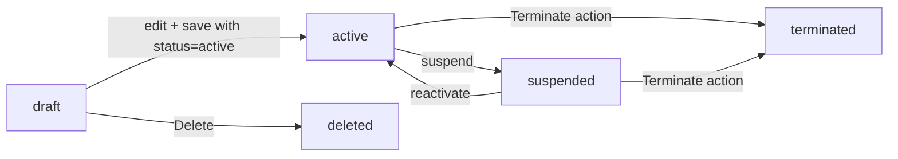
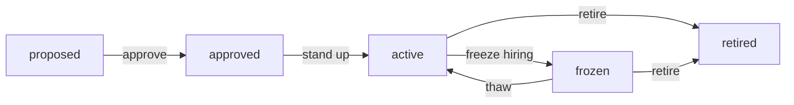
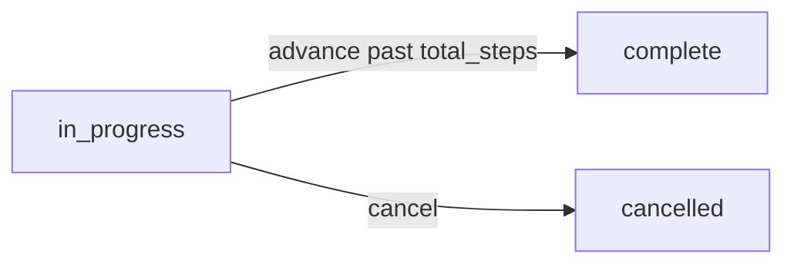
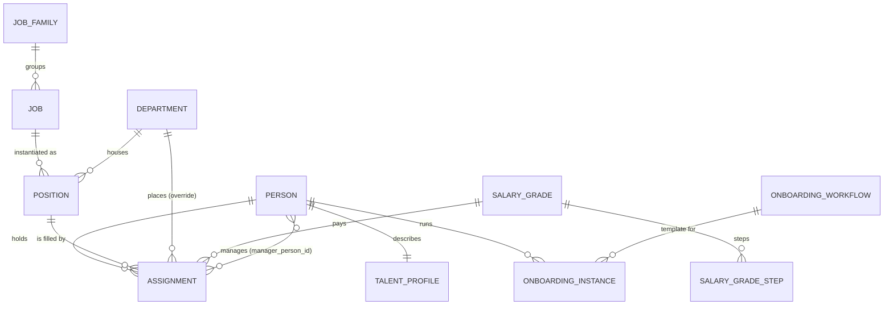

# HR

The people side of the ERP — who works here, what they do, who they report to, what they get paid, and how they got started.

> **Where do I begin?** Read this once before clicking anything: **a Person is not an Employee**. ROBUSTA follows the Oracle Person / Assignment / Position model — three independent records joined into employment:
>
> - A **[Person](#persons)** is a human (name, DOB, national id). It exists whether they're hired, pre-hired, contingent, or terminated.
> - A **[Position](#positions)** is a slot in your org chart ("Senior Engineer — Platform"). Positions exist with **zero incumbents** — that's how "open requisitions" are modelled.
> - An **[Assignment](#assignments)** is the join: this Person fills this Position from this date for this pay, under this manager. **A single person can hold multiple concurrent assignments** (e.g. two part-time roles) — the one flagged `is_primary=1` drives payroll and reporting defaults.
>
> Setup order on a green tenant: [Job Families](#job-families) → [Jobs](#jobs) → [Departments](#departments) → [Salary Grades](#salary-grades) → [Positions](#positions). Once that scaffold is up, [create a Person](#persons), then [create an Assignment](#assignments) that ties the Person to a Position. Optionally [start an Onboarding instance](#onboarding) on hire.

---

## Table of contents

1. [Persons](#persons)
2. [Assignments](#assignments)
3. [Positions](#positions)
4. [Jobs](#jobs)
5. [Job Families](#job-families)
6. [Departments](#departments)
7. [Salary Grades](#salary-grades)
8. [Onboarding](#onboarding)
9. [Talent Profiles](#talent-profiles)
10. [Person / Assignment / Position relationship](#person--assignment--position-relationship)

---

## Persons

### What it is

The canonical record of a human, **independent of any employment relationship**. An employee, a contractor, and a candidate who hasn't started yet are all `persons` rows — differentiated by `person_type`, not by the presence or absence of an [Assignment](#assignments). A Person can outlive any specific job they've held.

> **Example:** Jane Doe is hired as a Senior Engineer (Platform). The system holds **one** persons row (`PRN-12-0017`, Jane Doe, employee, active) plus **one** assignments row (ASGN-12-0042) linking her to the Senior Engineer position. Eighteen months later she takes a second part-time assignment in the Architecture team — same Person, second Assignment, `is_primary=0`.

### How records get created

| Method | When |
|---|---|
| `/erp/hr/persons` UI | The standard path — manager creates the Person, then immediately or later attaches an Assignment. |
| `POST /erp/hr/persons` | Integration (HRIS import, applicant-tracking handoff). |
| Auto from onboarding (planned) | Not implemented in this sprint — onboarding still requires the Person to exist first. |

### Fields

| Field | Required | Notes |
|---|---|---|
| Person Number | Auto | `PRN-{tenantId}-{seq}` from `Person::nextPersonNumber`. UNIQUE per tenant. Two parallel creates that compute the same MAX+1 are caught and one retries — see Gotchas. |
| First / Last Name | Yes | `Validator->required` on both. |
| Middle / Preferred Name | Optional | |
| Date of Birth | Optional | |
| Gender | Optional | Enum: `male`, `female`, `non_binary`, `other`, `prefer_not_to_say`. Unknown values are silently NULLed on create/update. |
| National ID | Optional | Free-text — the system does **not** validate format or uniqueness. |
| Email / Phone | Optional | |
| Person Type | Default `pending` | Enum: `employee`, `contingent`, `pending`. Unknown values are coerced to `pending`. |
| Status | Default `active` | Enum: `active`, `inactive`, `terminated`. **This is the Person's status, not their employment status** — employment is on the Assignment. |
| Company ID | Optional | Link to a CRM `companies` row (used when the Person is also a contact). |
| User ID | Optional | Link to a `users` row when this Person logs into the app. |
| Notes | Optional | Free-text. |

### Lifecycle

`persons.status` is set on create and edited directly — there is no state machine. It tracks the human, not the employment:

- `active` — currently engaged in any capacity (live assignment, or a pre-hire pending start).
- `inactive` — on the books but not currently working (sabbatical, leave between assignments).
- `terminated` — left the company; retained for historical payroll, audit, and 1099/W-2 traces.

The presence of a live Assignment does **not** auto-flip `persons.status`. If you terminate someone's only Assignment and want the Person marked terminated too, edit the Person record separately.

### Actions

- **List / search** — by person_type, status, or text search across first_name / last_name / person_number / email.
- **Create / edit** — manager role required (`super_admin`, `admin`, `manager`).
- **Delete** — only if the Person has **zero** assignments **and** is not listed as `manager_person_id` on any assignment. Otherwise returns 422 with `"Person has assignments or reports; terminate or reassign them first."`
- **Upsert talent profile** — see [Talent Profiles](#talent-profiles).
- **View detail** — `/erp/hr/persons/{id}` returns the Person plus an `assignments` array (all of them, primary first) and the embedded `talent_profile`.

### Gotchas

- **Person ≠ Employee.** Filtering "all employees" means `person_type = 'employee'` joined to `assignments.status = 'active'`. Filtering on `persons.status = 'active'` alone returns pre-hires and people on leave too.
- **Delete is blocked by both directions of the assignments table** — being someone's manager (`manager_person_id`) blocks delete even if the Person has no assignments of their own. Reassign reports first.
- **Person number races**: two simultaneous POSTs can both compute the same `PRN-{tenantId}-NNNN` from `MAX(person_number)+1`. The controller retries **once** on unique-key violation `23000`; the second pass re-reads MAX and picks the next free slot. If the client supplied an explicit `person_number` that collides, no retry — direct 422.
- The Person record carries `user_id` so a person can be linked to a login. Deleting the user row does **not** cascade to the Person; clear `persons.user_id` first.

---

## Assignments

### What it is

The join table that turns a [Person](#persons) into an employee in a particular [Position](#positions). Carries the employment contract details (hire date, salary, hours, manager, employment type) and the lifecycle (`draft` → `active` → `suspended` → `terminated`). A Person can hold many assignments; exactly one is flagged `is_primary=1` at any time.

> **Example:** Alex starts as a full-time Marketing Manager (ASGN-12-0058, primary). Six months later he picks up a 10-hour-a-week role on the new Brand Council (ASGN-12-0073, part_time, is_primary=0, same person_id). Payroll runs the primary salary into the regular pay run and meters the secondary by hours.

### How records get created

| Method | When |
|---|---|
| `/erp/hr/assignments` UI | The standard hire flow — pick Person, Position, hire_date, salary, post. |
| `POST /erp/hr/assignments` | Bulk-loader or HRIS sync. |
| Implicitly on first hire | First Assignment for a Person is auto-flagged `is_primary=1` even if the caller didn't ask — see service code in `HrAssignmentService::create`. |

### Fields

| Field | Required | Notes |
|---|---|---|
| Assignment Number | Auto | `ASGN-{tenantId}-{seq}`. UNIQUE per tenant. Same race-retry as person_number. |
| Person | Yes | Must exist in the same tenant. |
| Position | Optional | If set, must not be in `retired` status — service returns 422 `"Position '{code}' is retired and cannot accept new assignments."` |
| Department | Optional | Free of the position's department; you can override it per assignment. |
| Manager (manager_person_id) | Optional | **Cannot equal `person_id`** — service throws `"A person cannot be their own manager."` |
| Job | Optional | Snapshots the job at hire — survives later job edits. |
| Grade / Step | Optional | Pulls from [Salary Grades](#salary-grades); the actual `salary` is independent (see Gotchas). |
| Employment Type | Default `full_time` | Enum: `full_time`, `part_time`, `contract`, `intern`, `temporary`. |
| Hours per Week | Optional | DECIMAL(5,2). |
| Salary | Optional | DECIMAL(20,4); rounded to 4 dp on insert/update. |
| Currency | Optional | CHAR(3); uppercased on write. |
| Hire Date | **Yes** | Validator-enforced — service throws if absent. |
| Start Date | Optional | The day they actually walk in (may differ from hire_date). |
| Termination Date | Optional | Stamped automatically when an assignment is terminated; can be edited manually for back-dated terminations. |
| Status | Default `active` | Enum: `draft`, `active`, `suspended`, `terminated`. |
| Is Primary | Auto on first hire | 0/1. Must be exactly one `=1` per (tenant, person) — enforced at the DB level by `uq_asg_tenant_person_primary` over a generated `primary_marker` column. Direct `is_primary` updates via the `PUT` endpoint are **ignored** — use the **Set Primary** action (see Actions below). |
| Notes | Optional | VARCHAR(500). |

### Lifecycle

`terminated` is terminal — there is no un-terminate. The only way to bring someone back is to create a new assignment. `draft` is the only status that can be **deleted** outright; everything else must be terminated. Termination always clears `is_primary` so a sibling assignment can be promoted afterwards.

### Actions

- **List** — by person_id, position_id, department_id, status.
- **Create** — must include `person_id` + `hire_date`; defaults fill the rest. First-hire promotion forces `is_primary=1`.
- **Update** — most fields editable; **`is_primary` is deliberately ignored** to avoid bypassing the unique-key swap. Use Set Primary.
- **Set Primary** — `POST /erp/hr/assignments/{id}/set-primary`. The service clears the existing primary, then sets the target, both inside one transaction. Only an `active` assignment can be made primary; already-primary calls are idempotent and return the row unchanged.
- **Terminate** — `POST /erp/hr/assignments/{id}/terminate` with optional `termination_date` (defaults to today) and `notes`. Flips status to `terminated`, stamps the date, clears `is_primary`. Cannot be called on an already-terminated row.
- **Delete** — only when `status = 'draft'`. Active/suspended/terminated must use Terminate.

### Gotchas

- **Terminate the Assignment, not the Person.** A Person with zero live assignments is still a valid Person — keep them with `persons.status='inactive'` for the historical retropay window. Payroll's `retropay` job still picks up terminated assignments inside the lookback period.
- **`is_primary` cannot be edited via PUT** — the model `update()` deliberately skips the column. Two parallel `setPrimary` calls are race-safe: one wins via the generated `primary_marker` unique key, the other returns 422 `"Another user changed the primary assignment concurrently; please refresh and retry."`
- **First-hire force-primary**: creating an Assignment for a Person with no existing assignments **always** flags it primary, regardless of the `is_primary` value the client sent. The service computes `wantPrimary = isFirstHire || !empty($payload['is_primary'])`.
- **Position retirement is a soft gate**: changing a position to `retired` blocks **new** assignments but does not auto-terminate existing ones. Sweep the actives separately.
- **Salary vs grade is loose**: the assignment carries both `grade_id`/`step_id` (suggested band) and a free `salary` DECIMAL. The system does **not** currently validate that `salary` falls inside `[salary_grades.min_amount, salary_grades.max_amount]` — that's an operational compliance check, not a code check.
- **Manager-self loop is checked on create only.** If you later edit an assignment to set `manager_person_id = person_id`, the update path will accept it. Don't.
- **Number races**: `assignment_number` collisions on parallel inserts narrow on `errno 1062` (true duplicate) — FK and NOT NULL violations also share SQLSTATE `23000` and must propagate as 500s, not be retried.

---

## Positions

### What it is

A concrete slot in your org chart — `name`, the `Job` it represents, the `Department` it sits in, the `SalaryGrade` it pays, and a target `headcount`. **Positions exist independent of incumbents.** An active position with zero assignments **is** the open requisition.

> **Example:** Position `POS-ENG-PLAT-SR-003`, name "Senior Engineer — Platform", job_id → Senior Software Engineer, department_id → Platform Engineering, grade_id → SE-3, headcount = 1, status `active`. Right now it has 0 assignments — it's the slot the recruiter is hiring against. Once Jane Doe is hired into it, `active_assignments` becomes 1.

### How records get created

| Method | When |
|---|---|
| `/erp/hr/positions` UI | Manager creates the slot before posting the requisition. |
| `POST /erp/hr/positions` | HRIS / workforce-planning import. |

### Fields

| Field | Required | Notes |
|---|---|---|
| Code | Yes | UNIQUE per tenant; duplicate returns 422 `"A position with that code already exists."` |
| Name | Yes | Human-readable label shown in pickers. |
| Job | Yes | FK to [Jobs](#jobs); validated on create. |
| Department | Optional | FK to [Departments](#departments); validated when present. |
| Grade | Optional | FK to [Salary Grades](#salary-grades); validated when present. |
| Headcount | Default 1 | Integer; coerced to `max(0, headcount)` on write. **Currently not enforced** — see Gotchas. |
| Effective From / To | Optional | DATE range when the position is intended to exist. |
| Status | Default `active` | Enum: `proposed`, `approved`, `active`, `frozen`, `retired`. |
| Description | Optional | VARCHAR(500). |

### Lifecycle

The status flows are by convention — the model accepts any of the five values on update via direct status edit. There is no `transition` endpoint with side effects; the only behavioural gate is that **new Assignments against a `retired` Position are rejected** by `HrAssignmentService::create`.

### Actions

- **List** — filter by job_id, department_id, status. Each row joins in `active_assignments` count so you can spot empty/over-filled positions at a glance.
- **Create / edit** — manager role required.
- **Delete** — blocked if any assignment (active or terminated) references this position. Use status `retired` instead.

### Gotchas

- **Headcount is documentation, not enforcement.** The column exists and is shown in the list view (`active_assignments` next to `headcount`), but the create-Assignment path does **not** count incumbents and refuse the (headcount+1)th hire. Treat it as a planning hint, not a hard cap.
- **Retired positions still appear in the list** — they're filtered out only when the picker explicitly passes `status=active`. Old assignments still surface them via FK joins.
- **Delete is permanently blocked** once a single terminated assignment ever pointed at this position. That's intentional — payroll retropay walks terminated assignments and would lose the join.

---

## Jobs

### What it is

A **job description** — "Senior Software Engineer", "Marketing Manager", "Receptionist". Independent of the concrete `Position` instances that hold it; one Job can back many Positions across departments.

> **Example:** Job `J-ENG-SE-SR` (Senior Software Engineer, family Engineering, default grade SE-3). It's referenced by three Positions: Senior Engineer — Platform (1 incumbent), Senior Engineer — Mobile (vacant), Senior Engineer — Data (1 incumbent). Editing the Job description updates the rendered text on all three.

### How records get created

| Method | When |
|---|---|
| `/erp/hr/jobs` UI | Comp/HR team curates the job catalogue. |
| `POST /erp/hr/jobs` | Bulk import from HR-tech vendor. |

### Fields

| Field | Required | Notes |
|---|---|---|
| Code | Yes | UNIQUE per tenant. |
| Name | Yes | |
| Description | Optional | TEXT. |
| Job Family | Optional | FK to [Job Families](#job-families). |
| Default Grade | Optional | FK to [Salary Grades](#salary-grades). Suggests the grade when a Position is created from this Job. |
| Is Active | Default 1 | Soft-disable flag for pickers. |

### Actions

- **List** — filter by job_family_id, is_active.
- **Create / edit / delete** — standard CRUD; no lifecycle.
- **Delete** — model lets you delete; the controller does not currently block on FK use, so prefer `is_active = 0` if any Position references the Job. (Deleting a referenced Job leaves Positions with a dangling `job_id`.)

### Gotchas

- **Job = job description; Position = a specific instance in the org.** Edits to a Job's `name`/`description` propagate to all positions that reference it (they JOIN to read those fields). Edits to a Position do not propagate up.
- **`default_grade_id` is a suggestion, not a constraint.** A Position can be created with a different grade than the Job's default — useful when the same job pays differently in different geographies.

---

## Job Families

### What it is

The top-level grouping — Engineering, Sales, Operations, G&A. Used to slice headcount and pay reports.

> **Example:** Family `FAM-ENG` (Engineering) groups Jobs J-ENG-SE-JR / J-ENG-SE-MID / J-ENG-SE-SR / J-ENG-EM. The salary-band report rolls all four into a single "Engineering" bucket.

### Fields

| Field | Required | Notes |
|---|---|---|
| Code | Yes | UNIQUE per tenant. |
| Name | Yes | |
| Description | Optional | VARCHAR(500). |
| Is Active | Default 1 | Pause without deleting. |

### Actions

- **List** — filter by is_active.
- **Create / edit / delete** — flat CRUD; no lifecycle.

### Gotchas

- Job Families are intentionally flat — there's no parent_id. If you need a nested taxonomy (Engineering → Backend / Mobile / Data), model that on the Jobs themselves via naming convention.

---

## Departments

### What it is

The org node a Position and an Assignment sit under. Supports **hierarchy** via `parent_id` — a department can have a parent department, allowing the classic CEO → VPs → Teams tree. Optionally references a Business Unit (for multi-entity reporting) and a department manager (a Person).

> **Example:** `Engineering` (parent: NULL) → `Platform Engineering` (parent: Engineering) → `Storage` (parent: Platform Engineering). Each level carries its own `manager_person_id`. The list view renders parent_name alongside, so building a tree in the UI is a single sort.

### Fields

| Field | Required | Notes |
|---|---|---|
| Code | Yes | UNIQUE per tenant. |
| Name | Yes | |
| Description | Optional | |
| Parent Department | Optional | FK to another department in the same tenant. NULL = top level. |
| Business Unit | Optional | FK to `business_units`. Used by [Multi-Entity](./multi-entity.md). |
| Manager | Optional | FK to `persons.id` — the department head. List view JOINs in their name. |
| Is Active | Default 1 | |

### Actions

- **List** — filter by business_unit_id, parent_id, is_active.
- **Create / edit / delete** — manager role required.
- **Delete** — blocked if any Positions, Assignments, **or child Departments** reference this department. Returns 422 `"Department is referenced by positions, assignments, or child departments."` Delete or reparent the children first, then retry.

### Gotchas

- **Cycle prevention is not enforced at the application layer.** The model accepts any `parent_id` that exists in the tenant, including the department's own id or a descendant. A manual data fix could create A → B → A. The UI should refuse a pick that loops; the server will accept it. Sanity-check before saving.
- **Manager linkage is informational** — setting `manager_person_id` does not automatically populate `manager_person_id` on the department's assignments. Reporting lines are per-assignment, not per-department.
- **Business Unit is decoupled from Departments by design** — one BU can have multiple departments, and a department reassigned to a new BU keeps all its existing assignments.

---

## Salary Grades

### What it is

A compensation band with a min, a max, a currency, and a series of discrete **steps** (`salary_grade_steps`). Used as the suggested pay envelope for Jobs and Positions, and the step a specific Assignment is sitting on.

> **Example:** Grade `SE-3` (Senior Engineer III), min $140k, max $180k, USD. Steps: 1 → $145k, 2 → $155k, 3 → $165k, 4 → $175k. A new hire is placed at step 1; an annual progression bumps them to step 2.

### How records get created

| Method | When |
|---|---|
| `/erp/hr/salary-grades` UI | Comp team builds the grid once per year. |
| `POST /erp/hr/salary-grades` | Then `POST /erp/hr/salary-grades/{id}/steps` to add each step. |

### Fields — Grade

| Field | Required | Notes |
|---|---|---|
| Code | Yes | UNIQUE per tenant. |
| Name | Yes | |
| Description | Optional | |
| Min Amount | Default 0.00 | DECIMAL(20,4). |
| Max Amount | Default 0.00 | DECIMAL(20,4). Validator rejects `max < min` with 422 `"max_amount cannot be less than min_amount."` |
| Currency | Default `USD` | CHAR(3); uppercased on write. |
| Is Active | Default 1 | |

### Fields — Step

| Field | Required | Notes |
|---|---|---|
| Step No | Auto-incremented | `count(steps)+1` if not provided; explicit `step_no` is allowed. |
| Amount | Yes | DECIMAL(20,4). |
| Currency | Default `USD` | |
| Effective From | Optional | DATE — when the step amount applies (useful for mid-year revisions). |

### Actions

- **List grades** — filter by is_active.
- **Show grade with steps** — `GET /erp/hr/salary-grades/{id}` returns the grade plus the ordered list of steps.
- **Add step / update step / delete step** — nested endpoints under the grade.
- **Delete grade** — blocked if any Job's `default_grade_id`, Position's `grade_id`, or Assignment's `grade_id` references the grade. Returns 422 `"Salary grade is referenced by jobs, positions, or assignments."`
- **Delete step** — blocked if any Assignment's `step_id` references the step. Returns 422 `"Step is in use by assignments."`

### Gotchas

- **Grade min/max is not enforced on Assignment.salary.** The Assignment carries a free DECIMAL `salary` independent of the grade — you can hire someone at $200k against grade SE-3 (max $180k) and the system will accept it. Use a report to find outliers; the schema doesn't gate them.
- **Deleting a grade transaction-wraps the step deletes.** The model wraps both `salary_grade_steps` and `salary_grades` deletes inside a transaction so the steps don't dangle if the grade delete fails.
- **Step numbering is not auto-resorted on delete.** Deleting step 2 of [1,2,3,4] leaves you with [1,3,4]. That's intentional — historical assignments at step 3 still resolve correctly.
- **Currency on the step can differ from the grade.** Nothing prevents a mismatch; treat the grade's currency as canonical.

---

## Onboarding

### What it is

A reusable **checklist template** (`onboarding_workflows`) plus a per-Person **running instance** (`onboarding_instances`). The workflow defines the steps once ("Sign NDA", "Order laptop", "Pair with buddy"); each new hire spawns an instance that walks through those steps in order.

> **Example:** Workflow `WF-ENG` "New Engineer Onboarding" — 8 steps, owners by role. Jane Doe is hired; manager clicks "Start Onboarding" → instance is created with `workflow_id=WF-ENG`, `person_id=Jane`, `total_steps=8` (snapshot), `current_step=1`, `status='in_progress'`. Each step completion calls `advance`; after step 8, the instance flips to `complete` and `completed_at` is stamped.

### How records get created — Workflow

| Method | When |
|---|---|
| `/erp/hr/onboarding-workflows` UI | HR builds reusable templates per role family. |
| `POST /erp/hr/onboarding-workflows` | Import from another HRIS. |

### How records get created — Instance

| Method | When |
|---|---|
| `POST /erp/hr/onboarding-instances` | Manager hits "Start Onboarding" from the Person detail page. |

### Fields — Workflow

| Field | Required | Notes |
|---|---|---|
| Code | Yes | UNIQUE per tenant. |
| Name | Yes | |
| Description | Optional | |
| Steps (steps_json) | Yes, non-empty | Array of step objects. Each step is free-form JSON (typically `{ name, owner_role, sla_days, description }`). Workflows with zero steps are rejected at the controller level (`"steps must be a non-empty array."`). |
| Is Active | Default 1 | Inactive workflows can't be used to start new instances. |

### Fields — Instance

| Field | Required | Notes |
|---|---|---|
| Workflow | Yes | Must be active at start time. |
| Person | Yes | Must exist. |
| Assignment | Optional | FK to the specific assignment this onboarding is for — useful when a Person has multiple. |
| Current Step | Auto | Starts at 1, advances by 1 each `advance` call. |
| Total Steps | Auto | **Snapshot at start** from `count(steps_json)`. Survives later edits to the workflow's steps. |
| Status | Auto | Enum: `in_progress`, `complete`, `cancelled`. |
| Step History (step_history_json) | Auto | Append-only log of completed/cancelled steps with `completed_by`, `completed_at`, `notes`. |
| Started / Completed / Cancelled At | Auto | Timestamps stamped at the lifecycle transitions. |
| Notes | Optional | TEXT. |

### Lifecycle

- `advance` requires `status='in_progress'` **and** the row's `current_step` to still match the value the service read — a CAS update via `OnboardingInstance::persistAdvance`. A second `advance` racing on the same step returns 422 `"Instance state changed concurrently; please reload."`
- When `current_step + 1 > total_steps`, the service runs `transitionStatus(['in_progress'], 'complete')` and stamps `completed_at` in the same UPDATE.
- `cancel` is also CAS-guarded — only an `in_progress` instance can be cancelled, and the transition includes the cancellation reason in `step_history_json`.

`complete` and `cancelled` are both terminal. There is no "restart" — to redo an onboarding, start a new instance.

### Actions

- **List workflows / instances** — filter by is_active / by person_id, workflow_id, status.
- **Start instance** — manager role required; workflow must be active; person must exist.
- **Advance** — `POST /erp/hr/onboarding-instances/{id}/advance` with optional `notes`. Appends to history and bumps `current_step`.
- **Cancel** — `POST /erp/hr/onboarding-instances/{id}/cancel` with optional `reason`. Terminal.
- **Delete workflow** — blocked if any instance ever referenced it. Returns 422 `"Workflow has instances; deactivate it instead."` Use `is_active = 0`.

### Gotchas

- **`total_steps` is frozen at start.** Editing a workflow's `steps_json` after instances are running does **not** reshape the in-flight runs — they advance to the original count. New instances pick up the new shape.
- **CAS forward**: two managers clicking "Advance" at the same time on the same instance — only one wins. The loser gets a 422; refresh the page to see the moved counter.
- **History is structured but not schema'd.** `step_history_json` is whatever the service writes — `{step, completed_at, completed_by, notes}` for advances, `{step, cancelled_at, cancelled_by, reason}` for cancel. Reports that read it must tolerate either shape per row.
- **No auto-link to hire.** Creating an Assignment does not auto-spawn an onboarding instance. Manager-initiated.

---

## Talent Profiles

### What it is

A per-Person catch-all for soft attributes: headline, summary, skills, competencies, certifications, languages. Each field after the first two is stored as JSON, giving you a flexible attribute store without paying for a new column every time HR wants to track something new.

> **Example:** Jane's profile: headline `"Distributed systems engineer (storage, replication)"`, skills `["Go","Rust","Postgres","Kafka"]`, competencies `[{"name":"Mentoring","level":4}]`, certifications `[{"name":"AWS SA Pro","year":2024}]`, languages `[{"name":"English","level":"native"},{"name":"Spanish","level":"B2"}]`.

### Fields

| Field | Required | Notes |
|---|---|---|
| Person | Yes | UNIQUE per (tenant, person) — exactly one profile per Person. |
| Headline | Optional | VARCHAR(200). |
| Summary | Optional | TEXT. |
| Skills (skills_json) | Optional | Free-form JSON; typically a string array. |
| Competencies (competencies_json) | Optional | Free-form JSON; typically `[{name, level}]`. |
| Certifications (certifications_json) | Optional | Free-form JSON; typically `[{name, year, issuer}]`. |
| Languages (languages_json) | Optional | Free-form JSON; typically `[{name, level}]`. |

### Actions

- **Upsert** — `PUT /erp/hr/persons/{id}/talent-profile`. The model uses `INSERT ... ON DUPLICATE KEY UPDATE` against the unique `(tenant_id, person_id)` key, so two concurrent first-saves can't both INSERT — the loser falls through to the UPDATE branch silently.
- **Read** — embedded in the Person detail payload at `/erp/hr/persons/{id}`.
- **Delete** — happens automatically when the parent Person is deleted; no standalone delete endpoint.

### Gotchas

- **JSON columns are not validated.** You can write any shape into `skills_json`; the reader has to defend itself. Stick to the conventions above so report SQL works.
- **One profile per Person, period.** If a Person has multiple Assignments, there's still one Talent Profile — it belongs to the human, not the role.

---

## Person / Assignment / Position relationship {#person--assignment--position-relationship}

Visual recap of the model — keep this in mind whenever you're tempted to think "employee record":

Reading the diagram:

- One PERSON, many ASSIGNMENTs. Exactly one of them is `is_primary=1`.
- One POSITION, many ASSIGNMENTs over time (current incumbent plus history). At any moment, "current incumbents" = ASSIGNMENTs with `status='active'`.
- DEPARTMENT appears twice: a POSITION sits in a department by default; an ASSIGNMENT can override it.
- PERSON ↔ ASSIGNMENT also has a self-loop via `manager_person_id` — every assignment can name a Person as the reporting manager.

---

## Cross-references

- **Payroll** — Every payroll run reads `assignments` (live and terminated within the lookback). `assignment.id` is the FK payroll holds; terminated assignments still appear in retropay. See [Payroll Runs deep-dive](./deep-dives/payroll-runs.md).
- **Multi-Entity** — `departments.business_unit_id` is the bridge to the [Business Unit](./multi-entity.md) the headcount is charged to.
- **Finance** — Departmental cost centres roll up to GL via `business_units` → company. See [General Ledger](./gl.md).
- **Security / Auth** — `persons.user_id` is the link from a human to a login. Deleting the user does not delete the Person; clear the FK first.
- **Service / CRM** — `persons.company_id` lets you flag a Person as also being a contact at a customer (rare but supported).
- **Audit** — Every create/update/delete/setPrimary/terminate/start/advance/cancel writes an entry via `AuditService::log`. The audit table is searchable by `entity_type` (`person`, `hr_assignment`, `position`, `department`, `salary_grade`, `onboarding`).
