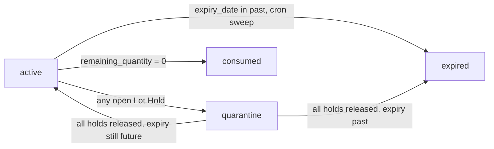
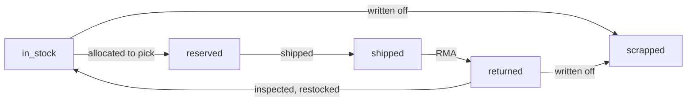
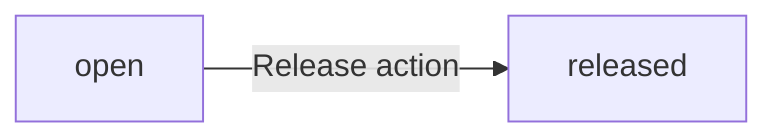
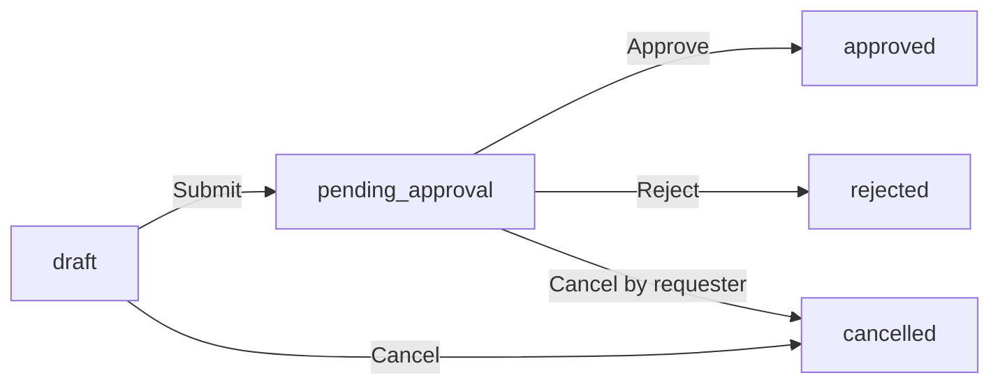
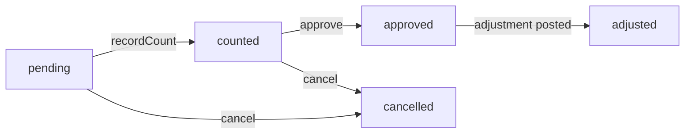

# Inventory

Everything that affects what stock you have, where it sits, what it cost, and how it moved.

> **Where do I begin?** Stand up your org hierarchy first ([Inventory Organizations](./framework.md#inventory-organizations) → [Subinventories](./framework.md#subinventories) → [Locators](./framework.md#locators)) and your [Item Master](./items.md#item-master). Once an item is assigned to an org with a default subinventory, you can post a [Receipt](#receipts) to land the first stock — everything else (issues, transfers, on-hand views, cycle counts) reads off the resulting movements.

---

## Table of contents

1. [On Hand](#on-hand)
2. [Lots](#lots)
3. [Serial Numbers](#serial-numbers)
4. [Lot Holds](#lot-holds)
5. [Expiry Alerts](#expiry-alerts)
6. [Traceability](#traceability)
7. [Receipts](#receipts)
8. [Issues](#issues)
9. [Transfers](#transfers)
10. [Movements](#movements)
11. [Cost Corrections](#cost-corrections)
12. [Inter-Org Transfers](#inter-org-transfers) *(see deep-dive: [inter-org-transfers.md](./deep-dives/inter-org-transfers.md))*
13. [Cycle Counts](#cycle-counts)

---

## On Hand

### What it is

Real-time view of every (item × org × subinventory × locator × lot) bucket of stock you own. **Read-only**: you never edit On Hand directly — it's derived from movements.

> **Example:** SKU `WIDGET-100` shows 247 units across two orgs — 180 EA in Warehouse-A / Bin-FG-01 / Lot LOT-2026-04 with 12 reserved against open sales orders, plus 67 EA at Warehouse-B / Bin-FG-Aisle3 with 0 reserved.

### Fields

| Field | Source | Meaning |
|---|---|---|
| Item | item_id | The SKU |
| Org / Subinv / Locator / Lot | bucket coordinates | The "where" of the stock |
| On Hand | derived | Physical stock at this bucket |
| Reserved | derived | Allocated to picks/SOs but not yet shipped |
| Available | `on_hand - reserved` (STORED) | What you can still promise |
| Last Movement | derived | Timestamp of the most recent in/out |

Locator and lot can be NULL — a subinventory without locators or a non-lot-controlled item still gets one canonical bucket per (item, org, subinv). The underlying UNIQUE index uses STORED columns `loc_key = IFNULL(locator_id, 0)` and `lot_key = IFNULL(lot_id, 0)` so two concurrent receipts can't silently create duplicate rows on NULL coordinates.

### Actions

- **List on-hand** — sidebar → Inventory → On Hand. Filter by org, item, subinventory, low-stock-only, or include-zeros.
- **Drill in** — click a bucket row to see the contributing [Movements](#movements).
- **Set min/max** — done on the [Item-Org assignment](./items.md#item-org-assignments) screen, not here. The min/max alert cron reads `inventory_levels.on_hand` vs `item_org_assignments.min_quantity` and posts a notification when it crosses below.

### Gotchas

- On Hand is the most concurrency-critical derived table — every receipt/issue/transfer races against it. The NULL-safe UNIQUE described above is what keeps it correct; if you see duplicate buckets in a list, run `setup/erp_v43.sql` (idempotent).
- `available` is a STORED generated column. Don't try to UPDATE it directly; update on_hand or reserved and it recomputes.
- Consigned stock is tracked at the **subinventory** level — a subinventory whose `type = 'consigned'` (see [Framework → Subinventories](./framework.md#subinventories)) holds vendor-owned stock that On Hand returns in the same row shape as owned stock. There is no per-row `is_consigned` flag on `inventory_levels`; the ownership distinction lives one level up on the subinventory record.

---

## Lots

### What it is

A **lot** is a batch of a lot-controlled item received at a point in time, with its own origination date, expiry date, and remaining quantity. Lots are the unit of traceability — every receipt of a lot-controlled item must specify a lot; every issue draws from one.

> **Example:** You receive 500 KG of `FLOUR-T55` from miller Sopexa on 2026-05-01. The system creates lot `SOPEXA-2026W18` with origination 2026-05-01, expiry 2026-11-01 (auto from `items.shelf_life_days = 180`), received quantity 500.0, remaining 500.0, status `active`.

### How lots get created

| Method | When |
|---|---|
| Inline on a receipt | The default path. Posting a Receipt for a lot-controlled item lets you create a new lot or pick an existing one per line. |
| Manual on the Lots screen | Operator pre-creates lots for materials they'll receive later (e.g. matching a supplier's pre-shipping notification). |
| API (`POST /erp/inventory/lots`) | Integration with a supplier feed. |

### Fields

| Field | Required | Notes |
|---|---|---|
| Item | Yes | Must be lot-controlled (`items.is_lot_controlled = 1`). Items without the flag refuse lot creation. |
| Lot Number | Yes | UNIQUE within (tenant, item). |
| Origination Date | Yes | When the lot was made/received. |
| Expiry Date | Auto / manual | If the item has `shelf_life_days`, expiry = origination + shelf_life_days. **Once you manually edit it, `manual_expiry_override = 1` and the value never auto-recalculates** — even if origination changes. |
| Received Quantity | Auto from movements | Total ever received into this lot. |
| Remaining Quantity | Derived | What's still on hand somewhere. |
| Status | Lifecycle | `active` / `expired` / `quarantine` / `consumed`. See state machine below. |
| Notes | Optional | Free-text. |

### Lifecycle



The effective status is computed from holds + expiry; `lots.status` mirrors that for fast filtering. See [Lot Holds](#lot-holds) for the hold mechanics.

### Actions

- **List lots** — filter by item, status, expired-before-date, or search by lot number / SKU.
- **Create** — pick item, set lot number + origination, accept auto-expiry or override it.
- **Edit** — origination, notes, manual expiry. Status changes go through Holds, not the edit form.
- **Place hold** — opens the [Lot Holds](#lot-holds) screen pre-filtered to this lot.
- **Where it came from / where it went** — opens [Traceability](#traceability) for this lot.

### Gotchas

- A lot in `consumed` status (remaining = 0) cannot have a new receipt linked to it. If you receive more of the same supplier batch, that's a *new* lot.
- Manual expiry override is **sticky**: a typo can't be fixed by re-saving the origination date. Edit the expiry directly.
- Lot UNIQUE is per (tenant, item) — two items can both have a lot called `2026-Q2` without colliding.

---

## Serial Numbers

### What it is

A **serial number** is a unique identifier per individual unit, for items where each piece needs distinct tracking (high-value parts, regulated devices, vehicles). Each serial has one current location and a status (`in_stock` / `reserved` / `shipped` / `returned` / `scrapped`).

> **Example:** Item `PUMP-X1` is serial-controlled. Receiving 5 units creates 5 serial rows: `SN-001`..`SN-005`, each at Warehouse-A / Bin-FG-01, status `in_stock`. Shipping SN-003 against a sales order flips its status to `shipped` and stamps `customer_id`.

### Fields

| Field | Required | Notes |
|---|---|---|
| Item | Yes | Must be serial-controlled. |
| Serial Number | Yes | UNIQUE within (tenant, item). |
| Lot | Conditional | Required if the item is *both* lot- and serial-controlled. |
| Status | Lifecycle | See state machine below. |
| Current Subinv / Locator | Tracked | Updated on every movement. |
| Customer | On ship | Stamped when status flips to `shipped`. |
| Received At | Auto | First receipt date. |

### Lifecycle



### Actions

- **List / filter** — by item, status, or serial number search.
- **History** — opens the per-serial trace: receipt → moves → ship → return.
- **Adjust** — operator can correct status (e.g. mark `scrapped`) with an audit reason.

### Gotchas

- Serials cannot be merged or split.
- A returned serial that was previously `shipped` keeps its old `customer_id` until restocked; report queries that group by current customer should exclude `returned` unless explicitly included.

---

## Lot Holds

### What it is

A **hold** parks a lot in quarantine — it stays in inventory but can't be issued or shipped — pending an investigation. Multiple distinct holds can coexist on the same lot; the lot leaves quarantine only when **all** holds are released.

> **Example:** QA finds a packaging defect in lot `SOPEXA-2026W18`. Inspector places a `quality` hold. A day later the supplier issues a recall on the same lot — that's a second hold, type `recall`. Releasing only the quality hold leaves the lot in quarantine because the recall is still open.

### Fields

| Field | Required | Notes |
|---|---|---|
| Lot | Yes | The lot being held. |
| Hold Type | Yes | `quality` / `recall` / `customer_complaint` / `regulatory` / `expiry` / `manual` / `other`. Unknown types return 422. |
| Reason | Yes | Free-text — auditors will read this. |
| Placed By / At | Auto | Stamped on create. |
| Released By / At | On release | Stamped via the Release action. |
| Release Reason | On release | Required by the auditor evidence rule. |

### Lifecycle



Releases are CAS-guarded — releasing the same hold twice returns 422 (the second attempt sees `released_at IS NOT NULL` and refuses).

### Actions

- **Place hold** — pick lot, type, write reason → lot transitions to `quarantine`.
- **Release hold** — write release reason → if any other open hold exists, lot stays quarantined; otherwise it returns to `active` (or `expired` if the date has passed).
- **List holds for a lot** — visible from the [Lots](#lots) row "View holds" link.

### Gotchas

- Releasing a hold does **not** automatically un-quarantine the lot. The service recomputes status from remaining open holds + expiry date; the lot can stay in quarantine for several more days while other holds work through.
- A lot in `consumed` status (remaining = 0) refuses new holds — there's nothing left to quarantine.

---

## Expiry Alerts

### What it is

Tenant-configurable "warn me N days before expiry" rules. Cron scans daily, finds lots whose expiry is inside the window, and fires a notification to the configured role.

> **Example:** Config "30-day expiry warning, food category, notify warehouse-manager" + a lot of `FLOUR-T55` expiring 2026-06-15. On 2026-05-16 the cron sees the lot fall inside the 30-day window and posts a notification. It does *not* re-send the same alert on subsequent runs — see Dedup below.

### Fields (per config)

| Field | Required | Notes |
|---|---|---|
| Name | Yes | UNIQUE per tenant. |
| Days Before Expiry | Yes | Single threshold per config. Create multiple configs for layered alerts (e.g. 60 / 30 / 7). |
| Item Category | Optional | Restrict to one category; NULL = applies to every lot. |
| Notify Role | Default `inventory_manager` | Recipients = active users with that role. |
| Active | Default `true` | Pause without deleting. |

### Dedup behaviour

Each (lot, config, days-band) pair fires at most one notification — same-day re-runs of the scan no-op via a UNIQUE on `lot_expiry_alerts_sent`. If a send genuinely fails (no recipients, mail backend error), the dedup row is rolled back so a retry can fire after the operator fixes the config. Diagnostic counters returned by every scan:

```
scanned_lots
matched_configs
notifications_sent
dedup_skipped
no_recipients
skipped_parse_error
failures
```

### Actions

- **Configure** — create / edit / pause an alert config.
- **Run now** — operator-triggered scan (cron also runs it daily).
- **View sent log** — `lot_expiry_alerts_sent` shows which lot×config combos have already fired.

### Gotchas

- A lot with an invalid `expiry_date` (parse failure) is *not* silently treated as "due today" — it increments `skipped_parse_error` and logs.
- Changing the `Notify Role` after a config has already fired does **not** re-send to the new role for the same lots — dedup applies.

---

## Traceability

### What it is

Read-only **where-from / where-used / serial history** queries. Walks the chain of stock movements:

- **Where from** — given a lot, where did each unit originate? Recurses into the work-order BOM if the lot was produced internally.
- **Where used** — given a lot, where did it go? If issued to a work order, recurses into the resulting FG lot.
- **Serial history** — full per-serial timeline.

> **Example — recall walk:** Supplier flags lot `SOPEXA-2026W18` as contaminated. Run "Where used" → service traces every ISSUE_WO that consumed it → walks to the produced FG lots → walks their ISSUE_SO → returns the list of customer shipments affected. Place a hold on each FG lot via [Lot Holds](#lot-holds).

### Behaviour notes

- Max recursion depth is 4. When that's hit, the affected node returns `children_truncated_at_max_depth: true` so an auditor can tell "no children" from "ran out of recursion budget."
- A cycle (BOM-A uses BOM-B uses BOM-A) is caught by a visited-set keyed on lot id — the second visit returns `already_traversed: true` and stops walking.

### Actions

- **Where from / where used** — opens the tree view starting from a chosen lot.
- **Serial history** — pick a serial, get the full receipt → moves → ship → return timeline.

### Gotchas

- The walk is read-only — it doesn't quarantine anything. Use the output to drive [Lot Holds](#lot-holds) manually.
- Traceability respects tenant scope; cross-tenant joins are blocked at the SQL level.

---

## Receipts

### What it is

Bring stock **in** — from a [Purchase Order](./procurement.md#purchase-orders) goods receipt, an inter-org transfer arrival, a return from a customer, or a manual opening-balance entry. Creates a `stock_movement` of type `in` and writes a FIFO valuation layer that subsequent issues consume.

> **Example:** PO-2026-0042 for 500 KG of FLOUR-T55 at $1.20/KG arrives. Inspection-routed receipt: stock lands first in subinventory `RECEIVING_INSPECT` pending QA. On `accept`, a second movement transfers it to `FG-RAW`. FIFO layer `2026-05-01 / 500 / 1.20` is written.

### Fields per receipt line

| Field | Required | Notes |
|---|---|---|
| Item | Yes | Must be assigned to the destination org. |
| Quantity | Yes | In the line's UOM. |
| UOM | Default = item primary | Convertible at write time. |
| Destination Subinv | Yes | Must allow the transaction type per the `subinventory_transaction_rules` table (configured under [Framework → Transaction Types](./framework.md#transaction-types)). |
| Destination Locator | If subinv uses locators | Picked from the subinv's locator list. |
| Lot | If item is lot-controlled | Pick existing or create inline. |
| Serials | If item is serial-controlled | Count must match line quantity exactly. |
| Unit Cost | Required for manual receipts | PO/transfer receipts pull from upstream. |
| Reason / Notes | Optional | |

### Receipt routing (per item)

`items.receiving_routing` controls what happens on receive:

| Routing | What |
|---|---|
| `direct` | Straight to the destination subinv. One movement, done. |
| `standard` | Lands in a receiving area subinv; operator does a put-away movement to move it to its final home. |
| `inspection` | Lands in an inspection-area subinv; QA accepts (auto-puts-away) or rejects (issues to scrap or returns to vendor). See [Quality → Inspections](./quality-compliance.md#inspections). |

### Actions

- **Create** — pick PO / inter-org / manual mode, add lines, post.
- **Inspect** — when routing is `inspection`, opens the per-line accept/reject screen.
- **List** — by status, by PO, by org, by date range.

### Gotchas

- Multi-line receipts are atomic. One bad line rolls back the whole receipt — half-posted state is a Sev-1 bug we explicitly test for ([round-3 review fix](#)).
- For lot-controlled items, **the system fails closed if no lot is named** — silent defaulting to a blank lot would corrupt traceability.
- Subinventory rules are checked alongside material-status rules — both must allow the transaction type for the line to post.

---

## Issues

### What it is

Take stock **out** — for a sales order shipment, a work-order component issue, an internal consumption, or a write-off. Creates a `stock_movement` of type `out` and consumes FIFO layers in receive-date order.

> **Example:** Work Order WO-2026-0017 requires 80 KG of FLOUR-T55. The issue consumes 80 KG from lot `SOPEXA-2026W18`'s FIFO layer at $1.20/KG → component cost = $96.00 posted to the WO's material cost.

### Fields per issue line

Same shape as receipt lines, but the source coordinates (subinv / locator / lot) come from the existing On Hand bucket — and **the lot must have enough remaining quantity** to satisfy the line, including the buffer for any other concurrent issues.

### Costing

Issues consume FIFO layers in chronological receipt order. If an item has no FIFO layer with cost (e.g. opening-balance receipt with cost = 0), the issue refuses with `422 Unprocessable Entity` rather than silently posting $0 COGS. The fix is a [Cost Correction](#cost-corrections) on the bad receipt layer.

### Actions

- **Create** — pick item, source org/subinv, quantity, reference (SO / WO / manual reason).
- **List** — by source-type, by item, by date range.

### Gotchas

- Issues against a `consigned` subinventory post like any other issue at v1 — there is no separate `consignment_consumption` table or auto-bill flow. Track consumed-but-not-yet-billed consigned stock manually until the vendor bill is recorded against the consuming PO (planned: an explicit consumption-trigger that mints a draft vendor bill — not in this build).
- A line with a serial-controlled item must list serials totalling the line quantity; mismatch returns 422.

---

## Transfers

### What it is

Move stock **inside one org** — subinv → subinv, locator → locator. A single movement of type `transfer` that simultaneously decrements the source bucket and increments the destination bucket. Cost travels with the units (no GL impact within the same legal entity).

> **Example:** Move 100 KG of FLOUR-T55 from `RECEIVING_INSPECT` / Locator-RX1 to `FG-RAW` / Locator-A12-B03 after QA acceptance.

### Fields per transfer line

| Field | Notes |
|---|---|
| Item, Quantity, UOM | As per receipts/issues |
| Source: Org / Subinv / Locator / Lot | Existing bucket |
| Destination: Subinv / Locator | Same org as source |
| Reason | Optional |

### Actions

- **Create** — pick lines, post.
- **List** — by date, item, or subinv.

### Gotchas

- For inter-**org** transfers, use [Inter-Org Transfers](#inter-org-transfers), not this screen. Intra-org transfers have no in-transit step.
- The destination subinv must allow the `TRANSFER` transaction type per `subinventory_transaction_rules` (a `quality_hold` subinv typically allows in but not out).

---

## Movements

### What it is

The append-only ledger of every `stock_movement` ever posted in the tenant. Read-only. The other inventory screens write here; this is where you read history.

### Filters

- Org, Subinv, Locator
- Item, Lot, Serial
- Transaction Type (Receipt PO, Issue SO, Transfer Subinv, Adjustment Cycle Count, etc.)
- Reference type + reference id (e.g. "show me every movement linked to PO-0042")
- Date range

### Per-movement view

Drill into a movement number to see:
- All lines (item / qty / UOM / src + dst / unit cost / lot or serials)
- The reference (PO, SO, WO, Transfer, Cycle Count entry, Cost Correction)
- The `posted_by` / `posted_at` audit stamps
- Linked journal_id when the movement triggered a sub-ledger post

### Gotchas

- **You cannot edit or void a movement directly.** The only way to "undo" stock is to post a counter-movement (a return receipt, an opposite-direction adjustment), or — for a cost mistake — open a [Cost Correction](#cost-corrections).
- Movement numbers use the single `MV-{tenantId}-{YYYYMMDD}-{seq}` format (per `StockMovementService::nextMovementNumber`) regardless of subinventory type. To split owned vs consigned activity in reports, join `stock_movements` to `subinventories` and filter on `subinventory_type = 'consigned'` — the movement-number prefix doesn't carry that signal.

---

## Cost Corrections

### What it is

Fix the unit cost on a specific FIFO layer. Goes through manager approval (because the variance posts to the GL via an adjustment journal). Used when a receipt was posted with the wrong cost — e.g. a duty/freight invoice arrived after the receipt, or the PO unit price was wrong.

> **Example:** PO-0042 receipt landed 500 KG at $1.20/KG (= $600). Freight invoice $0.05/KG arrives a week later. Cost correction: `old_unit_cost=1.20, new_unit_cost=1.25, reason="Add freight per inv FREIGHT-0042"`. Approver = warehouse manager. On approval, the FIFO layer is rewritten **only for the unconsumed remainder**, and the variance posts a balanced journal: DR Inventory $25, CR GR/IR $25.

### Fields

| Field | Required | Notes |
|---|---|---|
| Movement Line | Yes | The receipt line being corrected. |
| Old / New Unit Cost | Yes | New must differ from old. |
| Reason | Yes | Auditor evidence. |
| Requested By | Auto | Logged-in user. |
| Approver | Auto-resolved | User's manager (`employees.manager_id`); falls back to RBAC's correction-approver role. |

### Lifecycle



CAS-protected: approve/reject/cancel each require the current status to match — a second click after another approver acted returns 422.

### Restrictions

- **Partial-layer correction is blocked** when any unit from that receipt has already been issued. (Otherwise the rewritten cost would retroactively change the COGS of past issues.) The screen surfaces "Some of this receipt is consumed — correct via a manual journal instead."
- Self-approval is blocked; super-admin can bypass.
- Reject requires a `decision_notes` reason (auditor evidence).

### Actions

- **Create draft** — pick the receipt line + new cost + reason.
- **Submit** — moves to `pending_approval`, fires a notification to the approver.
- **Approve / Reject / Cancel** — see lifecycle.

### Gotchas

- The approver is **resolved at submit time**, not at draft time — if you change the requester's manager between draft and submit, the new manager gets the request.
- The variance journal posts via the sub-ledger template `event_type = 'cost_correction'`. A tenant without that template configured will see the correction approve but no GL entry — surface as a warning in audit.

---

## Inter-Org Transfers

Cross-org movement, with optional in-transit step. Has its own [deep-dive: inter-org-transfers.md](./deep-dives/inter-org-transfers.md). The summary:

| Mode | Behaviour |
|---|---|
| **1-way** | One movement: source subinv → destination org's subinv. Immediate. No in-transit. |
| **2-way** | Two movements: source subinv → source-org's `_SYS_IN_TRANSIT` (on **ship**), then `_SYS_IN_TRANSIT` → destination subinv (on **receive**). Vehicle and driver are recorded on the transfer header. |

`inter_org_transfer_rules` per (source_org, dest_org) picks the mode. CAS-protected ship/receive — re-clicking either after the first success returns 422.

---

## Cycle Counts

### What it is

Recurring snapshot of "system thinks X, physical count says Y" for a slice of inventory. Variances post automatically as `adjustment` movements on approval.

> **Example:** A monthly ABC-A schedule for org WH-1 / subinv FG-RAW generates 47 cycle-count entries on the 1st of each month. A counter scans each location, types in the counted qty. Five entries show variance. The supervisor reviews + approves → 5 adjustment movements post (some positive, some negative) and FIFO layers are updated.

### Setup

| Concept | What |
|---|---|
| Definition (`cycle_count_definitions`) | The repeating rule: org, frequency (daily/weekly/monthly/quarterly), ABC-class filter, subinv filter. |
| Schedule (`cycle_count_schedules`) | A single fire of a definition on a date. |
| Entry (`cycle_count_entries`) | One row per (item, subinv, locator, lot) bucket in the schedule. |

### Entry lifecycle



`recordCount` and `approve` are both CAS-protected. A second `recordCount` on the same entry returns 422 — by design, so two phones can't both update the same line.

### Costing rules (round-4 review)

- **Negative variance** (counted < system): adjustment consumes FIFO normally.
- **Positive variance** (counted > system, "found stock"): adjustment's unit cost is derived from the **most recent** FIFO layer for that item in that org. If the item has zero cost layers anywhere (e.g. brand-new item, no receipts), the adjustment is **rejected** rather than silently posting at $0 — operator must do a manual receipt with cost first.

### Actions

- **Define schedule** — set frequency + filters.
- **Generate entries** — operator-triggered or cron. Idempotent: generating twice on the same date returns "already_generated, 0 new entries."
- **Count entry** — record counted_qty + counter id.
- **Approve** — variance gets posted as an adjustment movement; FIFO is updated.
- **Cancel** — terminal; cannot be re-opened.

### Gotchas

- Cycle counts respect [Lot Holds](#lot-holds) — a quarantined lot is **included** in the count (the physical stock is still there) but the recorded counted_qty does *not* release the hold.
- Approve double-fires are blocked at the DB level — the second approve returns 422 even if the UI didn't disable the button fast enough.

---

## Cross-references

- **Items** — [Item Master and per-org assignments](./items.md#item-master) drive every Inventory screen.
- **Procurement** — Receipts here are usually the *result* of a Goods Receipt against a [Purchase Order](./procurement.md#purchase-orders).
- **Sales & AR** — Issues here are usually the *result* of a [Pick](./sales-ar.md#picks) → [Shipment](./sales-ar.md#shipments).
- **Manufacturing** — Issues to a [Work Order](./manufacturing.md#work-orders) consume components; the Receipt of the finished good lands here.
- **GL** — Every stock movement can post a balanced journal via the sub-ledger template `event_type = 'stock_movement'`. See [Journal Entries deep-dive](./deep-dives/journal-entries.md).
- **Quality** — [Inspections](./quality-compliance.md#inspections) gate inspection-routed receipts.
