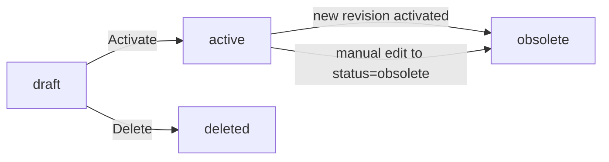

# Items

Everything about the SKUs that flow through inventory, procurement, sales and accounting — what they're called, how they're controlled, what default behaviour they carry into every transaction.

> **Where do I begin?** Build [Item Categories](#item-categories) and the [Primary UOM](./framework.md#units-of-measure) first, then create the [Item Master](#item-master) record. Once the item exists, attach it to one or more inventory orgs via [Item-Org Assignments](#item-org-assignments) so receipts/issues/transfers can find a default subinventory. Everything else (cross-references, UOM conversions, revisions) is optional and grows over time.

---

## Table of contents

1. [Item Master](#item-master)
2. [Item-Org Assignments](#item-org-assignments)
3. [Item-UOM Conversions](#item-uom-conversions)
4. [Item Cross-References](#item-cross-references)
5. [Item Revisions](#item-revisions)
6. [Item Categories](#item-categories)
7. [Item Catalog Categories](#item-catalog-categories)
8. [Item Templates](#item-templates)

---

## Item Master

### What it is

The canonical record for a SKU — name, description, primary UOM, what it can do (sell / buy / stock / lot-track / serial-track / revision-track), how it receives, how MFG backflushes its components, default GL accounts, and tenant-defined extended attributes (`custom_fields`).

> **Example:** SKU `FLOUR-T55` — *Type 55 wheat flour* — primary UOM `KG`, category *Raw Materials > Flour*, lot-controlled, shelf life 180 days, receiving routing `inspection`, backflush `manual`, base price USD 1.40/KG, standard cost 1.20, inventory account *1200-FG-RAW*, COGS account *5100-COGS-RAW*.

### How records get created

| Method | When |
|---|---|
| UI — sidebar Items → New Item | Default path. Tabbed form: Overview · Control · Receiving · Pricing · Custom Fields. |
| Copy from an [Item Template](#item-templates) | Operator picks a template; the form pre-fills with the template's `attributes_json`. |
| Bulk import | CSV adapter under platform imports (`ItemImportAdapter`). |
| API (`POST /erp/items`) | Integration / scripted onboarding. |

### Fields

#### Overview

| Field | Required | Notes |
|---|---|---|
| SKU | Yes | UNIQUE per tenant (`uq_items_tenant_sku`). Read-only after create. |
| Name | Yes | Display name. |
| Description | Optional | Free-text, shown on PO/SO line printouts. |
| Primary UOM | Yes | The stocking unit. Conversions to other UOMs live in [Item-UOM Conversions](#item-uom-conversions) or in the [UOM class table](./framework.md#units-of-measure). |
| Category | Optional | One [Item Category](#item-categories). |
| Catalog Category | Optional | One [Item Catalog Category](#item-catalog-categories), which can drive a flexfield of extended attributes. |
| Status | Default `active` | `active` / `inactive`. Inactive items are hidden from line-entry pickers but historical transactions still resolve. |

#### Type flags

These are independent toggles — an item can be any combination.

| Flag | Default | Meaning |
|---|---|---|
| `is_inventory_item` | 1 | Tracked in stock buckets at all. Set 0 for service items, expenses-only items. |
| `is_sellable` | 1 | Eligible to appear on a Sales Order / Quote line. |
| `is_purchasable` | 1 | Eligible to appear on a Purchase Order line. |
| `is_stockable` | 1 | Can hold on-hand quantity (vs. a flow-through/dropship-only item). |

#### Control flags

| Flag | Default | Meaning |
|---|---|---|
| `is_lot_controlled` | 0 | Every receipt and issue must name a [lot](./inventory.md#lots). Cannot be flipped off once any lot exists. |
| `is_serial_controlled` | 0 | Every receipt creates serial rows; every issue lists serials matching the line quantity. |
| `is_revision_controlled` | 0 | Engineering revisions tracked via [Item Revisions](#item-revisions). |
| `shelf_life_days` | NULL | When set on a lot-controlled item, drives auto-expiry on new lots (origination + shelf_life_days). See [Inventory → Lots](./inventory.md#lots). |
| `abc_class` | NULL | `A` / `B` / `C`. Tenant-level classification; per-org override available in [Item-Org Assignments](#item-org-assignments). Currently entered manually; no automated classifier ships in-product. |

#### Receiving

| Field | Default | Meaning |
|---|---|---|
| `receiving_routing` | `standard` | `direct` (straight to destination), `standard` (lands in receiving area, operator put-aways), `inspection` (lands in inspection area, [QA accepts/rejects](./quality-compliance.md#inspections)). |
| `requires_inspection` | 0 | **Read-only at v1.** Column exists on `items` but is **not** in `Item::ALLOWED_FIELDS`, so the Item Master API ignores it on create/update. Gate inspection via `receiving_routing = inspection` instead. Direct DB writes are the only way to flip this column today. |
| `over_receipt_tolerance_pct` | NULL | Maximum over-receipt allowed against a PO line (e.g. `5.00` = +5%). Receipts past this refuse. |
| `early_receipt_days` | NULL | Earliest receipt window vs. PO promise date. |
| `late_receipt_days` | NULL | Latest receipt window vs. PO promise date. |

#### MFG

| Field | Default | Meaning |
|---|---|---|
| `backflush_method` | `manual` | Drives how WO component issues are posted: `manual` (issue per WO operation), `operation` (auto-backflush at each op completion), `assembly_completion` (auto-backflush at WO close), `none` (item is never backflushed — must be issued explicitly). See [Manufacturing → Work Orders](./manufacturing.md#work-orders). |

#### Pricing

| Field | Notes |
|---|---|
| `base_price` | Default sell price; overridable on the SO line. |
| `currency` | ISO 4217 (e.g. `USD`). |
| `standard_cost` | Tenant-level standard cost. Per-org overrides on the [Org Assignment](#item-org-assignments). |

#### Default GL accounts

| Field | Used by |
|---|---|
| `income_account_combination_id` | SO/AR invoice line revenue posting. |
| `expense_account_combination_id` | Expense purchases (non-inventory items). |
| `inventory_account_combination_id` | Receipts post DR Inventory at this combination. |
| `cogs_account_combination_id` | Shipments / SO issues post DR COGS at this combination. |
| `default_tax_code_id` | Pre-fills the tax code on PO/SO lines. |

All four account fields resolve through [account combinations](./finance.md#account-combinations), so the same field can drive different cost-centre/business-unit segments per line.

#### Custom Fields

The Custom Fields tab shows every tenant-defined attribute for `entity_type = 'inventory_item'`. Values are stored on `items.custom_fields` (LONGTEXT JSON) and merged into list/show responses. Custom-field definition is a Platform-level concern (per-entity-type schema) — TODO: link once the Platform Custom Fields screen lands a dedicated section.

### Actions

- **List** — sidebar → Items. Filter by SKU/name search, status, category.
- **Create / Edit / Delete** — admin role required (controller `requireAdmin` allows `super_admin`, `admin`).
- **Open sub-tabs** — once saved, the form exposes nav links to *Org Assignments*, *UOM Conversions*, *Cross-Refs*, *Revisions*.
- **API** — `GET|POST /erp/items`, `GET|PUT|DELETE /erp/items/{id}`, `GET /erp/items/{id}/custom-field-definitions`.

### Gotchas

- **SKU is immutable in the UI** (`readonly` on edit). To rename a SKU, change it via API; the validator still enforces UNIQUE per tenant.
- **Validation order matters on create.** SKU duplicate check, then `primary_uom_id` existence, then `category_id`, then `catalog_category_id`. A bad foreign key returns 422 with the specific message, not a generic SQL error.
- **`primary_uom_id` is required.** A NULL primary UOM would break every receipt-line UOM conversion. The validator catches this.
- **Switching `is_lot_controlled` off after lots exist** is not blocked by the controller, but every downstream transaction expecting a lot id will start failing — don't do it without first consuming or scrapping all open lots.
- **`custom_fields` accepts either an object or a JSON-encoded string.** Other shapes (number, plain string, array) are stored as `null`.
- **Delete is hard.** No soft-delete column; the FK from movements / PO lines / SO lines etc. will block the DELETE if any history exists. The fix is to flip `status = 'inactive'` instead.

---

## Item-Org Assignments

### What it is

Per-(item × inventory_org) configuration: where the item lives by default, what the min/max planning levels are, and per-org cost overrides. **An item is invisible to an inventory org until it's assigned.**

> **Example:** Item `FLOUR-T55` assigned to org `WH-1` with default subinventory `FG-RAW` / locator `A12-B03`, min 200 KG, max 1500 KG, reorder 800 KG, safety stock 100 KG, planning `min_max`, lead time 14 days, standard cost 1.20, average cost 1.22.

### How records get created

| Method | When |
|---|---|
| UI — *Org Assignments* sub-tab on the item form | Default path. Operator picks the org, sets defaults. |
| API (`POST /erp/items/{item_id}/org-assignments`) | Onboarding scripts when standing up a new org. |

There's a UNIQUE on `(item_id, inventory_org_id)` — re-assigning the same pair returns 422.

### Fields

| Field | Required | Notes |
|---|---|---|
| Inventory Org | Yes | FK to [`inventory_organizations`](./framework.md#inventory-organizations); tenant-scoped check on create. |
| Is Active | Default 1 | Pause an item in an org without unassigning. |
| Default Subinventory | Optional | Used as the destination on PO receipt / inter-org receive when the line doesn't override. Validated to belong to the same `inventory_org_id` — cross-org subinv → 422. |
| Default Locator | Optional | Within the default subinv (when the subinv uses locators). |
| Default Material Status | Optional | Pre-stamps every receipt of this item with this material status. |
| Min Quantity | Optional | Triggers the min/max alert cron — see [Inventory → On Hand](./inventory.md#on-hand). |
| Max Quantity | Optional | Replenishment ceiling. |
| Reorder Quantity | Optional | Used by `planning_method = 'reorder_point'`. |
| Safety Stock | Optional | Buffer under min. |
| Planning Method | Default `none` | `min_max` / `reorder_point` / `none`. Drives the planning suggestions. |
| Lead Time Days | Optional | Used by planning to time the reorder. |
| ABC Class Override | Optional | `A` / `B` / `C`. Overrides `items.abc_class` for this org only (e.g. a regional warehouse where this SKU is high-velocity even though it's a C globally). |
| Standard Cost / Last Cost / Average Cost | Optional | Per-org cost snapshots. Last/Average are updated by the costing engine on receipts. |

### Actions

- **List** — *Org Assignments* sub-tab shows all org assignments for the current item.
- **Assign** — pick an inventory org, fill defaults, save.
- **Edit** — change defaults, planning levels, costs.
- **Unassign** — removes the assignment row. Doesn't delete history.
- **API** — `GET|POST /erp/items/{item_id}/org-assignments`, `PUT|DELETE /erp/item-org-assignments/{id}`.

### Gotchas

- **Default subinv must match the org.** Cross-org subinventory id returns 422 on both create and update — the controller resolves the subinv and rejects if `inventory_org_id` doesn't match (Sev-2 FK fix from the a1-5 review pass).
- **Unassigning ≠ stopping movements.** If the item has on-hand stock in this org, you'll have a stranded bucket. Move the stock out first via [Issues](./inventory.md#issues) or an [Inter-Org Transfer](./inventory.md#inter-org-transfers).
- **`abc_class_override` doesn't recompute anything** — it's a static input that downstream reports and the [Cycle Counts](./inventory.md#cycle-counts) ABC-filter read off of. Update it manually when consumption patterns shift.
- **Min/max alerts read these fields directly.** The cron compares `inventory_levels.on_hand` to `min_quantity`; NULL min = no alert.

---

## Item-UOM Conversions

### What it is

Item-specific UOM factors, including **cross-class** conversions that only make sense for a single SKU. Distinct from the tenant-wide UOM class conversions on the framework UOM screen, which are limited to within-class factors.

> **Example:** For item `BANANA-12022`, 1 KG = 0.5 DOZ. (Kilograms and Dozens are different classes — a tenant-wide cross-class factor wouldn't make sense because it depends on the size of the banana.)

### How records get created

| Method | When |
|---|---|
| UI — *UOM Conversions* sub-tab on the item form | Operator adds an item-specific factor. |
| API (`POST /erp/items/{item_id}/uom-conversions`) | Mass setup. |

UNIQUE on `(item_id, from_uom_id, to_uom_id)` — duplicate pair → 422.

### Fields

| Field | Required | Notes |
|---|---|---|
| From UOM | Yes | FK to `uoms`, tenant-scoped. |
| To UOM | Yes | FK to `uoms`, tenant-scoped. Must differ from From. |
| Conversion Factor | Yes | Decimal, **must be > 0**. The number of `to_uom` per one `from_uom`. |
| Is Active | Default 1 | Pause without deleting. |

### Resolution priority

When a movement needs to convert between UOMs for an item, `UomConversionService` is asked with the `item_id`. The lookup order is:

1. Same UOM → factor 1.
2. Item-specific row in `item_uom_conversions` for this (item, from, to). If found, use that factor.
3. Tenant-wide within-class conversion in `uom_class_conversions`.
4. No match → 422 *Unconvertible UOM pair for this item*.

### Actions

- **List / Add / Edit / Delete** — admin role required.
- **API** — `GET|POST /erp/items/{item_id}/uom-conversions`, `PUT|DELETE /erp/item-uom-conversions/{id}`.

### Gotchas

- **The factor is directional.** A row for KG → DOZ doesn't automatically give you DOZ → KG; create the inverse if you need both directions. Two rows can co-exist (different `(from, to)` pairs both pass the UNIQUE).
- **Zero / negative factors are rejected** at the controller (422) — they would create division-by-zero on the inverse calculation.
- **Item-specific overrides shadow the class-level factor.** If a tenant-wide LB → KG conversion exists and an item-specific LB → KG also exists, the item-specific one wins for that SKU.

---

## Item Cross-References

### What it is

Alternate identifiers for the same SKU — vendor part numbers, customer part numbers, barcodes, GTINs/UPCs/EANs, manufacturer part numbers, plain "internal" aliases. Used by receiving (scan a vendor barcode → resolve to your SKU), by AR/AP (vendor invoice cites their part number), and by EDI feeds.

> **Example:** Item `FLOUR-T55` carries three cross-refs: `vendor_part` `SOPX-T55-25KG` (partner = Sopexa), `gtin` `0712345678901` (no partner), `customer_part` `FT55-WHOLE` (partner = Acme Bakery).

### How records get created

| Method | When |
|---|---|
| UI — *Cross-Refs* sub-tab on the item form | Default path. |
| API (`POST /erp/items/{item_id}/cross-references`) | Import from vendor catalogues. |

### Fields

| Field | Required | Notes |
|---|---|---|
| Type | Yes | One of `vendor_part`, `customer_part`, `internal`, `barcode`, `gtin`, `upc`, `ean`, `manufacturer_part`. Anything else → 422. |
| Partner | Conditional | FK to `companies` (a customer or vendor). NULL for type-only refs like `gtin`/`upc`/`ean`/`barcode`. When provided, must belong to the same tenant — cross-tenant FK → 422 (Sev-2 fix from the a1-5 review pass). |
| Cross-Reference Value | Yes | The external identifier itself (e.g. `SOPX-T55-25KG`). |
| Is Primary | Default 0 | Flag the "official" value for this (item, type) — used by printouts that show only one. |
| Description | Optional | Free-text. |

### Uniqueness

UNIQUE on `(tenant_id, item_id, type, partner_id, cross_ref_value)`. **MySQL UNIQUE treats multiple NULLs as distinct**, so the controller does an explicit duplicate check using `partner_id <=> ?` (NULL-safe equality) before insert — otherwise you could create two identical `(item, gtin, NULL, '07123…')` rows. Re-posting the same payload returns 422.

### Actions

- **List / Add / Edit / Delete** — admin role required.
- **API** — `GET|POST /erp/items/{item_id}/cross-references`, `PUT|DELETE /erp/item-cross-references/{id}`.

### Gotchas

- **Partner is required for `vendor_part` / `customer_part` in practice**, even though the column is nullable in the DB. A vendor part number without a vendor can't be resolved on a PO receipt scan. The UI defaults the partner picker but doesn't hard-enforce it.
- **The NULL-safe UNIQUE is enforced in PHP, not at the index.** If you `INSERT` directly bypassing the controller (raw SQL, bulk import without the same check), duplicates with NULL `partner_id` can leak in.
- **`is_primary` is advisory.** No constraint prevents two primaries for the same (item, type) — printouts pick the first one they see. Set it consciously.

---

## Item Revisions

### What it is

Engineering revisions for revision-controlled items (`items.is_revision_controlled = 1`). Each revision has a code (`A`, `B`, `Rev-3`), an effective date, a lifecycle status, and an optional link to the [Engineering Change Order](./manufacturing.md#engineering-changes) that introduced it. Only one revision per item can be `active` at a time.

> **Example:** Item `PUMP-X1` is revision-controlled. Revision `A` was active from 2025-01-01. ECO `ECO-2026-014` introduces revision `B` with effective date 2026-04-01 — when revision `B` is activated, revision `A` auto-demotes to `obsolete`.

### How records get created

| Method | When |
|---|---|
| UI — *Revisions* sub-tab on the item form | Operator drafts a revision, then activates. |
| ECO release | When an [ECO](./manufacturing.md#engineering-changes) is released, the linked `eco_revisions` rows are stamped on the matching `item_revisions`. |
| API (`POST /erp/items/{item_id}/revisions`) | Onboarding / scripted setup. |

### Fields

| Field | Required | Notes |
|---|---|---|
| Revision | Yes | Code string. UNIQUE per `(tenant, item)` — see Gotchas. |
| Effective Date | Yes | When the revision becomes valid for shipping / planning. |
| Status | Default `draft` | `draft` / `active` / `obsolete`. Other values → 422. |
| ECO | Optional | FK to the Engineering Change Order that introduced this revision. |
| Description | Optional | Free-text. |

### Lifecycle

**Activation invariant** (`ItemRevision::activate`):

1. Demote every other `active` revision for the same `(tenant, item)` to `obsolete`.
2. If THIS revision was already `active`, return `false` — no audit row, idempotent re-click.
3. Otherwise flip THIS revision to `active`, return `true`, write `activated` audit entry.

The activate endpoint always returns 200 — the response message is *"Revision activated"* when the status actually changed and *"Revision already active"* when the second click was a no-op.

### Actions

- **List** — *Revisions* sub-tab on the item form, ordered by `effective_date DESC, revision DESC`.
- **Create** — set code + effective date; if `status = 'active'` was passed, the create endpoint runs `activate()` afterwards.
- **Edit** — change code / effective date / description / ECO. If `status = 'active'` is passed on update, the activation invariant runs.
- **Activate** — explicit `POST /erp/item-revisions/{id}/activate`. Demotes siblings, idempotent.
- **Delete** — admin only. Doesn't auto-promote any other revision back to active.
- **API** — `GET|POST /erp/items/{item_id}/revisions`, `PUT|DELETE /erp/item-revisions/{id}`, `POST /erp/item-revisions/{id}/activate`.

### Gotchas

- **UNIQUE was originally cross-tenant** on `(item_id, revision)` — two tenants couldn't both have revision `A` for the same `item_id`. Fixed in migration `setup/erp_v30.sql` to `(tenant_id, item_id, revision)`. If you see a 1062 duplicate-key error from a clean tenant on revision creation, that migration hasn't run yet.
- **Activate is idempotent** — re-activating an already-active revision returns 200 with no audit entry, by design (lets retry-safe automation re-fire without log noise).
- **Deleting the active revision** doesn't auto-promote anything. The item is left with zero active revisions — work orders that look up the current revision will fail. Create / activate a replacement first.
- **No constraint links the revision to a BOM or routing version** at this layer — the link goes through the ECO. If you activate a revision without a corresponding ECO release, MFG screens will show the new code but no BOM change.

---

## Item Categories

### What it is

Simple hierarchical tagging for items — *Raw Materials > Flour > Hard Wheat*. One category per item. Used for filtering on the [Item Master](#item-master) list and on the [Inventory On Hand](./inventory.md#on-hand) screen, and for restricting [Expiry Alerts](./inventory.md#expiry-alerts) to a slice of inventory.

> **Example:** *Raw Materials* (parent) → *Flour* (child) → *Hard Wheat*, *Soft Wheat*, *Rye*. Items get assigned to a leaf category and report at any level via the parent chain.

### How records get created

| Method | When |
|---|---|
| UI — `/erp/item-categories` | Manage hierarchy. |
| API (`POST /erp/item-categories`) | Import / scripted setup. |

### Fields

| Field | Required | Notes |
|---|---|---|
| Name | Yes | Display name. |
| Parent | Optional | FK to another `item_categories` row, same tenant. |
| Description | Optional | Free-text. |
| Is Active | Default 1 | Inactive categories hidden from pickers but historical references intact. |

### Actions

- **List** — flat table grouped by parent name. Visible to all roles; mutation requires admin.
- **Create / Edit** — admin role required.
- **Delete** — admin only; FK from `items.category_id` will block if any item still references it. Reassign first.
- **API** — `GET|POST /erp/item-categories`, `GET|PUT|DELETE /erp/item-categories/{id}`.

### Gotchas

- **Self-parent is blocked.** Update returns 422 if `parent_id = id`. Multi-step cycles (A→B→A) aren't structurally prevented — don't intentionally do it.
- **Cross-tenant parent_id is blocked.** The parent lookup is tenant-scoped on both create and update.
- **No depth limit.** A 20-deep tree is legal; whether your UI renders it sensibly is a different question.

---

## Item Catalog Categories

### What it is

A second, **flexfield-aware** classification axis — separate from the simple [Item Categories](#item-categories). The Oracle EBS pattern: a catalog category can carry a [Key Flexfield](./framework.md#key-flexfields) whose segments define category-specific extended attributes (e.g. *Electronics* needs *voltage*, *connector type*; *Apparel* needs *size*, *colour*).

> **Example:** Catalog category *Electronics > Power Supplies* points at flexfield `PSU_ATTRS` with segments *voltage*, *amperage*, *connector*. Every item placed in this catalog inherits those attribute slots on its custom-fields tab.

### How records get created

| Method | When |
|---|---|
| UI — Item Catalog Categories screen | Admin sets up the hierarchy + flexfield link. |
| API (`POST /erp/item-catalog-categories`) | Scripted setup. |

### Fields

| Field | Required | Notes |
|---|---|---|
| Name | Yes | Display name. |
| Parent | Optional | FK to another `item_catalog_categories` row, same tenant. |
| Flexfield | Optional | FK to `key_flexfields`. Validated to be the same tenant on both create and update. |
| Description | Optional | Free-text. |
| Is Active | Default 1 | |

### Actions

- **List / Create / Edit / Delete** — admin role required for mutations.
- **API** — `GET|POST /erp/item-catalog-categories`, `GET|PUT|DELETE /erp/item-catalog-categories/{id}`.

### Gotchas

- **Self-parent is blocked**, same as Item Categories.
- **Flexfield is optional, not inherited.** A child catalog category does NOT inherit its parent's flexfield — set it explicitly if you want the same attribute set.
- **Items can carry both** a category and a catalog category — they're independent FKs. Treat the simple Category as the high-level grouping and Catalog as the attribute schema.

---

## Item Templates

### What it is

Reusable boilerplate for creating new items quickly — a JSON bag of `column → default` pairs that the *New Item* form pre-fills.

> **Example:** Template *Raw Material — Lot Controlled* with `attributes_json = {"is_lot_controlled":1,"is_serial_controlled":0,"receiving_routing":"inspection","backflush_method":"manual","currency":"USD"}`. Picking it on the New Item form pre-fills those five fields; the operator only needs to set SKU, name, UOM, and category.

### How records get created

| Method | When |
|---|---|
| UI — `/erp/item-templates` | Admin builds and curates templates. |
| API (`POST /erp/item-templates`) | Scripted setup. |

### Fields

| Field | Required | Notes |
|---|---|---|
| Name | Yes | Display name. |
| Description | Optional | What this template is for. |
| Attributes | Optional | JSON object OR a JSON-encoded string. Other shapes (number, plain string, non-object array on store/update) → 422 *"attributes must be a JSON object or a JSON-encoded object string."* |
| Is Active | Default 1 | Inactive templates hidden from the picker. |

### Actions

- **List / Show / Create / Edit / Delete** — admin role required for mutations.
- **API** — `GET|POST /erp/item-templates`, `GET|PUT|DELETE /erp/item-templates/{id}`.

### Gotchas

- **The template applies on the client.** Picking a template merges its `attributes` into the form state on the New Item screen — there's no server-side "create from template" endpoint. Templates affect new items only; editing the template doesn't ripple into items that were previously created from it.
- **Attributes JSON is validated for shape, not content.** The controller checks "is this a JSON object?" but does NOT check that the keys are real `items` columns — typos silently stay in the template until you next use it.
- **Round-trip safe.** A template can carry `attributes` either as a real array (preferred from the API) or as a JSON-encoded string; both are accepted and decoded the same way on read.

---

## Cross-references

- **Inventory** — [Item-Org Assignments](#item-org-assignments) drive the default subinv/locator on every [Receipt](./inventory.md#receipts), and `shelf_life_days` drives auto-expiry on new [Lots](./inventory.md#lots). Lot/serial/revision control flags here gate the line validation on every [Issue](./inventory.md#issues) and [Transfer](./inventory.md#transfers).
- **Procurement** — `is_purchasable`, `receiving_routing`, `over_receipt_tolerance_pct`, and the `early_receipt_days` / `late_receipt_days` windows are read by [Purchase Orders](./procurement.md#purchase-orders) on line entry and by goods receipt validation. Vendor cross-references resolve scanned vendor part numbers back to the SKU.
- **Sales & AR** — `is_sellable`, `base_price`, `currency`, `income_account_combination_id`, `default_tax_code_id`, and customer cross-references are read by [Quotes](./sales-ar.md#quotes), [Sales Orders](./sales-ar.md#sales-orders), and AR invoice posting.
- **Manufacturing** — `backflush_method` controls how component issues post on [Work Orders](./manufacturing.md#work-orders), and [Item Revisions](#item-revisions) tie into the [Engineering Change Order](./manufacturing.md#engineering-changes) release flow.
- **GL** — The four default account combinations on the Item Master (`income`, `expense`, `inventory`, `cogs`) are the fallback used by every sub-ledger posting that touches this SKU. Per-org overrides on the [Org Assignment](#item-org-assignments) take precedence where set.
- **Quality** — `receiving_routing = inspection` + `requires_inspection` gate every receipt through the [Inspections](./quality-compliance.md#inspections) screen before the stock is available to issue.
