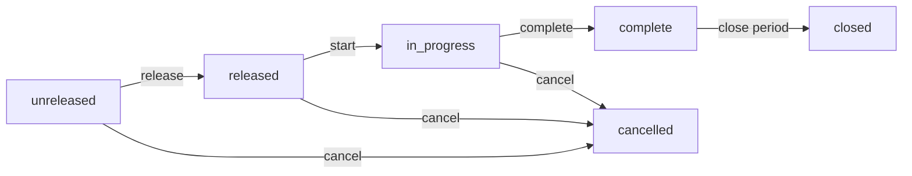
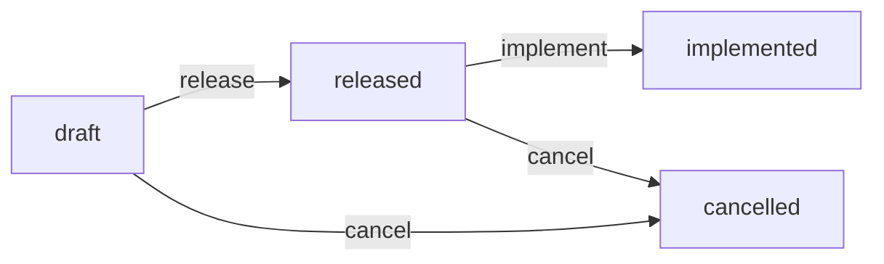

# Manufacturing

How you turn raw materials into finished goods — the structures (BOMs, routings, work centers), the orders that consume them (work orders), and the change-control wrapper (ECOs) that keeps revisions honest.

> **Where do I begin?** Stand up [Work Centers](#work-centers) (where work happens) and an [Item Master](./items.md#item-master) for the parent SKU **and** every raw component. Build the [Bill of Material](#bills-of-material) for the parent, then the [Routing](#routings) that lists its operations and resources. Mark both as `active` and `default`. Now you can create a [Work Order](#work-orders) — releasing it snapshots the BOM and routing onto the WO so subsequent edits to the masters don't reshape an in-flight build.

---

## Table of contents

1. [Work Orders](#work-orders) *(see deep-dive: [work-orders.md](./deep-dives/work-orders.md))*
2. [Bills of Material](#bills-of-material)
3. [Routings](#routings)
4. [Work Centers](#work-centers)
5. [Engineering Changes](#engineering-changes)

---

## Work Orders

`/erp/mfg/work-orders`

### What it is

A **work order (WO)** is a production order to make `quantity_planned` of one parent item. The lifecycle covers everything from "I plan to build this" → "BOM exploded, components and operations materialised" → "stock issued" → "FG received and journal posted." The WO is the single audit anchor — every component issue, every operation completion, the FG receipt, and the production journal all carry `reference_type='work_order', reference_id=<wo_id>`.

> **Example:** WO-1-0042 builds 200 units of `CHAIR-OAK-01`. On release, the system explodes the chair's BOM into 4 component picklist rows (seat blank, 4× legs, 8× screws, 1× finish kit) and materialises 3 routing operations (Cut, Assemble, Finish). Operators issue components against the picklist as they consume them; on `complete(produced_qty=200)`, the system receives 200 chairs to the target subinventory, computes material + labor cost, and posts the production journal.

### How records get created

| Method | When |
|---|---|
| Sidebar → Manufacturing → Work Orders → New | The default path. Pick item, planned qty, due date, target/source org+subinv. |
| API (`POST /erp/mfg/work-orders`) | Integration with an MRP run or a sales-order-driven make-to-order trigger. |
| Auto from upstream | Not in v1 — MRP suggestion-to-WO conversion is roadmap; today every WO is operator-created. |

### Fields

| Field | Required | Notes |
|---|---|---|
| `wo_number` | Auto | `WO-{tenant}-{0001}` unless overridden. UNIQUE per tenant. |
| Item | Yes | Must exist in this tenant. Cannot be edited after release. |
| `quantity_planned` | Yes | Decimal(18,4); must be > 0. |
| `due_date` | Optional | Used by the scheduler view; no hard enforcement. |
| `bom_id` | Optional pre-bind | If empty at release, falls back to the item's default active BOM. Snapshotted at release. |
| `routing_id` | Optional pre-bind | If empty at release, falls back to the item's default active routing. Snapshotted at release. Routing is optional — items with no manufacturing steps just skip operations. |
| Target Org / Subinv | Required by `complete` | Where the FG lands. Validated at complete, not at create. |
| Source Org / Subinv | Required by `issueComponent` | Where components are pulled from. Validated at issue, not at create. |
| `quantity_completed` | Auto | Stamped at `complete`. |
| `quantity_scrapped` | Auto | Aggregated from operation scrap_qty. |
| `journal_id` | Auto | FK to the production journal posted at complete (NULL if the tenant has no `work_order` SLPS template). |
| `backflush_claimed_at` | Auto | One-shot race-guard for operation backflush. See [Gotchas](#gotchas-work-orders). |
| At/By stamps | Auto | `released_*`, `started_*`, `completed_*`, `cancelled_*` — six pairs of (datetime, user) for the full audit. |

### Lifecycle



Each transition is a CAS UPDATE keyed on the current status — re-clicking `release` after another user already released returns 422 ("Work order changed state during release"). At the SQL level: `UPDATE work_orders SET status=?, ...stamps... WHERE id=? AND tenant_id=? AND status IN (allowed)` — `rowCount=1` means we won the race, `0` means we lost it.

#### release

- Resolves `bom_id` (override → pre-bind → item default) and `routing_id` (same fallback chain).
- Validates BOM/routing parent matches WO item; refuses if not.
- Calls `BomService::explode(item_id, quantity_planned, level_cap=8, skip_optional=true)` — see [BOM explode flow](#bom-explode-flow) below — and **materialises one `work_order_components` row per aggregated component**. Optional lines are skipped; phantoms with a child BOM disappear (their grandchildren take their place); phantoms with no child BOM fall through re-labelled as `standard` so backflush can issue them.
- Materialises one `work_order_operations` row per `routing_operations` row (carrying `sequence_no`, `expected_yield_pct`, `requires_inspection`, `work_center_id`).
- CAS `unreleased → released` and snapshots `bom_id` + `routing_id` onto the WO row in the same UPDATE.
- For each routing operation flagged `requires_inspection`, auto-creates a draft Inspection (`InspectionService::autoCreateForWoOperation`). Failures don't abort release — they're surfaced on the response under `inspection_warnings` so the scheduler knows that op will block at completion until QA fixes the checklist.

#### start

CAS `released → in_progress`. Stamps `started_at`, `started_by`. No other side effects.

#### issueComponent

Issues a quantity from one of the WO's component rows.

- Refuses unless WO status ∈ {`released`, `in_progress`}.
- Refuses unless WO has `source_org_id` + `source_subinventory_id` set.
- Creates a `stock_movement` of `transaction_type=ISSUE_WO` with `reference_type='work_order'`, `reference_id=<wo_id>`, **`skip_sub_ledger_post=true`** — the per-line stock-movement journal template is suppressed because the WO's `complete` step posts the full production journal via the `work_order` template instead. (Double-posting prevention.)
- For lot-controlled items, `lots` must be supplied — `StockMovementService` validates allocations against on-hand.
- Bumps `work_order_components.quantity_issued` via `WorkOrderComponent::applyIssued`, an atomic conditional UPDATE: `UPDATE ... SET quantity_issued = quantity_issued + ? WHERE id=? AND tenant_id=? AND quantity_issued + ? <= quantity_required + 0.0001`. If `rowCount=0`, the caller throws "Issue quantity would exceed required (concurrent issue may have raced)" — the outer transaction rolls back the stock movement so on-hand stays consistent.

#### completeOperation

- Refuses unless WO status = `in_progress`.
- If the operation has `requires_inspection=1`, refuses unless `InspectionService::isOperationCleared` is true (inspection record exists in `completed` state with verdict ∈ `accepted` / `accepted_with_concession`). Error text walks the operator through the steps.
- Computes `actual_yield_pct = completed_qty / (completed_qty + scrap_qty) × 100`.
- CAS `pending → completed` on the operation row with `completed_qty`, `scrap_qty`, `actual_yield_pct`, `completed_at`, `completed_by`.
- If the parent item is `backflush_method='operation'`, **first** caller to win `WorkOrder::claimBackflush` (an atomic `UPDATE … SET backflush_claimed_at=NOW() WHERE backflush_claimed_at IS NULL`) runs `BackflushService::autoIssueRemaining`, which iterates `line_type ∈ {standard, repetitive}` components and issues whatever's still required. Losers of the claim CAS skip silently — no double-issue.

#### complete

- Takes `FOR UPDATE` on the WO row for the duration of the transaction.
- Refuses unless WO status = `in_progress`.
- Refuses unless `target_org_id` + `target_subinventory_id` are set.
- If `backflush_method='assembly_completion'`, runs `BackflushService::autoIssueRemaining` first (issuing every standard/repetitive component's remaining qty) so the cost roll-up is whole.
- Aggregates `material_cost` from this WO's `ISSUE_WO` stock-movement lines only, **specifically filtering `JOIN transaction_types tt ON tt.id = sm.transaction_type_id AND tt.code='ISSUE_WO'`** rather than the broader `movement_type='out'`. That keeps later WO-referencing 'out' movements (scrap, return-to-stock) from inflating production cost.
- Computes `labor_cost = RoutingService::unitCost(routing_id) × produced_qty` if a routing was snapshotted. (RoutingService sums `cost_per_hour × (setup_time + run_time_per_unit) × quantity_required` across every operation's resources.)
- Posts a `RECEIPT_MISC` stock movement to `target_org/subinv` for `produced_qty` at `fg_unit_cost = (material + labor) / produced_qty` — again with `skip_sub_ledger_post=true`.
- Calls `SubLedgerPostingService::postFor('work_order', 'work_order', wo_id, {fg_value, material_cost, labor_cost, …})` to post the production journal. The template `linesForWorkOrder` produces:
  - DR Finished Goods Inventory (`fg_value`)
  - DR/CR Variance (signed `fg_value − (material + labor)`)
  - CR Raw Materials Inventory (`material_cost`)
  - CR Labor Applied (`labor_cost` if > 0)
- CAS `in_progress → complete` with `quantity_completed` and the returned `journal_id` (NULL if the tenant has no `work_order` template configured — non-fatal, surfaced as a warning in audit).

#### cancel

CAS any of {`unreleased`, `released`, `in_progress`} → `cancelled`. **Inventory already issued is NOT auto-reversed** — a manual return-movement is required if the operator wants stock back. Components and operations stay on the WO for audit.

#### closed

Set during period-close; locks the WO from further changes. Not currently transitioned via a service method — set by the GL period-close routine.

### Actions

- **List** — sidebar → Manufacturing → Work Orders. Filter by status, item.
- **Create** — opens the form; only `item_id` + `quantity_planned` are required upfront. Target/source coordinates can be filled later as long as they're set before the first issue / complete.
- **Edit** — allowed only while `unreleased`. Service rejects edits at any later state with a 422 "Only unreleased work orders can be edited."
- **Delete** — allowed only while `unreleased` or `cancelled`. Cascades `work_order_operations` + `work_order_components` rows in the same transaction.
- **Release** (`POST .../release`) — see lifecycle above. Optional body `{bom_id, routing_id, skip_optional}` to override defaults.
- **Start** (`POST .../start`) — no body. CAS-only; pure state flip.
- **Issue Component** (`POST .../issue-component`) — body `{component_id, quantity, lots?}`. Returns the WO refreshed with `components` and `operations` arrays, plus `_movement_id` for the stock movement that was posted.
- **Complete Operation** (`POST .../operations/{op_id}/complete`) — body `{completed_qty, scrap_qty?}`. Default `scrap_qty=0`. Triggers operation-method backflush if eligible.
- **Complete WO** (`POST .../complete`) — body `{produced_qty}`. Must be > 0. Triggers assembly-completion backflush if configured, posts FG receipt + journal.
- **Cancel** (`POST .../cancel`) — body `{reason?}`. Audit-logged. Does **not** reverse issued stock.

### Gotchas {#gotchas-work-orders}

- **Snapshot at release means master edits don't follow.** Edit the BOM or routing after release and the in-flight WO is unaffected — that's the point. To roll the new revision in, cancel the WO and create a new one.
- **`backflush_claimed_at` is a one-shot.** Once set, it never resets. A WO can backflush exactly once across all op completions; that's by design (v1 lump-sum simplification). Two concurrent `completeOperation` calls that both observe `backflush_method='operation'` race for `claimBackflush`; only the winner runs `autoIssueRemaining`, losers skip. Without this guard, both would call `autoIssueRemaining` and double-issue. *(Sev-1 fix, B4 review round.)*
- **`applyIssued` is the over-issue race guard.** The pre-check (`quantity > remaining`) is informational; the SQL-level conditional UPDATE is what actually prevents two concurrent issues from both seeing room and both committing. If `rowCount=0`, the caller throws and the outer transaction rolls back the stock movement — so on-hand stays consistent. *(Sev-1 fix, B4 review round.)*
- **`material_cost` join filters on `tt.code='ISSUE_WO'`, not just `movement_type='out'`.** Adding a future scrap-out or return-to-stock transaction type with `movement_type='out'` won't pollute the production cost roll-up. *(Sev-2 fix, B4 review round.)*
- **Cancel does not reverse issued stock.** Operators expecting it will be surprised. The cancel reason field is the right place to write "stock returned via REC-1234" so auditors can trace it.
- **`work_order` SLPS template is opt-in.** A tenant without one configured will see WO complete succeed, `quantity_completed` stamped, but no `journal_id`. The audit log captures `journal_id: null` — surface as a warning in the production-accounting dashboard.
- **Inspection-gated ops block at completeOperation, not at start.** A WO can be released and started, run operations 10 and 20, then hit a wall at operation 30 if QA hasn't configured the checklist. The release response carries `inspection_warnings` so the scheduler knows in advance.
- **Edit window is `unreleased` only.** Once released, the operator-visible fields (quantity, due date, target/source) are locked. Cancel + re-create is the correction path.
- **`FOR UPDATE` on the WO row is taken for the whole `complete` transaction.** Two operators racing to complete the same WO will serialise — the loser sees "Work order changed state during complete" once the winner's transition lands. This is the safety net behind the CAS transition; without it, both could pre-check `status='in_progress'` and both build the FG receipt before either flips the status.
- **`released → started` is a no-op state flip; you can issue components without starting.** `issueComponent` allows status ∈ {`released`, `in_progress`}. The `start` action is a courtesy stamp for "we actually began work" — useful for cycle-time reporting but not required by the issue pipeline.
- **WO number generation is `MAX(SUBSTRING_INDEX) + 1` per tenant**, not a sequence. Two concurrent `WorkOrder::create` calls without explicit numbers can theoretically pick the same `wo_number`; the UNIQUE on `(tenant_id, wo_number)` makes the loser retry. If you see "A work order with that number already exists" on a clean create, that's the race — re-submit.

### Backflush method matrix

The `items.backflush_method` value (set per parent item, not per WO) decides who and when components get issued:

| Method | At op complete | At WO complete | Manual `issueComponent` |
|---|---|---|---|
| `none` | No auto-issue. | No auto-issue. | Required for every component. |
| `manual` | Same as `none`. | Same as `none`. | Required. |
| `operation` | First op completion claims `backflush_claimed_at` and runs `autoIssueRemaining` (lump-sum v1). Subsequent op completions skip. | Skipped (already issued at op complete). | Allowed for early manual issues; `autoIssueRemaining` only issues the **remaining** required qty. |
| `assembly_completion` | No auto-issue at op complete. | `autoIssueRemaining` issues every remaining standard/repetitive component before the FG receipt is posted. | Allowed; same "remaining only" behaviour. |

`BackflushService::autoIssueRemaining` always filters on `line_type ∈ {standard, repetitive}` — phantoms (after explode) are re-labelled standard, but `option` / `optional` lines never auto-issue. Operators have to issue those explicitly.

### Walkthrough — a complete WO cycle

This is the condensed version; the [deep-dive](./deep-dives/work-orders.md) walks the same flow with full payloads.

1. **Setup** — chair item has `backflush_method='assembly_completion'`. Default active BOM exists (the multi-level example above). Default active routing exists (3 ops, op 20 inspection-gated).
2. **Create** — `POST /erp/mfg/work-orders {item_id: chair, quantity_planned: 200, due_date: '2026-06-30', target_org_id, target_subinventory_id, source_org_id, source_subinventory_id}`. Returns WO-1-0042 in `unreleased`.
3. **Release** — `POST .../work-orders/42/release {}`. BomService::explode runs (level cap 8, skip_optional=true), aggregates 7 component rows, writes them to `work_order_components`. RoutingService::operations bulk-fetches the 3 ops + their resources, writes 3 rows to `work_order_operations`. Inspection auto-create runs for op 20 — say it fails (no checklist), warning added to response under `inspection_warnings`. WO snapshot has `bom_id=17, routing_id=23`. Status `released`. `released_at`, `released_by` stamped.
4. **Start** — `POST .../work-orders/42/start {}`. Status `in_progress`. `started_at` stamped.
5. **Op 10 complete** — `POST .../work-orders/42/operations/10/complete {completed_qty: 200, scrap_qty: 0}`. `actual_yield_pct=100`. Status of the op `completed`. WO is `assembly_completion`, not `operation`, so no backflush.
6. **Inspection setup** — QA configures the default production inspection checklist. Manually creates an inspection for the WO's op 20 row, records results, marks `completed` with verdict `accepted`.
7. **Op 20 complete** — `POST .../work-orders/42/operations/20/complete {completed_qty: 195, scrap_qty: 5}`. Gate clears. `actual_yield_pct = 195 / 200 × 100 = 97.5`.
8. **Op 30 complete** — same shape. Suppose `completed_qty=195`.
9. **WO complete** — `POST .../work-orders/42/complete {produced_qty: 195}`. Takes `FOR UPDATE` on WO. `backflush_method='assembly_completion'` → `BackflushService::autoIssueRemaining` issues every component's remaining qty. Each call posts an ISSUE_WO stock movement (auto-post suppressed) and bumps `quantity_issued`. After backflush, `material_cost = SUM(stock_movement_lines.total_cost)` filtered on `tt.code='ISSUE_WO'`. `labor_cost = RoutingService::unitCost × 195`. `fg_unit_cost = (material + labor) / 195`. RECEIPT_MISC stock movement posted to target subinv for 195 units. `SubLedgerPostingService::postFor('work_order', ...)` posts the production journal. CAS `in_progress → complete` with `quantity_completed=195` + `journal_id`. `completed_at`, `completed_by` stamped.
10. **GL** — the journal is DR FG Inventory + DR/CR Variance + CR Raw Materials + CR Labor Applied. Variance is `fg_value − (material + labor)`; with `fg_value = material + labor` (which is how complete computes it in v1), the variance line is zero and gets dropped.

For the full release → issue → complete walk with sample payloads and journal output, see [deep-dives/work-orders.md](./deep-dives/work-orders.md).

---

## Bills of Material

`/erp/mfg/boms`

### What it is

A **BOM** is the recipe — for a parent item, the list of component items and quantities needed to make one unit. BOMs are **multi-level**: a phantom line lets a sub-assembly's own BOM explode through into the parent's component list, so a flat picklist at WO release contains only the raw components actually issued from stores.

> **Example:** Parent `CHAIR-OAK-01` revision A: line 1 SEAT-BLANK qty 1 (`standard`, scrap 5%), line 2 LEG-OAK qty 4 (`standard`), line 3 SCREW-M6 qty 8 (`standard`), line 4 FINISH-KIT qty 1 (`phantom` — which has its own BOM listing 0.05L stain + 0.02L lacquer + 1× brush). When the BOM explodes at WO release, the picklist contains: SEAT-BLANK 1.05, LEG-OAK 4, SCREW-M6 8, STAIN 0.05L, LACQUER 0.02L, BRUSH 1 — no FINISH-KIT.

### How records get created

| Method | When |
|---|---|
| Sidebar → Manufacturing → BOMs → New | The default path. Operator builds header, then adds lines. |
| API (`POST /erp/mfg/boms`) + `POST .../lines` | PLM/CAD import script. |
| ECO release | An ECO with `eco_bom_changes` rows is the *intended* (v2) path for in-place edits; today the ECO records the change but operators apply it manually via the BOM screen. |

### Fields

#### Header (`boms`)

| Field | Required | Notes |
|---|---|---|
| Parent Item | Yes | Cannot be its own component. Validated on `addLine`. |
| Revision | Default `A` | Free-text; convention is single letter or numeric. |
| Description | Optional | |
| Effective Date | Optional | When the revision goes live. Informational in v1. |
| Status | Default `draft` | `draft` / `active` / `superseded`. WOs at release look for `status='active' AND is_default=1`. |
| `is_default` | Default 0 | UNIQUE one-default-per-parent (see `default_marker` below). |
| Notes | Optional | |

`default_marker` is a `VIRTUAL GENERATED` tinyint column on `boms` — it's `1` when `is_default=1` and NULL otherwise. A composite UNIQUE on `(tenant_id, parent_item_id, default_marker)` lets you have arbitrarily many non-default BOMs for an item but exactly one default. Trying to flip a second BOM to `is_default=1` returns 422 "Another default BOM already exists for this item." Same pattern as Routings.

#### Lines (`bom_lines`)

| Field | Required | Notes |
|---|---|---|
| `line_no` | Auto | `MAX(line_no)+1` per BOM if not supplied. |
| Component Item | Yes | Cannot equal the BOM's parent (cycle guard at controller level). |
| Quantity | Yes | Decimal(18,4); per **one unit** of the parent. |
| UOM | Optional | Defaults to the component's primary UOM. |
| `line_type` | Default `standard` | See table below. |
| `scrap_pct` | Default 0 | Decimal(7,4); 0–1 scale (so 0.05 = 5%). `effective_qty = qty × parent_qty × (1 + scrap_pct)`. |
| Description | Optional | |

| `line_type` | Behaviour on BOM explode |
|---|---|
| `standard` | Included verbatim. Issued from stores. |
| `phantom` | Recurse into the component's own default BOM and replace this line with the children. **Phantom with no child BOM falls through re-labelled `standard`** — matches Oracle MFG behaviour; without that fallback, backflush would skip the phantom (it filters on standard/repetitive) and leave required stock un-issued. |
| `option` | A selectable variant (caller chooses which option to take). Included by default at v1. |
| `optional` | Pickable add-on. **Skipped when `skip_optional=true`** (the default at WO release and at the explode action). |
| `repetitive` | Continuous-flow input. Treated like `standard` in v1; the enum is reserved for a future repetitive-WO subtype. |

### Lifecycle


There's no CAS service for BOM transitions in v1; operators set `status` directly via the edit form. The pattern is: copy an `active` BOM to a new revision draft, edit lines, set the new draft `active`, set the old `active` `superseded`, flip `is_default` to the new revision. WOs released against the prior revision keep using it (snapshot at release).

### BOM explode flow

```mermaid
flowchart TD
    Start[explode parent, qty, level=0, level_cap=8] --> Find{find default active BOM}
    Find -- none --> Leaf[return: leaf component, no children]
    Find -- found --> Iter[for each bom_line]
    Iter --> Type{line_type?}
    Type -- optional --> Skip[skip if skip_optional]
    Type -- phantom --> ChildBOM{component has own default BOM?}
    ChildBOM -- yes --> Recurse[walk component, qty × parent_qty × (1+scrap_pct), level+1]
    ChildBOM -- no --> Standardise[emit as 'standard' line - backflush will issue it]
    Type -- standard/option/repetitive --> Emit[emit at effective_qty]
    Recurse --> Iter
    Standardise --> Iter
    Emit --> Iter
    Iter --> Done[end of lines]
    Done --> Agg[aggregate by component_item_id + uom_id, sum quantities]
```

`BomService::explode` runs this walk, then aggregates the flat list keyed on `(component_item_id, uom_id)` — so a component used in multiple sub-assemblies gets one picklist row with the summed required quantity. `level_cap=8` is the cycle defense; exceeding it throws "BOM explode exceeded level cap (8); cycle in BOM?" so the operator can find and fix the loop.

### Actions

- **List** — filter by parent item, status.
- **Show** — header + nested lines (joined to items + UOMs for sku/name/code).
- **Create** — `POST /erp/mfg/boms` with `{parent_item_id, revision, description, …}`. Lines are added separately via `POST /erp/mfg/boms/{id}/lines`.
- **Edit** — header fields (revision, description, effective_date, notes, status, is_default). Status changes go through this same edit form in v1.
- **Add Line / Update Line / Remove Line** — nested under `/lines`. `line_no` auto-appends if not supplied.
- **Explode** (`GET .../explode?quantity=N&skip_optional=0|1`) — read-only, returns the flat aggregated picklist for the given quantity. Used by the front-end "preview picklist" button on the WO create screen.
- **Delete** — refused if any `work_orders.bom_id` references it OR if any `work_order_components.bom_line_id` references one of its lines (the latter catches the case of a phantom-child BOM that the parent's WO still references through its lines, even though the WO's `bom_id` points at the parent). *(Sev-2 fix, B4 review round.)*

### Gotchas {#gotchas-boms}

- **A BOM cannot include its own parent as a component** — controller-level check on `addLine`. Use phantoms with care; cycles across multiple levels are caught at explode time by the `level_cap`, not at edit time.
- **`is_default` is mutually exclusive per parent item.** Trying to set a second `is_default=1` row returns 422 from the DB-level UNIQUE on `(tenant_id, parent_item_id, default_marker)` — fix is to flip the old default off in the same edit.
- **`scrap_pct` is 0–1, not 0–100.** A 5% scrap is `scrap_pct=0.05`. Saving `5` would multiply the required qty by 6.
- **Phantom-with-no-BOM is treated as `standard` after explode** — by design. Otherwise the WO would have a picklist row tagged `phantom`, and `BackflushService::autoIssueRemaining` filters on `standard`/`repetitive` and would skip it, leaving required stock un-issued.
- **Deletes are heavily guarded.** If you can't delete a BOM, check `work_orders.bom_id` first, then `work_order_components.bom_line_id` — the second case (phantom child still in use) is non-obvious.
- **`line_no` auto-appends, but isn't auto-renumbered on insert in the middle.** Inserting a line with explicit `line_no=5` between existing 4 and 6 just writes 5; deleting a middle row leaves a gap. The display sort is on `line_no`, so gaps are cosmetic.
- **`is_default` filter on WO release is `status='active' AND is_default=1`.** A draft BOM with `is_default=1` won't be picked at release; you'll get "No BOM specified and item has no default active BOM." Status flip and default flip are independent.
- **The explode action respects `skip_optional`.** The UI's "preview picklist" sets `skip_optional=1` by default, matching the WO release behaviour. To preview what an option-heavy WO would look like with options included, pass `?skip_optional=0`.

### Walkthrough — building a multi-level BOM

Suppose you're modelling a chair with a phantom finish kit and one optional accessory:

1. Create item masters for parent + every component: `CHAIR-OAK-01`, `SEAT-BLANK`, `LEG-OAK`, `SCREW-M6`, `FINISH-KIT` (phantom container), `STAIN`, `LACQUER`, `BRUSH`, `CUSHION-RED` (optional add-on).
2. `POST /erp/mfg/boms` for `FINISH-KIT` rev A with `is_default=1, status='active'`. Add lines: STAIN 0.05L, LACQUER 0.02L, BRUSH 1.
3. `POST /erp/mfg/boms` for `CHAIR-OAK-01` rev A with `is_default=1, status='active'`. Add lines: SEAT-BLANK qty 1 scrap_pct 0.05, LEG-OAK qty 4, SCREW-M6 qty 8, FINISH-KIT qty 1 `line_type='phantom'`, CUSHION-RED qty 1 `line_type='optional'`.
4. `GET /erp/mfg/boms/{chair_bom_id}/explode?quantity=10&skip_optional=1` returns:
   - SEAT-BLANK 10.5 (10 × 1 × 1.05 scrap)
   - LEG-OAK 40
   - SCREW-M6 80
   - STAIN 0.5L (10 × 1 × 0.05L from phantom)
   - LACQUER 0.2L
   - BRUSH 10
   - (no CUSHION-RED — optional skipped)
5. Same call with `skip_optional=0` adds CUSHION-RED 10 to the picklist.

---

## Routings

`/erp/mfg/routings`

### What it is

A **routing** is the ordered list of operations needed to make the parent item, with each operation's resource requirements (labor / machine / tool, with rates and run times). Routings drive labor + overhead costing at WO complete and feed scheduling/capacity views.

> **Example:** Parent `CHAIR-OAK-01` routing rev A, 3 operations: seq 10 "Cut" (work center CUT-01, 1× operator @ $25/hr, setup 0.1h, run 0.05h/unit) → seq 20 "Assemble" (work center ASSY-01, 2× operators @ $20/hr, setup 0.0h, run 0.15h/unit, requires_inspection=1) → seq 30 "Finish" (`is_osp=1`, OSP vendor "Lacquer Pro", expected_yield_pct=98). At WO complete, `RoutingService::unitCost` returns `0.1×25 + 0.15×20×2 = $8.50/unit` (OSP doesn't carry labor in v1).

### How records get created

Same shape as BOMs: header via `POST /erp/mfg/routings`, then operations via nested `POST .../operations`, then resources via deeper nested `POST .../operations/{op_id}/resources`.

### Fields

#### Header (`routings`)

Identical shape to BOMs:

| Field | Required | Notes |
|---|---|---|
| Parent Item | Yes | Validated against `items`. Accepts `item_id` or `parent_item_id` in the request body. |
| Revision | Default `A` | |
| Description | Optional | |
| Effective Date | Optional | |
| Status | Default `draft` | `draft` / `active` / `superseded`. |
| `is_default` | Default 0 | Same `default_marker` virtual column + UNIQUE pattern as BOMs — one default per parent item. |

#### Operations (`routing_operations`)

| Field | Required | Notes |
|---|---|---|
| `sequence_no` | Auto-incremented by 10 | `MAX(sequence_no)+10` per routing if not supplied. The +10 gap is deliberate — leaves room to insert ops between existing steps without renumbering. |
| Name | Yes | |
| Description | Optional | |
| Work Center | Optional | FK to `work_centers`. NULL is permitted for OSP-only routings. |
| `is_osp` | Default 0 | Outside-processing flag. |
| `osp_vendor_id` | Required when `is_osp=1` | FK to `companies` (vendor). v2 auto-creates a subcontract PO at release; v1 records the link only. |
| `expected_yield_pct` | Default 100 | Decimal(7,4); informational at v1 (actual yield comes from `completed_qty / (completed + scrap)` at op complete). |
| `requires_inspection` | Default 0 | When 1, WO release auto-creates a draft Inspection and `completeOperation` refuses to advance until QA marks it `completed` with verdict ∈ `accepted` / `accepted_with_concession`. |

#### Operation Resources (`routing_operation_resources`)

| Field | Required | Notes |
|---|---|---|
| `resource_type` | Yes | ENUM `labor` / `machine` / `tool`. Other values return 422. |
| `resource_name` | Optional | Free-text label. The schema does **not** have a `work_center_id` column on this table — the work center lives on the operation row. |
| `quantity_required` | Default 1 | E.g. 2 operators on the same op. |
| `setup_time` | Default 0 | Hours per operation, once. |
| `run_time_per_unit` | Default 0 | Hours per produced unit. |
| `cost_per_hour` | Default 0 | Decimal(20,4). |

`RoutingService::unitCost(routing_id)` returns `Σ (setup_time + run_time_per_unit) × cost_per_hour × quantity_required` across every resource of every operation. At WO complete, that total × `produced_qty` is the labor portion of the production journal.

### Lifecycle

Same as BOM:


### Actions

- **List** — filter by parent item, status.
- **Show** — header + `RoutingService::operations()` (each operation with its `resources` array attached).
- **Create / Edit / Delete header** — `Delete` is refused if any `work_orders.routing_id` references the routing.
- **Add / Update / Remove Operation** — nested under `/operations`. Removing an operation cascades its resources.
- **Add / Remove Resource** — nested under `/operations/{op_id}/resources`.

### Gotchas {#gotchas-routings}

- **`routing_operation_resources` has no `work_center_id` column.** The work center is on `routing_operations.work_center_id`; a resource is just a (type, name, qty, time, cost) tuple under an op. An earlier draft of the controller wrote a non-existent `work_center_id` column to this table, which would crash every add-resource call. The controller now writes `resource_name` instead. *(Sev-1 fix, B4 review round.)*
- **`sequence_no` defaults +10, not +1.** That's why a freshly added op shows seq 10, then 20, then 30 — leaves insertion gaps so renumbering isn't constant.
- **Default uniqueness collides with BOM the same way.** Two `is_default=1` routings for the same parent → 422 "Another default routing already exists for this item, or revision conflict."
- **OSP is a flag, not a separate routing type.** A routing can mix OSP and in-house ops freely. v1 stops at recording `osp_vendor_id`; auto-creating the subcontract PO at WO release is on the roadmap, not in code yet.
- **`expected_yield_pct` is informational at v1.** Variance against actual is computed at op complete (`completed_qty / (completed + scrap) × 100` → `actual_yield_pct`) and stamped on the WO operation row; the routing's expected % is what the scheduler/dashboard compares against.
- **`requires_inspection` flows from the master to the WO snapshot at release.** Flipping the routing's `requires_inspection` after a WO is released does NOT update the WO's operation row — that's snapshot semantics in action. Operators who change the routing in the middle of an in-flight build need to either accept the snapshot will run with the old gate, cancel and re-release, or edit the WO operation row directly via SQL (not exposed in the UI).
- **Resource cost rolls up only at WO complete, not at op complete.** The labor + overhead in the production journal is `RoutingService::unitCost × produced_qty` — a single number from the routing's resource rates × `produced_qty`. There's no per-op true-up against time actually clocked; that's a v2 work-effort-tracking enhancement. The "Variance" line in the journal absorbs whatever drift exists between standard and actual.

### Walkthrough — assembling a routing

Sequence to fully describe the chair routing example:

1. `POST /erp/mfg/work-centers` for `CUT-01`, `ASSY-01`, and (if you want the OSP done in-house too) `FINISH-01`.
2. `POST /erp/mfg/routings` for `CHAIR-OAK-01` rev A with `is_default=1, status='active'`.
3. `POST .../routings/{id}/operations` for "Cut" (`work_center_id=CUT-01`, no auto seq → defaults to 10).
4. `POST .../operations/{cut_op_id}/resources` for `{resource_type: 'labor', resource_name: 'Saw operator', quantity_required: 1, setup_time: 0.1, run_time_per_unit: 0.05, cost_per_hour: 25}`.
5. Repeat 3-4 for "Assemble" (seq auto → 20, `requires_inspection=1`, 2× operators @ $20).
6. Add "Finish" (seq 30, `is_osp=1, osp_vendor_id=<LacquerPro company id>`). OSP ops carry no resources at v1; the cost will come from the vendor bill at goods-receipt time.
7. `GET .../routings/{id}` returns the header + `operations` array with each op's `resources` attached — matches what the WO release will snapshot.

---

## Work Centers

`/erp/mfg/work-centers`

### What it is

A **work center** is a physical or logical grouping of resources — a CNC cell, an assembly bench, a paint booth — where one or more routing operations happen. Used to attach an operation to a location for scheduling and capacity reporting, and (optionally) to a department for HR overhead allocation.

> **Example:** Code `CUT-01`, name "Cut and trim cell #1", department "Production - Cutting". Routing operation `seq 10 Cut` on `CHAIR-OAK-01` points at this work center.

### How records get created

| Method | When |
|---|---|
| Sidebar → Manufacturing → Work Centers → New | The default path. |
| API (`POST /erp/mfg/work-centers`) | Bulk seed during go-live. |

### Fields

| Field | Required | Notes |
|---|---|---|
| Code | Yes | Free-text; convention is `AREA-NN`. The model also exposes `findByCode` for lookup integrations. |
| Name | Yes | |
| Description | Optional | |
| Department | Optional | FK to `departments`. Used to roll work-center cost into an HR department for overhead reporting. |
| `is_active` | Default 1 | Pause without deleting. Inactive work centers still resolve on existing WOs (snapshot semantics) but won't appear in pickers. |

### Lifecycle

No state machine — just `is_active` toggle. Routings and routing operations reference the work center by id; the snapshot pattern means an in-flight WO's `work_order_operations.work_center_id` keeps working even after the master is paused or renamed.

### Actions

- **List** — filter by `is_active`. Sorted by code.
- **Create / Edit / Delete** — straight CRUD. No referential refusal on delete in v1; an operation referencing a deleted work center reads the FK as a dangling pointer. *(Watch this if you decide to delete vs. deactivate.)*

### Gotchas {#gotchas-work-centers}

- **Prefer deactivate over delete.** Routings and (snapshotted) WO operations carry the FK; a deleted work center leaves the JOIN producing NULLs. The list query is `LEFT JOIN`-safe, but reports that filter on work-center name will silently drop rows.
- **Code is enforced UNIQUE per tenant at the table level.** `uq_wc_tenant_code` (`setup/erp_v29.sql`) blocks two work centers in the same tenant from sharing a code — the insert errors with 1062. Use **deactivate** (`is_active = 0`) instead of delete when you want a code to stay reserved while the record stops appearing in lookups.
- **Department link is optional.** Without it, work-center cost can't be rolled into an HR department for overhead allocation; the production journal still posts correctly (the variance falls into the configured variance bucket regardless).
- **The `LEFT JOIN departments` in the list query is permissive.** A work center pointing at a deleted department shows `department_name=NULL` rather than erroring — useful when departments get reorganised but you don't want the work-center list to break.
- **`findByCode` is a public lookup helper.** Integrations that seed routings can resolve work centers by code without hitting the list endpoint — handy for idempotent import scripts that run before the work-center IDs are stable.

---

## Engineering Changes

`/erp/mfg/ecos`

### What it is

An **Engineering Change Order (ECO)** bundles item-revision bumps and BOM line diffs into one reviewable change with a release/implement audit trail. ECOs are the change-control wrapper around the recipe — they don't auto-apply BOM edits at v1, but they atomically write `item_revisions` rows at release so subsequent production can opt into the new revision.

> **Example:** ECO-1-0007 "Switch CHAIR-OAK-01 from screws to dowels". `eco_revisions`: bump CHAIR-OAK-01 from rev A → rev B. `eco_bom_changes`: on BOM 17 (CHAIR-OAK-01 rev A), remove component SCREW-M6, add WOOD-DOWEL-8MM qty 8. On release, the system writes an `item_revisions` row `(item_id=CHAIR-OAK-01, revision='B', eco_id=this, status=active)`. Operators then build the new rev B BOM manually (v1) or wait for v2 auto-apply.

### How records get created

| Method | When |
|---|---|
| Sidebar → Manufacturing → Engineering Changes → New | The default path. |
| API (`POST /erp/mfg/ecos`) | Integration with a PLM tool. |

### Fields

#### Header (`engineering_change_orders`)

| Field | Required | Notes |
|---|---|---|
| `eco_number` | Auto | `ECO-{tenant}-{0001}` unless overridden. UNIQUE per tenant. |
| Title | Yes | |
| Description | Optional | Long-form (text). |
| Effective Date | Optional | When the change goes live. Defaults to today at release if not set. |
| Status | Default `draft` | `draft` / `released` / `implemented` / `cancelled`. |
| Notes | Optional | |
| At/By stamps | Auto | `released_*`, `implemented_at`, `cancelled_at`. |

#### Revisions (`eco_revisions`)

One row per (eco, item) recording the revision bump.

| Field | Required | Notes |
|---|---|---|
| Item | Yes | |
| Old Revision | Optional | What we're bumping from. Informational. |
| New Revision | Yes | What we're bumping to. **UNIQUE per (tenant, eco, item)** — two changes to the same item inside one ECO de-dup to the final new_revision. Adding a duplicate returns 422 "A revision for this item already exists on the ECO." |

#### BOM Changes (`eco_bom_changes`)

One row per BOM line diff inside the ECO.

| Field | Required | Notes |
|---|---|---|
| BOM | Yes | FK to `boms`. |
| `change_type` | Yes | ENUM `add` / `remove` / `update`. |
| Component Item | Yes | |
| Old Quantity | Optional | For `update` / `remove`. |
| New Quantity | Optional | For `add` / `update`. |
| Notes | Optional | |

### Lifecycle



- **draft** — editable. Add/remove revisions and BOM changes freely. The only state where the header (`update`) or nested rows can be modified.
- **released** — atomically writes one `item_revisions` row per `EcoRevision`, then CAS `draft → released` with `released_at` / `released_by` stamps. Wrapped in `Database::beginTransaction()` — a partial failure rolls back; an `item_revisions` already-exists collision (errno 1062) returns 422 "An item revision in this ECO already exists." **Note: cancelling a `released` ECO does NOT roll back the `item_revisions` rows already written** — that's by design (history preservation).
- **implemented** — manual stamp; no further DB side-effects in v1. Placeholder for v2 auto-apply of `eco_bom_changes` to live BOMs.
- **cancelled** — allowed from `draft` or `released`. Stamps `cancelled_at`. Does not undo prior side-effects.

### Actions

- **List / Show** — show includes nested `revisions` + `bom_changes`.
- **Create** — `POST /erp/mfg/ecos` with `{title, description, effective_date, notes}`.
- **Edit** — `PUT /erp/mfg/ecos/{id}` allowed only while `draft`. Status changes go through release/implement/cancel.
- **Add / Remove Revision** — `POST .../revisions`, `DELETE .../revisions/{rev_id}`. Both refuse if ECO isn't `draft`.
- **Add / Remove BOM Change** — `POST .../bom-changes`, `DELETE .../bom-changes/{chg_id}`. Both refuse if ECO isn't `draft`.
- **Release** (`POST .../release`) — `draft → released` with the atomic `item_revisions` write described above.
- **Implement** (`POST .../implement`) — `released → implemented`. CAS-protected; second click returns 422.
- **Cancel** (`POST .../cancel`) — `draft → cancelled` or `released → cancelled`. CAS-protected.
- **Delete** — `DELETE /erp/mfg/ecos/{id}` allowed only while `draft`. Cascades `eco_revisions` + `eco_bom_changes`.

### Gotchas {#gotchas-ecos}

- **`eco_revisions` UNIQUE is `(tenant, eco, item)`.** A v30 fix moved the UNIQUE on `item_revisions` (which the release writes into) to be tenant-scoped — earlier versions had a cross-tenant collision risk where tenant A creating revision "B" for an item could block tenant B from doing the same. Verify v30 has run if you see "An item revision in this ECO already exists" errors that don't correspond to a real conflict in your tenant. *(Sev-1 fix, B4 review round.)*
- **Release wraps everything in a transaction.** A failure mid-loop (e.g. one of the `item_revisions` inserts hits a UNIQUE violation) rolls back the entire ECO release — the ECO stays in `draft`. No half-released state.
- **PDOException 23000 is caught separately from generic exceptions** in `release`, so the operator gets the friendly "An item revision in this ECO already exists" message instead of the raw `SQLSTATE[23000]` text (which can leak details about other tenants' index entries). *(Sev-2 fix, B4 review round.)* A non-1062 23000 (FK/NOT NULL) is logged but returned as the generic 500 — investigate via logs.
- **Cancelling a released ECO does NOT undo the `item_revisions` rows.** That's intentional — the revision history is part of the product record. To "undo" a release, raise a new ECO that bumps back to the prior revision.
- **`eco_bom_changes` are recorded, not applied.** v1 ECO release writes the revision rows and stops; the `eco_bom_changes` table is the audit log of what *should* change. Operators apply the changes manually via the BOM screen. v2 will close that loop.
- **Implement is a manual stamp.** It doesn't do anything to the database other than mark `implemented_at`. Don't expect downstream side-effects in v1; the lever for "this revision is now in production" is the operator releasing a WO that picks up the new BOM.
- **An `item_revisions` row already at the target revision is treated as success, not collision.** The release loop pre-checks `SELECT id FROM item_revisions WHERE ... revision=?` before inserting; if the row already exists (e.g. seeded manually, or a prior ECO already bumped to the same revision), the loop skips. The 422 only fires on a genuine UNIQUE collision the pre-check missed — typically a race between two ECO releases targeting the same item/revision.
- **`eco_revisions` is the de-dup point for multiple changes to one item.** If the operator adds two revision rows for the same item inside one ECO (rev A → B, then rev A → C), the second add returns 422 from the `(tenant, eco, item)` UNIQUE — they need to remove the first and add the final target.
- **Edit/delete refusal is on `status != draft`.** Once released, the only allowed transitions are `implement` and `cancel`; the operator cannot tweak the title or add another revision. To extend a released change, raise a new ECO.

### Walkthrough — running an ECO

1. `POST /erp/mfg/ecos` with `{title: "Switch CHAIR-OAK-01 from screws to dowels", effective_date: "2026-07-01"}`. ECO-1-0007 created, status `draft`.
2. `POST .../ecos/7/revisions` with `{item_id: <chair>, old_revision: "A", new_revision: "B"}`. Audit-trail of the version bump.
3. `POST .../ecos/7/bom-changes` × 2:
   - `{bom_id: <chair_bom>, change_type: 'remove', component_item_id: <screw>}`
   - `{bom_id: <chair_bom>, change_type: 'add', component_item_id: <dowel>, new_quantity: 8}`
4. Review the ECO show page — confirm both nested arrays populated.
5. `POST .../ecos/7/release` — atomic transaction writes `item_revisions(item_id=chair, revision='B', eco_id=7, status='active', effective_date='2026-07-01')` and CAS `draft → released`. Stamps `released_at`, `released_by`.
6. Manually edit the chair BOM (`PUT .../boms/{id}/lines/{screw_line_id}` to remove, `POST .../boms/{id}/lines` to add dowel). v2 will automate this from the `eco_bom_changes` rows.
7. When the new BOM is live and a WO has been built against it, `POST .../ecos/7/implement` — `released → implemented`. Just a stamp; nothing else changes.

---

## Common error messages and what they mean

A reference for the operator-visible 422s thrown across Manufacturing:

| Message | Where | Meaning |
|---|---|---|
| "Only unreleased work orders can be released (status='X')." | WO release | Someone already released this WO; refresh the screen. |
| "No BOM specified and item has no default active BOM." | WO release | Either pass `bom_id` in the release body, or flip a BOM to `is_default=1 AND status='active'`. |
| "BOM parent item does not match work order item." | WO release | A WO with `bom_id` pre-bound to a different item's BOM. Clear `bom_id` to fall back to default. |
| "Work order changed state during release." | WO release | CAS lost — another release call won; refresh. |
| "Components can only be issued to released or in_progress work orders (status='X')." | issueComponent | WO is `complete`/`cancelled`/`unreleased`; either re-open or re-create the WO. |
| "Work order has no source org/subinventory configured." | issueComponent | Edit the WO (only allowed before release) or, if released, accept and direct-edit via SQL. |
| "Issue quantity X exceeds remaining required Y for component." | issueComponent | Pre-check refused before stock movement. Re-check planning. |
| "Issue quantity would exceed required (concurrent issue may have raced)." | issueComponent | The atomic `applyIssued` CAS lost — a parallel issue completed; refresh the component row and recompute remaining. |
| "Operation requires a completed+accepted inspection before it can be completed." | completeOperation | QA hasn't resolved the inspection. Verify a checklist exists, run + complete the inspection with `accepted` / `accepted_with_concession`. |
| "Operation changed state during complete." | completeOperation | Another operator completed the op first. |
| "Only in_progress work orders can be completed (status='X')." | complete | Run `start` first, or the WO is already `complete`/`cancelled`. |
| "Work order has no target org/subinventory for FG receipt." | complete | Pre-bind on create (only editable while `unreleased`). |
| "Cannot cancel a complete/closed/cancelled work order." | cancel | Reverse stock manually instead. |
| "Another default BOM/routing already exists for this item, or revision conflict." | BOM/Routing create or update | Toggle the old default's `is_default=0` first. |
| "A BOM cannot include its own parent item as a component." | addLine | Pure cycle — use a phantom intermediate instead. |
| "BOM is referenced by work orders; cannot delete." | BOM destroy | Cancel/close the dependent WOs, or supersede the BOM (status flip). |
| "BOM lines are referenced by work order components (likely a phantom-child BOM still in use); cannot delete." | BOM destroy | A phantom child of a parent BOM is still being consumed by in-flight WOs. |
| "resource_type must be one of labor/machine/tool." | Routing addResource | Validate enum at the caller. |
| "Only draft ECOs can be edited / deleted." | ECO update/destroy/nested | Move from `released` back via cancel + new ECO. |
| "A revision for this item already exists on the ECO." | ECO addRevision | Remove the existing row first or edit it. |
| "An item revision in this ECO already exists; remove or rename it before releasing." | ECO release | `item_revisions` UNIQUE collision; either the same revision was seeded outside the ECO, or a parallel ECO released the same item/revision. |

---

## Cross-references

- **Items** — every WO, BOM, routing parent and component item lives in [Item Master](./items.md#item-master). Item-level fields that the Manufacturing engine reads: `backflush_method` (drives `BackflushService`), `is_lot_controlled` / `is_serial_controlled` (drive issue/receipt validation), `current_revision` / `item_revisions` (ECO release writes here).
- **Inventory** — component issues are [Issues](./inventory.md#issues) of `transaction_type=ISSUE_WO`; the FG receipt is a [Receipt](./inventory.md#receipts) of `transaction_type=RECEIPT_MISC`. Both carry `reference_type='work_order'` for the WO drill-in. On Hand reflects WO activity in real time. See [Movements](./inventory.md#movements) for the audit trail.
- **Procurement** — OSP routing operations will (v2) auto-create a [Purchase Order](./procurement.md#purchase-orders) for the subcontract service at WO release. Today the link is via `routing_operations.osp_vendor_id` only.
- **GL** — WO complete posts the production journal via SLPS template `event_type='work_order'` (see [Journal Entries deep-dive](./deep-dives/journal-entries.md)). Lines: DR FG Inventory, DR/CR Variance, CR Raw Materials, CR Labor Applied. Without a configured `work_order` template the WO completes with no GL entry — surface as a warning.
- **Quality** — operations flagged `requires_inspection=1` block at `completeOperation` until an [Inspection](./quality-compliance.md#inspections) is resolved with a green verdict. Release auto-creates the draft inspection; QA records results and resolves.
- **HR** — work centers can link to [Departments](./hr.md#departments) for overhead allocation. Labor cost on a routing comes from the resource `cost_per_hour` × times, not from actual timesheet posting in v1 (that's roadmap).
- **Reports & Dashboards** — work-order throughput, on-time complete, scrap by op, variance by WO can all be built through [Custom Reports](./reports.md#custom-reports) against the `mfg_work_orders` / `mfg_wo_components` / `mfg_wo_operations` tables; the [work-orders deep-dive](./deep-dives/work-orders.md) walks the joins.
- **Audit** — every lifecycle action (`work_order.release`, `work_order.start`, `work_order.issue_component`, `work_order.complete_operation`, `work_order.complete`, `work_order.cancel`, plus the same for ECOs and the CRUD verbs on BOMs / Routings / Work Centers) writes an `audit_logs` row via `AuditService::log`. Audit failures are caught and logged, never bubbled — losing a log line cannot fail a production flow.
- **Deep-dive** — for the full release → issue → complete walk with sample payloads, journal output, and the backflush race demo, see [work-orders.md](./deep-dives/work-orders.md).
