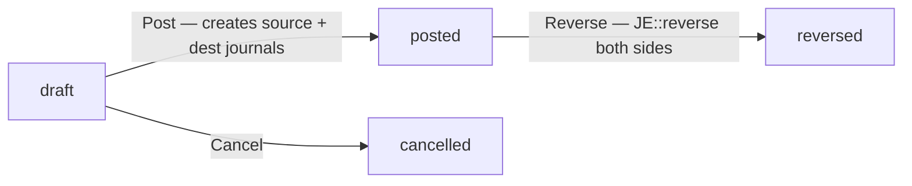
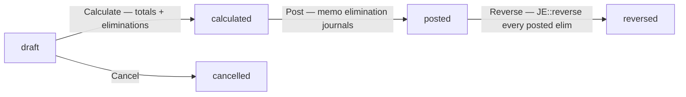
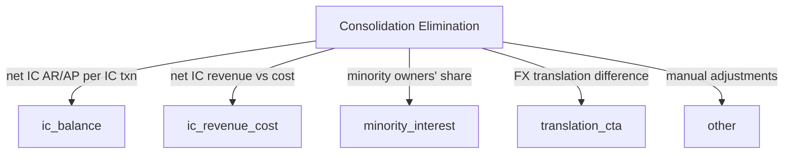

# Multi-Entity & Consolidation

Everything that moves money across legal-entity boundaries — and the period-end rollup that turns several LEs into one consolidated set of books.

> **Where do I begin?** Stand up your Legal Entities and per-LE Ledgers in [Framework & Setup](./framework.md#legal-entities) first, then create one [IC Relationship](#ic-relationships) per trading direction (A→B and B→A are two rows if both directions trade). Only then can you record [IC Transactions](#ic-transactions). At period-end, configure a [Consolidation Run](#consolidation-runs) that lists the base LE + child LEs and run calculate → post.

---

## Table of contents

1. [IC Relationships](#ic-relationships)
2. [IC Transactions](#ic-transactions)
3. [Consolidation Runs](#consolidation-runs)

---

## IC Relationships

### What it is

A **pairwise (from_le → to_le) configuration** that names the IC Receivable (AR) combination on the source LE's books and the IC Payable (AP) combination on the dest LE's books. Every IC transaction in that direction is journaled against these two combinations. The relationship row also carries default payment terms + currency that pre-fill the IC transaction form.

> **Example:** Parent LE `ACME-US` regularly sells inventory to subsidiary `ACME-MX`. You create one relationship row: `from_legal_entity_id = ACME-US`, `to_legal_entity_id = ACME-MX`, `ic_receivable_combination_id = 1130 — IC AR — ACME-MX`, `ic_payable_combination_id = 2230 — IC AP — ACME-US`. If ACME-MX ever sells back to ACME-US, you create a second row with the directions reversed and *different* AR/AP combinations.

### How records get created

| Method | When |
|---|---|
| UI — `/erp/multi-entity/relationships` → New | The default path. Finance lead defines the pair after the two LEs and their AR/AP combinations are set up. |
| API (`POST /erp/multi-entity/relationships`) | Bulk import or fixture seeding. |

### Worked example — a three-LE group's relationship matrix

A group with parent `ACME-US` and subsidiaries `ACME-MX`, `ACME-CA`, where every LE trades with every other LE, needs **six** relationship rows (one per directed edge):

| From | To | IC AR (on From) | IC AP (on To) |
|---|---|---|---|
| ACME-US | ACME-MX | 1131 — IC AR — ACME-MX | 2231 — IC AP — ACME-US |
| ACME-MX | ACME-US | 1132 — IC AR — ACME-US | 2232 — IC AP — ACME-MX |
| ACME-US | ACME-CA | 1133 — IC AR — ACME-CA | 2233 — IC AP — ACME-US |
| ACME-CA | ACME-US | 1134 — IC AR — ACME-US | 2234 — IC AP — ACME-CA |
| ACME-MX | ACME-CA | 1135 — IC AR — ACME-CA | 2235 — IC AP — ACME-MX |
| ACME-CA | ACME-MX | 1136 — IC AR — ACME-MX | 2236 — IC AP — ACME-CA |

If a direction never trades, omit that row. The UNIQUE on `(tenant, from, to)` makes it safe to leave gaps — adding the row later when that direction first trades is non-disruptive.

### Fields

| Field | Required | Notes |
|---|---|---|
| From Legal Entity | Yes | The LE that books the IC Receivable side. Must exist in the tenant. |
| To Legal Entity | Yes | The LE that books the IC Payable side. Must differ from `from_legal_entity_id` (controller rejects same-LE with 422). |
| IC Receivable Combination | Yes | The DR side on the source ledger's IC journal. Typically maps to a `1130 IC AR — <to_le>` account. |
| IC Payable Combination | Yes | The CR side on the dest ledger's IC journal. Typically maps to a `2230 IC AP — <from_le>` account. |
| Default Payment Terms | Optional | Pre-fills the IC transaction form. |
| Default Currency | Optional | 3-letter ISO, upper-cased and truncated to 3 chars on save. Pre-fills IC transactions; falls back to `USD`. |
| Is Active | Default `1` | Inactive relationships are rejected at IC transaction post (`Relationship is inactive`). Inactive relationships cannot be picked when creating a new IC transaction. |
| Notes | Optional | Free-text, 500 chars. |

### Uniqueness

`UNIQUE (tenant_id, from_legal_entity_id, to_legal_entity_id)`. A second create for the same direction returns 422 *An IC relationship for that direction already exists.* A→B and B→A are distinct rows.

### Actions

- **List** — filter by `from_legal_entity_id`, `to_legal_entity_id`, or `is_active`. Sorted by from-LE name, then to-LE name. The list view enriches each row with `from_le_name`, `to_le_name`, `from_le_currency`, `to_le_currency`, `ic_receivable_code`, and `ic_payable_code` via LEFT JOINs so the table is human-readable without a second fetch.
- **Create / Edit** — manager role required (`super_admin`, `admin`, `manager`). Edits cover combination IDs, payment terms, currency, active flag, notes. The from/to LE columns are *not* editable — flipping the direction means delete + recreate (and any historical IC txns on the old direction remain pinned to the old row).
- **Delete** — blocked when any `inter_company_transactions` row references this relationship: throws `RuntimeException` → 422 *Cannot delete relationship — IC transactions reference it.* Pause via `is_active = 0` instead.

### Gotchas

- **One direction per row.** A→B and B→A are *two* relationship rows with *different* AR/AP combinations. The IC Receivable on A→B is not the same combination as on B→A; each direction needs its own ledger account.
- **Inactivating is not retroactive.** Posted IC transactions referencing an inactive relationship remain posted. The flag only blocks new posts — the post() service explicitly checks `is_active` and refuses with *Inter-company relationship is inactive.* Edits to AR/AP combinations on an active relationship apply to *new* IC transactions only; historical journals continue to reference the combinations the post() call resolved at the time.
- **Same-LE pairs are rejected at create.** The controller short-circuits with 422 *from and to legal entities must differ* — there's no scenario where an LE owes itself.
- **Combinations are not validated as the right account type.** The controller checks the combinations exist in the tenant but does not assert they're AR vs AP. Mis-assigning a revenue combination as `ic_receivable_combination_id` will post — the error surfaces at trial-balance review, not at create. The IC AR account should be a current-asset natural; the IC AP account should be a current-liability natural. The COA convention is to name them `IC AR — <counterparty LE name>` and `IC AP — <counterparty LE name>` so consolidation auditors can trace each one back to its pair.
- **`default_currency` does not pin the IC txn currency.** A relationship configured with `default_currency = USD` pre-fills the IC transaction form, but the operator can override at create. Once posted, the journal's currency is whatever the IC txn row carried, not the relationship's default.
- **Foreign-key enforcement is partial.** The migration carries FKs from `inter_company_relationships.tenant_id` but combinations are referenced by id only without a tenant-scoped FK. The controller's `AccountCombination::find` check at create time is the line of defense; do not bypass it with direct INSERTs.

---

## IC Transactions

### What it is

The header for **one balanced cross-LE posting**. Post creates two journal entries (one on source LE's ledger, one on dest LE's ledger) inside a single database transaction, so a failure on either side rolls back both. The IC transaction row stores `source_journal_id` + `dest_journal_id` pointers at post time and carries its own lifecycle so you can reverse the pair atomically.

> **Example:** ACME-US ships $50,000 of inventory to ACME-MX on 2026-06-04. Operator creates IC-1-0042 referencing the ACME-US→ACME-MX relationship, amount = 50000.00, currency = USD, `source_credit_combination_id = 4100 — Inventory Out`, `dest_debit_combination_id = 1410 — Inventory In`. On post:
> - **Source journal (ACME-US ledger):** DR `1130 IC AR — ACME-MX` 50000 / CR `4100 Inventory Out` 50000
> - **Dest journal (ACME-MX ledger):** DR `1410 Inventory In` 50000 / CR `2230 IC AP — ACME-US` 50000

### How records get created

| Method | When |
|---|---|
| UI — `/erp/multi-entity/transactions` → New | The default path. Pick a relationship → form pre-fills source/dest LE + currency. |
| API (`POST /erp/multi-entity/transactions`) | Integration: e.g. shipping app emits an IC txn when goods cross an LE boundary. |

The controller resolves `source_ledger_id` / `dest_ledger_id` from each LE's primary active ledger at create time (`SELECT id FROM ledgers WHERE tenant_id = ? AND legal_entity_id = ? AND is_active = 1 ORDER BY id LIMIT 1`) and snapshots them onto the row. Posting later asserts each ledger still belongs to the matching LE — see Gotchas.

### IC Number

`IC-{tenantId}-{NNNN}` — auto-generated, 4-digit zero-padded, monotonic per tenant via `MAX(SUBSTRING_INDEX(ic_number,'-',-1))`. Custom `ic_number` overrides on import are accepted but a collision returns 422 *An IC transaction with that number already exists.*

### Fields

| Field | Required | Notes |
|---|---|---|
| IC Number | Auto | See above. Override allowed but UNIQUE per tenant. |
| Relationship | Yes | Must exist and be active. Source/dest LE + ledger IDs are derived from this. |
| Transaction Date | Default today | Inherits to both journal entries' `entry_date` and (later) `posting_date`. |
| Source LE / Dest LE | Auto (from relationship) | Stored on the row for audit; defended at post time. |
| Source Ledger / Dest Ledger | Auto (resolved) | Primary active ledger per LE. Post asserts `ledger.legal_entity_id == source_le_id` (and same for dest). |
| Source Credit Combination | Yes | The CR side of the *source* journal (typically revenue / inventory-out / receivable contra). Validated to belong to tenant at create. |
| Dest Debit Combination | Yes | The DR side of the *dest* journal (typically expense / inventory-in). Validated to belong to tenant at create. |
| Amount | Yes | Stored as `decimal(20,4)`. Must be > 0 at post (`> 0.0001`). |
| Currency | Default from relationship → `USD` | 3-letter ISO. |
| Exchange Rate | Default `1.0000000000` | Snapshotted onto both journals so consolidation totals translate at the same rate the IC pair posted at. |
| Description / Notes | Optional | Description flows into both journal entries' description (suffixed `(source)` / `(dest)`). |
| Reversal Of | Auto | Pointer when this row was created as a reversal of another. |

### Lifecycle



- `draft → posted`: CAS-guarded — both `source_journal_id` and `dest_journal_id` are stamped in the same UPDATE that flips the status. A second post() call after a successful first one returns 422 *Only draft transactions can be posted (status='posted').*
- `posted → reversed`: each journal goes through `JournalEntryService::reverse` (creates a contra journal entry). The original IC row's `reversed_at` / `reversed_by` are stamped; no new IC row is created — the audit lives on the original row.
- `draft → cancelled`: terminal. Only draft can be cancelled (`Only draft transactions can be cancelled`).

### Actions

- **List / filter** — by `status`, `relationship_id`, or `source_le_id`. Sorted by `transaction_date DESC, id DESC`.
- **Create** — picks a relationship → resolves LEs + ledgers + IC AR/AP from the relationship.
- **Edit** — only while `draft` (controller refuses with 422 once posted). Editable fields: `transaction_date`, `amount`, `currency`, `exchange_rate`, `description`, `notes`.
- **Post** — creates the two balanced journals (`source_type = 'inter_company'`, `source_id = ic_txn_id`), posts each through `JournalEntryService::post`, CAS to `posted` with both `journal_id` pointers.
- **Reverse** — only `posted` can be reversed; needs both journal IDs present, otherwise 422 *IC transaction has no posted journals to reverse.*
- **Cancel** — only `draft` can be cancelled.
- **Delete** — only `draft` or `cancelled` can be deleted (posted/reversed are immutable history).

### Gotchas

- **Two journals, one transaction.** The post() service wraps both `JournalEntryService::create` + `post` calls in a single DB transaction. A failure halfway (e.g. the dest combination is on a frozen ledger) rolls both back — you never end up with the source journal posted and the dest one missing.
- **Ledger ↔ LE consistency is re-checked at post.** The controller resolves ledgers at create, but post() *re-asserts* `srcLedger.legal_entity_id == source_le_id` (and dest), throwing `IC source_ledger_id does not belong to source_le_id.` if a row drifted. This defends against direct-DB tampering or a future update path that lets ledgers move LEs.
- **Combination IDs are tenant-scoped at create.** Before the B5 review pass, an invalid `source_credit_combination_id` survived create and only surfaced as a confusing error inside `JournalEntryService::post` at IC-post time. The controller now calls `AccountCombination::find` for both combinations and returns 422 up front.
- **`source_type = 'inter_company'` must be in the JournalEntry allowlist.** Before the B5 review pass, `JournalEntry::SOURCE_TYPES` was missing several values (`payroll_run`, `work_order`, `inter_company`, `bank_transaction`, `asset_retirement`) and silently coerced them to `'manual'`, breaking sub-ledger trace-back. The allowlist now matches the full ENUM declared on the table.
- **Exchange rate is snapshotted at post, not at consolidation.** Consolidation totals translate each posted journal line using the rate stamped on that journal — so an IC pair posted at 18.50 MXN/USD continues to convert at 18.50 even if consolidation runs months later. This is intentional (matches "period-end rate at post") and adequate for v1.
- **Reverse creates contras, not a new IC row.** Unlike some sub-ledgers, IC reverse does *not* spawn a sibling `reversal_of_id` row in `inter_company_transactions`. The reversal lives entirely on the journal entries; the original IC row carries `reversed_at` / `reversed_by` stamps. (The `reversal_of_id` column on `inter_company_transactions` exists for future use but is not populated by the current `InterCompanyService::reverse`.)
- **Reversed IC transactions still appear in the period's IC list for elimination matching.** They net to zero at consolidation because the underlying journals self-cancel — but the audit trail is preserved on both runs.
- **Amount precision.** Stored as `decimal(20,4)` and rounded to 4 places on insert. Sub-cent rounding (e.g. 0.00005) is dropped. The post check is `> 0.0001`, so a 0.0000-rounded amount fails *Inter-company amount must be > 0.* Use a manual journal for negative-amount adjustments — IC txns are unsigned.
- **Currency must match across the pair.** Both journals are posted in the IC txn's currency. There's no per-side currency override — you can't post the source side in USD and the dest side in MXN. If the two LEs operate in different ledger currencies, the receiving LE's ledger absorbs the currency mismatch via its ledger-default `exchange_rate` snapshot; consolidation later translates via the same rate.
- **`exchange_rate` is per-IC-txn, not pulled from a rate table.** The operator enters it (or accepts the default `1.0`). If your tenant maintains a daily FX rate table, the UI can pre-fill from there, but the IC txn itself is the system of record for that rate — consolidation will use whatever was stamped.
- **Delete vs cancel.** `Delete` is destructive (removes the row); `cancel` is a status change that preserves the row + audit trail. Operators in doubt should cancel and only delete cancelled rows when housekeeping requires it. Posted/reversed rows cannot be deleted at all (controller returns 422).
- **A failed post leaves the IC txn in `draft`.** The wrapping DB transaction rolls back on any error — including a journal-line validation failure deep inside `JournalEntryService`. The operator sees the error message; the row is safe to retry once the underlying issue (e.g. wrong combination, frozen period) is fixed.

### Common scenarios

**Inventory shipment parent → subsidiary.** Parent ships goods worth $50,000 to subsidiary. `source_credit_combination_id` = parent's `Inventory Out` / `Cost of Goods Transferred`. `dest_debit_combination_id` = subsidiary's `Inventory In`. On post, parent's books: DR IC AR / CR Inventory; subsidiary's books: DR Inventory / CR IC AP. At month-end consolidation, the IC AR/AP eliminates; the inventory increase on subsidiary nets against the decrease on parent → group balance unchanged.

**Service fee subsidiary → parent.** Subsidiary bills parent $12,000 for shared-services work. `source_credit_combination_id` (on subsidiary) = `Service Revenue — IC`. `dest_debit_combination_id` (on parent) = `Service Expense — IC`. Eliminations at consolidation: an `ic_revenue_cost` row nets the revenue / cost pair (this elimination type is reserved in the calculator today; operators add it manually as a row of type `ic_revenue_cost` via API).

**Cash transfer parent → subsidiary capital injection.** Parent transfers $1M to fund subsidiary expansion. `source_credit_combination_id` = parent's `Cash`. `dest_debit_combination_id` = subsidiary's `Cash`. The IC AR/AP eliminates; cash totals on both sides offset, so consolidated cash is unchanged (the cash didn't leave the group). The investment vs equity elimination (parent's "Investment in Subsidiary" vs subsidiary's "Share Capital") is a separate `minority_interest`-or-`other`-type elimination an operator would book manually at consolidation.

**Reversing a wrong IC txn.** IC-1-0042 posted at $50,000 should have been $45,000. *Do not edit* — once posted, the only fix is reverse + repost: reverse IC-1-0042 (status → reversed, contra journals created on both ledgers, net effect on each LE = $0), then create a new IC-1-0043 at $45,000 and post. Both rows remain in audit; trial balance nets to the correct $45,000.

---

## Consolidation Runs

### What it is

A **period-end roll-up** of multiple legal entities into a single base LE, in a single base currency, with **eliminations** that zero out intra-group balances so they don't double-count. Every IC AR on the source LE's books has a matching IC AP on the dest LE's books; eliminations net them to zero at the consolidated view. A run carries totals (assets / liabilities / equity / revenue / expense + CTA) computed during calculate and persists elimination rows that *optionally* post as memo journals at post time.

> **Example:** Parent `ACME-US` and subsidiaries `ACME-MX`, `ACME-CA` each ran the May 2026 period close. Group finance creates `CON-1-0007` "May 2026 Group", `base_le_id = ACME-US`, `base_currency = USD`, `child_le_ids = [ACME-MX, ACME-CA]`, `cta_combination_id = 3910 — CTA`. Running calculate:
> - Sums posted journal lines across all three LEs per natural account type → `total_assets = $12.4M, total_liabilities = $4.1M, total_equity = $8.3M, total_revenue = $9.2M, total_expense = $7.8M`.
> - Finds 18 posted IC transactions whose `transaction_date` fell in the May period and whose source AND dest LE are both in the child list → emits 18 `ic_balance` elimination rows.
> - Detects ACME-MX's MXN ledger ≠ USD base → emits a `translation_cta` marker row + logs an `AppLogger::warning` because the v1 placeholder cannot compute the FX delta.
> - CAS draft → calculated.

> **Why eliminations matter (worked through):** Without elimination, the consolidated trial balance would carry **both** the $50,000 IC AR on ACME-US's books (asset) **and** the $50,000 IC AP on ACME-MX's books (liability) for the same inventory shipment. From the group's perspective, neither exists — the parent doesn't owe itself. The `ic_balance` elimination row tells the consolidated view "net these to zero." The same logic applies to IC revenue/cost (parent's IC sales = subsidiary's IC purchases; the group sees neither).

### How records get created

| Method | When |
|---|---|
| UI — `/erp/multi-entity/consolidation-runs` → New | The default path. Finance lead picks period + base LE + child LEs. |
| API (`POST /erp/multi-entity/consolidation-runs`) | Period-close automation can trigger this. |

### Run Number

`CON-{tenantId}-{NNNN}` — auto-generated, 4-digit zero-padded, monotonic per tenant. Custom `run_number` overrides on import are accepted; collision returns 422 *A consolidation run with that number already exists* (narrowed to MySQL errno 1062 so FK/NOT-NULL constraint violations surface as 500).

### Fields

| Field | Required | Notes |
|---|---|---|
| Run Number | Auto | See above. |
| Name | Yes | Human-readable label, 150 chars. |
| Period | Yes | Anchors the date range — calculate sums journal lines whose `posting_date BETWEEN period.start_date AND period.end_date` AND IC transactions whose `transaction_date BETWEEN ...`. |
| As-of Date | Default today | Used as the entry_date on posted elimination journals. |
| Base LE | Yes | Must exist in the tenant. Elimination journals post to this LE's primary active ledger. |
| Base Currency | Yes | 3-letter ISO. All totals stored in this currency; non-base-CCY child LE journals translate via each journal's snapshotted `exchange_rate`. |
| Child LE IDs | Optional JSON array | Stored as `child_le_ids_json` (TEXT). The base LE is *always* added to the resolved set even if not listed — so single-LE "self-consolidation" works. |
| CTA Combination | Optional | The equity combination where Cumulative Translation Adjustment lands. Required for multi-currency runs to post a meaningful CTA elimination. |
| Status | Default `draft` | See lifecycle. |
| Totals (`total_*`) | Auto on calculate | `decimal(20,4)`. Set via the allowlisted `transitionStatus` extras path; you can't write them directly. |
| CTA Amount | Auto on calculate | Currently always `0.0000` in v1; the placeholder marker elimination row carries the "manual CTA required" signal. |
| Notes | Optional | Free-text, 500 chars. |

### Lifecycle



- `draft → calculated`: clears any prior elimination rows (`deleteForRun`), computes the 5-bucket totals + IC eliminations + CTA marker, persists eliminations, and stamps `total_*` + `cta_amount` via the CAS UPDATE. A second calculate() requires you to drop back to draft first (or — more typical — delete the run and start over).
- `calculated → posted`: walks `consolidation_eliminations`, posts a memo-style balanced journal for each row that has a `source_combination_id` AND non-zero amount AND no `journal_id` yet. Calc-only rows (CTA placeholder, zero-amount) are skipped with counted reasons.
- `posted → reversed`: reverses every posted elimination journal via `JournalEntryService::reverse`. Elimination rows keep their `journal_id` pointer (now pointing at a reversed entry) for audit.
- `draft → cancelled`: terminal.

### Eliminations — types



The ENUM is asserted on insert: `ConsolidationElimination::create` throws `InvalidArgumentException` for any value outside `{ic_balance, ic_revenue_cost, minority_interest, translation_cta, other}` rather than silently downgrading to `'other'`. Every caller is an internal service, so an unknown value is a code bug — surfacing it loudly catches it at write time.

What the calculator generates today:

| Type | When |
|---|---|
| `ic_balance` | One row per posted IC transaction whose `transaction_date` falls in the period AND whose source AND dest LE are both in the child list. The row stores the IC `amount` + `currency`, points `source_combination_id` at the relationship's `ic_receivable_combination_id`, and captures `from_le_id` / `to_le_id`. |
| `translation_cta` | One row when *any* child LE's ledger currency differs from `base_currency`. Currently always carries `amount = 0` and `description = 'CTA REQUIRED (multi-currency LEs detected; v1 placeholder — manual CTA needed)'` + `notes = 'cta_required=true'`. The calculator also writes an `AppLogger::warning` so operators see the gap in logs even if they only skim the UI. |
| `ic_revenue_cost`, `minority_interest` | Reserved — the ENUM accepts them and the post() path knows how to journal them, but the calculator does not auto-detect them yet. Operators can write them manually via API/import. |
| `other` | Catch-all for manual adjustments inserted by an integration. |

### Actions

- **List / filter** — by `status`, `period_id`, or `base_le_id`. Sorted by `as_of_date DESC, id DESC`.
- **Show** — returns the run with its eliminations + resolved `child_le_ids`. (Round-3 review fix: `show()` was issuing two queries — once for the run, once for `loadWithChildren`; it's now a single `ConsolidationService::loadWithChildren` call.)
- **Create** — pick name, period, base LE + currency, child LE list (JSON array), optional CTA combo. Validates period_id + base_le_id exist in tenant.
- **Edit** — only while `draft`. Editable fields: `name`, `as_of_date`, `base_currency`, `cta_combination_id`, `child_le_ids` (replaces the JSON wholesale), `notes`.
- **Calculate** — service path; CAS draft→calculated. Wrapped in a DB transaction so a failure mid-calc leaves no half-written elimination rows.
- **Post** — service path; CAS calculated→posted. Audit emits `posted_eliminations`, `skipped_already_posted`, `skipped_no_source_combo`, `skipped_zero_amount` counters. Both `skipped_no_source_combo > 0` and `skipped_zero_amount > 0` trigger `AppLogger::warning` so operators notice unexpected gaps (a CTA combo not configured, or a real IC pair that surprisingly netted to zero).
- **Reverse** — service path; CAS posted→reversed. Audit emits `reversed`, `skipped_unposted`, `skipped_already_reversed`, `orphan_journal_pointers` counters. An orphan (journal_id present but the journal row is missing or cross-tenant) writes an `AppLogger::error` — that's a data-corruption signal, not a normal skip.
- **Cancel** — only `draft` can be cancelled.
- **Delete** — only `draft` or `cancelled` can be deleted. Delete cascades the elimination rows in the same DB transaction.

### What calculate actually computes

1. **Resolve child LE list.** Reads `child_le_ids_json`; **corrupt JSON throws** rather than silently consolidating just the base LE — that would be a Sev-1 wrong-result bug. The base LE is always included in the resolved set.
2. **Per-account-type rollup.** One query joins `journal_lines → journal_entries → ledgers → account_combinations`, filters to `je.status='posted'` AND `posting_date BETWEEN period.start_date AND period.end_date` AND `l.legal_entity_id IN child_list`, groups by `ac.cached_account_type` and sums `(jl.debit - jl.credit) * je.exchange_rate`. The `exchange_rate` factor is what makes a foreign-currency journal translate to base; it was snapshotted on the journal at post time.
3. **IC elimination scan.** Posted IC transactions whose `transaction_date` is in the period AND whose `source_le_id` AND `dest_le_id` are both in the child list → one `ic_balance` row each.
4. **CTA detection.** Queries `DISTINCT ledger.currency` across child LE ledgers; if any non-base-CCY ledger exists, persists the placeholder + logs the warning. The full FX engine (period-end rate lookup, B/S vs P&L translation rules, CTA reconciliation) is a Tier C extension.
5. **CAS draft → calculated** stamps `total_assets/liabilities/equity/revenue/expense + cta_amount + calculated_at/by`.

### What post actually journalizes

For each elimination row that's not already posted, has a non-zero amount, and has a `source_combination_id`, post writes a memo-style balanced journal in the base LE's primary active ledger:

```
DR source_combination_id   |amount|
CR source_combination_id              |amount|
```

— same combination on both sides. This is intentional: the *consolidated* effect comes from removing both sides of the IC pair from the LE-level rollup. The memo journal makes the elimination visible in the trial-balance audit (`source_type = 'elimination'`, `source_id = run_id`). A richer implementation would resolve the counterpart from the IC relationship; that's a Tier C extension.

Post then `Database::update`s the `journal_id` back onto the elimination row. **If that UPDATE affects zero rows (tenant drift or the row vanished mid-txn), post throws** — without this check a future post() call would see no `journal_id`, re-post, and produce duplicate GL entries.

### Gotchas

- **Calculate is not idempotent — it clears prior eliminations.** A re-calculate (which today requires dropping back to draft first) wipes the existing `consolidation_eliminations` rows for the run via `deleteForRun` before re-emitting. Any manual `'other'`-type rows an operator added through the API will be lost. Workflow: edit at draft, calculate, review the elimination list, then post — don't edit eliminations and re-calculate.
- **The base LE is auto-added to `child_le_ids`.** Even if you forget to list it, `resolveChildLeIds` injects it. A pure self-consolidation (base only, no children) is supported but produces no IC eliminations (the scan short-circuits when child count < 2).
- **Corrupt `child_le_ids_json` throws loudly.** Before the fix, JSON parse failure silently fell back to `[]` and the run consolidated only the base LE — a Sev-1 wrong-result class. `resolveChildLeIds` now logs an error AND throws *Consolidation run #N has corrupt child_le_ids_json — cannot calculate.*
- **Multi-currency CTA is a placeholder.** v1 detects non-base-CCY ledgers and writes a marker elimination row + a warning to logs, but `cta_amount` stays at 0 and there's no auto-computed FX delta. Operators with multi-currency LEs must either manually book a CTA journal in the base LE OR write an `'other'`-type elimination via API/import before post. The marker row is calc-only (no `source_combination_id` if `cta_combination_id` is null) so post skips it cleanly.
- **`translation_cta` post is a self-balancing memo entry.** Same as IC eliminations — DR/CR the same combination. The real translation effect must come from the journal-line-level `exchange_rate` snapshot OR a manual CTA journal; the elimination row is documentation only.
- **Post() skip counters surface in audit + warnings.** Round-3 + round-4 review pass split a single "continue" into four distinct counters: `posted`, `skipped_already_posted`, `skipped_no_source_combo`, `skipped_zero_amount`. `skipped_no_source_combo > 0` warn-logs because it means the CTA combo isn't configured. `skipped_zero_amount > 0` warn-logs because a real IC pair unexpectedly netting to zero deserves a second look.
- **Reverse() splits three skip conditions.** The post-close sweep collapsed an early version's three branches (`journal_id == null`, journal row missing, journal not posted) into one `continue`. They're now `skipped_unposted` / `skipped_already_reversed` / `orphan_journal_pointers` — and orphans write an `AppLogger::error` because a missing journal that the elim row points at is a data-corruption signal, not a normal skip.
- **Reversed eliminations keep their journal_id pointer.** After reverse, the elimination row's `journal_id` points at a `reversed`-status journal entry (which itself has a `reversal_journal_id` pointing at the contra). An auditor walking the chain sees: elim row → original journal → contra journal. Do not zero out the pointer on reverse — the audit trail depends on it.
- **`consolidation_eliminations` is cascade-deleted with the run.** `ConsolidationRun::delete` wraps the elim-delete + run-delete in one transaction so a partial delete can't orphan the elims. Only `draft` / `cancelled` runs can be deleted in the first place, so posted runs (and their journals) are safe.
- **Calculate's per-account-type roll-up reads `ac.cached_account_type`.** That column is denormalised from the natural account onto the combination at create time; if a tenant has stale combinations whose cached_account_type was never backfilled, the row falls into the `'asset'` default bucket. Re-run the combination-cache migration if your equity totals look short.
- **Period boundaries are inclusive on both ends.** `posting_date BETWEEN period.start_date AND period.end_date` AND `transaction_date BETWEEN ...` both use SQL `BETWEEN`, which is inclusive. A journal posted on the last day of the period is included; one posted on day-after is not. Match this to your closing-entry policy.
- **Single-LE runs are legal but produce no IC eliminations.** A run where `child_le_ids = []` (resolves to just the base LE) is supported — useful for re-running an LE's stand-alone totals in a single source of truth. The IC elimination scan short-circuits with *nothing to eliminate across* when `count(childLeIds) < 2`. CTA is also bypassed when the base LE's ledger currency equals `base_currency`.
- **Posted runs don't lock the period.** Other modules can still post journals into the period after a consolidation run has been calculated/posted. Re-running consolidation requires deleting the existing run (only `draft` / `cancelled` are deletable, so a posted run must be reversed first, then the operator creates a *new* run for the same period). This is a deliberate ordering: posted-and-reversed history is preserved per audit-trail rules.
- **The base LE's primary active ledger is resolved at post.** `SELECT id FROM ledgers WHERE tenant_id = ? AND legal_entity_id = ? AND is_active = 1 ORDER BY id LIMIT 1` — lowest id wins. If you maintain multiple active ledgers per LE (rare; usually one operating, optionally one statutory), put the consolidation-target ledger first by id, or expect surprises.
- **Elimination journals are dated `as_of_date`, not period end.** The memo journals use the run's `as_of_date` as `entry_date`. If `as_of_date` differs from `period.end_date` (e.g. a delayed close where you set as-of to the last business day), trial-balance queries that group by date will see eliminations on a different day than the underlying activity. Setting `as_of_date = period.end_date` is the typical convention.
- **`reversal_of_id` is unused on `consolidation_runs`.** There's no column with that name on the run — reversal just stamps `reversed_at` / `reversed_by`. The `journal_entries.reversal_journal_id` pointer on each elimination journal is what an auditor uses to walk to the contra entry.
- **Sub-cent rounding policy.** Totals and CTA stamp via `round(...,4)`. The summed `(jl.debit - jl.credit) * je.exchange_rate` from the totals query can accumulate sub-penny noise; the round at write time is the truncation point. If a tenant requires sub-cent precision (rare), the column type would have to change — `decimal(20,4)` is the hard limit.
- **`source_type = 'elimination'` is on the JournalEntry allowlist.** Same B5 review fix as `'inter_company'`. A tenant on a pre-fix schema would see elimination journals coerce to `'manual'` and lose the reverse linkage. If you see manual-typed journals in audit where you expect elimination-typed, check the migration version.

### Common scenarios

**Single-currency three-LE close.** Parent + two subs all on USD. Operator creates the run with `base_currency = USD`, `child_le_ids = [sub_a_id, sub_b_id]`, no CTA combo needed. Calculate sums all three LEs' posted activity in May, finds the eight IC transactions that crossed LE boundaries that month, emits eight `ic_balance` rows, CTA detection sees all-USD ledgers and emits no marker. Post writes eight memo elimination journals on the parent's ledger; the consolidated trial balance is correct.

**Multi-currency close requiring manual CTA.** Parent on USD; one sub on MXN, one on CAD. Calculate detects multi-currency LEs and emits a `translation_cta` marker row with `amount = 0` + `description = 'CTA REQUIRED ...'`. Operator reads the warning, computes the proper CTA externally (or via a Tier C extension), and either: (a) edits the marker elimination's `amount` + `source_combination_id` via API before post, or (b) deletes the marker via API and inserts a fresh `'other'`-type elimination with the computed amount, or (c) posts the run (the marker skips because of missing `source_combination_id`) and then books a manual CTA journal on the parent's ledger after the fact. Path (a) is the cleanest audit story.

**Restating a posted run.** Auditor finds that the May run missed three IC transactions because they were posted on June 1 with a `transaction_date` of May 31 *but* posted after the May calculate ran. Operator reverses the May run (status → reversed, all eight elimination journals get contras), deletes is *not* allowed for reversed runs, so the operator creates a new run `CON-1-0008` "May 2026 Group v2", same period, calculates → finds all eleven IC pairs (eight original + three late), posts. Audit trail shows both runs.

**Catching a wrong-base-currency mistake.** Operator accidentally creates a run with `base_currency = EUR` on a USD-functional group. Calculate runs successfully (all summations multiply by snapshotted `exchange_rate`, so the numbers are mechanically valid but in EUR units). Before posting, the operator notices the wrong totals, cancels the run, deletes it (`draft` → `cancelled` → delete), and creates a new run with `base_currency = USD`. The cancel + delete path is safe because no elimination journals were posted yet.

---

## Review-pass history (defence-in-depth fixes)

This section's models + services have been through multiple cross-sprint reviews. The defences below are what those passes added; understanding them helps when the audit log surfaces a counter you weren't expecting.

### B5 review fixes (Sev-2 class)

- **JournalEntry source_type allowlist gap.** `JournalEntry::SOURCE_TYPES` was missing `payroll_run`, `work_order`, `inter_company`, `bank_transaction`, `asset_retirement`. Calls with those values silently coerced to `'manual'`, breaking sub-ledger trace-back. The allowlist now matches the full table ENUM, so an `inter_company` post() stamps the IC txn id correctly into `journal_entries.source_id`.
- **CTA placeholder visibility.** `ConsolidationService::computeCta` returns a `manual_required` flag when multi-currency LEs are detected; `calculate` then persists a marker `translation_cta` elimination row + writes `AppLogger::warning`. Before the fix, multi-currency runs silently consolidated with `cta_amount = 0` and operators had no signal that the v1 FX engine couldn't compute it.
- **`source_ledger_id` ↔ `source_le_id` consistency.** `InterCompanyService::post` asserts each ledger's `legal_entity_id` matches the IC txn's `source_le_id` / `dest_le_id`. Without this, a row whose `source_ledger_id` had drifted (direct-DB tampering, future update path) could post the IC AR debit into an unrelated LE's ledger.
- **Combination ID validation at IC txn create.** `InterCompanyTransactionsController::store` validates `source_credit_combination_id` + `dest_debit_combination_id` belong to the tenant up front (was previously deferred to post-time, producing a confusing inner-service error).
- **ConsolidationElimination silent downgrade.** `ConsolidationElimination::create` throws `InvalidArgumentException` on unknown `elimination_type` instead of coercing to `'other'`. Every caller is internal, so an unknown value is a code bug — surfacing it at write time catches it during dev.
- **ConsolidationService::post skip counts.** Tracks `skipped_already_posted`, `skipped_no_source_combo`, `skipped_zero_amount` in audit metadata. `skipped_no_source_combo > 0` warn-logs (the CTA combo likely isn't configured).
- **ConsolidationRunsController::show duplicate query.** Was issuing `ConsolidationRun::find` + `ConsolidationService::loadWithChildren`. Reduced to a single `loadWithChildren` call; saves one DB roundtrip per show.

### Post-close review sweep (Sev-2 class)

- **ConsolidationService::post skipped zero-amount eliminations silently.** Added `AppLogger::warning` when `skippedZero > 0` so a real IC pair that unexpectedly netted to zero gets flagged for operator review.
- **ConsolidationService::reverse collapsed three skip conditions into one continue.** Split into `skipped_unposted` (no `journal_id` — calc-only row), `skipped_already_reversed` (journal status ≠ `posted`), and `orphan_journal_pointers` (journal row missing or cross-tenant — data-corruption signal). Orphans warn-log via `AppLogger::error`; audit emits all four counters.

### Round-3 review (Sev-1 class — related context)

- **NULL-safe UNIQUE on `consolidation_eliminations`** (defence against duplicate elimination rows when `source_combination_id` is NULL for CTA placeholders) — see migration `setup/erp_v43.sql` if a tenant ever shows duplicate CTA markers.

---

## API quick reference

All endpoints require the `Authorization: Bearer <token>` header and `manage` role (`super_admin`, `admin`, `manager`) for write actions. Read actions accept any authenticated user.

### IC Relationships

| Method | Path | Body / Params | Returns |
|---|---|---|---|
| GET | `/erp/multi-entity/relationships` | query: `from_legal_entity_id`, `to_legal_entity_id`, `is_active` | array, enriched with LE + combination codes |
| GET | `/erp/multi-entity/relationships/:id` | — | single row |
| POST | `/erp/multi-entity/relationships` | `from_legal_entity_id`, `to_legal_entity_id`, `ic_receivable_combination_id`, `ic_payable_combination_id`, optional `default_payment_terms_id`, `default_currency`, `is_active`, `notes` | created row, 201 |
| PATCH | `/erp/multi-entity/relationships/:id` | any of `ic_receivable_combination_id`, `ic_payable_combination_id`, `default_payment_terms_id`, `default_currency`, `is_active`, `notes` | updated row |
| DELETE | `/erp/multi-entity/relationships/:id` | — | `{id}`; 422 if any IC txn references the row |

### IC Transactions

| Method | Path | Body / Params | Returns |
|---|---|---|---|
| GET | `/erp/multi-entity/transactions` | query: `status`, `relationship_id`, `source_le_id` | array, enriched with LE names + journal numbers |
| GET | `/erp/multi-entity/transactions/:id` | — | single row |
| POST | `/erp/multi-entity/transactions` | `relationship_id`, `amount`, `source_credit_combination_id`, `dest_debit_combination_id`, optional `transaction_date`, `currency`, `exchange_rate`, `description`, `notes` | created row (status=draft), 201 |
| PATCH | `/erp/multi-entity/transactions/:id` | any of `transaction_date`, `amount`, `currency`, `exchange_rate`, `description`, `notes` | updated row; 422 if not draft |
| DELETE | `/erp/multi-entity/transactions/:id` | — | `{id}`; 422 unless draft / cancelled |
| POST | `/erp/multi-entity/transactions/:id/post` | — | row (status=posted) + stamped journal IDs |
| POST | `/erp/multi-entity/transactions/:id/reverse` | — | row (status=reversed); contra journals created |
| POST | `/erp/multi-entity/transactions/:id/cancel` | — | row (status=cancelled) |

### Consolidation Runs

| Method | Path | Body / Params | Returns |
|---|---|---|---|
| GET | `/erp/multi-entity/consolidation-runs` | query: `status`, `period_id`, `base_le_id` | array, enriched with LE + period names |
| GET | `/erp/multi-entity/consolidation-runs/:id` | — | run + `eliminations` array + resolved `child_le_ids` |
| POST | `/erp/multi-entity/consolidation-runs` | `name`, `period_id`, `base_le_id`, `base_currency`, optional `as_of_date`, `child_le_ids` (array), `cta_combination_id`, `notes` | created row (status=draft), 201 |
| PATCH | `/erp/multi-entity/consolidation-runs/:id` | any of `name`, `as_of_date`, `base_currency`, `cta_combination_id`, `child_le_ids`, `notes` | updated row; 422 if not draft |
| DELETE | `/erp/multi-entity/consolidation-runs/:id` | — | `{id}`; 422 unless draft / cancelled |
| POST | `/erp/multi-entity/consolidation-runs/:id/calculate` | — | run with totals + eliminations |
| POST | `/erp/multi-entity/consolidation-runs/:id/post` | — | run with posted eliminations |
| POST | `/erp/multi-entity/consolidation-runs/:id/reverse` | — | run with reversed eliminations |
| POST | `/erp/multi-entity/consolidation-runs/:id/cancel` | — | run (status=cancelled) |

All write actions audit-log via `AuditService::log`. Failures: 422 for state-machine violations and validation errors, 500 for unexpected exceptions (logged with class + file + line via `AppLogger::error`).

---

## Permissions

Manager role (`super_admin`, `admin`, `manager`) is required for every write action on every screen in this module. Read actions accept any authenticated user. This is enforced by `requireManage()` on each controller; there is no per-LE permission split today — an admin on the tenant can create relationships and post IC transactions touching any LE in the tenant. If your group needs LE-scoped permission (e.g. ACME-MX finance can only post IC txns where source=MX), that's a Tier C extension to the auth layer.

## Audit trail

Every action emits an `AuditService::log` entry. The action names are:

| Surface | Actions |
|---|---|
| IC Relationships | `created`, `updated`, `deleted` (entity = `inter_company_relationship`) |
| IC Transactions | `created`, `updated`, `deleted`, `posted`, `reversed`, `cancelled` (entity = `inter_company_transaction`) |
| Service-layer IC | `inter_company.post`, `inter_company.reverse`, `inter_company.cancel` — with `{source_journal_id, dest_journal_id, amount, currency}` metadata on post |
| Consolidation Runs | `created`, `updated`, `deleted`, `calculated`, `posted`, `reversed`, `cancelled` (entity = `consolidation_run`) |
| Service-layer consolidation | `consolidation.calculate` (`{eliminations, cta}`), `consolidation.post` (`{posted_eliminations, skipped_already_posted, skipped_no_source_combo, skipped_zero_amount}`), `consolidation.reverse` (`{reversed, skipped_unposted, skipped_already_reversed, orphan_journal_pointers}`), `consolidation.cancel` |

Audit failures themselves never block the action — `safeAudit` wraps the call in try/catch and routes failures to `AppLogger::error` so the main transaction still commits. If you can't find an audit entry for an action you know succeeded, check `storage/logs/app.log` for an "audit log failed" line.

## Cross-references

- **Framework** — [Legal Entities](./framework.md#legal-entities) and [Ledgers](./framework.md#ledgers) are the prerequisites for every screen in this section. Each LE must have at least one active ledger before it can participate in an IC transaction or a consolidation.
- **GL** — IC transactions post via the [Journal Entries](./gl.md#journal-entries) sub-ledger (`source_type = 'inter_company'`, `source_id = ic_txn_id`); consolidation eliminations post as `source_type = 'elimination'`, `source_id = run_id`. See the [Journal Entries deep-dive](./deep-dives/journal-entries.md) for the create + post + reverse mechanics this section calls into.
- **Finance / Master Data** — [Account Combinations](./finance.md#account-combinations) drive the IC AR/AP combos on the relationship and the CTA combo on the run.
- **Reports** — the consolidated trial balance and group P&L (planned in `reports.md`) read from `consolidation_runs.total_*` and the underlying journal lines minus the posted elimination journals.
- **Audit** — every action here (`inter_company.post`, `inter_company.reverse`, `inter_company.cancel`, `consolidation.calculate`, `consolidation.post`, `consolidation.reverse`, `consolidation.cancel`) writes an `AuditService::log` entry with skip-counter metadata where applicable.
