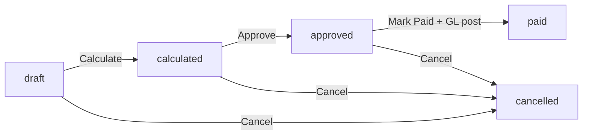
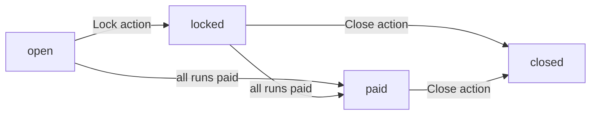
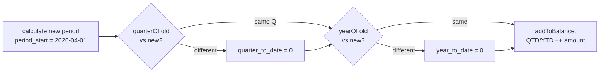
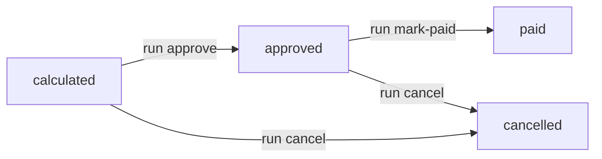

# Payroll

Everything that turns a roster of employees into payslips, posts net pay to the GL, and keeps period-to-date / quarter-to-date / year-to-date balances honest across quarter and year boundaries.

> **Where do I begin?** Build the calculation library before you build a run. Define [Classifications](#classifications) (or use the seeded standard set), then [Formulas](#formulas) (safe-expression library), then [Elements](#elements) (Basic, HRA, PF, TDS, etc.). Once the library is in place, attach values per employee on [Element Entries](#element-entries), open a [Pay Period](#pay-periods), and create a [Payroll Run](#payroll-runs) against it — `calculate` reads the library, writes a payslip per active employee, and stages totals for `approve` → `markPaid` → GL post.

---

## Table of contents

1. [Payroll Runs](#payroll-runs) *(see deep-dive: [payroll-runs.md](./deep-dives/payroll-runs.md))*
2. [Pay Periods](#pay-periods)
3. [Elements](#elements)
4. [Classifications](#classifications)
5. [Formulas](#formulas)
6. [Element Entries](#element-entries)
7. [Balances](#balances)
8. [Payslips](#payslips)

---

## Payroll Runs

### What it is

A **payroll run** owns a set of payslips for one [Pay Period](#pay-periods). It walks every active employee in scope, evaluates each element via its calculation type, writes a payslip, rolls balances, and (once approved + marked paid) posts a balanced journal entry to the GL via the sub-ledger.

> **Example:** Run `PR-1-0007` for pay period `2026-05` covers 24 employees. Manager hits **Calculate** → 24 payslips appear with gross/deductions/net per employee, totals `41,820.00 / 6,273.00 / 35,547.00 USD`. After review, **Approve** moves it to `approved`. Finance hits **Mark Paid** → the run flips to `paid`, a journal entry is auto-posted with DR Salary Expense $41,820 + DR Tax Expense (employer charges) / CR Bank $35,547 + CR PF/TDS payables $6,273, and `payroll_runs.journal_id` is stamped with the new journal id.

### How records get created

| Method | When |
|---|---|
| UI — `/erp/payroll/runs` New Run | The default path. Pick a pay period (status `open` or `locked`), give the run a name, optionally pick a bank account + currency. |
| API — `POST /erp/payroll/runs` | Integrations that schedule runs from an external HR rhythm. |
| Auto-numbered | `run_number` defaults to `PR-{tenant_id}-{nnnn}` (zero-padded, monotonic per tenant) — `nextRunNumber()` reads `MAX(...)` then bumps. The store endpoint retries once on UNIQUE collision before failing 422. |

### Fields

| Field | Source | Notes |
|---|---|---|
| Run Number | Auto / manual | UNIQUE per tenant. Manual numbers refuse duplicates. |
| Pay Period | Required | Must be in status `open` or `locked` at create time. |
| Name | Required | Free-text (e.g. "May 2026 Cycle"). |
| Currency | Default `USD` | Uppercased on write. |
| Bank Account | Optional | If set, threaded into the GL post as the credit account for net pay. |
| Status | Lifecycle | `draft` / `calculated` / `approved` / `paid` / `cancelled` — see below. |
| Total Gross / Deductions / Net | Auto on calculate | Sum of the corresponding fields across all payslips in this run. |
| Employee Count | Auto on calculate | Number of payslips actually written (employees with at least one non-zero element). |
| Calculated / Approved / Paid At + By | Auto on transition | Stamped by `transitionStatus`. |
| Journal Id | Auto on `markPaid` | FK to `journal_entries.id` — null if the tenant has no `payroll_run` sub-ledger template configured. |
| Notes | Optional | Free-text. |

### Lifecycle



Every transition is **CAS-guarded** at the SQL level — the UPDATE matches `status IN (allowedFrom)` and returns 0 rows if a concurrent caller already moved the run. The service throws "Run changed state during …" rather than overwriting a later state. `paid` and `cancelled` are terminal; a paid run cannot be cancelled (see `cancel()`).

**Calculate** further holds a row lock — `findForUpdate()` issues `SELECT ... FOR UPDATE`, so two concurrent calculate calls on the same run serialize cleanly rather than racing on the payslip write.

### Calculation algorithm

For every active employee in scope (see [scope filter](#active-employee-scope-on-calculate)), the service iterates active elements in `classification.processing_order` ascending order. For each element it resolves the per-employee value from `employee_element_entries` (or skips if no entry exists for the period_end), then computes the amount according to the element's `calculation_type`:

| `calculation_type` | How the amount resolves |
|---|---|
| `flat` | `amount = entry.amount_or_percent`. |
| `percent_of` | `amount = base × (entry.amount_or_percent / 100)` where `base` is the value of the element identified by `percent_of_element_code` **on the same payslip**. The base must have been computed earlier — `processing_order` is what guarantees BASIC runs before HRA / PF. |
| `formula` | `amount = PayrollFormulaService::evaluate(formula_id, inputs)` with `inputs = {ALL_PRIOR_ELEMENT_CODES_ON_THIS_PAYSLIP, ENTRY = entry.amount_or_percent}`. See [Formulas](#formulas). |
| `table_lookup` | Reserved — refuses with "not yet supported in v1." |

Amounts with `abs(value) < 0.0001` are dropped silently (zero-out an element by leaving its entry inactive — don't pollute the payslip with rounding noise).

Classification routing decides whether each amount touches gross or deductions:

- `earning` → `gross_pay += amount`
- `pre_tax_deduction` / `post_tax_deduction` / `tax` **and** `classification.affects_net = 1` → `total_deductions += amount`
- `employer_charge`, `informational` → tracked on the payslip's `data_json` line but **do not** affect employee net.

`net_pay = round(gross_pay - total_deductions, 4)`.

The full audit trail (every element evaluated, its calculation type, the source — `flat` / `percent_of` with base + percent / `formula` with formula_id, and the resolved amount) is written to `payslips.data_json` so an auditor can reconstruct any payslip line by line.

### Active-employee scope on calculate

`calculate()` only includes a person if:

```sql
persons.status            = 'active'
persons.person_type       IN ('employee','contingent')
assignments.status        = 'active'
assignments.hire_date    <= pay_period.period_end
(assignments.termination_date IS NULL OR assignments.termination_date >= pay_period.period_start)
```

Mid-period hires and terminations both land in the run as long as the assignment window overlaps the period. Pro-rata for the partial window is **not** handled automatically — author a formula element that reads workdays from `ENTRY` if you need it.

### Actions

- **List** — `/erp/payroll/runs`, filter by pay_period or status. Lists join `pay_periods` and `journal_entries` so you can see the period code + linked journal entry number at a glance.
- **Show** — drill into a run to see its payslips (`payslips` array hydrated via `Payslip::listForRun`).
- **Create** — `POST /erp/payroll/runs` (manager role required).
- **Calculate** — `POST /erp/payroll/runs/{id}/calculate`. Only from `draft`. Throws 422 if the period is not `open`/`locked`. Wipes any pre-existing payslips on the run first.
- **Approve** — `POST /erp/payroll/runs/{id}/approve`. Only from `calculated`. Bulk-transitions every payslip to `approved` in the same transaction.
- **Mark Paid** — `POST /erp/payroll/runs/{id}/mark-paid`. Only from `approved`. Posts the GL journal **first**, then a single CAS transition flips `approved → paid` and writes `paid_at` / `paid_by` / `journal_id` atomically. The frontend wraps this in an explicit confirm dialog ("This posts to the GL and cannot be undone from the UI").
- **Cancel** — `POST /erp/payroll/runs/{id}/cancel`. From `draft` / `calculated` / `approved`. Bulk-cancels payslips in the same transaction. Refuses on `paid` or already-cancelled runs.
- **Delete** — `DELETE /erp/payroll/runs/{id}`. Only allowed when status is `draft` or `cancelled` (you must cancel first). Cascades to delete payslips.

### Gotchas

- **GL post happens BEFORE the CAS to `paid`.** This is the order on purpose — see [B3 review fixes](#payroll-runs-gotchas) below. If `SubLedgerPostingService::postFor` fails (closed accounting period, missing account on the template), the whole `markPaid` transaction rolls back and the run stays `approved`.
- **Sub-ledger template is opt-in.** If the tenant has no `payroll_run` event-type template configured, `markPaid` still succeeds — the run transitions to `paid`, `journal_id` stays NULL, no journal is created. Surface as a warning in audit if your tenant is supposed to post payroll to GL.
- **Re-calculate is destructive on payslips, not balances.** `Payslip::deleteForRun()` wipes the prior payslips before re-writing them, but `payroll_balances` carry forward — re-calculating the *same* draft run twice will double-count balances. Cancel + new draft if you need a clean recompute mid-period.
- **`run_number` collisions retry once.** When the auto-numbered `run_number` collides on UNIQUE (rare — two concurrent stores during the same `MAX(...)` window), the controller retries with a fresh `nextRunNumber()`. Manual run numbers do **not** retry.

### Payroll Runs gotchas — B3 review fixes {#payroll-runs-gotchas}

Four Sev-1 race / state-corruption bugs shipped in the B3 review pass — listed here because the fix shape is non-obvious and affects every operator-facing action:

- **`PayPeriod::close` would orphan live runs.** Close formerly only checked the period status; child runs in `draft`/`calculated`/`approved` would survive a close, but `markPaid` checks the run status (not the period state) and would eventually move them to `paid`, leaving them stuck against a closed period. Close now refuses with 422 if any child run is not in `paid`/`cancelled`. See [Pay Periods → Gotchas](#pay-periods-gotchas).
- **`markPaid` double-stamped `paid_at` and could drop `journal_id`.** The earlier implementation called `transitionStatus(approved → paid)` first and then a *second* update to write `journal_id`. A concurrent caller could win the second update and overwrite the stamp, or — worse — silently drop the journal link. Refactored to a single CAS transition that takes `journal_id` via an allow-listed `$extra` map (`transitionStatus` only accepts `journal_id` there — anything else throws). The GL post happens *before* the CAS so its id is available; failure rolls back the whole `markPaid` transaction.
- **`cancel()` was non-transactional.** The run transition and the payslip bulk-transition were two separate SQL statements with no transaction. A concurrent `markPaid` between the two could leave the run cancelled but payslips paid. Both are now wrapped in one transaction.
- **`PayrollBalance` QTD/YTD never reset across boundaries.** Calculate added to QTD/YTD on every period; without a roll-forward, Q1+Q2+Q3+Q4 would silently accumulate into a single "this quarter" total, and January of a new year would inherit December's YTD. `PayrollBalance::rollForwardForEmployee` is now called before adding — it reads each balance's `last_period_id`, compares quarter and calendar year against the new period's `period_start`, and zeroes `quarter_to_date` and/or `year_to_date` when the boundary crosses. See [Balances](#balances).

---

## Pay Periods

### What it is

A **pay period** is the date window a payroll run calculates against. It carries `period_start` / `period_end` (the work window) and `pay_date` (when employees actually get paid — used as the GL entry date on `markPaid`).

> **Example:** Period `2026-05` runs `period_start=2026-05-01 / period_end=2026-05-31 / pay_date=2026-06-05`, frequency `monthly`. Status starts `open`. The first run on the period is created; period stays `open` until manager hits **Lock** (no new runs after that, but existing draft runs still calculate). Once the last run on the period is `paid`, the service transitions the period to `paid`. Finance reviews and hits **Close** → terminal status.

### How records get created

| Method | When |
|---|---|
| UI — `/erp/payroll/pay-periods` New Period | The default path. Manager defines the next pay window. |
| API — `POST /erp/payroll/pay-periods` | Bulk-create the whole year up front from a template. |

### Fields

| Field | Required | Notes |
|---|---|---|
| Code | Yes | UNIQUE per tenant (e.g. `2026-05`, `2026-W22`). |
| Name | Yes | Free-text label. |
| Frequency | Default `monthly` | One of `monthly` / `semi_monthly` / `weekly` / `biweekly`. |
| Period Start / End | Yes | `period_end >= period_start` (refused 422 otherwise). |
| Pay Date | Yes | Used as `entry_date` on the GL journal at `markPaid`. |
| Status | Lifecycle | See below. |
| Notes | Optional | |

### Lifecycle



- `open` — runs can be created against it.
- `locked` — no new runs. Existing draft runs can still calculate / approve / pay.
- `paid` — the period rolls to `paid` once every run on it is in `paid` status.
- `closed` — terminal. The **Close** action requires every child run to be in `paid` or `cancelled` and the period itself to be in `locked` or `paid` (CAS-guarded — `transitionStatus(['paid','locked'], 'closed')`).

### Actions

- **List / Show** — `/erp/payroll/pay-periods` and `/erp/payroll/pay-periods/{id}`.
- **Create** — `POST /erp/payroll/pay-periods` (manager role required).
- **Update** — `PUT /erp/payroll/pay-periods/{id}`. **Date fields (period_start / period_end / pay_date / frequency) freeze** as soon as the period leaves `open` OR any payroll_run exists on it. Other fields (name, code, notes) remain editable.
- **Lock** — `POST /erp/payroll/pay-periods/{id}/lock`. CAS `open → locked`.
- **Close** — `POST /erp/payroll/pay-periods/{id}/close`. Refuses with 422 if any child run is still `draft` / `calculated` / `approved`; otherwise CAS `(paid|locked) → closed`.
- **Delete** — `DELETE /erp/payroll/pay-periods/{id}`. Only allowed in status `open` and only if no payroll_runs exist on the period.

### Pay Periods gotchas

- **Close gate (Sev-1 fix).** Close formerly looked only at the period status. If you locked a period, then created a draft run, then closed it — the draft run was orphaned (you couldn't calculate against a closed period, and you couldn't open it back up). The fix: `close` now refuses with 422 listing the live-run count, and a separate `cancel` step on each run is required first.
- **Date freeze (Sev-2 fix).** Once a run exists on the period, mutating `period_start`/`period_end` would silently invalidate every previously-calculated payslip — the run's `data_json` carries `pay_period_code` and the active-employee filter uses the period dates. The update endpoint surfaces 422 with the actual reason (status not open OR runs exist).
- **`status` is service-managed.** The plain `update` endpoint does not mutate status — go through Lock / Close, or let the run lifecycle promote it to `paid` automatically when the last run pays. There is no "re-open" action; a closed period is terminal.

---

## Elements

### What it is

An **element** is one salary component — Basic Pay, HRA, PF, TDS, Provident Fund Employer Contribution, etc. Each element belongs to a [Classification](#classifications) (which drives net-pay routing) and picks one of the four calculation types.

> **Example — Indian payroll skeleton (6 elements):**
> - `BASIC` — classification `EARNINGS` (order 10), `calculation_type = flat`
> - `HRA` — classification `EARNINGS` (order 20), `calculation_type = percent_of`, `percent_of_element_code = BASIC`
> - `PF_EMP` — classification `PRE_TAX_DED` (order 100), `calculation_type = percent_of`, `percent_of_element_code = BASIC`
> - `TDS` — classification `TAX` (order 200), `calculation_type = formula`, `formula_id = (TDS_SLAB)`
> - `PF_ER` — classification `EMPLOYER_CHARGE` (order 300), `calculation_type = percent_of`, `percent_of_element_code = BASIC`
> - `LOP_DAYS` — classification `INFORMATIONAL` (order 999), `calculation_type = flat`

### How records get created

| Method | When |
|---|---|
| UI — `/erp/payroll/elements` New Element | The default path. |
| API — `POST /erp/payroll/elements` | Tenant onboarding from a template. |

### Fields

| Field | Required | Notes |
|---|---|---|
| Code | Yes | UNIQUE per tenant. **Convention** (not insert-validated): match `/^[A-Z][A-Z0-9_]*$/` — codes become formula variable names. The formula evaluator's tokenizer enforces the pattern at run time; a lowercase or hyphenated code inserts cleanly but throws inside `PayrollFormulaService` on first use. See Gotchas. |
| Name | Yes | Free-text display label. |
| Description | Optional | |
| Classification | Yes | FK to `payroll_element_classifications`. Determines the type (`earning` / `pre_tax_deduction` / ...), `processing_order`, and `affects_net`. |
| Calculation Type | Default `flat` | One of `flat` / `percent_of` / `formula` / `table_lookup`. |
| Formula | Required when `calculation_type = formula` | FK to `payroll_formulas`. |
| Percent Of Element Code | Required when `calculation_type = percent_of` | The element code (text, not FK) whose payslip-resolved value is the base. |
| GL Account Combination | Optional | The GL account this element posts to via the `payroll_run` sub-ledger template. |
| Is Recurring | Default `true` | Informational — recurring vs one-off classification. |
| Is Active | Default `true` | Inactive elements are skipped by `listActiveOrdered()` even if entries exist. |

### Actions

- **List / Show** — `/erp/payroll/elements`. List joins `payroll_element_classifications` so `classification_type`, `processing_order`, and `balance_category` are returned on each row.
- **Create / Update / Delete** — manager-role guarded. Create-time validation refuses 422 if `calculation_type = formula` and `formula_id` is empty (or vice versa for `percent_of` + `percent_of_element_code`).
- **Delete protection** — refuses 422 if any `employee_element_entries` row references the element. Set `is_active = 0` instead to retire an element while preserving its historical entries.

### Gotchas

- **Element code is the variable name in formulas.** `BASIC * 0.4` inside a formula resolves `BASIC` by looking up the resolved value of the element with code `BASIC` on the same payslip. The `/^[A-Z][A-Z0-9_]*$/` regex (enforced by the formula evaluator's tokenizer) is what guarantees no spaces, lowercase, or special characters can leak into the tokenizer.
- **`percent_of` is text, not a FK.** `percent_of_element_code` is a `VARCHAR(40)` carrying the *code* of another element, not its `id`. The runtime resolves the base by code lookup on the same payslip; if the base hasn't been computed yet (wrong `processing_order`), the run throws "references base 'BASIC' which hasn't been computed yet (check processing_order)." Re-order classifications, don't reorder elements.
- **`table_lookup` is reserved.** Refuses with 422 at calculation time — author a formula instead.
- **No automatic pro-rata.** Mid-period hires/terminations get the full element value. Build a formula that scales by workdays if your statutory model requires it.

---

## Classifications

### What it is

A **classification** is the bucket an element falls in: earning, deduction, tax, employer charge, or informational. Classifications drive three things at calculation time:

1. **Processing order** — `processing_order` ascending = compute order. Earnings before deductions before taxes before employer charges.
2. **Net-pay routing** — the `type` decides whether the amount adds to gross or to deductions (and `affects_net` is an extra gate so an `informational` line can be carried on the payslip without touching net).
3. **Balance category** — `balance_category` is the canonical bucket for balance rollups (`gross` / `deductions` / `net` / etc.) — used by reports, not the calculator itself.

> **Example — standard seeded set (tenant 1, seeded by `erp_v28.sql`):**
> | Code | Type | Processing Order | Affects Net | Balance Category |
> |---|---|---|---|---|
> | `EARNINGS` | earning | 10 | 1 | gross |
> | `PRE_TAX_DED` | pre_tax_deduction | 100 | 1 | deductions |
> | `TAX` | tax | 200 | 1 | deductions |
> | `POST_TAX_DED` | post_tax_deduction | 300 | 1 | deductions |
> | `EMPLOYER_CHARGE` | employer_charge | 500 | 0 | employer |
> | `INFORMATIONAL` | informational | 999 | 0 | gross |

### How records get created

| Method | When |
|---|---|
| Seed | The default set is seeded for tenant 1 via `erp_v28.sql`. |
| UI — `/erp/payroll/classifications` New | Other tenants (and edge cases on tenant 1) build their own. |
| API — `POST /erp/payroll/classifications` | |

### Fields

| Field | Required | Notes |
|---|---|---|
| Code | Yes | UNIQUE per tenant. |
| Name | Yes | Display label. |
| Type | Yes | One of `earning` / `pre_tax_deduction` / `post_tax_deduction` / `tax` / `employer_charge` / `informational`. |
| Affects Net | Default `1` | Set to `0` to keep an `informational` line off net pay. |
| Taxable | Default `0` | Informational — flagged for reports/integrations, not used by the calculator. |
| Balance Category | Default `gross` | Free-text bucket for reports. |
| Processing Order | Default `100` | Lower = earlier. |
| Is Active | Default `true` | Inactive classifications hide their elements from `listActiveOrdered()`. |

### Actions

- **List / Show / Create / Update / Delete** — standard CRUD, manager role required.
- **Delete protection** — refuses 422 if any `payroll_elements` references the classification. Set `is_active = 0` to retire instead.

### Gotchas

- **`processing_order` is what makes `percent_of` work.** If you create HRA (percent_of BASIC) under a classification with a *lower* `processing_order` than BASIC's classification, HRA runs first, BASIC isn't yet resolved, and calculate throws. The seeded `EARNINGS = 10` puts every earning under one bucket where order is stable.
- **`affects_net` is independent of `type`.** A `tax` classification with `affects_net = 0` would track tax for reporting without deducting from net pay — used for representational ("employer paid this tax for you") lines.
- **Type is mutable.** You can flip `EARNINGS` from `earning` to `informational`. The next calculate will route every BASIC line out of gross and into the payslip's informational section. There is no historical migration — old payslips keep their snapshot in `data_json`.

---

## Formulas

### What it is

A **formula** is a stored, safe-to-evaluate arithmetic expression — the engine for any element whose value is too dynamic for `flat` or `percent_of` (slab-rate tax, salary-cap deductions, complex prorations). The expression is **never** `eval()`'d — it's tokenized, parsed by a hand-rolled recursive-descent grammar, and evaluated to a float.

> **Example — a 5%/10%/20% slab TDS formula:**
> ```
> code:               TDS_SLAB
> name:               TDS slab (simplified India)
> formula_type:       basic_arithmetic
> inputs_json:        ["BASIC","HRA"]
> formula_expression: if(BASIC + HRA > 50000,
>                        (BASIC + HRA) * 0.20,
>                        if(BASIC + HRA > 25000,
>                           (BASIC + HRA) * 0.10,
>                           (BASIC + HRA) * 0.05))
> ```
> Wire it to element `TDS` (`calculation_type = formula`, `formula_id = TDS_SLAB.id`). At calculate time, the runtime passes `{BASIC, HRA, ENTRY}` as inputs and the result becomes the line amount.

### How records get created

| Method | When |
|---|---|
| UI — `/erp/payroll/formulas` New Formula | The default path. |
| API — `POST /erp/payroll/formulas` | |
| Validation dry-run | **Every create / update is dry-evaluated up-front** with each declared variable set to 0. The temporary formula is inserted inside a rollback-only transaction, evaluated, then the transaction is always rolled back — so syntax errors / disallowed characters / undeclared variable references surface at save time, not during a payroll run. |

### Fields

| Field | Required | Notes |
|---|---|---|
| Code | Yes | UNIQUE per tenant. |
| Name | Yes | Display label. |
| Description | Optional | |
| Formula Type | Default `basic_arithmetic` | `basic_arithmetic` is the only type supported in v1 — `table_lookup` and `custom` are reserved. |
| Formula Expression | Yes | TEXT. The expression itself. Allowed tokens: numbers, declared identifiers, `+ - * / ( )`, whitelisted functions (`max`, `min`, `round`, `abs`, `if`, `floor`, `ceil`), comparison operators (`< <= > >= == !=`) — only valid inside `if(...)`. |
| Inputs (JSON) | Yes | Declares the variable names the expression may reference. Stored as `inputs_json` LONGTEXT — either a list of strings or a list of `{name: ..., ...}` objects. **Reserved built-in: `ENTRY` is auto-declared** by the evaluator — formulas can reference it without listing it in inputs. |
| Is Active | Default `true` | Inactive formulas refuse evaluation with 422. |

### Allowed expression surface

| Allowed | Not allowed |
|---|---|
| Decimal / integer literals (`0`, `5`, `0.05`, `.5`) | Strings, dates, NULL |
| Identifiers `[A-Z][A-Z0-9_]*` declared in `inputs_json` or `ENTRY` | Any non-declared identifier (refused at tokenization) |
| `+ - * /` (with unary `+/-`) | `%`, `^`, `**`, bitwise operators |
| `( )` grouping | `[ ]`, `{ }` |
| `max`, `min`, `round`, `abs`, `if(cond, then, else)`, `floor`, `ceil` | Anything else (refused as "Unknown function") |
| `< <= > >= == !=` between two simple operands inside `if(...)` only | Comparisons outside `if()` or with grouped sub-expressions |
| Whitespace | `$`, backtick, `;`, `#`, `--`, `'`, `"` and every other character (rejected at tokenizer) |

### Evaluation pipeline

```mermaid
flowchart LR
    L[load formula by id] --> A[active check]
    A --> T[basic_arithmetic type check]
    T --> S[sanitize inputs:<br/>uppercase keys, finite floats]
    S --> N[INF / NaN guard:<br/>reject 1e400, 0.0/0.0]
    N --> E[auto-declare ENTRY]
    E --> K[tokenize:<br/>whitelist chars, whitelist names]
    K --> C[lower comparisons:<br/>simple-operand only]
    C --> P[recursive-descent parse +<br/>evaluate to float]
    P --> F[finite-result guard]
    F --> R[return value + trace]
```



The `trace` (returned alongside `value`) includes the original `expression`, the sanitised `inputs`, and the final `result` — surfaced into payslip `data_json` so an operator can answer "why did TDS come out as 5,213.40?" without grepping logs.

### Actions

- **List / Show / Create / Update / Delete** — standard CRUD, manager role required. Delete refuses 422 if any element references the formula.
- **Test** — `POST /erp/payroll/formulas/{id}/test` with `{"inputs": {"BASIC": 50000, "HRA": 20000}}` returns `{value, trace}`. **No DB writes** — used to dry-run a formula against ad-hoc numbers before wiring it to an element.

### Gotchas — Formulas (B3 Sev-2 hardening)

- **`INF` / `NaN` are refused at the door.** Sanitisation rejects any input that is not numeric and not finite (`is_finite` check). A formula that would emit `1e400` (which PHP folds to `INF`), or `0.0 / 0.0` (`NaN`), would corrupt `payroll_balances` and refuse to write to a `DECIMAL` MySQL column. The result is checked the same way on the way out.
- **`ENTRY` is reserved.** Don't declare `ENTRY` in `inputs_json` — the evaluator auto-declares it and the runtime injects `entry.amount_or_percent` as its value. Useful when an element's entry magnitude (e.g. headcount, hours, days) is the formula's primary input.
- **Parser errors are wrapped with the formula code.** When the parser throws "Unexpected token at end of expression", the service rewraps it as `Formula 'TDS_SLAB': Unexpected token at end of expression` so an operator can identify the failing formula without parsing log lines.
- **Division by zero is refused.** `abs(divisor) < 1e-12` is the threshold — the parser throws "Division by zero in formula." with the formula code prepended.
- **Comparison operators only support simple operands.** `BASIC > 0` works. `(BASIC * 2) > 0` does **not** — the v1 lower-comparisons pass requires both sides of the `cmp` to be already-reduced `num` / `var` tokens. Refactor with `if(BASIC > 0, BASIC * 2, 0)` instead.
- **Disallowed characters are a hard reject.** Any character outside `A-Z a-z 0-9 _ \s . + - * / ( , ) < > = !` aborts tokenization with the offending character JSON-encoded. This is the defense against `$` / backtick / comment markers / quotes ever reaching `eval()`-shaped territory.

---

## Element Entries

### What it is

Per-employee value for one payroll element, **effective-dated**. The same employee can have multiple entries for the same element across time — `activeForPeriod()` picks the latest entry whose `[effective_from, effective_to]` window covers the period_end.

> **Example:** Employee Priya (person_id 47) has two entries for element `BASIC`:
> - `2025-04-01 → 2026-03-31`, amount `45,000.00`
> - `2026-04-01 → NULL`, amount `52,500.00`
>
> Calculating the May 2026 run (`period_end = 2026-05-31`) picks the second entry (52,500). Calculating a retro Feb 2026 run (`period_end = 2026-02-28`) picks the first (45,000). The same row carries `amount_or_percent` whether the element is `flat` (absolute amount) or `percent_of` (the percentage figure).

### How records get created

| Method | When |
|---|---|
| UI — `/erp/payroll/element-entries` filtered by employee | Per-employee setup screen. |
| API — `POST /erp/payroll/element-entries` | Bulk-load from a CSV or an HR system. |
| Inline on the HR person screen | (Planned — currently entries are managed only from the payroll screen.) |

### Fields

| Field | Required | Notes |
|---|---|---|
| Employee Person | Yes | FK to `persons.id`. Refused 422 if the person doesn't exist for the tenant. |
| Element | Yes | FK to `payroll_elements.id`. Refused 422 on invalid id. |
| Amount Or Percent | Yes | The magnitude. Interpretation depends on the element's `calculation_type`. Rounded to 4 decimals. |
| Effective From | Yes | The first period_end this entry applies to. |
| Effective To | Optional | NULL = open-ended. |
| Notes | Optional | Free-text. |

### Actions

- **List for employee** — `GET /erp/payroll/element-entries?employee_person_id=47`.
- **Show / Create / Update / Delete** — standard CRUD, manager role required. There is no period freeze on entries — you can edit history at any time; future calculate calls will see the new value.

### Gotchas

- **Per-employee overrides the default.** Elements don't carry a default value — every employee who should receive an element needs an entry. An employee with no entry for `BASIC` will be skipped by calculate (`activeForPeriod` returns null → `continue`) and won't appear in the run at all if none of their elements resolve.
- **Effective-from is inclusive, effective-to is inclusive.** The SQL is `effective_from <= asOf AND (effective_to IS NULL OR effective_to >= asOf)`. Set `effective_to` to the **last** day the old value applies (e.g. `2026-03-31` for an April 1 raise).
- **Editing an entry doesn't recalculate.** Past payslips snapshot their resolved values into `data_json`. To restate a paid period, you'd need to cancel + create a corrective run — there is no automatic retropay engine in v1.
- **`amount_or_percent` carries both meanings.** Don't try to enter `40%` for a `percent_of` element — enter `40` (the runtime divides by 100). For a `flat` element, enter the absolute amount in the run's currency.

---

## Balances

### What it is

Running PTD / QTD / YTD totals per `(employee, balance_code)`. Read by reports (Form 16 / W-2-equivalents) and by reasonability checks. The calculator writes a fixed trio per payslip: `GROSS_PAY`, `TOTAL_DEDUCTIONS`, `NET_PAY` — extend in your tenant via custom queries.

### Schema highlights

| Column | Notes |
|---|---|
| `balance_code` | The bucket. Standard codes: `GROSS_PAY`, `TOTAL_DEDUCTIONS`, `NET_PAY`. |
| `period_to_date` | PTD — reset to 0 by `resetPtdForEmployee` on every calculate, then incremented by the payslip's amount. |
| `quarter_to_date` | QTD — incremented per payslip; reset to 0 by `rollForwardForEmployee` when the period's calendar quarter changes vs `last_period_id`'s. |
| `year_to_date` | YTD — same shape as QTD but reset on calendar-year change. |
| `last_period_id` | FK to `pay_periods.id` — the period that last touched this balance. Used by `rollForwardForEmployee` to detect a boundary crossing. |
| audit columns | `created_at`, `updated_at`, `created_by`, `updated_by` — **added by `erp_v43.sql`** (the original schema shipped without them; balance corrections were un-investigable until v43). `last_updated` is left in place for backward compatibility. |

### How balances change

`addToBalance` is an atomic upsert (`INSERT ... ON DUPLICATE KEY UPDATE`) — two parallel calculate calls cannot both INSERT and lose one update. The service applies it once per payslip per balance_code:

```php
PayrollBalance::resetPtdForEmployee($tenantId, $employeeId);
PayrollBalance::rollForwardForEmployee($tenantId, $employeeId, $period['period_start']);
PayrollBalance::addToBalance($tenantId, $employeeId, 'GROSS_PAY',        $gross,      $payPeriodId);
PayrollBalance::addToBalance($tenantId, $employeeId, 'TOTAL_DEDUCTIONS', $deductions, $payPeriodId);
PayrollBalance::addToBalance($tenantId, $employeeId, 'NET_PAY',          $net,        $payPeriodId);
```

### Quarter / Year boundary handling (Sev-1 fix)



`rollForwardForEmployee` reads each balance's `last_period_id`, fetches that period's `period_start`, and compares `quarterOf` and `yearOf` against the new period's `period_start`. If they differ, the corresponding column is zeroed *before* the next `addToBalance` runs. Idempotent — calling it twice for the same period leaves balances unchanged (after the first call, `last_period_id` advances to *this* period, so the second call sees no boundary cross).

### Gotchas — Balances

- **The trio is fixed.** The service writes exactly `GROSS_PAY`, `TOTAL_DEDUCTIONS`, `NET_PAY`. Per-element balances (e.g. `BASIC_YTD`, `TDS_YTD`) are not written by the engine — query `payslips.data_json` and aggregate yourself, or extend the service.
- **Re-calculating a draft run double-counts balances.** PTD is reset every calculate, so PTD is safe. But QTD and YTD accumulate — if you calculate, then re-calculate the same draft run, QTD/YTD will be over-counted by one period. Cancel + create a new run if you need a clean recompute.
- **Roll-forward requires `last_period_id`.** A brand-new employee whose first run is Q2 will not get a Q1 → Q2 reset (because `last_period_id` is NULL on the first add). The first run on a new balance simply seeds the row at the period's totals — no harm done.

---

## Payslips

### What it is

One row per `(payroll_run, employee)`. Carries the resolved totals (`gross_pay`, `total_deductions`, `net_pay`) and the full audit trail in `data_json`.

### Lifecycle



Payslip status follows the payroll run via `Payslip::bulkTransitionStatus(run_id, [from_states], to_state)` inside the run's lifecycle transaction. There is no per-payslip action — operators act on the run, not the payslip.

### `data_json` audit trail

Each payslip carries a JSON blob like:

```json
{
  "employee_person_id": 47,
  "employee_name": "Priya Sharma",
  "pay_period_id": 12,
  "pay_period_code": "2026-05",
  "lines": [
    {
      "element_code": "BASIC",
      "element_name": "Basic Pay",
      "classification_type": "earning",
      "classification_code": "EARNINGS",
      "calculation_type": "flat",
      "amount": 52500.0000,
      "source": { "type": "flat" }
    },
    {
      "element_code": "HRA",
      "element_name": "House Rent Allowance",
      "classification_type": "earning",
      "classification_code": "EARNINGS",
      "calculation_type": "percent_of",
      "amount": 21000.0000,
      "source": { "type": "percent_of", "percent": 40, "base_element": "BASIC" }
    },
    {
      "element_code": "TDS",
      "element_name": "TDS",
      "classification_type": "tax",
      "classification_code": "TAX",
      "calculation_type": "formula",
      "amount": 14700.0000,
      "source": { "type": "formula", "formula_id": 8 }
    }
  ]
}
```

Auditors get full reconstruction: element + classification + calculation type + amount + source (flat / `percent_of` with base and rate / `formula` with formula_id). Re-running the formula against the same inputs reproduces the amount byte-for-byte.

### Gotchas

- **Payslips are immutable post-create.** There is no per-payslip edit endpoint. The only way the values change is to cancel the run + new draft + re-calculate.
- **`data_json` is the source of truth for line detail.** Don't try to back-derive lines from `payroll_balances` — only the trio is rolled up. Drill into the payslip itself.
- **`deleteForRun` is destructive on re-calculate.** `calculate()` calls it defensively before writing fresh payslips. If you've manually inspected a draft run's payslips, they will be gone after the next calculate.

---

## Cross-references

- **HR — Employees** — the active-employee scope on `calculate` reads `persons.status`, `person_type`, and `assignments.hire_date / termination_date / status`. See [HR → Persons](./hr.md#persons) and [HR → Assignments](./hr.md#assignments).
- **GL — Journal Entries** — `markPaid` posts a balanced journal via the `payroll_run` sub-ledger template. See [Journal Entries deep-dive](./deep-dives/journal-entries.md).
- **Cash & Bank** — the bank account on a payroll run drives the credit account of the GL post (net pay out). See [Cash & Bank → Bank Accounts](./cash-bank.md#bank-accounts).
- **Finance — Chart of Accounts** — every element optionally carries a `gl_account_combination_id` that the sub-ledger template can route per-line.
- **Reports** — Form 16 / W-2 / payslip PDFs read off `payroll_balances` + `payslips.data_json`. See [Reports & Dashboards](./reports.md).
- **Deep-dive** — full calc → approve → mark-paid flow including retropay, balances, and fast formula evaluation: [Payroll Runs deep-dive](./deep-dives/payroll-runs.md).
