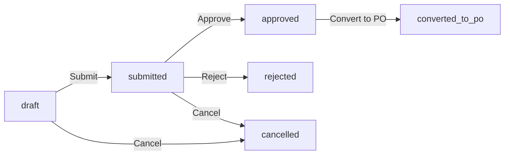
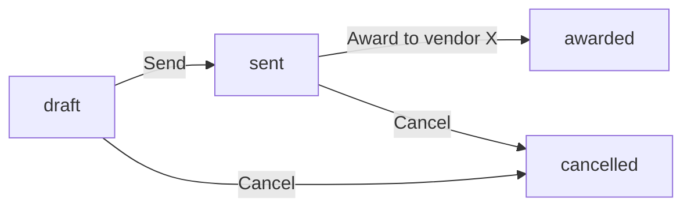
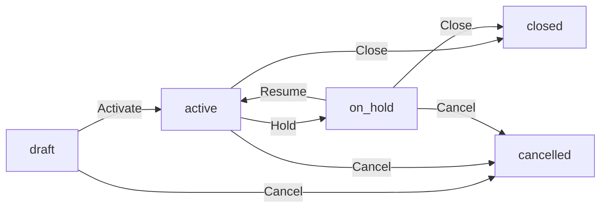
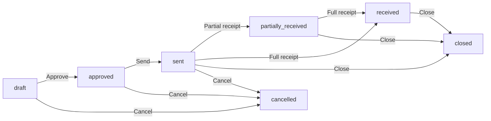
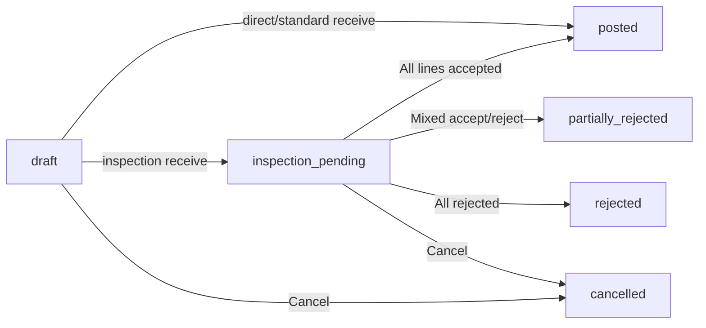
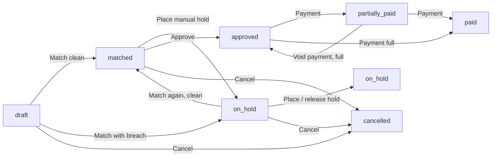
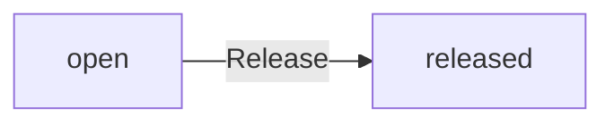
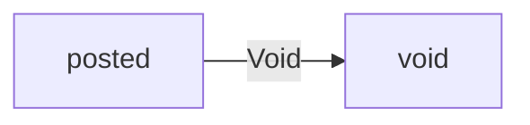
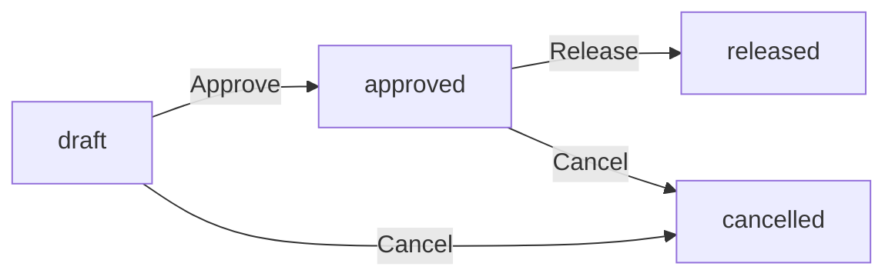

# Procurement (P2P)

Procure-to-Pay: from "someone in the warehouse needs widgets" through "the cheque has cleared." Vendor records live in the shared Companies master with `is_vendor = 1`; everything else on this page is procurement-owned.

> **Where do I begin?** Mark the supplier companies as vendors first (Companies screen, flip `is_vendor = 1`), pre-qualify them per item on the [Approved Supplier List](#approved-supplier-list-asl) so requesters get vendor suggestions, and seed at least one [Withholding Tax code](#withholding-tax-codes) + one [Pay Group](#pay-groups) so the disbursement screens have something to bind to. Once that's in place the flow is linear: [Requisition](#requisitions) → [PO](#purchase-orders) → [Goods Receipt](#goods-receipts) → [Vendor Bill](#vendor-bills) → [Payment Batch](#payment-batches) → [Vendor Payment](#vendor-payments).

---

## Table of contents

1. [Requisitions](#requisitions)
2. [Approved Supplier List (ASL)](#approved-supplier-list-asl)
3. [RFQs](#rfqs)
4. [Purchase Agreements](#purchase-agreements)
5. [Purchase Orders](#purchase-orders)
6. [Goods Receipts](#goods-receipts)
7. [Vendor Bills](#vendor-bills)
8. [Invoice Holds](#invoice-holds)
9. [Vendor Payments](#vendor-payments)
10. [Pay Groups](#pay-groups)
11. [Payment Batches](#payment-batches)
12. [Withholding Tax Codes](#withholding-tax-codes)
13. [Purchase Returns](#purchase-returns)
14. [Debit Notes](#debit-notes)
15. [AP Reports](#ap-reports)

---

## Requisitions

### What it is

The internal request that kicks off a purchase: "I need 50 KG of FLOUR-T55 by next Tuesday for the new line." Requisitions go through a manager-approval gate, and approved ones can be converted into one or more Purchase Orders.

> **Example:** Production lead `j.singh` opens REQ-1-20260605-0001 with three lines (flour, sugar, packaging), each tagged with a suggested vendor from the ASL, `need_by_date = 2026-06-12`. Submits. The system routes to her manager `r.gupta` (resolved from `users.manager_id`). Manager approves. A buyer converts the three lines — all with the same suggested vendor — into PO-1-20260605-0007.

### How records get created

| Method | When |
|---|---|
| Requisition screen | The default path — requester picks item, qty, suggested vendor (from ASL), need-by date. |
| API (`POST /erp/procurement/requisitions`) | Integration / forms. |
| Forward to PO | Once approved, the buyer calls `createFromRequisition` on the [PO screen](#purchase-orders) (or `POST /erp/procurement/purchase-orders/from-requisition/{id}`). |

### Fields

#### Header

| Field | Required | Notes |
|---|---|---|
| Requisition Number | Auto | `REQ-{tenant}-{YYYYMMDD}-{seq}`, MAX(suffix)+1 per date prefix (gap-safe, restart-safe). |
| Type | Default `purchase` | `purchase` (external buy) or `internal` (move from another inventory org). |
| Requester | Auto = logged-in user | The approval-routing key. |
| Need-by Date | Optional | Drives the buyer's daily worklist; never auto-fills a PO ETA. |
| Justification | Optional | Free-text; shown to the approver. |
| Currency | Default `USD` | Header-level, lines inherit. |
| Total | Auto | Σ `quantity × unit_cost_estimate` across lines. **Advisory only** — real prices lock in at PO creation. |
| Status | Lifecycle | See state machine below. |

#### Per line

| Field | Required | Notes |
|---|---|---|
| Item | Either item or description | When `item_id` is set, ASL lookups and category-driven coding apply. |
| Description | Either item or description | Free-text path for non-catalogue goods. |
| Quantity | Yes (>0) | In the line's UOM. |
| UOM | Optional | Defaults from the item's `primary_uom_id` if blank. |
| Unit Cost Estimate | Optional | Drives `line_total_estimate` and the header `total`. |
| Suggested Vendor | Optional | Picked from the ASL for the item; drives the buyer's vendor split. |
| Need-by Date | Optional | Per-line override of the header. |
| Charge Account Combination | Optional | Pre-codes the expense / asset GL hit. |
| Project / Task | Optional | For project-costing rollups. |
| Notes | Optional | Free-text. |

### Lifecycle



Every flip uses the `Requisition::transitionStatus` compare-and-set helper — two concurrent approve/cancel calls can't both win. Submission resolves the approver as: the requester's `users.manager_id` (if same tenant), else the first tenant admin / super_admin other than the requester.

### Actions

- **List** — sidebar → Procurement → Requisitions. Filter by status, requester, type.
- **Create draft** — pick type, currency, need-by, add lines.
- **Edit** — header + lines, draft only. Submitting clones the draft snapshot to the approval request.
- **Submit** — opens an `approval_requests` row keyed `entity_type='requisition'`, notifies the approver, flips to `submitted`.
- **Approve / Reject** — by the routed approver only (self-approval blocked at the approval-request layer); writes `decided_by` + `decided_at` + `decision_notes`.
- **Cancel** — from `draft` or `submitted`; auto-cancels the matching approval request.
- **Convert to PO** — wraps `Requisition::transitionStatus(['approved'] → converted_to_po)` and `PurchaseOrderService::create` in one transaction. If the PO insert fails, the claim is reverted.
- **Delete** — `draft` or `cancelled` only; preserves audit trail for anything that's been decided.

### Gotchas

- **Multiple req lines can roll into one PO** — but only if every converted line has the same `suggested_vendor_id` (or you pass an explicit `vendor_id` override). Mixed vendors must be split into multiple PO conversions.
- The total is purely informational. Buyers can change unit costs freely on the PO; nothing reconciles back to the requisition.
- A requisition with no lines refuses to submit (`A requisition must have at least one line before submission.`).
- "Already converted" is a race-safe error: if two buyers click "Convert to PO" on the same requisition, the second sees `Requisition is no longer approved (already converted or changed).` because the CAS lost.

---

## Approved Supplier List (ASL)

### What it is

An item × vendor pre-qualification matrix. Each (item, vendor) pair carries a status, a lead time, and an optional "primary" flag. Used by the [Requisition](#requisitions) UI for vendor suggestions and by the [PO](#purchase-orders) layer for the ASL-enforcement gate.

> **Example:** Item `FLOUR-T55` has three ASL rows: Sopexa (primary, 7-day lead, status `approved`), MillCo (secondary, 14-day lead, `approved`), QuickGrain (`disqualified` after a quality recall last quarter). Requesters see Sopexa pre-selected; buyers can override to MillCo but the PO screen blocks QuickGrain.

### How records get created

| Method | When |
|---|---|
| ASL screen | Sourcing manager adds the pair after a supplier qualification run. |
| API (`POST /erp/procurement/asl`) | Bulk seed from a procurement scorecard. |

There's a UNIQUE on `(tenant_id, item_id, vendor_id)` so the same pair can't be duplicated. Primary-vendor uniqueness (only one primary per item) is enforced by the service — promoting one demotes any prior primary for the item in the same call.

### Fields

| Field | Required | Notes |
|---|---|---|
| Item | Yes | One side of the pair. |
| Vendor | Yes | Must be a Companies row with `is_vendor = 1`. |
| Primary Vendor | Default `false` | At most one per item; the service auto-demotes any prior. |
| Supplier Part Number | Optional | The vendor's catalogue id (prints on the PO). |
| Lead Time (days) | Optional | Buyer worksheet uses it to back-date `need_by`. |
| Min Order Qty | Optional | Soft hint — not currently enforced at PO line entry. |
| Status | Lifecycle | `approved` / `pending` / `disqualified`. |
| Notes | Optional | Free-text rationale (auditor evidence for `disqualified`). |

### Actions

- **List / filter** — by item, vendor, status. Default sort: SKU then primary-first then vendor name.
- **Create / edit** — set the qualification fields above.
- **Promote to primary** — flips `is_primary_vendor = 1` and auto-clears any other primary for that item in the same transaction.
- **Disqualify** — set status. Vendor can no longer pass the PO ASL gate for that item.

### ASL enforcement (read on the PO screen)

The `PROCUREMENT_ASL_ENFORCEMENT` profile option chooses the gate behaviour, evaluated at PO create + edit time:

| Setting | Behaviour |
|---|---|
| `off` | No check. |
| `warn` (default) | PO proceeds; response carries a `warnings` array per non-ASL line. |
| `block` | PO rejected with 422 if ANY line's item has at least one ASL row AND the PO vendor isn't on it. |

Lines without an `item_id` (free-text PO lines) are skipped regardless. An item with no ASL rows at all is treated as "open vendor" — no check.

### Gotchas

- Disqualifying a vendor doesn't retroactively block existing POs in flight; only the next PO insert / edit re-runs the gate.
- The `min_order_qty` field is informational only — receivers will not refuse a smaller delivery, and the PO screen doesn't yet warn.

---

## RFQs

### What it is

Request For Quote: ask multiple vendors to bid on the same shopping list, record their per-line responses, then award the whole RFQ to one winner — which creates a PO in the same atomic step.

> **Example:** Sourcing opens RFQ-1-20260520-0003 for 200 KG of `FLOUR-T55` plus 80 KG of `SUGAR-W2`, invites Sopexa + MillCo + QuickGrain, closing date 2026-05-30. By the closing date Sopexa and MillCo have responded (`status = responded`). Buyer compares: Sopexa is $0.05/KG cheaper across both lines. Awards to Sopexa. The system creates PO-1-20260530-0019 with both lines at Sopexa's quoted prices in one transaction, stamps `awarded_vendor_id` + `awarded_po_id` on the RFQ, and flips it to `awarded`.

### How records get created

| Method | When |
|---|---|
| RFQ screen | The default path. |
| API (`POST /erp/procurement/rfqs`) | Sourcing tool integration. |

Lines are immutable once the RFQ is `sent` — recording responses or awarding can't change the shopping list under the vendors who already quoted.

### Fields

#### Header

| Field | Required | Notes |
|---|---|---|
| RFQ Number | Auto | `RFQ-{tenant}-{YYYYMMDD}-{seq}`. |
| Title | Optional | Free-text label. |
| Currency | Default `USD` | Inherited by the PO on award. |
| Issue Date / Closing Date | Optional | Informational; nothing auto-closes the RFQ on a date. |
| Status | Lifecycle | See below. |
| Awarded Vendor / Awarded PO | Auto on award | Foreign keys filled by `setAward`. |

#### Per line

| Field | Required | Notes |
|---|---|---|
| Item / Description | At least one | Same shape as requisition lines. |
| Quantity | Yes (>0) | What you're asking for. |
| UOM | Optional | |
| Need-by Date | Optional | |
| Notes | Optional | Per-line spec carries to every vendor. |

#### Per invited vendor

`rfq_vendors` rows record who was invited and where they are in the response cycle. Status: `invited` → `responded` (on `recordResponse`) → `awarded` (set when the RFQ is awarded to them) / `declined` (manual flag).

#### Per vendor line quote

`rfq_vendor_lines` carries `unit_price` (>= 0), optional `lead_time_days`, and free-text notes. `upsert` so re-recording a response replaces the prior numbers.

### Lifecycle



Send requires at least one line AND at least one invited vendor. Award is the only path that creates a PO.

### Actions

- **List** — by status.
- **Create draft** — pick lines + vendors.
- **Edit (draft only)** — change lines and invited vendor set.
- **Send** — flips `draft → sent`; lines + vendors are now immutable.
- **Record response** — per (rfq, vendor), upsert each line's price + lead time. Updates the vendor's `total_quote` rollup (`Σ unit_price × line.quantity`) and `responded_at`.
- **Award** — pick winning vendor + required `ship_to_org_id`. The winner must have quoted **every** RFQ line, else 422. Atomic claim + PO create + award stamp; if the PO insert fails the whole award rolls back.
- **Cancel** — from `draft` or `sent`.
- **Delete** — `draft` or `cancelled` only; cascades to RFQ lines + vendor rows + their quote lines.

### Gotchas

- Recording a response while the RFQ is anything but `sent` returns 422 — you can't quote a draft RFQ or amend after the award has been called.
- The award reads vendor quotes only **after** the `sent → awarded` CAS wins; this closes the response-edit window, so the prices that land on the PO can't be silently re-quoted under the buyer.
- Cancelling an `awarded` RFQ is **not** supported — the corresponding PO would have to be cancelled separately, and `setAward` is one-way.

---

## Purchase Agreements

### What it is

A "blanket" or "contract" agreement with a vendor that pre-negotiates prices and (optionally) committed quantities. POs are then created as `blanket_release` against the active agreement, drawing down the agreement's released-amount counter.

> **Example:** Agreement PA-1-20260101-0002 is a year-long blanket with Sopexa: 5,000 KG of `FLOUR-T55` committed at $1.18/KG, $6,500 spend cap. Buyer issues four 1,250 KG releases over Q1–Q4. Each release decrements `quantity_released` on the agreement line; the headers' `amount_released` climbs to $5,900 total. A fifth release of 100 KG raises an error: "exceeds remaining committed quantity (0)."

### How records get created

| Method | When |
|---|---|
| Agreements screen | The default path. |
| API (`POST /erp/procurement/purchase-agreements`) | |
| Release → PO | `POST /erp/procurement/purchase-agreements/{id}/release` creates the blanket-release PO atomically. |

### Fields

#### Header

| Field | Required | Notes |
|---|---|---|
| Agreement Number | Auto | `PA-{tenant}-{YYYYMMDD}-{seq}`. |
| Type | Default `blanket` | `blanket` (price agreement, releases drawn against caps) or `contract` (more like a master services agreement — same schema). |
| Vendor | Yes | Must be `is_vendor = 1`. |
| Start / End Date | Optional | Informational; no auto-expire (status `expired` exists in the enum but isn't auto-set). |
| Amount Limit | Optional | Total spend cap. NULL = uncapped. |
| Amount Released | Auto | Rolling sum of all release POs' totals. |
| Currency | Default `USD` | Inherited by every release PO. |
| Payment Terms | Optional | Inherited by every release PO. |
| Status | Lifecycle | See below. |

#### Per line

| Field | Required | Notes |
|---|---|---|
| Item / Description | At least one | |
| Agreed Unit Price | Yes (>= 0) | The price the releases will use. Buyers can't override on the release. |
| Quantity Committed | Optional | NULL = uncapped on that line. |
| Quantity Released | Auto | Sum of all release lines for that agreement line. |
| UOM | Optional | |

### Lifecycle



Activation requires at least one line. `expired` is in the status enum but no scheduled job currently transitions agreements based on `end_date`.

### Actions

- **List / filter** — by status, vendor, type.
- **Edit (draft only)** — header + lines.
- **Activate** — `draft → active`.
- **Hold / Resume** — pause releases without cancelling.
- **Release** — atomic operation under a `lockRow FOR UPDATE` on the agreement header so two concurrent releases can't both overdraw. Per-line `quantity_committed` cap and header `amount_limit` are checked against the live counters; on success a `blanket_release` PO is created (nested transaction via `PurchaseOrderService::create`'s `$owns` guard) and both line `quantity_released` + header `amount_released` are incremented.
- **Close** — terminal, from `active` / `on_hold` / `sent` rolls.
- **Cancel** — from `draft` / `active` / `on_hold`.
- **Delete** — `draft` or `cancelled` only.

### Gotchas

- **Duplicate release lines for the same agreement line are summed before the cap check.** Otherwise two half-size entries each pass independently (each ≤ remaining) yet together over-draw. This is per-call; two concurrent operator calls are serialised by the `FOR UPDATE` lock.
- The release lifts the agreement line's `unit_cost` straight onto the PO line — the buyer can NOT override the price on the release call. To negotiate a different price, amend the agreement first.
- Holding an agreement blocks *new* releases but doesn't touch any in-flight PO that was already released.
- `amount_limit` is enforced in agreement currency; foreign-currency POs released against the same agreement convert via the standard exchange-rate input on the release call.

---

## Purchase Orders

### What it is

The buyer-side contract with a vendor. Every other AP document either feeds the PO ([Requisition](#requisitions), [RFQ](#rfqs), [Agreement](#purchase-agreements)) or feeds off it ([Goods Receipt](#goods-receipts), [Vendor Bill](#vendor-bills)).

> **Example:** PO-1-20260530-0019 against Sopexa for the FLOUR + SUGAR award. `type = standard` (a one-off), `currency = USD`, `ship_to_org_id` = WH-1, `match_type = three_way` per line. Buyer approves → sends → vendor delivers → goods receipt lands → AP receives the supplier invoice → match → approve → payment.

### How records get created

| Method | When |
|---|---|
| PO screen | The buyer types one in. |
| API (`POST /erp/procurement/purchase-orders`) | |
| From requisition | `createFromRequisition` (see [Requisitions](#requisitions)). |
| From RFQ award | `RfqService::award` (see [RFQs](#rfqs)). |
| From agreement release | `PurchaseAgreementService::release` (see [Purchase Agreements](#purchase-agreements)). |

### Fields

#### Header

| Field | Required | Notes |
|---|---|---|
| PO Number | Auto | `PO-{tenant}-{YYYYMMDD}-{seq}`. |
| Type | Default `standard` | `standard` / `blanket_release` / `planned` / `contract`. |
| Vendor | Yes | Must be `is_vendor = 1`. |
| Requisition / RFQ / Agreement | Optional | Set automatically by the upstream creator. |
| Buyer | Auto = logged-in user | |
| Order Date | Default today | |
| Expected Delivery | Optional | Buyer's ETA. |
| Currency | Default `USD` | |
| Exchange Rate | Default 1 | Snapshot at PO creation; doesn't auto-update from FX feed. |
| Ship-To Org | Yes | The receiving inventory org. |
| Ship-To Subinventory | Optional | Default destination for receipts. |
| Payment Terms | Optional | Drives `due_date` on the matched bill. |
| Subtotal / Tax Total / Total | Auto | Recomputed after every line mutation from `Σ line_total` + `Σ tax_amount`. |
| Notes / Terms | Optional | Free-text; `terms` is reserved for legal language shown on the printed PO. |
| Status | Lifecycle | See below. |

#### Per line

| Field | Required | Notes |
|---|---|---|
| Item / Description | At least one | |
| Quantity | Yes (>0) | |
| UOM | Optional | Defaults to the item's `primary_uom_id`. |
| Unit Cost | Yes (>=0) | |
| Tax Code | Optional | Drives `tax_amount`. |
| Match Type | Default `three_way` | `two_way` / `three_way` / `four_way` / `no_match`. **Per line, not per PO.** |
| Over-Receipt Tolerance % | Optional | Line-level override; else falls back to item-level; else 0. |
| Early / Late Receipt Days | Optional | Informational. |
| Expected Subinventory / Locator | Optional | Suggested receipt destination. |
| Charge Account Combination | Optional | Pre-codes the GL hit. |
| Requisition Line | Auto | Set when converted from a requisition. |

`quantity_received` and `quantity_billed` are rolled-up counters maintained by [Goods Receipts](#goods-receipts) and [Vendor Bills](#vendor-bills) respectively.

### Lifecycle



Receive transitions (`sent → partially_received → received`) are derived: after each posted GR, `refreshReceiveStatus` recomputes the header status from the per-line `quantity_received` counters. It is **roll-forward only** — a background recompute will never drag a `closed` or `cancelled` PO back to a receiving state.

### Actions

- **List / filter** — by status, vendor, buyer, requisition.
- **Create / edit** — standard CRUD plus the ASL gate (see [ASL](#approved-supplier-list-asl)).
- **Approve** — `draft → approved`, requires at least one line.
- **Send** — `approved → sent`. Until you send, receipts refuse.
- **Cancel** — from `draft` / `approved` / `sent`, but **blocked if any GR has been posted** (`status IN posted, partially_rejected`). Operator must close instead.
- **Close** — terminal, from `received` / `partially_received` / `sent`.
- **Delete** — `draft` or `cancelled` only.
- **Create bill from PO** — `POST /erp/procurement/vendor-bills/from-po/{id}` seeds a draft bill from the outstanding (received-but-not-yet-billed) PO lines. See [Vendor Bills](#vendor-bills).

### Gotchas

- **Match type is per line.** A mixed PO (some standard items at `three_way`, one freight charge at `two_way`) is normal. The bill match runs the appropriate gate per line.
- The PO must be `sent` before any receipt is accepted (`GoodsReceiptService::create` refuses `draft` / `approved`).
- `quantity_received` is the **all-time** rolled-up value (sum of accepted receipts), not "this receipt." Likewise `quantity_billed` is the cumulative across every matched bill — that's what makes the cumulative gate work.
- Over-receipt tolerance resolution order is line override → item master `over_receipt_tolerance_pct` → 0. Exceeding it returns 422 on the receipt, never silently caps.
- The PO unit cost is locked once a receipt posts; price changes need a Cost Correction on the inventory side (see [inventory.md → Cost Corrections](./inventory.md#cost-corrections)), not a PO edit.

---

## Goods Receipts

### What it is

The physical-arrival event against a PO. One GR can cover multiple PO lines; the GR's `routing` decides whether the stock lands directly, into a standard receiving area, or into an inspection queue.

> **Example:** PO-0019 (3 lines: FLOUR, SUGAR, packaging). Truck arrives. Warehouse user posts GR-1-20260601-0042 against the PO, all three lines, routing inferred from the items: FLOUR is `inspection`-routed (food-safety category), the other two are `standard`. Because the inferred routings disagree, the header falls back to `standard`. Operator overrides to `inspection`. GR creates lines with `inspection_status = pending`; auto-creates one draft Inspection per line. QA accepts FLOUR (480 KG of 500 accepted, 20 rejected for water damage), accepts SUGAR + packaging in full. Once every line has a decision, the GR finalises: posts one RECEIPT_PO movement for the accepted quantities, flips to `partially_rejected`, updates PO `quantity_received` counters.

### How records get created

| Method | When |
|---|---|
| GR screen | Warehouse user types it in. |
| API (`POST /erp/procurement/goods-receipts/from-po/{poId}`) | EDI / barcode-scan integration. |
| ASN (planned) | Not yet implemented. |

### Fields

#### Header

| Field | Required | Notes |
|---|---|---|
| Receipt Number | Auto | `GR-{tenant}-{YYYYMMDD}-{seq}`. |
| PO | Yes | Must be in `sent` or `partially_received`. |
| Received Date | Default now | |
| Received By | Auto = logged-in user | |
| Routing | Inferred or explicit | `direct` / `standard` / `inspection`. See below. |
| Ship-To Subinventory | Yes | Default destination per line; lines can override. |
| Ship-To Locator | Optional | Default for lines. |
| Stock Movement Id | Auto on post | The RECEIPT_PO movement created when the GR finalises. |
| Status | Lifecycle | See below. |
| Notes | Optional | |

#### Per line

| Field | Required | Notes |
|---|---|---|
| PO Line | Yes | Must belong to the GR's PO. |
| Item | Auto | Copied from the PO line. |
| Quantity Received | Yes (>0) | Bounded by ordered × (1 + tolerance/100) minus already-received. |
| Unit Cost | Auto | Copied from the PO line (drives the FIFO layer). |
| UOM | Auto | From the PO line. |
| Lot | Conditional | Required when the item is lot-controlled. |
| Subinventory / Locator | Default from header | Per-line override. |
| Inspection Status | `pending` / `accepted` / `rejected` | Only set on inspection-routed lines. |
| Quantity Accepted / Rejected | Set on inspection | `quantity_received = quantity_accepted + quantity_rejected`. |
| Notes | Optional | |

### Routing

Per-item via `items.receiving_routing`:

| Routing | What |
|---|---|
| `direct` | Stock lands at the requested subinventory + locator immediately. One movement, GR `status = posted`. |
| `standard` | Same as direct for the receipt itself — the "staging → put-away" two-step is a soft convention layered on subinventory choice, not a separate movement type. |
| `inspection` | GR is created with `status = inspection_pending` and per-line `inspection_status = pending`. Inspector decides each line. Once every line is decided AND at least one was accepted, the finalize step posts the RECEIPT_PO movement for the accepted sum and flips to `posted` or `partially_rejected`. If all were rejected, the GR moves to `rejected` and no stock movement is posted. |

When the receipt covers multiple PO lines with different routings, the **header** falls back to `standard` (any mix collapses) — but the operator can override on the request body.

### Lifecycle



`posted` / `partially_rejected` / `rejected` are terminal. A posted GR cannot be cancelled — operators have to issue a separate return stock movement.

### Actions

- **List / filter** — by status, PO.
- **Create from PO** — see "How records get created" above.
- **Record inspection (per line)** — only valid when `inspection_status = pending`. Inspector picks accept/reject, with optional `quantity_accepted` (default = full); rejection forces accept=0. Atomic + serialised:

  - The GR header row is locked `FOR UPDATE` — the serialization point so two inspectors deciding the last two lines can't both post.
  - `recordInspectionIfPending` is a CAS against `inspection_status = pending`; the loser sees `Inspection was already recorded by another user.`
  - On the final decision, `finalizeInspectionIfComplete` posts the RECEIPT_PO movement for the accepted slice and flips the GR. A lost CAS on the finalize throws so the posted movement rolls back.

- **Cancel** — only valid for `draft` or `inspection_pending` (nothing posted yet).
- **Auto-created inspections** — on creation of an inspection-routed GR, the service tries `InspectionService::autoCreateForReceiptLine` per pending line. If no "Default Receiving Inspection" checklist is configured, the warning bag on the response lists each line that wasn't auto-queued — receiving still works, but the inspector queue won't see those lines until QA configures a checklist.

### Gotchas

- **Concurrent inspection finalisation is the highest-risk race in receiving** — two inspectors clicking accept on the last two lines simultaneously without the GR-header `FOR UPDATE` lock + CAS would each see "this is the final line" and double-post the movement. The serialization above is what stops it.
- A receipt of a lot-controlled item without a `lot_id` returns 422 — the service refuses to default a blank lot (would corrupt traceability).
- Over-receipt tolerance is checked against ordered + the line's already-received counter, so spreading receipts across multiple deliveries still caps correctly.
- An all-rejected inspection GR posts **no stock movement** — but it still updates the PO line counters? No: it doesn't. PO line `quantity_received` only advances on `applyReceipt` calls, which only happen when accepted quantities post.
- The GR can't be cancelled after posting. Returns to vendor are a separate workflow: see [Purchase Returns](#purchase-returns).

---

## Vendor Bills

### What it is

The supplier's invoice as recorded on the tenant's books — the AP liability. Bills can stand alone (no_match), or be matched against the PO (two_way), or the PO + receipt (three_way), or the PO + receipt + inspection (four_way). Each per-line breach during match places an [Invoice Hold](#invoice-holds) that blocks approval and payment.

> **Example:** Sopexa's invoice SOP-2026-991 arrives for the FLOUR + SUGAR shipment, $755.40. AP clerk seeds a draft bill from PO-0019 (`from-po` button). The system pre-populates lines from outstanding (received-but-not-yet-billed) quantities. Clerk types in Sopexa's invoice number, runs Match (3-way). The PO had unit $1.20 but the invoice shows $1.22 — a `PRICE` hold lands. Bill parks at `on_hold`. Clerk escalates to the buyer; buyer accepts the price change, places a `MANUAL` release on the PRICE hold (re-running match would just re-place it). AP releases the manual hold's underlying PRICE entry, re-runs match, this time the unit-cost field is corrected → bill flips to `matched` → approved → paid.

### How records get created

| Method | When |
|---|---|
| Vendor Bill screen | AP clerk types it in. |
| API (`POST /erp/procurement/vendor-bills`) | EDI / OCR / supplier portal feeds. |
| From PO (seed) | `POST /erp/procurement/vendor-bills/from-po/{poId}` — one bill line per PO line with outstanding `received − billed > 0`. Inherits vendor, currency, match_type. |
| From consignment consumption | When implemented, will create a draft bill automatically when consigned stock is consumed. Not in the current build. |

### Fields

#### Header

| Field | Required | Notes |
|---|---|---|
| Bill Number | Auto | `VB-{tenant}-{YYYYMMDD}-{seq}`. |
| Vendor Invoice Number | Optional but UNIQUE per vendor | Friendly-error 409 on duplicate; DB unique key `uq_vb_vendor_invoice` is the hard backstop. |
| Vendor | Yes | Must be `is_vendor = 1`. |
| PO | Optional | If set, must belong to the same vendor. |
| Type | Default `standard` | `standard` / `credit_memo` / `debit_memo` / `prepayment`. |
| Match Type | Default `three_way` | `two_way` / `three_way` / `four_way` / `no_match`. |
| Bill Date | Default today | |
| Due Date | Optional | Drives [AP Aging](#ap-reports) bucketing. |
| Currency / Exchange Rate | Default USD / 1 | |
| Subtotal / Tax Total / Total | Auto | Recomputed from lines on every mutation. |
| Paid / Balance Due / Withholding Total | Auto | Maintained by payment & WHT activity. |
| Billed Applied | Internal | Guards the PO `quantity_billed` roll-up so it's applied exactly once across re-matches. |
| Status | Lifecycle | See state machine. |

#### Per line

| Field | Required | Notes |
|---|---|---|
| PO Line | Optional | Lines without one are free-text and skip the match gate. |
| Goods Receipt Line | Auto | Stamped on a clean match (latest receipt for that PO line). |
| Item / Description | At least one | |
| Quantity | Yes (>0) | |
| Unit Cost | Yes (>=0) | |
| Tax Code / Tax Amount / Line Total | | `line_total` is tax-exclusive (subtotal feeder). |
| Charge Account Combination | Optional | Pre-codes the GL hit. |

### Lifecycle



Every flip is race-safe via `VendorBill::transitionStatus`. The PO `quantity_billed` roll-up is applied exactly once per bill (`billed_applied = 1`) so re-matches after a manual hold never double-count, and cancel reverses it.

### Actions

- **List / filter** — by status, vendor, PO. List includes `open_hold_count` per row.
- **Create draft** — standard CRUD; duplicate `vendor_invoice_number` for the same vendor returns 409.
- **Edit (draft only)** — header + lines.
- **Match** — the gate. See below.
- **Approve** — `matched → approved`, blocked if any open hold (`Cannot approve a bill with N open hold(s). Release them first.`). Also auto-posts the AP journal (`DR expense/inventory + DR tax_receivable, CR AP`) the first time the bill goes clean-matched.
- **Place manual hold** — see [Invoice Holds](#invoice-holds). Drops a matched / approved / pending bill back to `on_hold` so it can't be paid.
- **Release hold** — see [Invoice Holds](#invoice-holds). When the LAST open hold releases AND the bill is on_hold, auto-flips back to `matched`. Auto-posts the deferred AP journal at that point (idempotent via `sub_ledger_postings` UNIQUE — a clean match that posted earlier then got held + released won't double-post).
- **Cancel** — from `draft` / `pending_match` / `on_hold` / `matched`. Reverses the PO `quantity_billed` roll-up if it was applied. Releases system holds first.
- **Delete** — `draft` or `cancelled` only.

### Match logic (per PO-linked line)

| Match Type | What's checked (each with `AP_PRICE_TOLERANCE_PCT` / `AP_QTY_TOLERANCE_PCT` from profile options, default 0 = exact) |
|---|---|
| `two_way` | Billed cumulative ≤ ordered × (1 + qty_tol/100), AND billed unit ≤ PO unit × (1 + price_tol/100). |
| `three_way` | two_way + billed cumulative ≤ received × (1 + qty_tol/100). |
| `four_way` | two_way + billed cumulative ≤ inspection-accepted × (1 + qty_tol/100). |
| `no_match` | No checks; bill goes straight to `matched`. |

Breaches place invoice_holds with codes `PRICE` / `QTY_ORD` / `QTY_REC` / `QTY_ACCEPTED`. Match always releases prior system holds first (`releaseSystemHolds` — touches everything except `MANUAL`) so stale auto-holds don't accumulate across re-matches.

The cumulative billed value used in every check is **the PO line's `quantity_billed` (rolled up across every prior matched bill) + this bill's qty**, so spreading the same PO across multiple bills can't sneak past the ordered cap. On a re-match of an already-applied bill, the gate math excludes this bill's own prior contribution so the cumulative reflects it exactly once.

### Gotchas

- **A bill with any active hold cannot be paid.** Payment screens enforce it via `VendorBill::lockForPayment` → status guard.
- **Match type is per bill**, but each line is checked per its **own** `match_type` on the PO line, not the bill header's. A bill with `match_type = three_way` over a PO with one `no_match` freight line will skip the gate for that line.
- The vendor-invoice uniqueness is per (tenant, vendor): the same invoice number under two different vendors is fine.
- Tolerances of 0 (the default) mean exact match — any cent over PO unit price places a `PRICE` hold. Set the profile options at tenant level to widen.
- Cancelling a bill that was previously matched reverses the PO `quantity_billed` roll-up so future bills against the same PO line see the right "already-billed" baseline.

---

## Invoice Holds

### What it is

A reason a vendor bill cannot be approved or paid. System holds (`QTY_ORD` / `QTY_REC` / `QTY_ACCEPTED` / `PRICE` / `TAX` / `MAX_AMT`) are placed by the match gate; `MANUAL` holds are operator-placed. Multiple distinct holds can coexist on the same bill; it can only be approved/paid when **all** are released.

> **Example:** Bill VB-…-0042 against PO-0019 fails match: PRICE breach on FLOUR line (vendor charged $1.22 vs PO $1.20) → `PRICE` hold. AP supervisor disagrees with the new price — places a `MANUAL` hold. Buyer escalates internally, gets the PO unit cost corrected on the next PO. AP runs match again — the new system pass releases the PRICE hold and finds nothing else, but the MANUAL hold remains, so the bill stays on `on_hold`. AP supervisor reviews the audit trail and releases the manual hold. With zero open holds, the bill auto-flips to `matched`.

### How records get created

| Method | When |
|---|---|
| `VendorBillService::match` | Re-derives every system hold on each call (releases prior system holds first, then evaluates). |
| `placeHold` on the bill | Operator-placed manual or named-type hold. |
| API | The hold itself is queried/released; placing goes through the parent bill. |

### Fields

| Field | Required | Notes |
|---|---|---|
| Bill | Yes | The parent vendor_bill. |
| Hold Type | Yes (enum) | `QTY_ORD` / `QTY_REC` / `QTY_ACCEPTED` / `PRICE` / `TAX` / `MAX_AMT` / `MANUAL`. Unknown types in `placeHold` fall back to `MANUAL`. |
| Hold Reason | Optional | Free-text; system holds fill in a structured breach message. |
| Status | Lifecycle | `open` → `released`. |
| Placed By / At | Auto | Stamped on insert. |
| Released By / At | On release | |
| Release Reason | On release | Auditor evidence. |

### Lifecycle



CAS-guarded: `InvoiceHold::release` matches `status = 'open'`; releasing the same hold twice returns "Hold is already released."

### Actions

- **List** — per-tenant or per-bill, filterable by status.
- **Place** — pick the bill + type + reason. The service locks the bill `FOR UPDATE`, places the hold, and drops a `matched` / `approved` / `pending_match` bill back to `on_hold` in the same transaction.
- **Release** — write release reason. Inside a bill `FOR UPDATE` lock, releases the hold (CAS) and — if it was the last open hold AND the bill is on_hold — auto-flips back to `matched`. On that auto-flip the deferred AP journal is posted (idempotent via the sub-ledger UNIQUE).
- **Auto-release (system holds only)** — every `match` call releases every open system hold first (`hold_type <> 'MANUAL'`) so stale auto-holds don't accumulate.

### Hold types (what each means)

| Code | Source | Meaning |
|---|---|---|
| `QTY_ORD` | Match gate | Cumulative billed > ordered × (1 + qty_tol/100). |
| `QTY_REC` | Match gate (3-way) | Cumulative billed > received × (1 + qty_tol/100). |
| `QTY_ACCEPTED` | Match gate (4-way) | Cumulative billed > inspection-accepted × (1 + qty_tol/100). |
| `PRICE` | Match gate | Billed unit > PO unit × (1 + price_tol/100). |
| `TAX` | Reserved | Future tax-mismatch hold (no auto-placer in current build). |
| `MAX_AMT` | Reserved | Future "exceeds max ship amount" hold. |
| `MANUAL` | Operator | Held by a human for reasons outside the system gate. |

### Gotchas

- Cancelling a bill releases every system hold first (so `cancelled` bills don't look perpetually held in reports) but leaves manual holds in place for the audit trail.
- A manual hold survives a re-match — operators must release it explicitly.
- The hold list is sorted newest-first; an old "released" hold from a previous match pass stays visible for audit.

---

## Vendor Payments

### What it is

An AP disbursement: cash leaving the bank (or check, transfer, card) applied against one or more approved bills. Each application reduces a bill's `balance_due`; withholding tax (if any) is deducted from the gross to compute `net_amount` — the cash that actually leaves.

> **Example:** Sopexa is owed $755.40 across two approved bills. AP runs VP-1-20260620-0017, method `bank_transfer`, applies $300 to bill A and $455.40 to bill B. Bill A had a 5% withholding code attached → $15 withheld. Gross `amount = $755.40`, `withholding_amount = $15`, `net_amount = $740.40` (the bank transfer), bills flipped to `partially_paid` / `paid` respectively. AP journal: DR AP $755.40, CR Cash $740.40, CR Withholding Payable $15.

### How records get created

| Method | When |
|---|---|
| Vendor Payment screen | One-off ad-hoc payment. |
| API (`POST /erp/procurement/vendor-payments`) | |
| Payment Batch release | One vendor_payment per vendor per batch (see [Payment Batches](#payment-batches)). |

### Fields

| Field | Required | Notes |
|---|---|---|
| Payment Number | Auto | `VP-{tenant}-{YYYYMMDD}-{seq}`. |
| Vendor | Yes | Must be `is_vendor = 1`. |
| Payment Date | Default today | |
| Method | Default `bank_transfer` | `cash` / `bank_transfer` / `check` / `card` / `other`. |
| Reference | Optional | Bank file ref / check number. |
| Bank Account | Optional | Used by the sub-ledger to pick the CR Cash account. |
| Payment Batch | Optional | Set when created via a batch release. |
| Currency / Exchange Rate | Default USD / 1 | |
| Amount | Auto | Σ `applied_amount` across applications. |
| Withholding Amount | Auto | Σ withheld via WHT codes. |
| Net Amount | Auto | `amount − withholding`. |
| Status | Lifecycle | `posted` (on create) or `void`. |
| Voided By / At / Reason | On void | |
| Notes | Optional | |

#### Per application

| Field | Required | Notes |
|---|---|---|
| Bill | Yes | Must be `approved` or `partially_paid` and belong to the same vendor. |
| Applied Amount | Yes (>0) | Cannot exceed bill's `balance_due`. |
| Withholding Code | Optional | Drives the WHT calc; below threshold or with a valid exemption certificate, WHT = 0. |
| Withholding Amount | Auto | `applied × effective_rate / 100`. |
| Discount Taken | Stored | Schema-only column; no early-payment-discount logic populates it in the current build. |

### Lifecycle



A payment is created already `posted` (applies on create). There's no draft / pending stage. Voiding is the only way out.

### Actions

- **List / filter** — by status, vendor, batch.
- **Create** — one or more applications in one call. Atomic: each bill is locked `FOR UPDATE` (`VendorBill::lockForPayment`), status + vendor + balance guards run, the application is recorded, and the bill's `paid_amount` is advanced. On a clean run, `SubLedgerPostingService::postFor` writes the AP-settlement journal (`DR AP, CR Cash`) for the net cash leg.
- **Void** — CAS on `status = 'posted'`. Reverses every application by rolling the affected bills back. **Round-2 fix:** when a void encounters an application whose bill is gone (FK detached or soft-deleted between post and void), it now logs an error per missing target with the applied amount and the original payment id — instead of silently `continue`-ing, which would leave the vendor over-paid on a phantom liability with no audit trail.

### Withholding tax calc

```
rate = max(0, withholding_tax_codes.rate_pct − active_certificate.exemption_rate_pct)
wht  = applied × rate / 100   (0 when applied < code.threshold_amount)
```

Certificates are looked up via `VendorWithholdingCertificate::activeFor(tenant, vendor, code, on_date)` — must be `is_active = 1` and have `valid_from ≤ on_date ≤ valid_to`. See [Withholding Tax Codes](#withholding-tax-codes) for the master data.

### Gotchas

- `$owns` transaction guard: `VendorPaymentService::create` nests under an open transaction if one exists (so [Payment Batches](#payment-batches) can orchestrate many payments atomically) and only owns the begin/commit when called standalone. PDO has no nested transactions.
- Over-applying is impossible: the `applied > balance_due + 0.0001` check throws before any write.
- **Voiding never silently drops a missing bill.** The void's error-log + continue pattern is by design (the round-2 fix above) — operators get a paper trail to chase the discrepancy rather than a phantom cash loss.
- Withholding is deducted from the vendor but you still owe the tax authority. The `vendor_payments.withholding_amount` is the liability to remit; the [1099 / Form 16 report](#ap-reports) aggregates it per vendor per year.
- WHT counts toward the 1099/TDS reportable total because it's compensation paid on the vendor's behalf — the [AP report](#ap-reports) uses `SUM(amount)` (gross), not `SUM(net_amount)`.

---

## Pay Groups

### What it is

Saved selection criteria for a Payment Process Request — pick which approved/unpaid bills a [Payment Batch](#payment-batches) sweeps in by currency, vendor, and minimum amount.

> **Example:** Pay group "USD ≥ $100" carries `criteria_json = {"currency":"USD","min_amount":100}`. Creating a batch with `pay_group_id = X` auto-populates it with every approved/partially-paid USD bill where `balance_due ≥ 100`. A second pay group "EU vendors" filters by `vendor_id` to a specific subsidiary's payable supplier.

### How records get created

| Method | When |
|---|---|
| Pay Groups screen | Treasury defines them. |
| API (`POST /erp/procurement/pay-groups`) | |

### Fields

| Field | Required | Notes |
|---|---|---|
| Name | Yes | Display label. |
| Criteria JSON | Optional | Object with any of: `currency`, `vendor_id`, `min_amount`, `withholding_code_id`. Accepted either as a JSON string or an object — the service serialises. |
| Is Active | Default `true` | Pause without deleting. |

The supported criteria are union-AND filters when a batch's `populateFromCriteria` runs:

```
status IN ('approved','partially_paid') AND balance_due > 0
[AND currency = ?]
[AND vendor_id = ?]
[AND balance_due >= min_amount]
```

The batch's `due_date_cutoff` is layered on top (`due_date IS NULL OR due_date <= ?`).

### Actions

- **List** — sorted by name.
- **Create / edit / delete** — standard CRUD.

### Gotchas

- **A corrupt `criteria_json` is a hard error**, not a silent "filter by nothing." The batch service refuses to run rather than letting an operator pull every open bill into a batch by mistake. Fix the pay group first.
- Inline criteria on the batch payload override the pay group's. Operators can clone a base pay group's behaviour and amend per-run.

---

## Payment Batches

### What it is

A Payment Process Request (PPR): build a batch of approved bills (manually or by pay-group sweep), review, approve, then release. Release creates **one `vendor_payment` per distinct vendor** in the batch — atomically; if any bill can't be paid the entire release rolls back.

> **Example:** Treasury creates PB-1-20260620-0005, picks pay group "USD ≥ $100", cut-off `due_date <= 2026-06-30`. The batch auto-populates with 47 bills across 12 vendors, total $43,212. AP supervisor reviews, removes 3 bills they want to chase quality issues on, approves. Treasury releases → 12 vendor_payments are created in one transaction, each with that vendor's applications; bills flip to `paid` / `partially_paid`; batch flips to `released`; bank file generated externally from the resulting payment rows.

### How records get created

| Method | When |
|---|---|
| Payment Batches screen | Treasury / AP picks a pay group or builds by hand. |
| API (`POST /erp/procurement/payment-batches`) | |

### Fields

#### Header

| Field | Required | Notes |
|---|---|---|
| Batch Number | Auto | `PB-{tenant}-{YYYYMMDD}-{seq}`. |
| Pay Group | Optional | If set, drives initial `populateFromCriteria` on create. |
| Due Date Cut-off | Optional | Layered on top of the pay-group criteria. |
| Payment Date | Default today | Passed to each generated vendor_payment. |
| Method | Default `bank_transfer` | Same enum as vendor_payments. |
| Bank Account | Optional | |
| Status | Lifecycle | See below. |
| Bill Count / Total Amount | Auto | Recomputed via `PaymentBatch::refreshTotals` after every item mutation. |
| Approved By / At, Released By / At | Auto on transition | |

#### Per item

| Field | Required | Notes |
|---|---|---|
| Bill | Yes | Must be `approved` or `partially_paid`. Can't appear on more than one open batch (`billOnAnotherActiveBatch` guard). |
| Vendor | Auto | Copied from the bill for the per-vendor grouping at release. |
| Amount | Default = bill `balance_due` | Cannot exceed it. |
| Withholding Code | Optional | Passed through to the vendor_payment application. |
| Payment Id | Auto on release | The generated vendor_payment id. |

### Lifecycle



### Actions

- **List / filter** — by status.
- **Create** — optionally pre-populates from a pay group's criteria + any inline items.
- **Add / remove item (draft only)** — `$owns` transaction guard: nests under an open transaction if one exists. Refreshes totals in the same unit.
- **Approve** — `draft → approved`. Requires `bill_count > 0`.
- **Release** — `approved → released`. The whole release is atomic:
  - CAS the batch to `released` first (locks out a second concurrent release).
  - Group items by vendor.
  - For each vendor, build `applications` and call `VendorPaymentService::create` (nests via `$owns`).
  - Stamp the resulting `payment_id` on each batch item.
  - If any bill has changed status under us (e.g. paid down via a one-off payment between approve and release), the application throws and the **entire release rolls back** — no partial state.
- **Cancel** — from `draft` or `approved`.
- **Delete** — `draft` or `cancelled` only.

### Gotchas

- **One bill, one open batch.** `billOnAnotherActiveBatch` prevents the same bill from being queued for payment twice, which would over-apply.
- **A bill that's already on this batch is silently skipped on re-populate** — pay-group sweeps are idempotent.
- The `$owns` guard pattern is what lets the release nest 12 `VendorPaymentService::create` calls in one transaction. PDO has no nested transactions; each service tests `Database::inTransaction()` and only commits if it opened the transaction itself.
- Two operators clicking "Release" simultaneously: the CAS to `released` wins for exactly one. The loser sees `Cannot release a batch in status 'released'.`
- The bank file (NACHA / ACH / SEPA / BACS) is generated **externally** from the `vendor_payments` table after release; the batch model itself doesn't emit the file.

---

## Withholding Tax Codes

### What it is

The TDS / WHT (withholding) master data — one record per (code, rate, optional threshold). Codes are referenced from [Vendor Payment](#vendor-payments) applications to deduct tax at the time of payment.

> **Example:** Code `TDS-194C` ("Contractor payments"), rate 2%, threshold ₹30,000, GL account 2-2200 (TDS Payable). A ₹50,000 contractor invoice paid under this code withholds ₹1,000; a ₹25,000 invoice withholds nothing (below threshold).

### How records get created

| Method | When |
|---|---|
| Withholding Tax screen | Tax team configures once per regime. |
| API (`POST /erp/procurement/withholding-tax-codes`) | |

### Fields

| Field | Required | Notes |
|---|---|---|
| Code | Yes | UNIQUE per tenant. |
| Name | Default = code | Display label. |
| Rate % | Yes (>=0) | The withholding rate. |
| Threshold Amount | Optional | Below this, WHT is 0. NULL = always applies. |
| GL Account | Optional | The CR side of the WHT liability journal. |
| Is Active | Default `true` | Inactive codes refuse new applications. |

### Vendor exemption certificates

Per (vendor, code) you can register a `vendor_withholding_certificate` carrying an `exemption_rate_pct`, `valid_from`, `valid_to`, optional `certificate_number`. At payment time:

```
effective_rate = max(0, code.rate_pct − cert.exemption_rate_pct)
```

The lookup picks the **active** certificate whose validity window covers the payment date. Multiple overlapping certificates: the model picks one (no documented tiebreaker — keep cert windows non-overlapping).

### Actions

- **List** — by code.
- **Create / edit / delete (code)** — standard CRUD.
- **Manage vendor certificates** — separate screen at `/erp/procurement/vendor-withholding-certificates`.

### Gotchas

- The threshold check uses the **applied amount on this payment**, not the cumulative paid-to-date for the vendor under that code. Real-world TDS thresholds are typically year-to-date — a future tightening would change this.
- Editing a code's `rate_pct` does **not** retroactively re-withhold prior payments. The rate at payment time is what's stamped on the application.

---

## Purchase Returns

### What it is

Value (goods) being returned to a vendor — the financial header. On confirm, raises a [Debit Note](#debit-notes) for the credit the vendor owes. Inventory reversal is a separate stock movement; this screen is the AP-side document.

> **Example:** Sopexa-supplied lot of FLOUR-T55 fails QA after receipt. Operator opens PR-1-20260615-0004, vendor Sopexa, original bill VB-…-0042, one line: 20 KG @ $1.20 = $24.00. Confirms → the system creates DN-1-20260615-0011 for $24 against Sopexa, references this return.

### How records get created

| Method | When |
|---|---|
| Purchase Return screen | Warehouse / QA initiates. |
| API (`POST /erp/procurement/purchase-returns`) | |

### Fields

#### Header

| Field | Required | Notes |
|---|---|---|
| Return Number | Auto | `PR-{tenant}-{YYYYMMDD}-{seq}`. |
| Vendor | Yes | Must be `is_vendor = 1`. |
| Original Bill | Optional | The bill being credited against. |
| Return Date | Default today | |
| Reason | Optional | Free-text. |
| Currency | Default USD | |
| Total | Auto | Σ `line_total`. |
| Debit Note Id | Auto on confirm | The credit note this return raised. |
| Status | Lifecycle | `draft` → `confirmed`; `draft` → `cancelled`. |

#### Per line

| Field | Required | Notes |
|---|---|---|
| Bill Line | Optional | The original `vendor_bill_line` being credited. |
| Item / Description | At least one | |
| Quantity | Yes (>0) | |
| Unit Cost | Yes (>=0) | |
| Line Total | Auto | `quantity × unit_cost`. |

### Actions

- **List / filter** — by status, vendor.
- **Create / edit (draft only)** — header + lines.
- **Confirm** — `draft → confirmed`, requires `total > 0`. Creates the debit note in the same transaction and stamps `debit_note_id` on the return. CAS-protected.
- **Cancel (draft only)** — `draft → cancelled`.
- **Delete** — `draft` or `cancelled` only.

### Gotchas

- The current build treats purchase returns as a **purely financial document**. The corresponding stock movement (sending the rejected goods back) is posted separately via the Issues / Movements path in [Inventory](./inventory.md#issues).
- A confirmed return cannot be cancelled — the debit note is now in play. Reverse it on the [Debit Notes](#debit-notes) screen instead.
- `original_bill_id` is informational — there's no check that the lines you're crediting match the lines on that bill.

---

## Debit Notes

### What it is

A credit owed by a vendor — typically the financial settlement leg of a [Purchase Return](#purchase-returns), but can also be raised standalone for vendor concessions. Applied against open bills to reduce what the tenant owes.

> **Example:** DN-1-20260615-0011 for $24 against Sopexa from the FLOUR return. AP applies it against Sopexa's next bill VB-…-0050 ($120 balance) → that bill's `paid_amount` advances by $24 (now $24/$120), debit note's `applied_amount = 24`, status flips to `applied` once fully consumed.

### How records get created

| Method | When |
|---|---|
| Auto from Purchase Return confirm | The default path. |
| Debit Note screen | Standalone for off-cycle concessions. |
| API (`POST /erp/procurement/debit-notes`) | |

### Fields

| Field | Required | Notes |
|---|---|---|
| Note Number | Auto | `DN-{tenant}-{YYYYMMDD}-{seq}`. |
| Vendor | Yes | Must be `is_vendor = 1`. |
| Purchase Return | Optional | Set when auto-created from a return. |
| Note Date | Default today | |
| Currency | Default USD | |
| Amount | Yes (>0) | The total credit. |
| Applied Amount | Auto | Cumulative across all applications. |
| Status | Lifecycle | `open` → `applied` (fully consumed) or `cancelled`. |
| Notes | Optional | |

### Actions

- **List / filter** — by status, vendor.
- **Apply to a bill** — pick (debit note, bill, amount). Atomic + guarded:
  - `DebitNote::lockRow` and `VendorBill::lockForPayment` both `FOR UPDATE`.
  - Bill vendor must match the debit note's vendor.
  - Bill must be `approved` or `partially_paid`.
  - Amount cannot exceed either the debit note's remaining balance or the bill's `balance_due` (each checked with a 0.0001 ε).
  - Bill's `paid_amount` advances; if `paid_amount ≈ total` the bill flips to `paid`.
  - Debit note's `applied_amount` advances; if fully consumed, flips to `applied`.
- **Cancel** — only valid when `applied_amount = 0`. Once any application has happened, you can't cancel — reverse on the application side.

### Gotchas

- Applying a debit note settles the bill the same way cash would — it does NOT round-trip to write a bill of type `debit_memo`. Choose between the two paths at the start; mixing creates a duplicate liability.
- A debit note in a different currency from the bill is not supported by the current build.
- `applied` is terminal: even if the bill is later voided / reversed, the debit note stays `applied` and would need a counter-entry.

---

## AP Reports

### What it is

Computed reports against the AP ledger — no stored aggregate tables, each call queries fresh.

### `apAging(as_of_date)`

AP balance bucketed by days past due for the given `as_of` date.

- **Filter:** bills in `approved` / `partially_paid` with `balance_due > 0`.
- **Buckets:** `current` (`dpd <= 0`), `d1_30`, `d31_60`, `d61_90`, `d90_plus`.
- **Output:** `{ as_of, vendors: [...], totals: {...} }` — per-vendor breakdown plus a tenant-level total row.
- **Gotcha:** a bill with `due_date IS NULL` is bucketed as `current` — review payment terms config if too many bills land there.

### `form1099Summary(year)`

Total gross paid per vendor for a calendar year, restricted to vendors with a non-empty `tax_id` (1099-eligible proxy).

- **Filter:** `vendor_payments.status = 'posted'`, `payment_date BETWEEN YYYY-01-01 AND YYYY-12-31`, vendor `tax_id IS NOT NULL AND tax_id <> ''`.
- **Per vendor:** `total_paid` (Σ gross `amount`), `withholding` (Σ withheld), `net_paid` (Σ `net_amount`), `payment_count`.
- **Box code:** hard-coded `'NEC'` (1099-NEC, the standard for contractor payments). Tenants reporting on `MISC` would need to adjust.
- **Why gross, not net?** Withholding is deducted from the vendor and remitted on their behalf — it still counts toward their reportable compensation. Summing `net_amount` would understate the box by exactly the tax withheld. This is the same logic Form 16 (India) follows for the "gross paid" column.

### Other reports

The current build covers AP aging and 1099 summary. AP turnover, days-payable-outstanding, and per-buyer commitment dashboards live in [Reports & Dashboards](./reports.md).

### Actions

- **Run** — pick the date / year, the response renders inline.
- **Export** — via the platform export-job mechanism (see [Platform](./platform.md)).

### Gotchas

- AP aging is computed at request time — large tenants should expect a slower response than a stored report would give. The query is a single tenant-scoped SELECT with a vendor join; index hints aren't tuned yet.
- 1099 / Form 16 misses vendors without a `tax_id`. A common cause of missing rows: vendor master incomplete. The report deliberately doesn't fall back to vendor name only.

---

## Cross-references

- **Companies** — vendor master sits on the shared `companies` table with `is_vendor = 1` (managed through the CRM Companies screen — see the CRM the CRM user guide).
- **Inventory** — [Goods Receipts](#goods-receipts) post `RECEIPT_PO` movements that land stock + write FIFO layers, see [inventory.md → Receipts](./inventory.md#receipts).
- **Quality** — inspection-routed receipts auto-create draft [Inspections](./quality-compliance.md#inspections); operators reject lines from there.
- **GL** — clean-match bills auto-post `DR expense/inventory + DR tax_receivable, CR AP`; vendor payments post `DR AP, CR Cash` (net of WHT) — both via the sub-ledger templates `event_type = 'vendor_bill'` / `'vendor_payment'`. See [Journal Entries deep-dive](./deep-dives/journal-entries.md).
- **Cash & Bank** — payment methods route through the bank-account chooser; reconciliation matches `vendor_payments` rows to bank statement lines (see [cash-bank.md](./cash-bank.md)).
- **Finance / Tax** — withholding codes use a GL account from [finance.md](./finance.md); tax on bills uses the [Tax Rates](./finance.md#tax-rates) configured there.
- **Multi-Entity** — POs against another legal entity within the tenant route through [Inter-Company](./multi-entity.md) — out of scope for this section.
