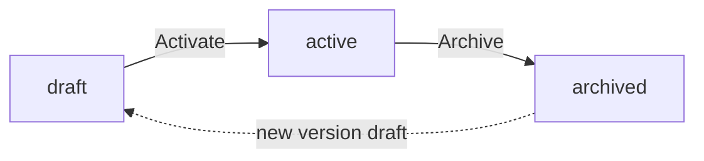
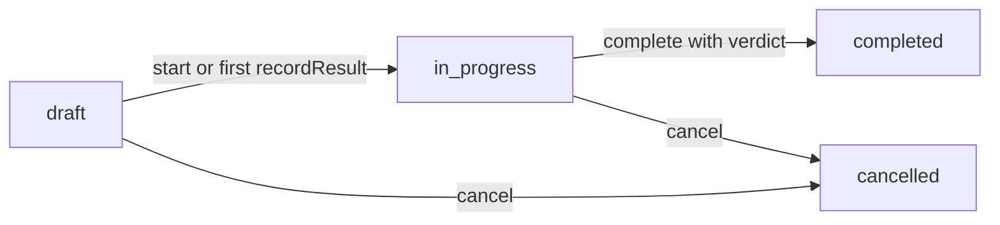
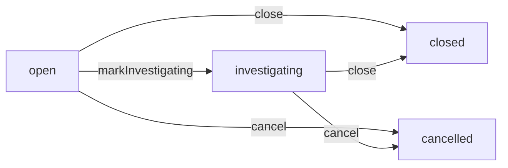
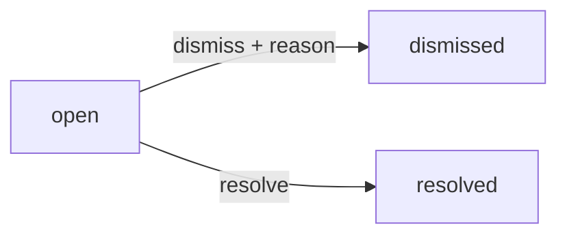
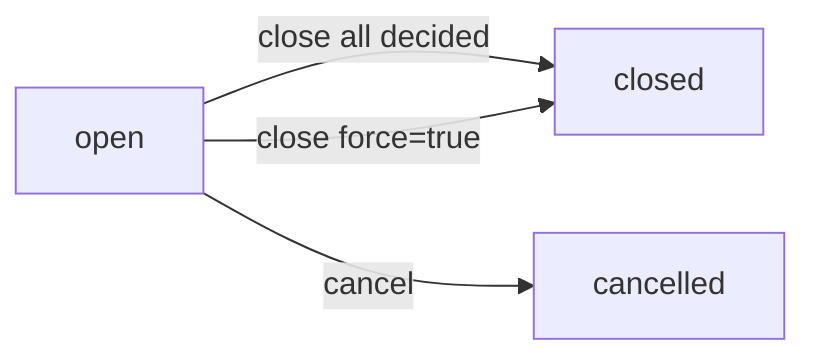
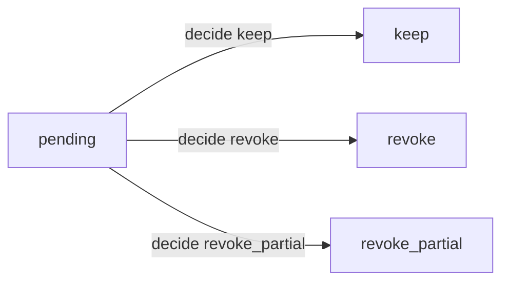
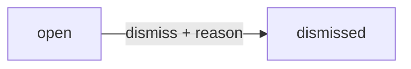

# Quality & Compliance

QA checklists, inspections, non-conformance reports, and the three audit surfaces that keep the platform honest: Segregation of Duties, Access Reviews, and Period-Lock breaches. Plus i18n — same screen pattern (tenant override beats system seed), same audit-driven discipline.

> **Where do I begin?** On the QA side, build at least one [Inspection Checklist](#inspection-checklists) with [Criteria](#inspection-criteria) before turning on `items.receiving_routing='inspection'` or `routing_operations.requires_inspection=1` — otherwise the auto-create at receipt / WO release no-ops and you'll see `inspection_warnings[]` on every response with no inspector queue downstream. On the compliance side, run a first [SoD scan](#compliance--sod-rules--violations) right after seeding roles to see the baseline — then create a single [Access Review](#compliance--access-reviews) per quarter as a recurring rhythm.

---

## Table of contents

1. [Inspection Checklists](#inspection-checklists)
2. [Inspection Criteria](#inspection-criteria)
3. [Inspections](#inspections)
4. [Non-Conformance Reports (NCRs)](#non-conformance-reports-ncrs)
5. [i18n — Translations & Locale](#i18n--translations--locale)
6. [Compliance — SoD Rules & Violations](#compliance--sod-rules--violations)
7. [Compliance — Access Reviews](#compliance--access-reviews)
8. [Compliance — Period-Lock Breaches](#compliance--period-lock-breaches)

---

## Inspection Checklists

### What it is

Versioned templates of QA criteria. A checklist names the inspection (`Default Receiving Inspection`, `Bottling Line Final QC`, etc.), declares whether it applies to `receiving` / `production` / `both`, and is reused across many [Inspections](#inspections). UNIQUE(tenant_id, name, version) lets the same `name` live at v1, v2, v3 — useful when criteria change but historical inspections still reference the older revision.

> **Example:** QA writes a checklist `Bottling Line Final QC` v1 with 6 criteria, sets `status='active'`, and the production team starts using it. Three months later QA adds a new dimensional check — they create v2 (`status='draft'`), add the new criterion, flip v2 to `active`, and `status='archived'` v1. Any in-progress inspection on v1 finishes against v1's criteria (the inspection points to a `checklist_id`, not a `name`); new inspections pick up v2 via the active-name lookup.

### How records get created

| Method | When |
|---|---|
| Manual on the Checklists screen | QA lead drafts the template. |
| API (`POST /erp/quality/checklists`) | Integration / bulk import. |
| Auto-version bump | Posting without `version` calls `InspectionChecklist::maxVersionForName(...) + 1`, so re-saving a name without renaming creates a new version. |

### Fields

| Field | Source | Notes |
|---|---|---|
| Name | Required | UNIQUE within (tenant, version). |
| Version | Auto or manual | If omitted, max(version)+1 for the name. Manual override accepted but a collision returns 422. |
| Description | Optional | Free-text. |
| Applies To | Enum | `receiving` / `production` / `both`. Defaults to `both` if the input is missing or unknown. |
| Status | Lifecycle | `draft` / `active` / `archived` — only `active` checklists get picked up by the auto-create lookup. |

### Lifecycle



Note: there is no `archived → active` transition — an archived checklist is terminal; bump to a new version instead.

### Actions

- **List checklists** — sidebar → Quality → Checklists. Filter by status, applies_to, or name.
- **Create** — pick name + applies_to + description; first version defaults to `draft`. Auto-bump kicks in if a name already exists.
- **Add criterion** — see [Inspection Criteria](#inspection-criteria). Only allowed while `status='draft'`.
- **Activate** — flip `status='draft' → 'active'`. The auto-create flow only sees active versions.
- **Archive** — flip to `archived`. Existing inspections keep their reference; new auto-creates skip it.
- **Delete** — only allowed if **no** inspection references the checklist. Once any inspection (in any status) points at this checklist, delete returns 422 with "Archive it instead."

### Gotchas

- **Edits on a non-draft checklist are restricted** — once `active` or `archived`, only the `status` field is editable. Add a criterion to an active checklist and the controller returns 422 with "Create a new version (draft) first." This protects historical inspections from having their criterion set mutated under them.
- **The auto-create lookup is by NAME, not ID.** `InspectionService::autoCreateForReceiptLine` uses `findActiveByName($tenantId, $name, 'receiving')` and picks the highest-version active match. If you have two active versions of the same name (a misconfiguration), the higher version wins. Archive the old one to clean up.
- **No active checklist matching the name = silent skip** at receipt / WO release. The auto-create returns `null`; receipt / release still succeeds, but a warning surfaces on the response (`inspection_warnings[].message`). See the Inspections Gotchas section below for the C2 Sev-2 fix details.
- **Default lookup name** is `Default Receiving Inspection` (receiving) and `Default Production Inspection` (production) unless the caller passes a specific `checklistName`. Keep at least one checklist with each of these exact names if you want the default wiring to work.

---

## Inspection Criteria

### What it is

Per-checklist line items. Each criterion is one yes/no question, one numeric measurement, one free-text capture, or one pick-from-list. `criterion_type` drives the input control on the recording screen AND the server-side pass/fail computation — the inspector never tells the system "this passed"; the inspector enters the raw value and the service computes pass.

> **Example:** `Bottling Line Final QC` v1 carries criteria:
> 1. `Cap torque (in-lbs)` — `numeric_range`, min 12, max 18, required.
> 2. `Label alignment OK?` — `yes_no`, required.
> 3. `Visible particulate?` — `select`, expected `["none","trace","fail"]`, required.
> 4. `Operator notes` — `text`, optional.

### Fields

| Field | Required | Notes |
|---|---|---|
| Line No | Auto | `MAX(line_no)+1` per checklist if omitted. UNIQUE(checklist_id, line_no). |
| Criterion Text | Yes | What the inspector sees. |
| Criterion Type | Enum | `yes_no` / `numeric_range` / `text` / `select`. Unknown coerces to `yes_no` on create. |
| Min Value / Max Value | If type=`numeric_range` | Either may be NULL (open-ended on that side). Numeric types ignore them. |
| Expected Values JSON | If type=`select` | JSON array of allowed strings. Empty / missing = nothing passes (fail-closed). |
| Is Required | Default 1 | Required criteria gate [Inspection completion](#inspections) — completing with a required criterion missing returns 422. |

### Pass/fail rules (server-computed, NEVER caller-trusted)

| Type | Pass when |
|---|---|
| `yes_no` | `strtolower(trim(value)) === 'yes'`. Anything else (including blank) fails. |
| `numeric_range` | `is_numeric(value)`, and value within `[min_value, max_value]` (open on the NULL side). Non-numeric input fails. |
| `text` | Trimmed value is non-empty. (Used as a "free-form acknowledgement" — pass means "the inspector typed something.") |
| `select` | Trimmed value is in the `expected_values_json` list. Corrupt JSON on a select criterion logs an error and **fails closed** — the inspection rejects rather than silently accepting. |

### Actions

- **List criteria** — opens inside the parent Checklist screen, sorted by line_no.
- **Add** — only while parent checklist is `draft`.
- **Edit** — same restriction; non-draft parent → 422.
- **Delete** — same restriction.

### Gotchas

- **`is_required` gates completion**, not recording. You can `recordResult` on an optional criterion; you can also skip it. But `complete(verdict)` refuses if any **required** criterion has no recorded result, with "Cannot complete: N required criteria missing a recorded result."
- **`pass` is computed in `InspectionService::computePass`, never accepted from the API.** The API takes `result_value` (raw input); the service derives `pass` from criterion definition + value, and writes that to `inspection_results.pass`. A typo in the client cannot claim a failing measurement passes.
- **Corrupt `expected_values_json` on a `select` criterion fails closed.** Hand-editing the column to invalid JSON used to ambiguously evaluate; now it logs `InspectionService corrupt expected_values_json on criterion #N` and the result is recorded as `pass=0`.

---

## Inspections

### What it is

A single run of a checklist against one of:
- a `goods_receipt_line` (when the item's receiving routing is `inspection`),
- a `work_order_operation` (when the routing op has `requires_inspection=1`),
- a `manual` source (ad-hoc QA sample).

UNIQUE(tenant_id, source_type, source_id) means a given receipt line / WO operation has **at most one** linked inspection — re-triggering the auto-create returns the existing one rather than duplicating.

> **Example — receiving:** PO-0042 line for `FLOUR-T55` arrives. `items.receiving_routing='inspection'`, so `GoodsReceiptService` calls `InspectionService::autoCreateForReceiptLine(grLineId)`. A draft inspection `INSP-1-00017` is created against the `Default Receiving Inspection` checklist. QA opens it, records results for each criterion, picks verdict `accepted`. The GR line's `inspection_status` flips to `accepted` and the put-away movement is released. If the inspector picks `rejected` instead, the GR line is marked `rejected` AND a [Non-Conformance Report](#non-conformance-reports-ncrs) auto-opens.

### How records get created

| Method | When |
|---|---|
| Auto-create at GR receipt | `items.receiving_routing='inspection'`; one inspection per inspection-routed line. Failures surface as `inspection_warnings[]` on the GR response. |
| Auto-create at WO release | `routing_operations.requires_inspection=1`; one inspection per such operation. Failures surface as `inspection_warnings[]` on the WO release response. |
| Manual (`POST /erp/quality/inspections`) | Ad-hoc / manual sample. Caller picks a `checklist_id` (must be `active`) and `source_type='manual'`. |

### Fields

| Field | Source | Notes |
|---|---|---|
| Inspection Number | Auto | `INSP-{tenant_id}-{seq:5}` from `MAX(seq)+1` per tenant. |
| Checklist | Required | Must be `active` for manual creation. |
| Source Type | Enum | `goods_receipt_line` / `work_order_operation` / `manual`. |
| Source ID | Conditional | Required if source_type is not `manual`. |
| Status | Lifecycle | `draft` / `in_progress` / `completed` / `cancelled`. |
| Verdict | Lifecycle | `pending` / `accepted` / `rejected` / `on_hold` / `accepted_with_concession`. Stays `pending` until complete. |
| Inspector | Optional | Stamped at `start` or by the recording user. |
| Started At / Completed At | Auto | Stamped on the respective CAS transitions. |
| Notes | Optional | Free-text. |

### Lifecycle



`completed` and `cancelled` are terminal. The CAS guards are baked into `Inspection::transitionStatus(id, tenant, allowedFrom, toStatus)` — a second `complete` after another inspector raced returns `rowCount === 0` and the service throws "Inspection changed state during complete."

### Verdict ≠ Status

The verdict is a *separate* enum from status because an `accepted_with_concession` inspection is **still completed** — the goods are accepted but flagged. The downstream NCR + GR-line mirror rules are driven by **verdict**, not status:

| Verdict | GR line `inspection_status` | NCR auto-opened? |
|---|---|---|
| `accepted` | `accepted` | No |
| `accepted_with_concession` | `accepted` | No (operator deliberately accepted as-is) |
| `rejected` | `rejected` | Yes — see [NCRs](#non-conformance-reports-ncrs) |
| `on_hold` | `rejected` | Yes |

### Actions

- **List / filter** — `/erp/quality/inspections`. Filter by status, verdict, source_type, source_id, checklist_id.
- **Show** — returns the inspection + its `criteria` (from the checklist) + its `results`.
- **Start** — CAS `draft → in_progress`, stamps `started_at` and optionally sets `inspector_user_id`.
- **Record result** — `POST /{id}/record-result` with `criterion_id` + `result_value` + optional `notes`. Service computes `pass`. Upsert on (inspection_id, criterion_id) so re-submitting a value overwrites cleanly. Auto-promotes a draft inspection to `in_progress` on the first result.
- **Complete** — `POST /{id}/complete` with `verdict`. Refuses if required criteria are missing a result. CAS `draft | in_progress → completed`. Inside one transaction: stamps GR line `inspection_status` (if source is a GR line), opens an NCR (if verdict is `rejected` or `on_hold`).
- **Cancel** — CAS `draft | in_progress → cancelled`. Optional reason logged on audit.

### Gotchas

- **C2 Sev-1 — Operation gate refuses missing inspection.** `InspectionService::isOperationCleared(operation)` takes the WO operation record (not just the WO op id). If `operation.requires_inspection=1` AND no inspection row exists for that op, the gate returns FALSE. Previously the gate was "no inspection row → clear", which silently passed ops whose auto-create at release had failed at warn-log time. Now the operator gets a loud refusal in `completeOperation` until QA backfills the inspection.
- **GR auto-create errors surface as `inspection_warnings[]` on the receipt response** (`goods_receipts[].inspection_warnings`). Missing-checklist (no active "Default Receiving Inspection") logs a warning and returns a warning row with the `gr_line_id` and message. Hard errors (PDOException etc.) log at `error` and surface as a warning row too. Receiving itself does not fail — the inspection_status='pending' flag on the GR line still blocks the movement post.
- **WO release auto-create errors surface as `inspection_warnings[]` on the release response.** Same shape, with `wo_op_id` instead of `gr_line_id`. Pair with the C2 Sev-1 gate above: the operator sees the warning at release AND gets blocked at completeOperation if they ignore it.
- **`pass` BOOLEAN is ALWAYS server-computed.** The API never accepts a `pass` field. Posting `{"criterion_id": 12, "result_value": "yes"}` against a `yes_no` criterion computes `pass=1`; `{"criterion_id": 12, "result_value": "no"}` computes `pass=0`.
- **Last-write-wins recording.** UNIQUE(inspection_id, criterion_id) + the `upsert` in `InspectionResult::upsert` mean the second `recordResult` on the same criterion overwrites the first. Audit log captures every record so the trail is preserved.
- **`accept_with_concession` does NOT open an NCR.** It's a deliberate accept-as-is — the verdict acknowledges the goods are off-spec but acceptable to use, so no investigative trail is forced.
- **PDOException catches narrowed to errno 1062 (ER_DUP_ENTRY).** Auto-create previously caught all SQLSTATE 23000 as "race-lost concurrent insert" — that masked FK / NOT NULL / CHECK violations as silent no-ops. Now only errno 1062 returns the existing row; other 23000 errors re-throw.
- **A `manual` inspection can have a NULL `source_id`** (it's an ad-hoc sample with no upstream row). Auto-created inspections always have `source_id` set.

---

## Non-Conformance Reports (NCRs)

### What it is

The investigation record opened when an inspection fails (auto) or when an operator manually files one (e.g. a defect found post-acceptance). UNIQUE(tenant_id, inspection_id) — at most one auto-NCR per failed inspection; re-completing a `rejected` inspection just returns the same NCR via the unique-constraint short-circuit.

> **Example:** Inspection `INSP-1-00018` on GR line for raw materials from vendor `Sopexa` is completed with verdict `rejected`. The service opens `NCR-1-00007` with:
> - `inspection_id=18`,
> - `source_type='goods_receipt_line'`, `source_id=...`,
> - `vendor_id` resolved by walking `gr_line → goods_receipt → purchase_order.vendor_id`,
> - `defect_type='functional'`, `severity` derived from failed-required-count (1 fail → minor; 2+ → major),
> - `disposition='pending'`, `status='open'`,
> - notes: `Auto-opened from inspection INSP-1-00018 (verdict=rejected).`
>
> QA marks it `investigating`, then closes it with `corrective_action='Returned to vendor under RMA-2026-04'` + `disposition='return_to_vendor'`.

### How records get created

| Method | When |
|---|---|
| Auto from a failed inspection | Verdict `rejected` or `on_hold` triggers `NonConformanceService::openFromFailedInspection` inside the inspection-complete transaction. |
| Manual (`POST /erp/quality/ncrs`) | Operator files one outside an inspection (e.g. shop-floor defect discovered after acceptance). |

### Fields

| Field | Source | Notes |
|---|---|---|
| NCR Number | Auto | `NCR-{tenant_id}-{seq:5}`. |
| Inspection | Conditional | Set for auto-NCRs; NULL for manual. UNIQUE per inspection. |
| Source Type / ID | Required | `goods_receipt_line` / `work_order_operation` / `manual`. Mirrors the inspection's source for auto-NCRs. |
| Defect Type | Enum | `cosmetic` / `functional` / `dimensional` / `contamination` / `labeling` / `other`. Auto-NCR uses `functional` for `rejected` and `other` for `on_hold`. |
| Severity | Enum | `minor` / `major` / `critical`. Auto-derived: 1 failed required criterion → `minor`; 2+ → `major`. Operator can override. |
| Disposition | Enum | `pending` / `rework` / `scrap` / `accept_concession` / `return_to_vendor`. Close requires a non-`pending` disposition. |
| Vendor | Auto-derived | For GR-source NCRs, walks `gr_line → goods_receipt → purchase_order.vendor_id`. Operator can override. |
| Work Order | Auto-derived | For WO-op-source NCRs, reads `work_order_operations.wo_id`. Operator can override. |
| Corrective Action | Required to close | Free-text auditor evidence. Empty → 422 on close. |
| Status | Lifecycle | `open` / `investigating` / `closed` / `cancelled`. |
| Opened At / By | Auto | Stamped on create. |
| Closed At / By | Auto | Stamped on `close`. |

### Lifecycle



All transitions are CAS — a second close from a stale tab returns "NCR changed state during close."

### Actions

- **List** — `/erp/quality/ncrs`. Filter by status, severity, source_type, vendor_id, work_order_id.
- **Show** — opens the NCR detail.
- **Create (manual)** — `source_type` is required; everything else optional. Returns 422 if an NCR already exists for that inspection.
- **Mark investigating** — CAS `open → investigating`.
- **Close** — requires `corrective_action` (non-empty) AND `disposition` (not `pending`). Updates the disposition + corrective_action, then CAS transitions to `closed`, stamps `closed_at` / `closed_by`. Both inside one transaction.
- **Cancel** — CAS `open | investigating → cancelled`. Optional reason on audit.
- **Delete** — only allowed for `cancelled` NCRs (terminal-but-throwaway). Open / investigating / closed all refuse with 422.

### Gotchas

- **NCR auto-open looks ONLY at REQUIRED failed criteria** for severity derivation (`failed_required_count = COUNT(*) WHERE pass=0 AND is_required=1`). Optional criterion fails don't bump severity.
- **Vendor / work_order resolution happens at open time.** If you re-link the PO later or change `work_order_operations.wo_id`, the NCR's stamped `vendor_id` / `work_order_id` do not auto-update.
- **The UNIQUE on (tenant, inspection_id) is the dedup guard.** A re-completion of a rejected inspection (e.g. operator un-cancels then re-completes — not currently possible via UI but reachable via API) would re-call `openFromFailedInspection`, which short-circuits on the existing NCR via 1062 → returns the existing row.
- **Closed NCRs are immutable via the `update` endpoint** — controller returns 422 on `update` for `closed | cancelled` NCRs.

---

## i18n — Translations & Locale {#i18n--translations--locale}

### What it is

Tenant-overridable translation registry. Every row is a single `(locale_code, namespace, t_key) → value` mapping. System-seed rows have `tenant_id = NULL` and are read-only; tenant rows have `tenant_id = N` and override the matching seed for that tenant. A STORED generated column `tenant_key = COALESCE(tenant_id, 0)` lets the UNIQUE(tenant_key, locale, namespace, t_key) accept both system-seed (tenant_key=0) and tenant rows (tenant_key=N) on the same (locale, ns, key) without collision.

> **Example:** System seed says `en / common / save = "Save"`. Tenant 7 overrides with `en / common / save = "Submit"`. A user in tenant 7 with `locale='en'` resolving `t('save')` gets `"Submit"`. A user in tenant 7 with `locale='fr-FR'` (with no `fr-FR / common / save` override or seed) falls back to the tenant default locale, then `en` system seed → `"Save"`.

### Fields

| Field | Required | Notes |
|---|---|---|
| Locale Code | Yes | BCP-47-ish: `^[a-z]{2,3}(-[A-Za-z0-9]{2,8})?$` (so `en`, `fr-FR`, `pt-BR` accepted; `English` rejected with 422). |
| Namespace | Yes | `[a-z0-9_.]{1,80}` case-insensitive. Default `common`. |
| Key | Yes | Up to 200 chars. |
| Value | Required, non-empty | Up to 8192 chars. Updating to `''` returns 422 — delete the row to fall back to the seed instead. |
| Tenant ID | Auto | NULL for system seeds; tenant for overrides. |

### Resolution chain — `TranslationService::t($key, ?$locale, ?$ns)`

```
1. Tenant override @ requested locale
2. System seed     @ requested locale
3. Tenant override @ tenant default locale
4. System seed     @ tenant default locale
5. System seed     @ 'en' (final fallback)
6. The key itself  (so a missing string is visibly missing in dev)
```

Steps 1+2 collapse into one query: `Translation::resolve()` returns the tenant row if both exist (`ORDER BY (tenant_id = ?) DESC`). Same for 3+4. Step 5 only fires if neither 1-2 nor 3-4 hit AND the requested+default locales aren't already `en`. The request-scope cache memoises by `(tenant|locale|default_locale|ns|key)` so a page rendering 200 strings doesn't re-query 200 times.

### Actions

- **List translations** — `/erp/i18n/translations`. Filter by locale + namespace. Returns system seeds AND tenant overrides interleaved; the `tenant_id` column tells them apart.
- **Create override** — `POST /erp/i18n/translations` with `locale_code` + `namespace` + `t_key` + `value`. UNIQUE collision (an override already exists) → 422.
- **Update override** — `PUT`. **System seeds return 403 "cannot be edited — create a tenant override instead"**. Validation re-runs (malformed BCP-47 / oversized fields blocked).
- **Delete override** — `PUT` system seeds → 403. Tenant rows delete cleanly; the resolution falls back to the seed.
- **Resolve a single key** — `GET /erp/i18n/t?key=&locale=&namespace=`. Empty `key` → 422.
- **Bulk bundle for hydration** — `GET /erp/i18n/bundle?locale=&namespace=`. Returns `{ locale, namespace, entries: { key: value, ... } }` with tenant overrides applied on top of seeds.
- **Get caller's locale** — `GET /erp/i18n/me/locale`. Returns `{ user_locale, effective, tenant_default }`.
- **Set caller's locale** — `PUT /erp/i18n/me/locale` with `{ "locale": "en" }`. **`{ "locale": null }` or `{ "locale": "" }` clears the override** so the user falls back to the tenant default. Unknown / inactive locale → 422.

### Gotchas

- **D5 Sev-1 — setMyLocale accepts null to clear.** Previously a blank `locale` returned 422 — users could SET a locale but never CLEAR it back to "use tenant default." Now `null` / `''` clears the per-user `users.locale` and the next `t()` resolves through tenant default + `en` fallback.
- **Tenant overrides beat system seeds on the SAME locale**, but a tenant override on `fr-FR` does not beat a system seed on `en` — fallback walks locales, not tenant priority.
- **Setting a locale that isn't enabled for the tenant** (`Locale::findByCodeForTenant` returns NULL or `is_active=0`) returns 422 `"Locale 'X' is not enabled for this tenant."`. Add the locale to the tenant first.
- **`Database::update` returning 0 means "no change OR not found"** — `setUserLocale` distinguishes by re-checking existence; only "not found" raises 404.
- **Tenant-isolation: a tenant cannot see another tenant's overrides.** The list query filters on `(tenant_id IS NULL OR tenant_id = ?)`; cross-tenant tenant rows are excluded at the SQL level.

---

## Compliance — SoD Rules & Violations {#compliance--sod-rules--violations}

### What it is

**Segregation of Duties** rules + the scan that finds users violating them. A rule names a set of permissions that should never be held by the same user (e.g. `["erp.po.create","erp.po.approve"]`); the scan walks every active rule × every active user in the tenant and opens a violation per (rule, user) match.

> **Example:** Auditor creates rule `Vendor 3-way risk` with severity=`high` and `conflicting_permissions = [["erp.vendor.create","erp.vendor_bill.approve","erp.vendor_payment.create"]]`. The scan flags every active user whose role holds all three permissions. Each match becomes an `open` violation. The auditor reviews → either resolves it (operator demonstrably no longer holds the perms) or dismisses it with a reason (operator's role is intentionally privileged for SOX-exception N). Auditor evidence is the `dismissal_reason` text.

### Fields — SoD Rule

| Field | Required | Notes |
|---|---|---|
| Name | Yes | UNIQUE per tenant — collision returns 422. |
| Description | Optional | Free-text. |
| Conflicting Permissions | Yes | JSON array of arrays. Each inner array is ≥ 2 permission strings (creator/approver, creator/approver/payer, etc.). Empty / single-element / non-string members are 422'd in the controller. |
| Severity | Enum | `low` / `medium` / `high` / `critical`. Defaults `medium`. |
| Is Active | Default 0 | Inactive rules are skipped by the scan. |

### Fields — SoD Violation

| Field | Source | Notes |
|---|---|---|
| Rule | FK | Snapshot of which rule fired. |
| User | FK | Which user held the conflicting set. |
| Matched Permissions JSON | Snapshot | The exact inner-set the user matched (snapshot so a later rule edit can't rewrite history). |
| Status | Lifecycle | `open` / `dismissed` / `resolved`. |
| Scanned At | Auto | When the scan inserted the row. |
| Dismissed At / By / Reason | On dismiss | Reason is REQUIRED (auditor evidence). |
| Resolved At / By | On resolve | No reason field — resolve means "fact pattern no longer holds" (re-scan would not re-open it). |

### Lifecycle



Both transitions are CAS-from-`open` (`WHERE ... AND status = 'open'`). A double-dismiss returns 422 "Violation is not open." A `dismissed` or `resolved` violation can still recur — UNIQUE on `(rule_id, user_id, status='open')` only blocks duplicate **open** rows; if the user re-acquires the conflicting perms after a dismissal, a fresh scan opens a brand-new row.

### Actions

- **List rules** — `/erp/compliance/sod/rules` with optional `?active=1`. Open to any authenticated user (reads aren't compliance-bearing).
- **Create / update / delete rule** — `requireComplianceAdmin` (super_admin / admin only; API keys forbidden). Update re-validates `conflicting_permissions` — see Gotcha.
- **Run scan** — `POST /erp/compliance/sod/scan`. Returns counters: `rules_scanned`, `users_scanned`, `violations_opened`, `violations_already_open`, `rules_skipped_bad_json`, `rules_with_bad_set_member`, `errors`.
- **List violations** — `/erp/compliance/sod/violations`, optional `?status=open|dismissed|resolved`.
- **Dismiss** — `POST /{id}/dismiss` with `{ "reason": "..." }`. Empty reason → 422.
- **Resolve** — `POST /{id}/resolve`. No reason; intended for "fact pattern cleared."

### Gotchas

- **D5 Sev-1 — Update re-validates `conflicting_permissions`.** Without re-validation, `PUT { conflicting_permissions: "lol" }` would silently `json_encode` the string into the column. The next scan would log "invalid json" and skip the rule entirely — the operator's SoD coverage would silently disappear with NO UI signal. Now the controller re-runs the same array-of-arrays-of-≥2-strings validator on update.
- **D5 Sev-1 — Dismiss without reason returns 422.** The `dismissal_reason` is the auditor's only evidence that someone deliberately suppressed a finding. The controller trims and refuses empty strings before the CAS fires.
- **D5 Sev-1 — Double-dismiss returns 422 via CAS.** The model's `UPDATE ... WHERE status='open'` returns `rowCount=0` on the second click; controller surfaces 422 "Violation is not open."
- **Wildcard permission matching mirrors RBAC** — `*` and `module.*` both count as "user holds it." So a `super_admin` with `*` matches every SoD set; expect a lot of violations on day one and tune your rules / role assignments accordingly.
- **The scan reads role permissions via `RBAC::getPermissions($userRole, $tenantId)`** — not via `RBAC::check`, which reads from the current request's auth context. The local implementation lets the scan check permissions for users it's not impersonating.
- **API key sessions can list / scan but cannot mutate.** `requireComplianceAdmin` explicitly forbids API key auth on mutations — compliance trails must attribute to a real user.
- **Tenant-isolation: tenant 2 cannot see tenant 1 rules.** Every query is `WHERE tenant_id = ?`.

---

## Compliance — Access Reviews {#compliance--access-reviews}

### What it is

Periodic "review every active user × their role" snapshots. The reviewer goes through each item and records a decision (`keep` / `revoke` / `revoke_partial`). Closed runs become immutable compliance evidence — no further decisions, no item additions. Typical cadence: quarterly.

> **Example:** Auditor creates run `2026-Q2 Access Review`. The service snapshots every active user in the tenant — for each, captures `user_id`, `user_role`, `last_login_at`, and `last_action_at` (= MAX from `audit_logs.created_at`). Reviewer goes through 47 items: 41 `keep`, 4 `revoke` (terminated employees who hadn't been deactivated), 2 `revoke_partial` (operators whose role grew too broad). Reviewer closes the run; the row + items become read-only audit evidence.

### Fields — Run

| Field | Source | Notes |
|---|---|---|
| Name | Required | E.g. `2026-Q2 Access Review`. |
| Status | Lifecycle | `open` / `closed` / `cancelled`. |
| Total Items | Auto | Recounted on every item decide. |
| Reviewed Items | Auto | Count with `decision <> 'pending'`. |
| Started At / By | Auto | Stamped on create. |
| Completed At / By | Auto | Stamped on close or cancel. |
| Notes | Optional | Free-text auditor note. |

### Fields — Item

| Field | Source | Notes |
|---|---|---|
| Run | FK | Which run. |
| User | FK | The user being reviewed. |
| User Role | Snapshot | Role at scan time (so a later role change doesn't rewrite history). |
| Last Login At / Last Action At | Snapshot | From `users.last_login_at` + `MAX(audit_logs.created_at)`. |
| Decision | Enum | `pending` / `keep` / `revoke` / `revoke_partial`. |
| Decision Notes | Optional | Reviewer free-text. |
| Reviewed At / By | Auto | Stamped on decide. |

### Lifecycle — Run



Closed runs cannot record decisions. The `decide` flow takes `SELECT ... FOR UPDATE` on the run row inside the same transaction as the CAS item update, so a reviewer racing against another reviewer's `close` cannot slip a late decision through.

### Lifecycle — Item



Item decisions are CAS-from-`pending` — re-clicking after another reviewer decided returns 422 "Item already decided as X."

### Actions

- **List runs** — `/erp/compliance/access-reviews`, optional `?status=`. Open to any authenticated user.
- **Show run** — returns the run + its items.
- **Create run** — `POST /erp/compliance/access-reviews` with `name` + optional `notes`. Snapshot + items populate in ONE transaction so a partial failure can't leave a header with half its items.
- **Decide item** — `POST /erp/compliance/access-reviews/items/{item_id}/decide` with `decision` + optional `notes`. `requireComplianceAdmin`.
- **Close run** — `POST /{id}/close`. Refuses if pending items remain unless `{ "force": true }`. `requireComplianceAdmin`.
- **Cancel run** — `POST /{id}/cancel`. CAS-from-open. `requireComplianceAdmin`.

### Gotchas

- **D5 Sev-1 — Decide on unknown decision returns 422.** `AccessReviewItem::decide` throws `InvalidArgumentException` (not silent coercion to `keep`) if the decision isn't one of `keep` / `revoke` / `revoke_partial`. A coerced-keep would look identical to a deliberate keep in the compliance audit trail — that silent-failure mode was the highest-stakes auditability bug in D5.
- **D5 Sev-1 — closeReview gates on pending items + `force` bypass works.** Closing with pending items returns 422 with "N item(s) are still pending. Decide them, or POST `{ "force": true }` to close with pending items recorded as un-attested." The force flag is recorded in audit (`pending_at_close`, `force=true`) so the auditor can see the operator explicitly accepted the gap.
- **Decide flow takes SELECT FOR UPDATE on the run row.** This prevents two reviewers racing on the same run from both passing the `status='open'` check and then having one of them slip a late decision into a run that just closed. It also keeps the `total_items` / `reviewed_items` recount monotonic.
- **Close races between two admins return 409**, not 422. The first close wins; the second admin gets "Access review state changed under you (now: closed). Refresh and retry." Cancel races behave identically (409).
- **`last_action_at` is computed inside the create transaction** as `MAX(al.created_at)` per user across the audit log. Big audit tables may slow large reviews — consider running them off-peak.
- **A user who logs in AFTER the snapshot is captured** doesn't update the item's `last_login_at`. The snapshot is intentional: the review is "as of the moment it was started."
- **Tenant-isolation: tenant 2 cannot decide on tenant 1's items.** Every query is tenant-scoped at the model layer.

---

## Compliance — Period-Lock Breaches {#compliance--period-lock-breaches}

### What it is

Scan that finds journal entries posted **after** their accounting period was closed. The signal is `journal_entries.posted_at > accounting_periods.closed_at` — the entry slipped through after the period was nominally locked. Three breach types are surfaced separately so the auditor can rank severity.

> **Example:** Q1 2026 period closed 2026-04-05 14:32. A journal entry posts 2026-04-06 09:00 against a Q1 period_id. The scan flags it as `je_posted_to_closed`. A separate entry has `entry_date=2026-03-30` (inside Q1) and `posting_date=2026-04-06` (after close) — that's `je_backdated_to_closed`, a more severe signal because someone deliberately backdated it through the lock.

### Breach types

| Type | Definition |
|---|---|
| `je_posted_to_closed` | period.status was `closed` at scan time AND je.posted_at > period.closed_at. |
| `je_posted_to_permanently_closed` | period.status was `permanently_closed` AND je.posted_at > period.closed_at — same fact pattern but a sharper compliance signal because the period was supposed to be untouchable. |
| `je_backdated_to_closed` | je.entry_date is inside the closed period AND je.posting_date > period.closed_at. Takes precedence over the other two when both apply. |

The scan also surfaces journals with `posted_at IS NULL` (lost timestamp on a transition that should always stamp it) — those bypass the > comparison and are classified by `period.status` alone.

### Fields

| Field | Source | Notes |
|---|---|---|
| Period | FK | The closed accounting_period. |
| Journal | FK | The breaching journal_entry. |
| Breach Type | Enum | Per the table above. |
| Journal Posted At | Snapshot | Captured at scan time so a later journal edit can't rewrite the evidence. |
| Period Closed At | Snapshot | Same. |
| Period Status At Scan | Snapshot | `closed` or `permanently_closed`. |
| Status | Lifecycle | `open` / `dismissed`. |
| Scanned At | Auto | When the row was inserted. |
| Dismissed At / By / Reason | On dismiss | Reason REQUIRED (auditor evidence). |

### Lifecycle



No resolve verb — the breach already happened; you can only dismiss with explanation. CAS-from-open.

### Actions

- **Run scan** — `POST /erp/compliance/period-lock/scan`. Returns counters: `journals_scanned`, `violations_opened`, `violations_already_open`, `errors`. Open to any authenticated user.
- **List violations** — `/erp/compliance/period-lock/violations`, optional `?status=open|dismissed`. Includes joined columns from `accounting_periods` and `journal_entries` for context (entry_number, entry_date, etc.).
- **Dismiss** — `POST /{id}/dismiss` with `{ "reason": "..." }`. Empty reason → 422. `requireComplianceAdmin`.

### Gotchas

- **Re-scan is idempotent via UNIQUE(tenant, period, journal, breach_type).** Insert collisions (errno 1062) increment `violations_already_open`; no duplicate rows. A `dismissed` row does NOT block re-open on re-scan — but the UNIQUE on (tenant, period, journal, breach_type) DOES — so re-running the scan after dismissing a breach does NOT re-open it. To re-surface, the underlying journal would need to change (different breach_type) OR the dismissed row would need to be deleted manually.
- **Backdated takes precedence.** A journal that's both posted-after-close AND backdated through the close gets `je_backdated_to_closed`, not the milder `je_posted_to_closed`. The auditor sees the more-serious type.
- **`posted_at IS NULL` is surfaced as a breach.** A `status='posted'` journal with no posted_at timestamp is itself a compliance red flag (lost timestamp on a transition that should always stamp it). The scan classifies it by `period.status` alone since the > comparison is impossible.
- **PDOException catches narrowed to errno 1062.** Same pattern as elsewhere — broad SQLSTATE 23000 catches were re-classified as either "already known" (1062) or true errors (everything else).
- **Tenant-isolation: tenant 2 cannot dismiss tenant 1's violations.** Every query is tenant-scoped at the model layer.

---

## Cross-references

- **Items** — `items.receiving_routing` controls whether [Inspections](#inspections) auto-create at GR receipt. See [Items → Item Master](./items.md#item-master) for the Receiving fields block.
- **Procurement** — [Goods Receipts](./procurement.md#goods-receipts) for inspection-routed items create draft inspections inline; the response surfaces `inspection_warnings[]` if QA setup is incomplete.
- **Manufacturing** — [Work Order](./manufacturing.md#work-orders) operations with `requires_inspection=1` auto-create draft inspections at release; `completeOperation` blocks until the inspection is `completed` with an accepted verdict. See [Work Orders deep-dive](./deep-dives/work-orders.md).
- **Inventory** — A rejected inspection on a GR line flips the GR line's `inspection_status='rejected'` which keeps the stock in the inspection-area subinventory. See [Inventory → Receipts](./inventory.md#receipts).
- **GL** — [Period-Lock Breaches](#compliance--period-lock-breaches) reads from `accounting_periods` and `journal_entries`; see [GL → Periods](./gl.md#accounting-periods) and [Journal Entries deep-dive](./deep-dives/journal-entries.md).
- **Platform** — [i18n](#i18n--translations--locale) feeds the in-app translation API consumed by every page. The translation cache is request-scope; the bundle endpoint is what the frontend hydrates from on locale change.
