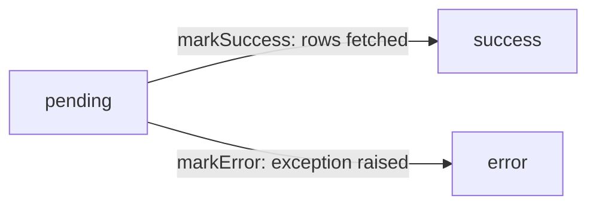
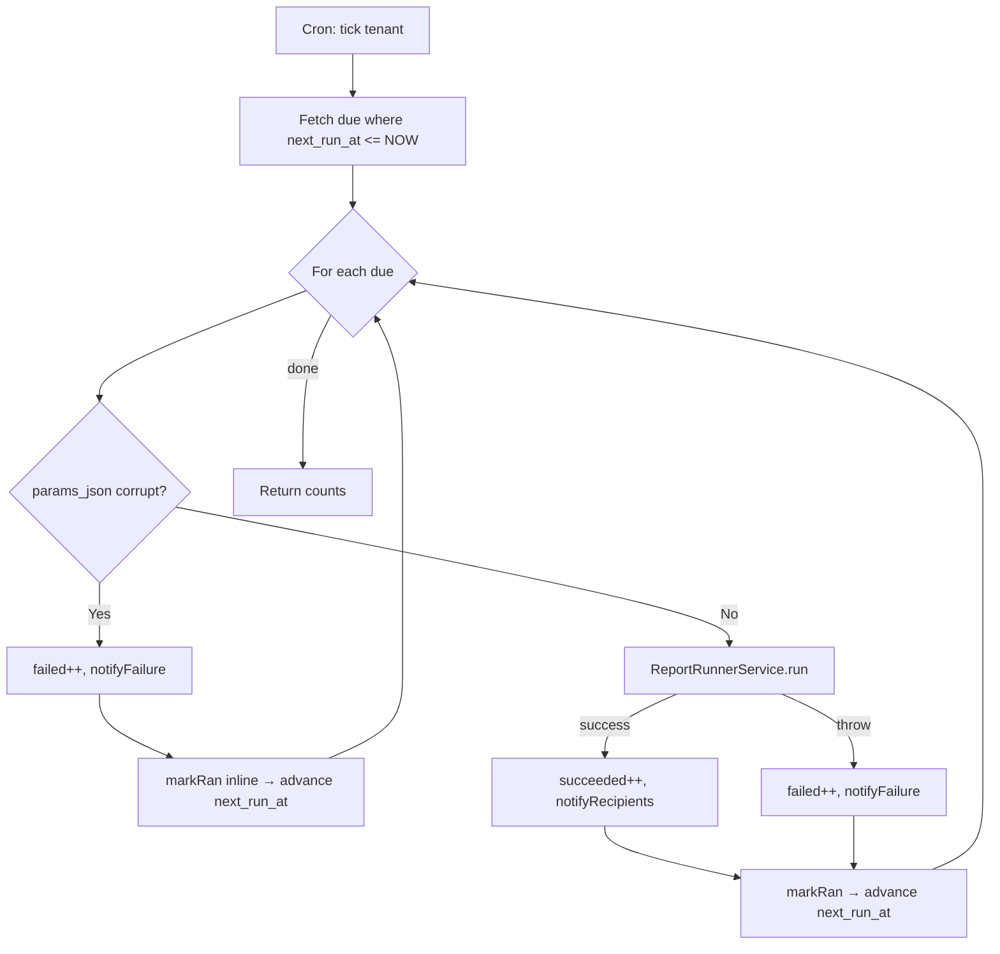
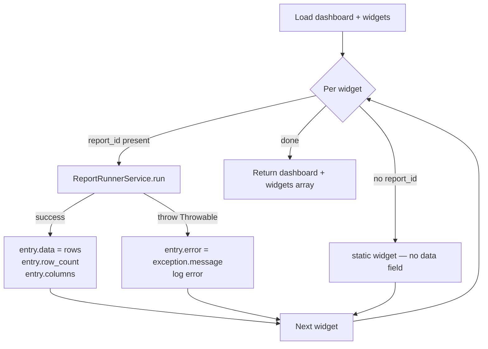
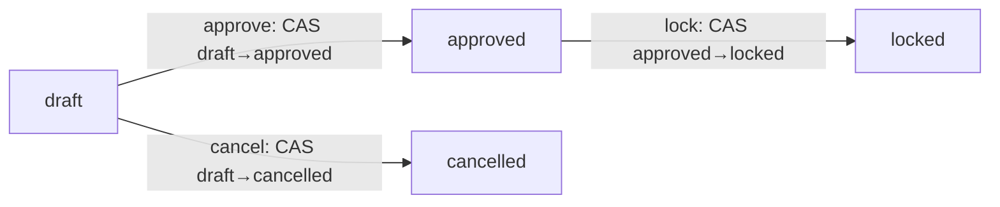

# Reports & Dashboards

How the ERP turns its operational tables into numbers a manager can read — saved query configurations, scheduled deliveries, dashboard tiles, and the budget-vs-actual variance engine.

> **Where do I begin?** Open [Custom Reports](#custom-reports) at `/erp/reports`. The six [system-seeded Data Sources](#report-data-sources) (inventory on-hand, GL journal lines, A/R aging, A/P aging, sales pipeline, work-order status) are already visible to every tenant — pick one, hit *New Report*, choose your filters/group-by/aggregations, save, and run. From there: schedule it via [Scheduled Reports](#scheduled-reports), pin the result on a [Dashboard](#dashboards), or — for finance — compare it against a [Budget](#budgets) on the [Variance Report](#variance-reports).

---

## Table of contents

**Reports**

1. [Custom Reports](#custom-reports)
2. [Report Data Sources](#report-data-sources)
3. [Report Runs](#report-runs)
4. [Scheduled Reports](#scheduled-reports)

**Dashboards**

5. [Dashboards](#dashboards)

**Budgeting** *(cross-linked from `/erp/finance/budgets`)*

6. [Budgets](#budgets)
7. [Variance Reports](#variance-reports)

---

## Custom Reports

### What it is

A **report definition** is a tenant-saved configuration — filters, group-by, aggregations, display columns, sort, row limit — pinned against one [Report Data Source](#report-data-sources). It is *not* the query result; running it (manually or via a [Schedule](#scheduled-reports)) executes the data source's vetted SQL with the saved configuration and writes a [Report Run](#report-runs) audit row.

> **Example:** Pick the system-seeded data source `ar_aging`. Save a definition called *"60+ Days Open — North Region"* with `filters_json = [{column_id: "region", op: "=", value: "NORTH"}, {column_id: "days_overdue", op: ">=", value: 60}]`, `display_columns_json = ["customer_name", "invoice_number", "due_date", "balance_due"]`, `sort_by_column_id = "balance_due"`, `sort_dir = "desc"`, `row_limit = 200`. Each run resolves these against the data source registry, builds a parameterized SQL, and returns the rows.

### How definitions get created

| Method | When |
|---|---|
| `/erp/reports` *New Report* UI | The default path — pick data source, build filter/group-by/aggregation, save. |
| API (`POST /erp/reports/definitions`) | Integration with an external report-builder UI. |
| Cloning an existing report | Open a report, *Save As* to copy the config under a new name. |

### Fields

| Field | Required | Notes |
|---|---|---|
| Name | Yes | UNIQUE per tenant (`uq_rdef_tenant_name`). |
| Description | Optional | Free-text. |
| Data Source | Yes | `data_source_id` → [Report Data Source](#report-data-sources). May be a system seed (`tenant_id IS NULL`) or one of your own. |
| Filters | Optional JSON | Array of `{column_id, op, value}`. `op` is matched against an allowlist (see [Gotchas](#custom-reports-gotchas)). Values are always bound as PDO parameters — never interpolated. |
| Group By | Optional JSON | Array of `column_id`. When set together with aggregations, the SELECT becomes GROUP BY syntax. |
| Aggregations | Optional JSON | Array of `{measure_id, function, alias?}`. Function is one of `sum`, `count`, `avg`, `min`, `max`. |
| Display Columns | Optional JSON | Array of `column_id`. Ignored when aggregations are set. If both display_columns and aggregations are empty, the runner selects every registered column. |
| Sort By | Optional | `column_id` from the data source registry OR an aggregation alias actually emitted by this report. Unknown ids throw `RuntimeException` (not a silent drop). |
| Sort Dir | Default `asc` | Coerced to `asc` for anything outside `['asc','desc']`. |
| Row Limit | Default 1000 | Clamped to `[1, 50000]`. |
| Active | Default true | Pause without deleting. |

### Actions

- **List** — `/erp/reports` shows all definitions for the tenant, filterable by `is_active` and `data_source_id`.
- **Create / Edit / Delete** — manager-role-gated (`super_admin`, `admin`, `manager`).
- **Run now** — `POST /erp/reports/definitions/{id}/run` executes the report and returns `{run_id, rows, row_count, columns}`. Pass `?debug=1` to also receive the composed SQL for troubleshooting.
- **Schedule** — opens [Scheduled Reports](#scheduled-reports) pre-bound to this report id.

### Gotchas <a id="custom-reports-gotchas"></a>

- **Operator allowlist (`ReportRunnerService::ALLOWED_OPS`):** `= != > >= < <= LIKE NOT LIKE IN NOT IN IS NULL IS NOT NULL BETWEEN`. Any other operator throws.
- **Function allowlist (`ReportRunnerService::ALLOWED_FUNCTIONS`):** `sum count avg min max`. Anything else throws.
- **`IN` / `NOT IN` with an empty value array** does **not** silently drop the filter — it emits `1=0` (or `1=1` for `NOT IN`). A UI bug that sent `[]` for an A/R filter would otherwise expose every invoice (Sev-2 review fix).
- **`BETWEEN`** requires a 2-element value array — otherwise throws `RuntimeException`.
- **Sort by unknown id** throws instead of producing an opaque "Unknown column" SQL error at execute time. The runner builds the set from `(registered columns ∪ aggregation aliases this report emits)` and rejects anything outside (Sev-2 review fix).
- **Corrupt `filters_json` / `group_by_json` / `aggregations_json` / `display_columns_json`** logs an error and falls through to `[]` so the report runs in degraded mode — but the log entry names which JSON column failed. Recipients would otherwise see the wrong cut without any signal.
- **Row limit hard-cap is 50,000** at both create and update; anything higher gets clamped silently. For wider exports, use [Scheduled Reports](#scheduled-reports) with `output_format = csv` (file-writer pipeline is Tier D).

---

## Report Data Sources

### What it is

A **report data source** registers a query schema — `base_query` + `columns_json` + `measures_json` + `default_filters_json` — that the [Report Runner](#custom-reports) is allowed to interpolate into a SELECT. Think of it as a vetted view definition: tenant users pick the source, then compose filters/aggregations from its **registered** columns and measures only. End-user input never reaches raw SQL.

> **Example:** The system-seeded source `inventory_onhand` exposes `base_query = "FROM inventory_levels il JOIN items i ON i.id = il.item_id ..."`, `columns_json = [{id: "sku", sql_expr: "i.sku"}, {id: "org_code", sql_expr: "io.org_code"}, ...]`, `measures_json = [{id: "qty_on_hand", sql_expr: "il.on_hand"}, ...]`. A tenant creating a report picks `sku` and `org_code` for group-by, `qty_on_hand` with function `sum` for the aggregation — the runner composes the SQL using only those vetted `sql_expr` strings.

### Visibility model

| `tenant_id` | Meaning |
|---|---|
| `NULL` | **System seed** — readable by every tenant; cannot be deleted; `is_system = 1`. |
| Tenant id | **Tenant-owned** — readable + writable by that tenant only. `create()` always forces `is_system = 0`. |

UNIQUE on `(tenant_id, code)` — `uq_rds_tenant_code`. NULL `tenant_id` is allowed alongside tenant rows because NULL doesn't collide on UNIQUE in MariaDB (so each tenant can still register a source with the same `code` as a system seed if they want to override locally).

### System seeds (v1)

The 6 seeded sources every tenant sees:

| Code | Name |
|---|---|
| `inventory_onhand` | Inventory On-Hand |
| `gl_journal_lines` | GL Journal Lines |
| `ar_aging` | A/R Aging — Open Customer Invoices |
| `ap_aging` | A/P Aging — Open Vendor Bills |
| `sales_pipeline` | Sales Pipeline — Orders by Status |
| `work_order_status` | Work Orders by Status |

### Fields

| Field | Required | Notes |
|---|---|---|
| Code | Yes | UNIQUE per (tenant). Lowercase snake_case by convention. |
| Name | Yes | Human label. |
| Description | Optional | What this source represents. |
| Base Query | Yes | Must start with `SELECT ... FROM ...` and must **not** contain a top-level `WHERE` (matched as a word boundary — see [Gotchas](#data-sources-gotchas)). Sub-SELECT WHEREs are fine. |
| Columns JSON | Yes | Array of `{id, label, sql_expr}`. The runner indexes by `id`. |
| Measures JSON | Optional | Array of `{id, label, sql_expr}`. Aggregatable expressions only. |
| Default Filters JSON | Optional | Applied before tenant-saved filters on every run. Same shape as `filters_json` on a definition. |
| Is System | Auto | `1` for seeds, `0` for tenant-authored. Forced by `ReportDataSource::create`. |
| Is Active | Default `1` | Deactivating refuses any further runs of definitions bound to this source (`'Report data source is deactivated.'`). |

### Actions

- **List** — `/erp/reports/data-sources` returns system seeds + this tenant's own sources, system seeds first (`ORDER BY is_system DESC, name`).
- **Show** — by id, with the same tenant-or-system guard.
- **Create / update** — tenant-owned only. The runner trusts `base_query` + `sql_expr` strings here as authored SQL — this endpoint is privileged and is **not** the report-run path.

### Gotchas <a id="data-sources-gotchas"></a>

- **`base_query` WHERE check uses a `\bWHERE\b` word-boundary regex**, not a substring search. A column named `where_clause` or a string literal containing `'somewhere'` no longer false-positives the validator (Sev-2 review fix).
- **`leadingAlias()` resolves the tenant predicate target.** Every base_query must have a tenant_id column on its leading table; the runner appends `{tenantAlias}.tenant_id = ?` to the composed WHERE. Sources without a parseable leading alias throw at run time.
- **`sql_expr` injection via `$N` backreferences (Sev-1 review fix):** the runner uses `preg_replace_callback` (not `preg_replace`) for the SELECT-projection rewrite. A tenant-authored source with `sql_expr` containing `$1` would otherwise be interpreted as a backreference into the matched SELECT text — that's a real injection vector with tenant-authored sources.
- **Corrupt `columns_json` / `measures_json`** on a data source throws `RuntimeException` (strict mode), not silently empty. A zero-column report would otherwise be mistaken for "no findings" by the recipient.
- **System seeds are read-only at the UI** — operators who need to alter one should clone (`Save As`) into a tenant-owned source with the same shape.

---

## Report Runs

### What it is

The append-only audit trail of every report execution — manual, scheduled, or dashboard-triggered. One row per run, with status, row count, timing, and (for failures) the error message.

> **Example:** A scheduler tick fires the *"60+ Days Open"* report at 03:00. `ReportRun::open` inserts a row with `status = 'pending'`, `trigger_type = 'scheduled'`. The runner executes, gets 47 rows, calls `markSuccess(runId, 47)` → status flips to `success`, `finished_at` stamped, `row_count = 47`. The recipient gets a notification linking to `/erp/reports/runs?id={runId}`.

### Fields

| Field | Source | Notes |
|---|---|---|
| Report | `report_id` | FK to the definition that was run. |
| Params JSON | On open | Extra params passed at run time (merged with the saved filters). |
| Status | Lifecycle | `pending` → `success` / `error`. |
| Row Count | On success | Returned by `count($rows)`. |
| Started / Finished At | Auto | `started_at` default `NOW()`; `finished_at` stamped on terminal state. |
| Error Message | On error | First 65535 chars of the exception message. |
| Output URL | Optional | File path for written exports — Tier D enhancement; null in v1. |
| Triggered By | User id | Null when invoked by a non-authenticated cron path. |
| Trigger Type | Auto | `manual` (default) or `scheduled`. Anything else coerces to `manual`. |

### Lifecycle



### Actions

- **List** — `/erp/reports/runs` filterable by `report_id` and `status`. Hard-capped at 500 rows, ordered by `started_at DESC`.
- **Show** — by id; useful for drilling into an error message or the params used.

### Gotchas

- **`markError` never masks the original exception (Sev-1 review fix).** If the DB connection dies between the failed `fetchAll` and `markError`, the secondary failure is caught + logged separately and the *original* exception still re-throws. Without this guard, the run row would stay `pending` forever AND the user would see the wrong error class.
- **Runs are never edited or deleted.** If a saved report changes mid-day, old runs keep the row count + params they were run against — that's the audit signal.
- **There is no retry endpoint.** A failed scheduled run will fire again on the next cadence boundary (see [Scheduled Reports](#scheduled-reports)). For manual runs, just hit *Run* again.

---

## Scheduled Reports

### What it is

A cron-like cadence rule that fires a saved [report definition](#custom-reports) on a recurring schedule and notifies the configured recipients with a link to the resulting [Report Run](#report-runs).

> **Example:** Schedule *"Weekly A/R Aging — Sales Leadership"* against report id 42 with `cadence = "weekly"`, `recipients_json = [12, 18, 23]` (user ids), `next_run_at = 2026-06-15 08:00:00`. Every Monday at 08:00 the tick processes it: runs the report, posts a `reports.scheduled_complete` notification to each recipient, advances `next_run_at` by 7 days.

### Fields

| Field | Required | Notes |
|---|---|---|
| Name | Yes | UNIQUE per tenant (`uq_sched_tenant_name`). |
| Report | Yes | `report_id` → an existing definition under the same tenant. |
| Cadence | Default `daily` | One of `daily`, `weekly`, `monthly`, `cron`. Unknown values silently fall back to `daily` at create-time. |
| Cron Expr | Optional | Reserved for `cadence = "cron"` — in v1 the scheduler logs a warning and falls back to daily so the cadence doesn't get stuck (Tier D extension). |
| Recipients JSON | Optional | Array of user ids. Empty / null → falls back to tenant admins (`role IN ('admin','super_admin','manager')`). |
| Output Format | Default `csv` | One of `csv`, `json`, `pdf`. File-writer pipeline is Tier D in v1; the notification links to the run page rather than a downloadable file. |
| Params JSON | Optional | Merged into the report-runner call as extra params on each tick. |
| Next Run At | Auto | Defaults to `NOW()` at create. |
| Last Run At | Stamped on tick | Mirrors what the cron last did. |
| Active | Default `1` | Pause without deleting; `dueForTenant` requires `is_active = 1`. |

### Tick flow



### Actions

- **List / show / create / update / delete** — `/erp/reports/scheduled`; manager-gated for writes.
- **Manual tick** — `POST /erp/reports/scheduled/tick` runs the scheduler for the current tenant immediately and returns counts. Useful for *"why isn't my schedule firing?"* triage.

### Gotchas

- **Corrupt `params_json` triggers an inline `markRan` *before* `continue` (Sev-1, Round-3 review fix).** Without that, `next_run_at` would never advance for a broken schedule and the cron would hot-loop spamming the failure notification on every tick. The fix is in `ScheduledReportService::tick` — the markRan in the post-loop block is skipped by `continue`, so it has to run inline.
- **`markRan` failures don't abort the batch (Sev-1 review fix).** Each schedule's `markRan` is wrapped in its own try/catch + log; one failed update no longer stops the rest of the due schedules from advancing.
- **Malformed `recipients_json` logs a warning and falls back to tenant admins (Sev-2 review fix).** Previously it silently blasted every admin. Now you'll see *"schedule N has malformed recipients_json; falling back to tenant admins"* in the log so the operator can fix it.
- **Failure-notification insert failures are logged, not swallowed (Sev-2 review fix).** Previous code had an empty `/* swallow */` catch; each failed `notifications` insert now logs the user id + schedule id + error.
- **Recipient resolution is tenant-scoped.** The query filters by `tenant_id = ? AND is_active = 1`, so a deleted/cross-tenant recipient id is silently dropped without leaking notifications.
- **`cadence = "cron"` is a placeholder in v1.** `computeNextRunAt` falls back to `+1 day` and logs a warning. Don't rely on it for sub-daily cadences.
- **No reactive triggering** — there is no event-driven fire-on-data-change. Cadence is wall-clock only.

---

## Dashboards

### What it is

A **dashboard** is a tenant-owned grid of widgets, each of which is a saved [report definition](#custom-reports) plus a visualisation type. The grid is 12 columns wide; each widget claims `width` (1–12) and `height` (1+) cells. Loading the dashboard runs every widget's report in turn — one bad report doesn't break the rest.

> **Example:** *"Operations Morning Dashboard"* with four widgets: `Number` showing today's open work orders (report id 14, width 3), `Bar` chart of issues-vs-receipts by warehouse (report id 22, width 9), `Table` of overdue cycle-counts (report id 30, width 6), `Pie` of A/P aging buckets (report id 7, width 6). Opening `/erp/dashboards/5` runs all four reports server-side, returns the data shaped per widget, and the frontend renders. If report 22's data source got deactivated overnight, that widget shows an error inline; the other three still render.

### Fields (dashboard)

| Field | Required | Notes |
|---|---|---|
| Name | Yes | Tenant-scoped, no UNIQUE constraint at DB level — but the API rejects 1062 collisions if you add one. |
| Description | Optional | Free-text. |
| Layout JSON | Optional | Frontend-managed grid layout payload (positions for drag-resize). Server stores opaquely. |
| Is Default | Default `0` | The default dashboard is what loads when a user hits `/erp/dashboards` with no id; `ORDER BY is_default DESC, name`. |

### Fields (widget)

| Field | Required | Notes |
|---|---|---|
| Dashboard | Auto | Set from the URL on `addWidget`. |
| Report | Optional | `report_id` → a report definition; widget with no report is a static placeholder (title + config only). |
| Sort Order | Default `0` | Render order within the dashboard. |
| Title | Yes | Shown in the widget header (the report's own name isn't reused — widgets may re-title for the context). |
| Visualization Type | Default `table` | One of `table`, `number`, `bar`, `line`, `pie`, `gauge`. Unknown values coerce to `table` at create; rejected at update. |
| Config JSON | Optional | Visualisation-specific knobs (axes, colour palette, target value for `gauge`, number format for `number`, etc.). Frontend interprets. |
| Width | Default 6 | Clamped to `[1, 12]`. |
| Height | Default 4 | Clamped to `[1, ∞)`. |

### Widget render flow



### Actions

- **List / show** — `/erp/dashboards`. Show returns the dashboard + its widget list (without running reports — use *Render* for that).
- **Render** — `GET /erp/dashboards/{id}/render` runs every widget's report and returns the shaped payload. This is what the dashboard page calls on load.
- **Create / delete dashboard** — manager-gated. Delete is wrapped in a transaction: widgets are removed in the same transaction as the dashboard row, so a mid-step failure rolls back cleanly with no orphans.
- **Add / update / remove widget** — manager-gated; `report_id` is validated against `ReportDefinition::find` so a typo doesn't bind a widget to a non-existent (or cross-tenant) report.

### Gotchas

- **Per-widget error isolation is the load-bearing guarantee.** A widget whose report deactivated its data source, hit an SQL syntax error, or referenced a deleted column surfaces `entry.error` *on that widget alone*. The other widgets still render. Without this isolation, one broken widget would dark the entire dashboard.
- **Widget errors are logged at `error` (not `warning`) severity** — dashboards going dark is operationally meaningful per the team's audit-log convention.
- **Static widgets (no `report_id`)** are allowed — title + config JSON only, no data. Use for an embed, a note panel, or a placeholder before a report is built.
- **Width is hard-clamped at 12** (the grid is 12-col); height has no upper bound but the frontend layout may scroll if a widget claims more than the viewport.
- **Visualisation type at update is *rejected* (not coerced) if unknown** — at create it falls back to `table`. The asymmetry is intentional: a typo on the create-form is forgiving; a typo on an existing widget that already had a valid type would silently overwrite, so the model refuses.
- **No cross-tenant widgets.** `report_id` is validated under `Auth::tenantId()` at every write; render also goes through `ReportRunnerService::run` which re-asserts tenant scope on the data source and on the composed WHERE.

---

## Budgets

### What it is

The header for a tenant's fiscal-year budget — a name, a fiscal year, a ledger, a version, a status — with one or more budget lines underneath that allocate amounts to (account_combination × period × cost_center? × project?). Versioning is explicit: editing an approved budget means creating a new version (v2, v3…) under the same name + year.

> **Example:** Create *"FY26 Opex — Engineering"* (fiscal_year=2026, version=1, ledger=USD-Primary, status=draft). Add 12 lines × 4 cost centers = 48 budget lines totalling $4.8M. Approve → status flips to `approved` with `approved_at` + `approved_by` stamped. End of Q1 you decide to reforecast: *Revise* creates version=2 in `draft` with all 48 lines copied; edit, approve, lock. Version 1 stays locked as the original baseline.

### How budgets get created

| Method | When |
|---|---|
| `/erp/finance/budgets` *New Budget* UI | Default path. |
| API (`POST /erp/finance/budgets`) | Bulk uploads from a planning tool. |
| `POST /erp/finance/budgets/{id}/revise` | Create version+1 draft from an approved/locked budget. |

### Fields

| Field | Required | Notes |
|---|---|---|
| Name | Yes | Part of the UNIQUE; immutable post-create. |
| Fiscal Year | Yes | `SMALLINT UNSIGNED`. Immutable post-create. |
| Version | Auto | Default = `MAX(version) + 1` for that (tenant, name, fiscal_year). Immutable post-create. |
| Ledger | Yes | `ledger_id`. Editable in draft (header-level update). |
| Status | Lifecycle | See state machine below. |
| Description | Optional | Editable in draft only (header-level update). |
| Approved By / At | Auto | Stamped on the `draft → approved` transition by `Budget::transitionStatus`. |
| Locked By / At | Auto | Stamped on the `approved → locked` transition. |

UNIQUE on `(tenant_id, name, fiscal_year, version)` — `uq_bdg_tenant_name_fy_ver`.

### Lifecycle



Editability per status:

| Status | Header | Lines | Notes |
|---|---|---|---|
| `draft` | Editable (description, ledger) | Full CRUD | Only draft accepts `addLine` / `updateLine` / `removeLine` / `bulkImportLines`. |
| `approved` | Status only | Frozen | To change a number, create a revised version. |
| `locked` | None | Frozen | Closed for the period; revision required for changes. |
| `cancelled` | None | Frozen | Terminal — only reachable from draft. |

Transitions use `Budget::transitionStatus`, a CAS update that requires the current status to match `allowedFrom`. A second click after another manager acted returns a `RuntimeException('Budget changed state during approve.')` rather than silently double-applying.

### Actions

- **List** — `/erp/finance/budgets` with filters `status`, `fiscal_year`, `ledger_id`, `name`. Includes `line_count` + `total_amount` subqueries.
- **Show** — returns the budget + lines + revisions + computed `total_amount`.
- **Create draft** — manager-gated; auto-bumps `version` if omitted.
- **Update** — header fields only (description, ledger). Refused for `locked` / `cancelled` with HTTP 422.
- **Delete** — refused unless `status IN ('draft','cancelled')`. Wrapped in a transaction (Sev-1 review fix — see [Gotchas](#budgets-gotchas)).
- **Approve / Lock / Cancel** — CAS-protected; each records a `budget_revisions` row.
- **Revise** — `POST /{id}/revise` creates a new draft at `version + 1` and copies all lines verbatim.
- **Add / Update / Remove Line** — manager-gated; draft only. Lines are immutable in scope (combo / period / cc / project) — delete + re-add to change scope.
- **Bulk Import Lines** — atomic per-batch transaction; per-row dup-skip with structured `skipped_rows[]` report (Sev-2 review fix — see [Gotchas](#budgets-gotchas)).
- **Variance** — `GET /{id}/variance` → [Variance Report](#variance-reports) for this budget.

### Gotchas <a id="budgets-gotchas"></a>

- **`budget_lines` UNIQUE uses STORED generated columns** `cc_key = COALESCE(cost_center_segment_value_id, 0)` and `proj_key = COALESCE(project_id, 0)` so two concurrent inserts can't silently create duplicate lines when both cost-center and project are NULL. NULL doesn't equal NULL on a plain UNIQUE — the COALESCE-into-0 trick is what makes the scope collision detectable. 1062 on insert surfaces as: *"A line already exists for that (account combination, period, cost center, project) scope."*
- **Sev-1 review fix — `destroy` wraps 3 DELETEs in a transaction.** Previously `Database::delete('budget_lines')`, `Database::delete('budget_revisions')`, and `Budget::delete()` ran un-wrapped — a mid-step failure (FK violation on revisions, connection drop, etc.) would orphan rows. Now they're inside an `$owns` transaction that rolls back cleanly on any throw, surfacing as *"Failed to delete budget — no partial deletion occurred."*
- **Sev-2 review fix — bulk-import `skipped_dup` returns `skipped_rows[]`.** Previously the counter conflated all duplicate rows into one number. Now each duplicate emits `{row_no, account_combination_id, period_id, reason: 'duplicate_scope'}` so the operator can fix the spreadsheet and re-import the targeted rows.
- **Sev-2 review fix — `createRevisedVersion` retries once on 1062.** Two concurrent revises race on `MAX(version) + 1` and both compute the same new version; the loser gets a 1062. The service catches the first 1062, recomputes `maxVersionForName`, and retries; a *third* race surfaces a clean 422 (*"Could not allocate a new budget version due to concurrent revisions — please retry."*) instead of a raw `PDOException`.
- **`BudgetRevision::record` has the same race + retry** on `revision_no` — a concurrent line edit could race the `MAX(revision_no) + 1` lookup. One retry; second 1062 re-throws.
- **Header fields `name` / `fiscal_year` / `version` are immutable post-create.** They form the UNIQUE; changing them would break the invariant. The model's `update()` allowlist is `['description', 'ledger_id']` only.
- **Audit failures during a budget mutation log at `error` (not warning).** Budget audits are compliance-bearing; missing rows need to alert SRE, not bury in warnings.

---

## Variance Reports

### What it is

Per-budget read-only computation: for each budget line, the matching actuals (posted journal lines on the same `account_combination_id` + `period_id`), the variance (`actual - budget`), the percent variance, and totals. Surfaced at `/erp/finance/budgets/{id}/variance`.

> **Example:** A budget line for combo `5100-MKTG-NULL` in period `2026-06` with `amount = 50,000`. The actuals query sums `(debit - credit)` from posted journal lines for that combo in that period → `actual = 62,300`. The row returns `budget = 50000.00, actual = 62300.00, variance = 12300.00, variance_pct = 24.60, variance_reason = null, over_budget_unbudgeted = false`. Total row at the bottom sums all lines.

### Fields (per variance row)

| Field | Notes |
|---|---|
| Line / Combo / Period | Joined from the budget line. |
| Combination Code | Joined from `account_combinations.combination_code`. |
| Period Name | Joined from `accounting_periods.name`. |
| Budget | `budget_lines.amount`, rounded to 4 dp. |
| Actual | `SUM(jl.debit - jl.credit)` from `journal_lines` + `journal_entries` where `je.status = 'posted'`, filtered to the budget's combos and periods. |
| Variance | `actual - budget`. |
| Variance Pct | `(variance / abs(budget)) * 100` when `budget != 0`; else `null`. |
| Variance Reason | See disambiguation below. |
| Over Budget Unbudgeted | `true` when `variance_reason = 'zero_budget_with_activity'`. |
| Cost Center / Project | From the line. |

### `variance_pct = NULL` disambiguation

A null percent means *"can't compute, denominator is zero"* — which by itself is ambiguous between **a) we forecasted $0 and got $0** (fine) and **b) we forecasted $0 and got real spend** (a red flag). The service emits `variance_reason` to disambiguate:

| Case | `variance_pct` | `variance_reason` | `over_budget_unbudgeted` |
|---|---|---|---|
| `budget != 0` | numeric percent | `null` | `false` |
| `budget = 0` and `actual = 0` | `null` | `zero_budget_no_activity` | `false` |
| `budget = 0` and `actual != 0` | `null` | `zero_budget_with_activity` | `true` |

The boolean is the consumer-friendly flag — UIs colour any row with `over_budget_unbudgeted = true` regardless of sign. Without this disambiguation, a recipient seeing `variance_pct = null` had no way to tell "no variance" from "unbudgeted spend leaking through" (Sev-2 review fix).

### Diagnostics

The response includes a `warnings[]` array. The service runs a diagnostic count query *before* computing rows:

```sql
SELECT COUNT(*) FROM journal_lines jl
JOIN journal_entries je ON je.id = jl.journal_id AND je.tenant_id = jl.tenant_id
WHERE jl.tenant_id = ? AND je.status = 'posted'
  AND jl.account_combination_id IN (...)
  AND je.period_id IS NULL
```

If any posted journal line on the budget's combos has `je.period_id IS NULL`, it would silently fall out of the `IN (...)` filter (SQL `NULL IN (...)` is `UNKNOWN` not `TRUE`). The warning surfaces as:

> *"N posted journal line(s) on these account combinations have NULL period_id and are EXCLUDED from actuals. Variance is understated."*

This is data-quality signalling, not a fatal — the report still returns rows. Operators can chase the unposted-to-period entries from the GL screen (Sev-2 review fix).

### Actions

- **Compute** — `GET /erp/finance/budgets/{id}/variance`. Read-only. No write-back to the budget.

### Gotchas

- **Sev-1 review fix — defense-in-depth tenant scoping on `accounting_periods`.** The actuals query has an explicit `JOIN accounting_periods ap ON ap.id = je.period_id AND ap.tenant_id = je.tenant_id`. The `jl.tenant_id = ?` predicate is the primary guard; the explicit `ap.tenant_id` pin makes intent verifiable on code-review without having to reason about whether period_id can collide cross-tenant.
- **Variance convention is `actual - budget` regardless of account type.** Positive variance on an expense account = over-budget; negative variance on a revenue account = under-target. Consumers apply their own sign-aware colouring — the engine doesn't normalise by account type.
- **Empty budget → empty result with all-zero totals + `variance_pct = null` on the totals row.** The function short-circuits before running the actuals query in that case.
- **Actuals are summed across the lifetime of the budget's period scope — there is no "as of date" parameter.** If you need a point-in-time comparison, run the variance report after closing the period (cuts the actuals at the period boundary). Live mid-period variance is just live-mid-period.
- **`SUM(debit - credit)` is the canonical actuals expression.** A row written as a pair of (debit, 0) and (0, debit) on the same combo still nets to the right number; an unbalanced journal would already have been rejected at posting time.

---

## Cross-references

- **Custom Reports** read from **[Report Data Sources](#report-data-sources)** — the registry of vetted query schemas. Add a tenant-owned source for any joined view your saved reports need.
- **[Scheduled Reports](#scheduled-reports)** wrap a [Custom Report](#custom-reports) with a cadence + recipients; each fire writes a [Report Run](#report-runs) audit row.
- **[Dashboards](#dashboards)** are grids of [Custom Reports](#custom-reports) — every widget runs through `ReportRunnerService::run` the same way the *Run now* button does.
- **[Budgets](#budgets)** belong under [`/erp/finance/budgets`](./finance.md) and join into the GL via `account_combinations` + `accounting_periods`. The [Variance Report](#variance-reports) reads actuals from `journal_entries` / `journal_lines`.
- **GL** — [Posted journal entries](./gl.md) feed the actuals side of every [Variance Report](#variance-reports). Period-close should always precede variance review.
- **Finance** — [Account Combinations](./finance.md) define the segment-string `XX-YY-ZZ` that budget lines and journal lines both pin against.
- **Platform** — Notifications fired by [Scheduled Reports](#scheduled-reports) use the same `notifications` table as the rest of the platform; users see them in the in-app bell.
