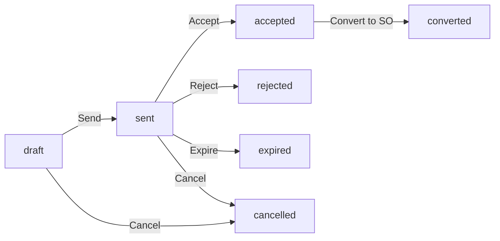
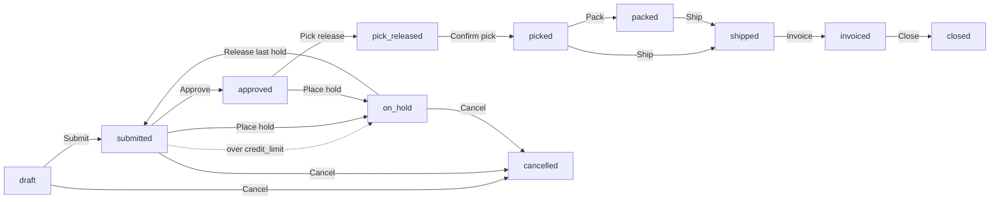
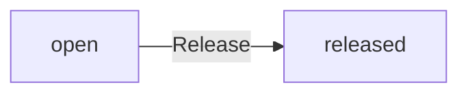
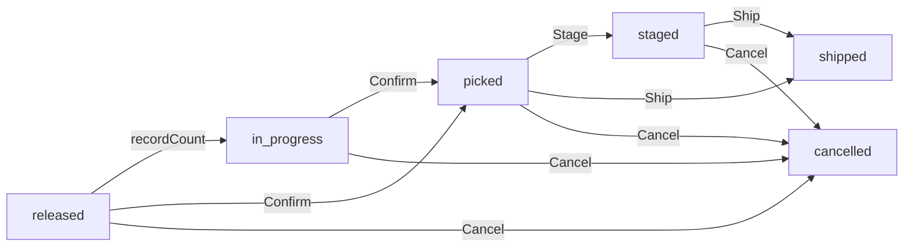
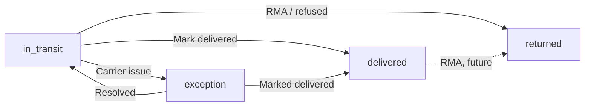
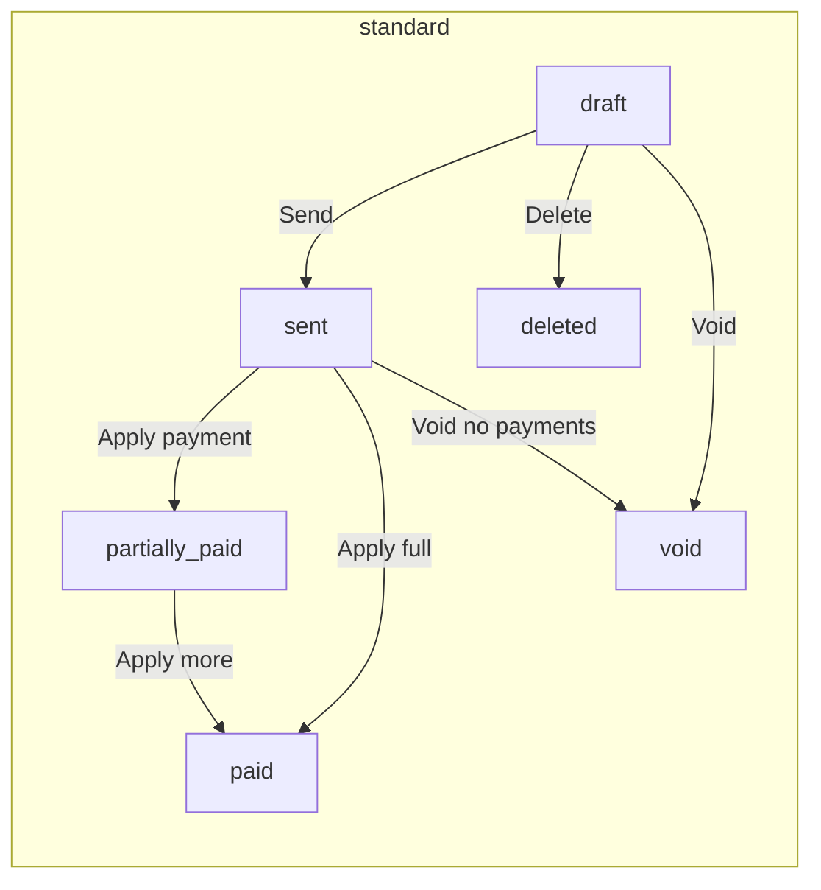
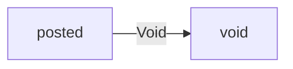

# Sales & AR (Order-to-Cash)

Everything from "customer says yes" to "money in the bank" — quote, order, hold, pick, ship, invoice, payment, aging.

> **Where do I begin?** Stand up your carriers and shipping methods ([Carriers](#carriers) → [Shipping Methods](#shipping-methods)) and any standing discounts/promotions ([Price Modifiers](#price-modifiers)) before you take real orders. Once a customer in the shared `companies` table (managed via the CRM, see the CRM user guide) has `is_customer = 1` and (optionally) a `credit_limit`, the rest of the cycle reads off that — a CRM deal flows to a [Quote](#quotes), an accepted quote converts to a [Sales Order](#sales-orders), an approved order releases a [Pick](#picks), and the [Shipment](#shipments) post creates the ISSUE_SO stock movement and unlocks invoicing.

---

## Table of contents

1. [Price Modifiers](#price-modifiers)
2. [Quotes](#quotes)
3. [Sales Orders](#sales-orders)
4. [Order Holds](#order-holds)
5. [Picks](#picks)
6. [Shipments](#shipments)
7. [Carriers](#carriers)
8. [Shipping Methods](#shipping-methods)
9. [Customer Invoices](#customer-invoices)
10. [Customer Payments](#customer-payments)
11. [AR Aging](#ar-aging)

---

## Price Modifiers

### What it is

Tenant-defined pricing rules — discounts, surcharges, promotions and freight charges — that the pricing engine applies **automatically** at quote / sales-order entry. Conditions on the modifier gate when it fires; level (`line` vs `order`) chooses whether the adjustment lands on a single line or on the post-line-discount subtotal.

> **Example:** A "10% off — Acme" rule (`type=discount`, `level=order`, `calculation=percent`, `value=10`, `conditions={"customer_id": 42}`) fires only when Acme (company #42) is the customer. A "$5/box freight surcharge" rule (`type=freight`, `level=line`, `calculation=flat_amount`, `value=5`, `conditions={"item_category_id": 7}`) adds $5 per box-category line.

### How records get created

| Method | When |
|---|---|
| UI: sidebar → Sales → Price Modifiers → **New Modifier** | The default path. |
| API (`POST /erp/sales/price-modifiers`) | Bulk-loading from an external catalogue. |

A modifier never fires retroactively — it only affects quotes/orders created (or re-priced) **after** it's saved and within its `valid_from..valid_to` window.

### Fields

| Field | Required | Notes |
|---|---|---|
| Name | Yes | Free-text label that appears on the applied-modifier audit row (`*_modifiers_applied.modifier_name`). |
| Type | Default `discount` | One of `discount` / `surcharge` / `promotion` / `freight`. `discount` and `promotion` *reduce* the gross; `surcharge` and `freight` *increase* it. |
| Level | Default `line` | `line` rules check each line in turn; `order` rules check the post-line-discount subtotal. |
| Calculation | Default `percent` | `percent` (off the line gross for line rules, off the post-line-discount subtotal for order rules) or `flat_amount` (absolute). |
| Value | Yes | Non-negative. For `percent`, capped at 100 by the controller (`PriceModifiersController::assertValue`). |
| Conditions (JSON) | Optional | Object with any of `min_amount`, `customer_id`, `item_id`, `item_category_id`, `min_qty`. **Empty conditions = applies globally** (intended). **Corrupt JSON = the modifier silently *never* fires** (fail closed). |
| Currency | Optional | Three-letter code; NULL means "matches any currency". |
| Valid from / Valid to | Optional | Inclusive date window; NULL on either side is open-ended. |
| Application order | Default 0 | Ascending — lower fires first. Two modifiers with the same `application_order` fall back to ascending `id`. |
| Is automatic | Default 1 | Only modifiers with `is_automatic = 1` are picked up by `PriceModifier::activeAutomatic` (which feeds the pricing engine). Manual-only modifiers exist for future per-line operator selection but aren't applied by the engine today. |
| Is active | Default 1 | Pause without deleting. |

### Lifecycle

CRUD only — no state machine. Edits take effect on the *next* pricing run; existing quotes/orders are not back-corrected.

### Actions

- **List / filter** — by active, by level, by type.
- **Create / edit / delete** — manager / admin only (`requireManage`).
- **Preview** — `POST /erp/sales/pricing/preview` runs `PricingService::price` against a hypothetical cart and returns the priced lines + applied modifiers + rolled-up totals without writing anything. Useful for "what would this rule do?" tests.

### Gotchas

- **Corrupt `conditions_json` fails closed.** A typo in the JSON used to silently mean "never match" — customers were over-billed because the discount stopped firing and nobody saw a signal. `PricingService::conditions` now `AppLogger::error`s loudly when JSON-decode fails; check `/storage/logs/` if a known-good rule has stopped working.
- **Percent on order-level rules is off the post-line-discount subtotal**, not the gross. A 10% order discount on a $1,000 cart that already has $200 of line discounts is $80, not $100.
- `is_automatic = 0` modifiers are saved but **not applied** anywhere today — there's no operator picker for them yet.
- Two competing modifiers can both fire — there's no "best price wins" arbitration. Use `conditions` (and `application_order` if order matters) to keep the rule set clean.

---

## Quotes

### What it is

A priced sales quotation sent to a prospect/customer. Standalone or created from a CRM deal (see the CRM user guide). Once **accepted**, it can be converted to a [Sales Order](#sales-orders) — the order copies the quote's priced lines verbatim so the customer is billed exactly what they agreed to.

> **Example:** Deal "Acme — 100 widgets" gets a quote. Lines: 100 × WIDGET-100 @ $9.00 list. PricingService fires a "Volume break ≥50" line modifier giving $0.50/unit off (= $50 discount). Subtotal $900, discount $50, tax $76, total $926. Send → customer accepts → convert → sales order SO-1-20260609-0001 carries the same numbers.

### How records get created

| Method | When |
|---|---|
| UI: sidebar → Sales → Quotes → **New Quote** | The default path. |
| `POST /erp/sales/quotes/from-deal/{dealId}` | One-click create from a CRM deal — customer = `deal.company_id`, default line uses `deal.title` × 1 @ `deal.value`. |
| API (`POST /erp/sales/quotes`) | Integration. |

On create + every edit, lines pass through `PricingService::price` so automatic modifiers fire and `quote_modifiers_applied` is rewritten.

### Fields

| Field | Required | Notes |
|---|---|---|
| Quote number | Auto | `Q-{tenant}-{YYYYMMDD}-{seq}`. |
| Customer | Yes | Must be a company with `is_customer = 1`. |
| Deal | Optional | Link back to the originating CRM deal. |
| Quote date | Default today | |
| Valid until | Optional | Free-text expiry date; no cron auto-expires today (the `expired` status is reachable via a future scheduler — manually set via API for now). |
| Currency | Default USD | Three-letter code. |
| Exchange rate | Default 1 | |
| Price list | Optional | Reference only at this stage (the line `list_price` still flows from the request). |
| Billing address | Optional | Free-text. |
| Notes / Terms | Optional | |
| Subtotal / Discount total / Tax total / Total | Derived | Refreshed by `Quote::refreshTotals`: `subtotal = Σ(qty × list_price)`, `discount_total = Σ line.discount_amount + Σ order-modifier amount`, `total = subtotal − discount_total + tax_total`. |

Each **quote line** carries: item (or pure-description), quantity, UOM, list_price, unit_price (= list_price after the pricing pass), discount_amount (net positive = reduction), tax_code_id, tax_amount, line_total (`qty × list_price − discount_amount`, tax-exclusive).

### Lifecycle

Every transition runs through `Quote::transitionStatus` — a compare-and-set on `(id, tenant, status IN allowed_from)`. A second click after another user already acted returns 422.

### Actions

- **List / filter** — by status, by customer, by deal.
- **Create / edit (draft only)** — non-draft quotes are immutable; revisions = a new quote.
- **Send** — `draft → sent`. Requires ≥1 line.
- **Accept / Reject** — `sent → accepted` / `sent → rejected`. Stamps `decided_by` / `decided_at`.
- **Cancel** — `draft|sent → cancelled`.
- **Convert to Sales Order** — `POST /erp/sales/sales-orders/from-quote/{quoteId}`. See `SalesOrderService::fromQuote`: claims the quote first (`accepted → converted`) so concurrent conversions can't both win, then copies lines + applied modifiers, then stamps `quotes.converted_order_id`. All atomic.
- **Delete** — only `draft`, `cancelled`, `rejected`, `expired` quotes can be deleted.

### Gotchas

- Only **draft** quotes can be edited. Once sent, the line set is frozen — a customer asks for a tweak, you cancel + clone instead.
- **Quote conversion claims the quote first.** Two simultaneous "Convert" clicks: the first wins the CAS to `converted`, the second sees the new status and gets a 422. The sales order is never created twice.
- A line-level modifier on the quote **must map** to a copied line at conversion time. If the originating line is gone, the conversion errors instead of silently re-bucketing the modifier to order level (which would double-count the discount).
- `expired` is a real status but **no scheduler auto-fires it today** — clients must drive the transition explicitly. (Documented limitation.)

---

## Sales Orders

### What it is

The order header you actually fulfil. Lives at the centre of O2C: priced from the [Quote](#quotes) (or entered directly), credit-checked, approved, picked, shipped, invoiced. Drives every downstream artefact — pick, shipment, customer invoice.

> **Example:** SO-1-20260609-0001, type `standard`, customer Acme, total $926. Submit → credit gate ($800 of Acme's other open orders + $926 new = $1,726, vs. limit $2,000 = under, no hold) → submitted → Approve → approved. Release a pick from Warehouse-A / Bin-FG-01 → reservation lands → confirm → ship → invoice → paid.

### How records get created

| Method | When |
|---|---|
| UI: sidebar → Sales → Sales Orders → **New Order** | Direct entry. |
| `POST /erp/sales/sales-orders/from-quote/{quoteId}` | Convert an accepted quote (the common path). |
| API (`POST /erp/sales/sales-orders`) | Integration. |

### Fields

| Field | Required | Notes |
|---|---|---|
| Order number | Auto | `SO-{tenant}-{YYYYMMDD}-{seq}`. |
| Type | Default `standard` | One of `standard` / `return` / `internal` / `drop_ship`. The header type is descriptive — fulfilment branching lives on **line** `fulfillment_type` (below). |
| Customer | Yes | Must be `is_customer = 1`. |
| Quote / Deal | Optional | Link back. |
| Order date | Default today | |
| Expected delivery | Optional | |
| Currency / Exchange rate | Default USD / 1 | |
| Price list | Optional | Reference. |
| Billing / Shipping address | Optional | Free-text on the header (per-line ship-from lives on the line). |
| Payment terms / Shipping method | Optional | Foreign keys to the master records. |
| Subtotal / Discount total / Tax total / Total | Derived | Same formula as a Quote. |

Each **sales-order line** carries: item (or description-only), quantity, UOM, list_price, unit_price, discount_amount, tax_code_id, tax_amount, line_total (tax-exclusive), an optional **ship_from_org_id + ship_from_subinventory_id + lot_id** hint, and `fulfillment_type`.

### Line `fulfillment_type`

| Value | What it means |
|---|---|
| `inventory` (default) | Pick from on-hand stock in a subinventory. The only path fully wired today. |
| `drop_ship` | Vendor ships directly to the customer; no internal stock movement. Recorded as a tag on the line — the auto-create-PO automation is on the roadmap, not yet wired. |
| `back_to_back` | Buy-to-order: a PO is raised against a known customer demand. Same: tag today, automation pending. |

### Lifecycle

`partially_invoiced` is provisioned in the enum for future split-invoice flows but the current `fromShipment`/`fromSalesOrder` paths only support a single full invoice (which lands at `invoiced`).

Every transition runs through `SalesOrder::transitionStatus` (CAS on `(id, tenant, status IN allowed_from)`).

### Actions

- **List / filter** — by status, by customer, by source quote.
- **Create / edit (draft only)** — re-runs pricing on save, replacing `sales_order_modifiers_applied`.
- **Submit** — `draft → submitted`. Order must have ≥1 line. The credit gate then evaluates:
    - If `companies.credit_hold = 1`, place an auto `credit` hold and move the order to `on_hold`.
    - Else if `companies.credit_limit IS NOT NULL` and `open_exposure(customer) + this_total > credit_limit`, same.
    - `open_exposure` sums `total` over the customer's other live orders (`submitted`/`approved`/`on_hold`/`pick_released`/`picked`/`packed`/`shipped`/`partially_invoiced`).
- **Approve** — `submitted → approved`. **Refuses if any hold is open.** Stamps `approved_by` / `approved_at`. Approver role required.
- **Place hold** — manager/admin only. Allowed types: `credit` / `manual` / `customs` / `export` / `revenue` / `sales_review` / `tax`. Order must be `submitted`, `approved` or already `on_hold`. Moves the order to `on_hold` (if not already there).
- **Cancel** — `draft|submitted|on_hold → cancelled`. Stamps `decision_notes`.
- **Convert from quote** — see [Quotes → Convert](#quotes).
- **Delete** — only `draft` and `cancelled` orders can be deleted.

### Gotchas

- **A held order loses its approval.** Releasing the last open hold sends the order back to `submitted` and **clears `approved_by`/`approved_at`** — a held order must be re-approved before it can be picked.
- **Credit hold uses the customer's *other* open exposure, not their total spend.** It re-sums on every submit, so paying down an outstanding invoice (which removes that order from the running tally — once `closed`) makes future submits easier.
- The order's line `ship_from_org_id` / `ship_from_subinventory_id` are **hints only** — the actual source bucket is named on the pick line at pick-release time, not on the SO line.
- Cancelling an order with reservations is **not handled here** — by then there's already a pick. Use [Pick → Cancel](#picks) to release the reservation; that returns the order to `approved`, then cancel the order.
- The `type = drop_ship` and line `fulfillment_type = drop_ship` / `back_to_back` enums exist but the matching automations (auto-PO creation, vendor-direct shipment) are not wired in this release. Setting them only tags the data.

---

## Order Holds

### What it is

A reason an order can't progress to (or past) approval. Multiple holds can coexist on the same order — it stays `on_hold` until **all** are released. An order with any open hold can't be approved, pick-released, or shipped.

> **Example:** SO-1-20260609-0001 hits the credit gate on submit → auto `credit` hold with reason "Credit exposure 2,250.00 exceeds limit 2,000.00". Finance reviews → customer wires $500 → finance releases the hold with reason "Wire received, ref WIRE-447". Order returns to `submitted`. Sales manager re-approves.

### Hold types

| Type | Typical placer | Why |
|---|---|---|
| `credit` | Auto on submit | Customer over `credit_limit`, or `credit_hold = 1` on the company. |
| `manual` | Sales rep | Generic operator hold (the default the SO list-screen "Hold" button uses). |
| `customs` | Logistics | Customs clearance pending. |
| `export` | Compliance | Export-licence check pending. |
| `revenue` | Finance | Revenue-recognition / contract review pending. |
| `sales_review` | Sales manager | Discount/term review for non-standard pricing. |
| `tax` | Tax team | Tax-treatment review. |

Unknown types return 422.

### Fields

| Field | Required | Notes |
|---|---|---|
| Sales order | Yes | The order being held. |
| Hold type | Yes | From the list above. |
| Hold reason | Yes-by-convention | Free-text; mandatory in practice (auditors will read it). The schema marks it nullable, but the credit-gate / UI always supply one. |
| Status | Auto | `open` on create, `released` after Release. |
| Placed by / Placed at | Auto | |
| Released by / Released at | On release | |
| Release reason | On release | Free-text. |

### Lifecycle

Release is CAS-guarded — releasing the same hold twice returns 422 (the second attempt sees `status = 'released'` and refuses).

### Actions

- **List** — `GET /erp/sales/order-holds` (defaults to `status=open`; pass `?status=released` for history or `?sales_order_id=` to scope).
- **Place** — happens on the Sales Order screen ("Hold" button) or via `POST /erp/sales/sales-orders/{id}/holds`. Approver role required.
- **Release** — `POST /erp/sales/order-holds/{id}/release` with `{ reason }`. Approver role required. Releasing the *last* open hold flips the order back to `submitted` and clears the prior approval stamps.

### Gotchas

- **Releasing a hold does NOT auto-re-approve the order.** It returns it to `submitted` so a manager can re-approve with fresh eyes.
- The credit-gate is **profile-controllable** via `companies.credit_limit` (NULL = no gating) and `companies.credit_hold` (1 = always hold). There's no system-wide "skip credit check" switch — set it per customer.
- A second concurrent hold-placement is safe: the SO's status CAS to `on_hold` no-ops if it's already there, then the service re-reads the order to assert it really is `on_hold` (so a race against a `cancel` can't leave an orphan open hold on a non-held order).
- Releasing a credit hold doesn't recompute exposure — if the customer is still over the limit and the order is re-submitted, a fresh `credit` hold is placed.

---

## Picks

### What it is

A pick worklist for one sales order. Releasing a pick **reserves** stock on `inventory_levels.reserved` so concurrent orders can't both promise the same unit. Confirming records that the picker actually grabbed it; shipping (next screen) is what posts the stock issue.

> **Example:** SO-1-20260609-0001 is `approved`. Operator releases a pick naming Warehouse-A / Bin-FG-01 / Lot LOT-2026-04 as the source for line 1 (100 × WIDGET-100). PK-1-20260609-0001 is created in status `released`, reservation +100 added to that on-hand bucket, SO advances to `pick_released`. Picker walks the warehouse, confirms → pick `picked`, SO `picked`. Operator hands to shipping.

### How records get created

UI: Picks → **Release Pick** (pick the SO + name a source bucket per line) or API: `POST /erp/sales/picks` with `{ sales_order_id, lines: [{ sales_order_line_id, src_org_id, src_subinventory_id, src_locator_id?, lot_id?, quantity? }] }`.

### Fields

**Pick header**

| Field | Required | Notes |
|---|---|---|
| Pick number | Auto | `PK-{tenant}-{YYYYMMDD}-{seq}`. |
| Sales order | Yes | Must be `approved` with no open holds. |
| Status | Auto | Starts `released`. |
| Picker | Optional | User id of the assigned picker. |
| Pick date | Default today | |
| Notes | Optional | |

**Pick line** (one per stocked SO line)

| Field | Required | Notes |
|---|---|---|
| Sales order line | Yes | The line being picked. Each SO line maps to at most one pick line. |
| Item / Quantity / UOM | Yes | Quantity must be > 0 and ≤ the SO line's ordered qty. |
| Src org / Src subinventory | Yes | Subinventory must belong to the named org. |
| Src locator | Conditional | If supplied, must belong to the named subinventory. |
| Lot | Conditional | Required if the item is lot-controlled. Becomes part of the reservation key. |
| Picked quantity | Auto | Stamped to `quantity` on Confirm; 0 until then. |

### Lifecycle

`in_progress` is reachable via partial-count flows; the standard UI confirms straight from `released → picked`. `staged` is set by future packing workflows.

### Actions

- **List / filter** — by status, by sales order.
- **Release** — Reserves stock first (`ReservationService::reserve`), then advances the SO `approved → pick_released` (CAS — concurrent releases can't both win). Non-stocked / description-only SO lines are skipped.
- **Confirm** — `released|in_progress → picked`. Stamps `picked_quantity = quantity` on every line and advances the SO `pick_released → picked`.
- **Cancel** — Any pre-ship state → `cancelled`. **Releases every reservation** the pick held, discards any packing units built against it, and returns the SO to `approved` so it can be re-picked.
- **Ship** — Done from the [Shipments](#shipments) screen (or `POST /erp/sales/shipments` with this pick's id). See below.

### Gotchas

- **The pick's order is claimed FIRST** (CAS on `sales_orders.status`). Two concurrent "Release Pick" calls for the same SO: the first wins, the loser gets a 422 *before* any reservation is written — no double-reservation.
- **Cancelling a `picked` pick releases the reservation** but does **not** undo any movement — by definition nothing has shipped yet at this point. If the pack/ship has already happened, you can't cancel; use a [Return SO](#sales-orders) and a goods receipt.
- A pick line's quantity cannot exceed the SO line's ordered quantity (422 if it does). Partial picks are allowed within that ceiling.
- The pick screen does not check ATP at release — it simply tries to reserve. A reservation against insufficient on-hand fails inside `ReservationService::reserve` and the whole release rolls back. Run ATP via `GET /erp/sales/atp?item_id={id}&org_id={org}` (query-string, not path param) before releasing if you want a pre-flight check.

---

## Shipments

### What it is

The dispatch event. Posting a shipment is the moment stock actually leaves the building — it posts a single ISSUE_SO `stock_movement` (decrement on_hand + FIFO COGS), releases the reservations the pick held, advances the pick to `shipped` and the SO to `shipped`. All atomic.

> **Example:** PK-1-20260609-0001 is `picked`. Operator selects carrier "FedEx", method "Ground", tracking "794-XXX". Submit → ISSUE_SO movement consumes 100 EA from Lot LOT-2026-04 at $4.80 FIFO ($480 COGS) → reservations released → SH-1-20260609-0001 written in_transit. Days later the truck arrives — operator marks Delivered.

### How records get created

| Method | When |
|---|---|
| UI: Picks → row action **Ship** | The default path — the screen lets you fill carrier / method / tracking. |
| API (`POST /erp/sales/shipments`) | Integration, with `{ pick_id, carrier_id?, shipping_method_id?, tracking_number?, ship_date?, freight_cost?, notes? }`. |

### Fields

| Field | Required | Notes |
|---|---|---|
| Shipment number | Auto | `SH-{tenant}-{YYYYMMDD}-{seq}`. |
| Sales order / Pick | Yes | Pick must be in `picked` or `staged`. |
| Ship date | Default today | |
| Carrier / Shipping method | Optional | FKs to [Carriers](#carriers) and [Shipping Methods](#shipping-methods). |
| Tracking number | Optional | Free-text. |
| Status | Auto | Starts `in_transit` (shipping IS the post — there's no separate "pending" wait state). |
| Freight cost | Default 0 | Recorded for cost analysis; not posted to GL today. |
| Currency | Default USD | |
| Stock movement id | Auto | Stamped after the ISSUE_SO posts so audit can drill from a shipment straight into the movement. |
| Notes | Optional | |

### Shipment lines

One per pick line, capturing `(sales_order_line_id, pick_line_id, item_id, quantity)` and (when packing is in use) `packing_unit_id`.

### Lifecycle

The schema enum also contains `pending` and `cancelled` for completeness; today `in_transit` is the create-default and the active states are `in_transit ↔ exception → delivered|returned`. The status transition (`updateStatus`) allows moving from `pending|in_transit|exception` to any of `in_transit|delivered|exception|returned`.

### Actions

- **List / filter** — by status, by sales order.
- **Ship (from Picks)** — Posts the ISSUE_SO movement, releases reservations, writes shipment lines, advances pick + order.
- **Update status** — `POST /erp/sales/shipments/{id}/status` with `{ status }`. The list view exposes a one-click "Delivered" button on in-transit shipments.

### Gotchas

- **The stock movement is created at ship-post, not at pick-confirm.** A pick that's been confirmed (and the items physically grabbed off the shelf) but not yet shipped does **not** decrement on_hand — `reserved` is what holds the units. This is intentional: until the truck rolls, the goods are still yours.
- **Ship-post claims the pick + order BEFORE issuing stock.** Two concurrent ship attempts on the same pick: the first wins the CAS, the second fails 422 before any double-issue can happen.
- A failed ISSUE_SO (insufficient on_hand from a bad reservation, closed period on the sub-ledger, etc.) **rolls back everything** — the pick stays `picked`, the SO stays `picked`, no half-state. Fix the upstream problem and retry.
- Marking a shipment `returned` here does **not** auto-create a return SO or a goods receipt — it just labels the shipment. The RMA flow (return SO + return goods receipt) is on the roadmap.
- `freight_cost` is recorded but not currently posted to GL — to capitalise it onto COGS, post a manual journal until the freight-allocation feature lands.

---

## Carriers

### What it is

A flat registry of shipping carriers per tenant (FedEx, UPS, DHL, your in-house fleet…). Used as a foreign key on shipments and as the parent for shipping methods.

### Fields

| Field | Required | Notes |
|---|---|---|
| Name | Yes | Free-text. |
| Integration code | Optional | A short code for the future label-printing / tracking-API integration. |
| Is active | Default 1 | Pause without deleting. |

### Actions

CRUD — list, create, edit, delete. No state machine.

### Gotchas

- A carrier in use by a shipment can be deleted at the DB level (no FK cascade today); deleting one will leave historic shipments with a NULL-resolved `carrier_name`. Prefer **deactivating** over deleting.

---

## Shipping Methods

### What it is

A service level under a carrier — "FedEx Ground", "FedEx 2-Day", "UPS Overnight". The order header carries `shipping_method_id` for routing intent; the shipment carries it for the actual dispatch.

### Fields

| Field | Required | Notes |
|---|---|---|
| Carrier | Optional | FK to [Carriers](#carriers). Nullable so you can model a "no specified carrier" generic method. |
| Name | Yes | Free-text display name. |
| Service level | Optional | Short code (e.g. `GROUND`, `2DAY`) — used by future label-printing integrations. |
| Is active | Default 1 | |

### Actions

CRUD. List filters by `carrier_id` and `is_active`.

### Gotchas

- A shipping method is loosely bound to its carrier today — nothing forces the shipment's `carrier_id` to match the shipping method's `carrier_id`. Choose carefully.

---

## Customer Invoices

### What it is

The tenant's receivable billed to a customer. Generated from a shipped sales order (`fromSalesOrder`), from a single shipment (`fromShipment`), or entered manually. Distinct from the platform `invoices` table — *that* one is your Elytz subscription bill.

> **Example:** SO-1-20260609-0001 has been shipped (one full shipment). Operator clicks "Invoice" → `fromSalesOrder` claims the order (`shipped → invoiced`), creates CI-1-20260609-0001 in `draft`, copies the 1 line at the SO price, prorates the order-level discount across the lines so the invoice total = the order total. Operator clicks Send → invoice flips to `sent`, the AR sub-ledger journal posts (DR AR / CR Revenue / CR Tax). Customer pays $926 a week later → see [Customer Payments](#customer-payments).

### How records get created

| Method | When |
|---|---|
| `POST /erp/ar/customer-invoices/from-sales-order/{soId}` | The common path. Order must be `shipped`. Copies all SO lines, prorates the order-level modifier across them. |
| `POST /erp/ar/customer-invoices/from-shipment/{shipmentId}` | When you split-bill by shipment. Prices each shipped qty from its SO line (discount + tax prorated by `shipped / ordered`; order-level modifier prorated by `shipped_gross / order_gross`). |
| UI: AR → Customer Invoices → **New Invoice** + API (`POST /erp/ar/customer-invoices`) | Manual capture for non-SO billing (one-off services, opening balances). |

### Fields

| Field | Required | Notes |
|---|---|---|
| Invoice number | Auto | `CI-{tenant}-{YYYYMMDD}-{seq}`. |
| Type | Default `standard` | One of `standard` / `credit_memo` / `debit_memo`. (Deposit / chargeback / guarantee invoice types are **not** in the schema today — work around with `standard` + notes or open a feature request.) |
| Customer | Yes | `is_customer = 1`. |
| Sales order / Shipment | Optional (auto on `from-*`) | Link back. |
| Invoice date | Default today | |
| Due date | Default = `invoice_date + companies.payment_terms_days` | NULL if the customer has no terms set. |
| Currency / Exchange rate | Default USD / 1 | |
| Subtotal / Discount total / Tax total / Total | Derived | `subtotal = Σ(qty × unit_price)`, `discount_total = Σ discount_amount`, `total = subtotal − discount_total + tax_total`. |
| Paid amount / Balance due | Derived | Updated by payment applications. `status = paid` once `balance_due ≤ 0.0001`. |
| Billing address | Optional | |
| Payment terms | Optional | FK. |
| Notes / Terms | Optional | |

Each **invoice line** carries: item (or description), quantity, UOM, unit_price, discount_amount, tax_code_id, tax_amount, line_total (defaults to `qty × unit_price − discount`), and an optional back-link `sales_order_line_id` for reconciliation.

### Type lifecycle

`credit_memo` and `debit_memo` follow the same draft → sent → paid arc; only the sign of the post differs (a credit memo posts the contra entry — DR Revenue / CR AR).

Statuses (DB enum): `draft` / `sent` / `partially_paid` / `paid` / `void` / `cancelled`. `cancelled` is reserved for draft-stage abandonment; today's voiding path uses `void`.

### Actions

- **List / filter** — by status, by customer, by sales order.
- **Create / edit (draft only)** — non-draft invoices are immutable.
- **From Sales Order** — claims `shipped → invoiced` first, then writes the draft invoice. Two concurrent generations can't both bill the same order (CAS wins prevent it).
- **From Shipment** — same claim, but the invoice header carries `shipment_id` and the lines reflect only the shipped fraction.
- **Send** — `draft → sent`. Refuses non-positive totals (you can't "send" a $0 invoice). Auto-posts the AR sub-ledger journal in the same transaction — a posting failure (closed period, missing template account) rolls the Send back and the invoice stays a draft.
- **Void** — `draft|sent → void`. **Refuses if any payment is applied** ("void the payments first"). Releases the linked SO `invoiced → shipped` so it can be re-invoiced.
- **Delete** — only `draft` invoices can be deleted.

### Gotchas

- **The sub-ledger post is part of the Send transaction.** If your sub-ledger template `event_type = 'customer_invoice'` is misconfigured or the accounting period for `invoice_date` is closed, the Send returns 422 and the invoice stays draft — no half-state where the invoice is "sent" but the GL doesn't know about it.
- **Order-level modifiers are prorated**, not lost. `fromSalesOrder` and `fromShipment` both spread the order-level discount across the lines proportional to gross, with the rounding residual on the last line so the parts sum back exactly. Without this prorating, the invoice total would silently undershoot the order total by the discount amount.
- **`from-*` paths claim the order first.** A duplicate-click on Invoice → the first creates CI-…0001 and flips the order to `invoiced`; the second sees the order is no longer `shipped` and gets a 422. No double billing.
- A voided invoice returns the order to `shipped` so you can re-invoice — but if the order has *moved* (e.g. someone cancelled it in the gap, hard to do but possible), the void detects the desync and aborts rather than silently leaving the order in `invoiced` with no covering invoice.
- The `partially_invoiced` SO status is provisioned in the enum but the current `from-*` paths only support a single full invoice; partial invoicing across multiple shipments lands the order at `invoiced` after the first one.

---

## Customer Payments

### What it is

Cash received from a customer, applied to one or more of their open invoices. Any unallocated portion becomes on-account credit (`unapplied_amount`), available to apply later.

> **Example:** Acme wires $1,000 against CI-…0001 ($926 balance) and CI-…0002 ($60 balance). Operator records CP-1-20260609-0001 with two applications: $926 → CI-…0001 (flips it to `paid`), $60 → CI-…0002 (flips it to `paid`). Unapplied = $14 sitting on the payment as on-account credit. The bank-account ledger gets DR $1,000 / CR AR $986 / CR Unapplied AR $14 via the sub-ledger template.

### How records get created

| Method | When |
|---|---|
| UI: AR → Customer Payments → **Record Payment** | Default path — pick customer + amount + per-invoice applications. |
| API (`POST /erp/ar/customer-payments`) | Integration. |
| Bank statement reconciliation | A future flow: matching a statement line to a customer creates a payment here. Not yet wired. |

### Fields

| Field | Required | Notes |
|---|---|---|
| Payment number | Auto | `CP-{tenant}-{YYYYMMDD}-{seq}`. |
| Customer | Yes | `is_customer = 1`. |
| Payment date | Default today | |
| Amount | Yes | Must be > 0. Sum of `applications.applied_amount` must be ≤ this. |
| Currency / Exchange rate | Default USD / 1 | |
| Method | Default `bank_transfer` | One of `cash` / `bank_transfer` / `card` / `check` / `other`. Unknown values silently coerced to `bank_transfer`. |
| Reference | Optional | Check number / wire ref / etc. |
| Bank account | Optional | FK to [Bank Accounts](./cash-bank.md#bank-accounts) — used by the sub-ledger template to debit the right cash GL account. |
| Status | Auto | `posted` on create, `void` after Void. |
| Unapplied amount | Derived | `amount − Σ applications`. Zeroed on Void so a voided receipt never shows phantom on-account credit. |
| Notes | Optional | |

Each **application** carries `(payment_id, customer_invoice_id, applied_amount)` plus `created_by`.

### Lifecycle

There's no "draft" / "pending approval" state — the receipt either posts straight to `posted` or doesn't get created at all.

### Actions

- **List / filter** — by status, by customer.
- **Record** — Validates the customer is real, validates each application (no duplicate invoices in the same receipt, applied ≤ invoice balance, no over-application beyond the receipt amount), locks each invoice `FOR UPDATE`, applies, recomputes paid/balance/status (`sent` → `partially_paid` → `paid`). Auto-posts the cash-receipt sub-ledger journal at the end — a posting failure rolls the entire receipt back.
- **Void** — `posted → void`. Reverses every application by re-locking each invoice and subtracting back. Zeroes `unapplied_amount`.

### Gotchas

- **Each application locks the invoice with `FOR UPDATE`** so two operators applying the same on-account credit to the same invoice can't both succeed — the loser sees an updated balance and either fits in or 422s.
- **Voiding a receipt whose target invoice has gone missing** (e.g. invoice deleted via direct SQL — should not happen via the UI since payment-applied invoices can't be voided/deleted) **does not silently drop the cash.** The service `AppLogger::error`s loudly with the payment id, application id, target invoice id and applied amount, and continues processing the other applications. The operator must reconcile manually. This used to be silent — round-3 fix.
- **`CustomerPaymentService::create` nests under an open transaction** when one already exists (`$owns` guard) so a future Lockbox-style batch importer can wrap many payments atomically without nested-`beginTransaction` PDO errors. Today's single-payment path opens and commits its own transaction.
- A payment can't be over-applied — sum of applications > `amount` returns 422 *before* commit. Likewise applying more than the invoice balance returns 422.
- A receipt with `applied = 0` (pure on-account) **skips the sub-ledger post** — there's no AR to credit. The unapplied stays on the payment until you apply it (which today means voiding + re-recording, since there's no standalone "apply later" endpoint).

---

## AR Aging

### What it is

A read-only report of every open customer invoice (`status IN ('sent', 'partially_paid')` AND `balance_due > 0.0001`) bucketed by days past due, as of a chosen date.

> **Example:** As of 2026-06-09: Acme has $0 current, $926 in the 1-30 bucket (CI-…0001 due 2026-05-15, 25 days late), $0 31-60, $0 61-90, $0 90+. Beta-Corp has $1,200 in 61-90. The report rolls per customer and a grand total at the bottom.

### Fields (per row)

| Column | Source |
|---|---|
| Customer | join to `companies` |
| Current | `due_date IS NULL` *or* `due_date >= as_of`. Invoices without a due date are treated as current. |
| 1–30 | `1 ≤ as_of − due_date ≤ 30` |
| 31–60 | `31 ≤ days ≤ 60` |
| 61–90 | `61 ≤ days ≤ 90` |
| 90+ | `> 90` |
| Total | row sum |

Totals across all customers are also returned.

### Actions

- **`GET /erp/ar/aging?as_of=YYYY-MM-DD`** — defaults to today if the query param is absent.

### Gotchas

- **A malformed `as_of` returns 422**, not "fell back to today". An authoritative-looking aging report for the wrong date is dangerous — the controller validates the format first.
- The buckets are computed in SQL via `DATEDIFF`, so the report respects the *server's* date arithmetic. Tenants in different timezones see the same bucket boundaries (DATEDIFF doesn't care about time-of-day).
- Invoices without a `due_date` collapse into Current — this is intended for opening-balance imports, but if you let it leak past the import phase you'll have invisible aging. Always set `payment_terms_days` on the customer or `due_date` on the invoice.
- Voided invoices are excluded by the `status IN ('sent', 'partially_paid')` filter, so a voided invoice instantly disappears from aging — there's no "void & age out separately" view.

---

## Recurring Invoices

Recurring billing templates live operationally under the AR sub-tree at `/erp/recurring-invoices`, but the **canonical documentation** is in **[service.md → Recurring Invoices](./service.md#recurring-invoices)**. Service contracts are the most common driver (managed-services retainer, monthly maintenance), so the docs are grouped there alongside Service Contracts / Service Tickets / Service Visits. Refer to that file for fields, lifecycle (`active / paused / completed / cancelled`), the `tick` cron entry point, idempotency rules, and gotchas.

---

## Cross-references

- **CRM Deals** — [Quotes](#quotes) can be created from a CRM Deal (see the CRM user guide); the deal id is carried forward through the SO via `quote.deal_id` and `sales_orders.deal_id`.
- **Inventory** — [Picks](#picks) reserve and [Shipments](#shipments) issue against the buckets defined in [Inventory On Hand](./inventory.md#on-hand) (and consume FIFO layers per [Receipts](./inventory.md#receipts)).
- **Items** — Every priced line resolves through the [Item Master](./items.md#item-master). Lot-controlled items require a `lot_id` on the pick line; serial-controlled items require serial selection at ship-post time.
- **Finance & Tax** — [Price Lists](./finance.md#price-lists), [Payment Terms](./finance.md#payment-terms), and [Tax Rates](./finance.md#tax-rates) feed the pricing engine; the shared `companies` table (CRM) supplies `credit_limit` for the credit gate.
- **GL** — Sending a [Customer Invoice](#customer-invoices) auto-posts via the sub-ledger template `event_type = 'customer_invoice'`; recording a [Customer Payment](#customer-payments) auto-posts `event_type = 'customer_payment'`. See [Sub-Ledger Postings](./gl.md#sub-ledger-postings) and the [Journal Entries deep-dive](./deep-dives/journal-entries.md).
- **Cash & Bank** — `customer_payments.bank_account_id` points at the [Bank Account](./cash-bank.md#bank-accounts) that received the funds; matching the receipt back to a [Bank Statement](./cash-bank.md#bank-statements) closes the cash-side loop. See the [Bank Reconciliation deep-dive](./deep-dives/bank-reconciliation.md).
- **Procurement** — `drop_ship` / `back_to_back` SO line fulfilment types tag the order for a downstream PO; the matching automations (auto-PO creation, vendor-direct shipment) are roadmap items in [Procurement → Purchase Orders](./procurement.md#purchase-orders).
- **Reports** — Beyond [AR Aging](#ar-aging), build revenue-by-customer and pipeline-conversion KPIs through the report builder (see [reports.md](./reports.md#custom-reports)) over `sales_orders`, `customer_invoices`, and `customer_payments`.
