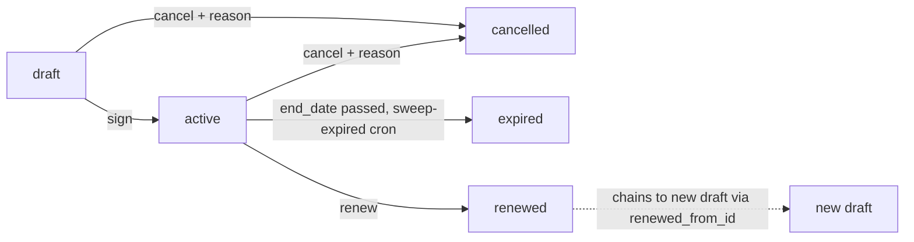
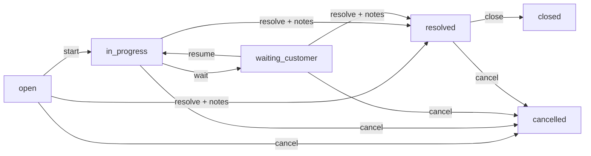
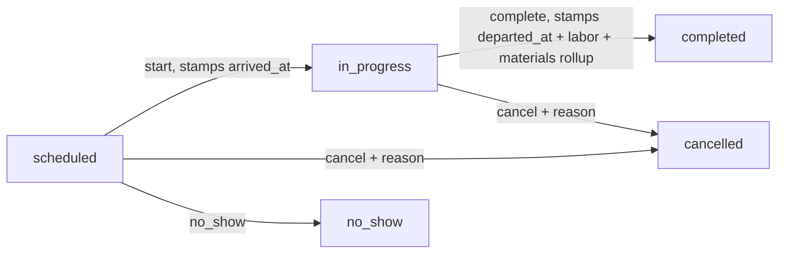
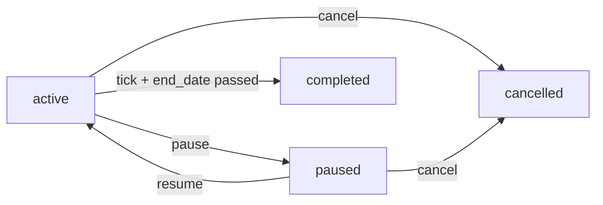
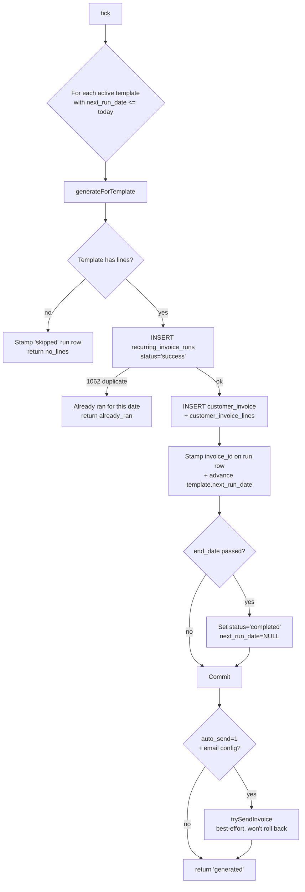

# Service

Post-sale customer support: the contract you sold them, the tickets they raise, the visits your technicians make, and the recurring invoice that bills them every month for the privilege.

> **Where do I begin?** Sign a [Service Contract](#service-contracts) first — it's the parent record that ties tickets, visits, and recurring invoices together. Customers without a contract can still raise standalone [Service Tickets](#service-tickets), but billing follow-through (recurring invoices, included-visit accounting) needs the contract on file. Once the contract is `active`, a [Recurring Invoice Template](#recurring-invoices) can bill it on the agreed cadence, and tickets/visits flow off it naturally.

---

## Table of contents

1. [Service Contracts](#service-contracts) — `/erp/service/contracts`
2. [Service Tickets](#service-tickets) — `/erp/service/tickets`
3. [Service Visits](#service-visits) — `/erp/service/visits`
4. [Recurring Invoices](#recurring-invoices) — `/erp/recurring-invoices`

---

## Service Contracts

### What it is

A commercial commitment between you and a customer: scope, term, billing cadence, optional auto-renewal. Each contract has one or more **lines** describing what's covered (a recurring monthly retainer, a one-time setup fee, a usage-based add-on), and a status that walks `draft → active → expired / renewed / cancelled`.

> **Example:** Customer `Acme Foods` signs an annual managed-IT contract `SC-1-0042`: name "Acme IT Managed Services 2026", start `2026-01-01`, end `2026-12-31`, billing cycle `monthly`, currency USD, total value $24,000, renewal term 12 months, auto_renew on. Three lines: a $1,800/month managed-services retainer (`billing_type=recurring`), a one-off $4,800 onboarding fee (`one_time`), and a $20/incident overage rate (`usage_based`). On `sign`, status flips to `active`, `signed_date` is stamped today, and `next_bill_date` defaults to `start_date`.

### How contracts get created

| Method | When |
|---|---|
| UI (`/erp/service/contracts` → New) | The default path. Pick a customer, fill the header, add lines, save as `draft`. |
| API (`POST /api/erp/service-contracts`) | Integration that quotes contracts from an external CRM. |
| Renewal (`POST /api/erp/service-contracts/:id/renew`) | Creates a new `draft` chained via `renewed_from_id` from a still-`active` parent. See [Renew](#renew) below. |

The contract number defaults to `SC-{tenant}-{4-digit-seq}` if you don't supply one; the sequence is `COUNT(*) + 1` per tenant.

### Fields (header)

| Field | Required | Notes |
|---|---|---|
| Customer | Yes | `companies.id` in this tenant. |
| Contract Number | Auto / manual | UNIQUE per tenant. Defaults to `SC-{tenant}-{nnnn}`. |
| Name | Yes | Display label. |
| Description | Optional | |
| Start Date | Yes | |
| End Date | Optional | If absent, contract is open-ended (sweep-expired won't touch it). |
| Billing Cycle | Default `monthly` | `monthly` / `quarterly` / `semi_annual` / `annual` / `one_time`. Other values are coerced to `monthly`. |
| Next Bill Date | Auto on sign | Defaults to `start_date` on `sign` if not provided. |
| Auto-Renew | Default off | Tinyint flag — drives renewal-reminder cron, not auto-renewal of the contract itself. |
| Renewal Term Months | Optional | Used to compute `end_date` of the renewal child when [renew](#renew) is invoked without an explicit `end_date`. |
| Currency | Default `USD` | ISO-3. |
| Total Value | Default 0 | Headline contract value — informational; the bill amount is computed from the lines. |
| Terms / Notes | Optional | Free-text. |
| Signed Date / Signed By User / Signed By Customer | On sign | Stamped automatically by the **Sign** action (see Actions below). |
| Cancelled At / By / Reason | On cancel | Stamped by the **Cancel** action (see Actions below). |
| Renewed From | On renew | `renewed_from_id` on the new child contract points back at its parent. |

### Fields (lines)

| Field | Required | Notes |
|---|---|---|
| Item | Optional | `items.id`; useful for revenue-account routing. |
| Description | Yes | What is the customer paying for. |
| Quantity | Default 1 | |
| UOM | Optional | |
| Unit Price | Default 0 | |
| Line Total | Auto | `quantity * unit_price`, recomputed on every line update. |
| Billing Type | Default `recurring` | `recurring` / `one_time` / `usage_based`. Recurring-invoice templates that source from a contract pull only the recurring lines (planned — current generator pulls from its own template lines). Unknown values are coerced to `recurring`. |
| Tax Code | Optional | |

### Lifecycle



CAS-protected — every transition is a single `UPDATE ... WHERE status IN (...)` that affects either exactly one row or zero. A second click after another user already signed/cancelled/renewed returns 422 with the current status in the message.

Terminal states (`expired`, `cancelled`, `renewed`) cannot be edited, signed, or have their lines mutated — the controller's `update` and line endpoints refuse with `Cannot edit a {status} contract.` / `Lines can only be edited while the contract is in draft.`.

### Actions

- **List** — sidebar → ERP → Service → Service Contracts. Filter by status or customer.
- **Create / Edit (draft only)** — header + line CRUD allowed while status is `draft`. Once signed, the controller blocks line add/update/delete.
- **Sign** — `draft → active`, stamps `signed_date = today`, `signed_by_user_id = current user`, `signed_by_customer = body.signed_by_customer` (signer's name), and `next_bill_date = next_bill_date OR start_date`.
- **Cancel** — `draft|active → cancelled`. **Reason is required** (`InvalidArgumentException` if blank) — auditor evidence. Stamps `cancelled_at`, `cancelled_by`, `cancellation_reason`.
- **Renew** — see below.
- **Delete** — only allowed when status is `draft`. Lines are cascade-deleted inside a transaction. Active / cancelled / expired / renewed contracts cannot be deleted — cancel them instead.
- **Sweep Expired** — `POST /api/erp/service-contracts/sweep-expired` flips every active contract with `end_date < CURDATE()` to `expired`. Returns `{ expired, scanned }`. Per-row audit (`contract.expire_auto`) is written for each transition so operators can reconstruct *when* each contract auto-expired.

### Renew

`POST /api/erp/service-contracts/:id/renew` body `{ name?, start_date?, end_date?, renewal_term_months? }`.

Atomic, transactional, FOR-UPDATE-locked on the source:

1. `SELECT ... FOR UPDATE` on the source contract — prevents two concurrent renew calls from both passing the "must be active" check and both creating draft children.
2. Compute the new term:
   - `newStart = body.start_date OR (source.end_date + 1 day) OR today`
   - `newEnd = body.end_date OR (newStart + renewal_term_months − 1 day)`
   - If neither `end_date` nor `renewal_term_months` is available, the call refuses with 422.
3. Create a new `draft` contract with the same header (cloned name + " (Renewal)", billing_cycle, currency, etc.) and stamp `renewed_from_id` pointing at the source. The follow-up `UPDATE` checking `renewedFromAffected !== 1` is a defence against a silent 0-row write — a renewal child with NULL parent is a permanent financial-provenance gap.
4. Clone every line from the source into the new contract (item_id, description, quantity, uom_id, unit_price, billing_type, tax_code_id).
5. Transition the source `active → renewed` (CAS).
6. Commit. Returns the new draft contract with lines embedded.

**[Round-2 fix]** Renew is well-formed even when called with an empty options body — the FOR UPDATE on the source means there's no race between the active check and the transition, and the contract's own `renewal_term_months` is the fallback for the new term.

### Gotchas

- **Line edits lock at sign.** Once a contract is `active`, the line-CRUD endpoints refuse with `Lines can only be edited while the contract is in draft.` — re-pricing has to go through a new contract (renew) or a manual customer invoice.
- **Cancel requires a reason.** Empty / whitespace-only reasons return 422 (`InvalidArgumentException`). That string is what an auditor will read three years later.
- **Sweep-expired won't re-expire a manually-cancelled contract.** The CAS transition only matches `WHERE status = 'active'`, so cancelled contracts past their end_date stay cancelled.
- **Permissions.** All mutations gated to `super_admin` / `admin` — read is open to any authenticated tenant user. Regular users cannot sign, cancel, renew, mutate lines, or run the sweep.
- **The renewed contract starts as draft.** Sign it explicitly when ready — auto-renew flag drives reminder cadence, *not* automatic sign. Until then there is no `next_bill_date` advance and recurring invoicing on the new contract doesn't fire.

---

## Service Tickets

### What it is

A customer-raised issue against a contract — outage, defect, request for change. Carries priority, SLA clock, an assignee, and a lifecycle walking `open → in_progress → waiting_customer → resolved → closed`. Optional cancel as an operator escape hatch.

> **Example:** Acme's primary file server is down at 09:14. Operator logs ticket `TKT-1-00134`: customer Acme Foods, contract `SC-1-0042`, subject "FS-PROD-01 unreachable", priority `critical`, sla_response_minutes 60, reported_at `2026-06-09 09:14`. The system stamps `sla_due_at = 2026-06-09 10:14`. Tech accepts → `start` flips status to `in_progress`. They patch, ping the customer for confirmation → `wait` flips to `waiting_customer`. Customer replies "all good" → `resume` then `resolve` with notes "Replaced failed NIC; rebooted; FS-PROD-01 ping OK". A few days later supervisor `close`s the ticket.

### How tickets get created

| Method | When |
|---|---|
| UI (`/erp/service/tickets` → New) | The default path. Operator logs the call. |
| API (`POST /api/erp/service-tickets`) | Customer portal / mail-to-ticket integration. |
| Linked to contract / standalone | `contract_id` is **optional**. Tickets can exist without a contract (free-tier customer, prospect, internal). |

Ticket number defaults to `TKT-{tenant}-{5-digit-seq}`; UNIQUE per tenant.

### Fields

| Field | Required | Notes |
|---|---|---|
| Customer | Yes | `companies.id`. |
| Contract | Optional | If present, ties the ticket to a `service_contracts` row. |
| Subject | Yes | Short label. |
| Description | Optional | |
| Priority | Default `medium` | `low` / `medium` / `high` / `critical`. List view sorts critical → high → medium → low. |
| Status | Lifecycle | See state machine. |
| Reported At | Default NOW | When the customer reported it. Used as the SLA-clock anchor — *not* `created_at`, so a back-logged ticket doesn't get an unrealistic SLA. |
| Reported By Contact | Optional | Free-text — who at the customer reported it. |
| Assigned To | Optional | `users.id` in this tenant. Cross-tenant assignee is refused; see [Assign](#assign). |
| SLA Response Minutes | Optional | When set on create, `sla_due_at = reported_at + sla_response_minutes`. |
| SLA Due At | Auto | Computed at create, **locked** to the reported moment. |
| SLA Breached At | Auto | Set by the breach sweep when the ticket is past due. |
| Resolved At / By User / Notes | On resolve | Resolution notes are **required** (non-empty). |
| Closed At / By | On close | |
| Cancelled At / By | On cancel | |

### Lifecycle



`closed` and `cancelled` are terminal — the controller's `update` and `destroy` refuse with `Cannot edit a {status} ticket.` and only `open` tickets can be deleted (everything else has audit trail to preserve).

### Actions

- **List** — filter by status / priority / customer / assignee. Sorted by priority then created_at desc.
- **Show** — embeds visits for the ticket via `ServiceVisit::listForTenant(..., ['ticket_id' => $id])`.
- **Create / Update** — header fields editable on non-terminal tickets; the line-edit equivalent for tickets doesn't exist (tickets don't have lines).
- **Start** — `open → in_progress`.
- **Wait** — `in_progress → waiting_customer`. Refused from any other source.
- **Resume** — `waiting_customer → in_progress`. Refused from any other source.
- **Resolve** — `open|in_progress|waiting_customer → resolved`. Body `{ resolution_notes }` is **required and non-empty** (`InvalidArgumentException` otherwise) — auditor evidence.
- **Close** — `resolved → closed`. Stamps `closed_at`, `closed_by`. No other source allowed.
- **Cancel** — any non-terminal `→ cancelled`. **[Round-2 fix]** When cancelling a `resolved` ticket, the existing `resolution_notes` are *preserved* and the cancel reason is appended as `\n[CANCELLED] {reason}` — overwriting would erase the original resolution audit trail (compliance regression). The append happens via a separate `UPDATE` because `resolution_notes` isn't in the transition allowlist (by design).
- **Assign** — see below.
- **Sweep SLA** — `POST /api/erp/service-tickets/sweep-sla` flips `sla_breached_at = NOW()` on every `(open|in_progress|waiting_customer)` ticket whose `sla_due_at < NOW()` and isn't already breached. Per-row audit (`ticket.sla_breach`) for each flip so SOC can investigate individual breaches, not just a bulk counter.

### Assign

`POST /api/erp/service-tickets/:id/assign` body `{ assignee_user_id }`.

**[Round-2 fix]** Defence-in-depth:

1. Look up `users.id = assignee AND tenant_id = current AND is_active = 1` — a cross-tenant or inactive assignee throws `Assignee is not an active user in this tenant.`
2. `UPDATE service_tickets` setting the assignee.
3. **Re-read** the row and verify `assigned_to_user_id` actually matches the requested value — if not (race with another reassign), throw `Assignment did not stick — another user may have reassigned. Refresh and retry.`

This catches both the cross-tenant attack (a forged tenant-id in the request payload would still be caught) and the silent-no-op race where two managers fight over the same ticket.

### SLA breach mechanics

- `sla_due_at` is computed once at create-time from `reported_at + sla_response_minutes * 60`. It is **never** recomputed on subsequent updates.
- The breach sweep only flips `sla_breached_at` for tickets currently in `open` / `in_progress` / `waiting_customer`. The SLA clock stops at `resolved` — a late resolution will still show breached if the sweep caught it before resolution, but a ticket that was resolved before the due time and then re-opened (it can't, since `closed` is terminal) wouldn't double-stamp.
- The sweep `SELECT`s the candidate ids first, then issues a bounded `UPDATE` with the id-list — this is so per-row audit (`ticket.sla_breach`) can be written for each flip. A bulk UPDATE with no per-row audit was a compliance gap (operators need to know *which* tickets breached, not just "12 did").
- Sweep is gated to `super_admin` / `admin` / `manager`.

### Gotchas

- **Resolution notes are required.** `resolve` refuses empty / whitespace `resolution_notes` with 422. No silent resolution.
- **Cancelling preserves resolution_notes (round-2 fix).** Don't cancel a resolved ticket expecting the original notes to disappear — they're appended-to, not overwritten.
- **Cross-tenant assignee refused (round-2 fix).** The defence-in-depth check rejects an assignee that doesn't belong to the calling tenant *or* is inactive. The post-update re-read also catches silent same-value writes and assignment races.
- **`sla_due_at` is locked at create.** Editing `sla_response_minutes` later does *not* recompute the due time. Cancel + re-open isn't possible (closed is terminal); if the SLA was set wrong, it stays wrong on that ticket.
- **Permissions.** Mutations gated to `super_admin` / `admin` / `manager` (the operational tier). Read is open to any tenant user.
- **Only `open` tickets can be deleted.** Everything else has audit trail to preserve — `cancel` instead.

---

## Service Visits

### What it is

A scheduled (or in-progress, or completed) field visit by one of your technicians to a customer site, against a contract and/or a ticket. Carries the labor clock (`arrived_at`, `departed_at`, `labor_hours`, `labor_rate`, `labor_cost`), a list of materials consumed (`service_visit_materials`), and a `total_cost` rollup that's locked in on completion.

> **Example:** Visit `VST-1-00087`: ticket `TKT-1-00134` ("FS-PROD-01 unreachable"), contract `SC-1-0042`, customer Acme Foods, technician Joe Tech, scheduled_at `2026-06-09 11:00`, labor_rate $120/h. Joe arrives at 11:07 (operator hits `start` → `arrived_at = 2026-06-09 11:07`, status `in_progress`). On site he adds two materials lines via `addMaterial`: 1× replacement NIC at $48 unit_cost = $48 line_total; 0.5× CAT-6 patch run at $0.30/m unit_cost = $0.15 line_total. At 12:34 he leaves, labor_hours `1.5`. Operator hits `complete` with `{ departed_at: '12:34', labor_hours: 1.5 }`: `labor_cost = 1.5 × 120 = $180`, `materials_cost = SUM(line_total) = $48.15`, `total_cost = $228.15`. Status → `completed`. All four fields are stamped atomically inside a transaction with FOR UPDATE on the visit AND its materials.

### How visits get created

| Method | When |
|---|---|
| UI (`/erp/service/visits` → New) | The default path. Operator schedules from a ticket or contract context. |
| API (`POST /api/erp/service-visits`) | Mobile dispatch app. |

**The visit MUST reference at least one of `contract_id` or `ticket_id`** (or both). The controller refuses with 422 `A visit must reference either a contract_id or a ticket_id (or both).` — without a reference there's no auditable origin for the materials cost (it could land against no parent and be lost).

Visit number defaults to `VST-{tenant}-{5-digit-seq}`.

### Fields (header)

| Field | Required | Notes |
|---|---|---|
| Ticket | Conditional | One of ticket_id / contract_id is required. |
| Contract | Conditional | Same. |
| Customer | Yes | `companies.id` — denormalised for fast list queries. |
| Technician | Optional | `users.id`. |
| Visit Number | Auto / manual | UNIQUE per tenant. |
| Status | Lifecycle | See state machine. |
| Scheduled At | Yes | Editable **only** while status is `scheduled`. Once a visit starts, arrival/departure are the truth. |
| Arrived At | On start | |
| Departed At | On complete | |
| Labor Hours | On complete | Float (8,2). |
| Labor Rate | Default 0 | Set at create — $/h. |
| Labor Cost | On complete | `labor_hours × labor_rate`, rounded to 4 dp. |
| Materials Cost | On complete | `SUM(service_visit_materials.line_total)` — read under FOR UPDATE to lock out a racing `addMaterial`. |
| Total Cost | On complete | `labor_cost + materials_cost`, rounded to 4 dp. |
| Notes | Optional | |
| Cancelled At / By / Reason | On cancel | |

### Fields (materials)

| Field | Required | Notes |
|---|---|---|
| Item | Optional | `items.id`. |
| Description | Yes | What was used. |
| Quantity | Default 1 | |
| Unit Cost | Default 0 | |
| Line Total | Auto | `quantity × unit_cost`, recomputed on every line update. |

### Lifecycle



`completed`, `cancelled`, `no_show` are terminal. The controller's `update` refuses anything other than `scheduled` with `Only scheduled visits can be edited (current: {status}).` — once the visit moves, you can't backdate the scheduled time.

### Actions

- **List** — filter by status, ticket, contract, technician. Sorted by `scheduled_at` desc.
- **Show** — embeds `materials` array.
- **Create** — requires a ticket or contract reference (see above).
- **Update** — only while `scheduled`. Editable fields: `scheduled_at`, `technician_user_id`, `labor_rate`, `notes`.
- **Delete** — only while `scheduled`. Materials cascade-deleted inside a transaction. **[Round-3 fix]** The `destroy` controller wraps the cascade in its own `$owns` check and rolls back on throw — earlier round was missing the `if (isset($owns) && $owns && Database::inTransaction()) Database::rollBack();` guard, so a partial cascade failure could leave orphaned material rows.
- **Start** — `scheduled → in_progress`. Stamps `arrived_at = body.arrived_at OR NOW()`.
- **Complete** — `in_progress → completed`. See below.
- **Cancel** — `scheduled|in_progress → cancelled`. **Reason required.**
- **No-Show** — `scheduled → no_show`. Refused from any other source.
- **Add Material** — `POST .../visits/:id/materials`. Allowed on `scheduled` or `in_progress` only. Refused on `completed`, `cancelled`, `no_show` with 422 `Materials can only be added to scheduled or in_progress visits.`
- **Delete Material** — same status guard.

### Complete — the cost rollup

Atomic, transactional, FOR-UPDATE-locked on both the visit AND its materials:

```
BEGIN
  SELECT * FROM service_visits WHERE id = ? AND tenant = ? FOR UPDATE
  assert status = 'in_progress'
  labor_cost = labor_hours × labor_rate (rounded 4dp)
  SELECT SUM(line_total) FROM service_visit_materials WHERE visit_id = ? FOR UPDATE
  materials_cost = that sum
  total_cost = labor_cost + materials_cost
  UPDATE service_visits SET status='completed', departed_at=?, labor_hours=?, labor_cost=?, materials_cost=?, total_cost=?
    WHERE id=? AND tenant=? AND status='in_progress'   -- CAS
  assert rowCount() = 1   -- raced into a non-in_progress state under us
COMMIT
```

The FOR UPDATE on the materials rows is what closes the race window between "I read the materials sum" and "I flipped the visit to completed" — without it, a concurrent `addMaterial` could slip in between the sum and the flip, leaving its cost uncounted in `materials_cost` while the visit transitioned. The materials-add status guard (controller line 181) only checks the visit *before* inserting; that check isn't synchronised with this complete transaction without the FOR UPDATE.

### Gotchas

- **Visit needs a parent.** No contract AND no ticket → 422 on create. This is intentional — orphaned visits have no auditable origin and their materials cost lands nowhere.
- **Materials lock at complete.** Adding a material to a `completed` visit is refused (422). If you really need to add one after the fact, you'd cancel the visit and create a new one — there is no "re-open" path.
- **Scheduled-at edit only while scheduled.** Once a visit `start`s, `scheduled_at` is read-only — the truth is now `arrived_at`. Trying to update from `in_progress` returns 422 `Only scheduled visits can be edited`.
- **Delete only allowed while scheduled.** Materials get cascade-deleted inside a transaction with the [round-3] $owns rollback guard.
- **No-show is single-source.** Only `scheduled → no_show`. You cannot mark an `in_progress` visit as no-show — once arrived, the visit is *real*; the right path is `cancel` with a reason if it has to be aborted.
- **Cancel requires a reason** (`InvalidArgumentException` on blank).
- **Cost rollup is float-rounded to 4 dp.** Reports that aggregate `total_cost` across many visits should re-sum at the cent boundary they actually invoice on — don't trust the visit's 4-dp number for 2-dp billing.
- **Permissions.** Mutations gated to `super_admin` / `admin` / `manager`. Read open.
- **There is no automatic decrement of "included visits" on the contract.** The contract's `service_contract_lines` carry `billing_type` (recurring / one_time / usage_based) but no `included_visits` counter — a finished visit doesn't write back to the contract. If you need to enforce a "10 visits per year" cap, that's a reporting query against `service_visits WHERE contract_id = ? AND status = 'completed'`, not a built-in counter.

---

## Recurring Invoices

### What it is

A **template** that, on each tick of the cadence, generates one `customer_invoice` (in `draft`) and a matching `recurring_invoice_runs` audit row. The template carries a customer, a cadence (`weekly` / `biweekly` / `monthly` / `quarterly` / `semi_annual` / `annual`), a `next_run_date`, and a list of lines that become the invoice lines on every generation.

> **Example:** Template `RIT-1-0007`: customer Acme Foods, contract `SC-1-0042`, frequency `monthly`, day_of_month `1`, start_date `2026-01-01`, currency USD, auto_send on, email_template_id 12, email_provider_id 3. One line: "Managed services retainer", quantity 1, unit_price $1800. On `tick` for `2026-06-01`, the service generates `INV-REC-1-000098` (customer invoice, draft, total $1800), inserts a `recurring_invoice_runs` row with `status='success'`, advances template `next_run_date` to `2026-07-01`, and (because auto_send=1 and the email config is present) dispatches the invoice via `EmailDeliveryService::send`. A second tick on the same date returns `already_ran` and creates no second invoice.

### How templates get created

| Method | When |
|---|---|
| UI (`/erp/recurring-invoices` → New) | The default path. |
| API (`POST /erp/recurring-invoices`) | Integration that creates templates from a sales-order or contract sign event. |

Template number defaults to `RIT-{tenant}-{4-digit-seq}`.

### Fields (header)

| Field | Required | Notes |
|---|---|---|
| Name | Yes | Display label. |
| Customer | Yes | `companies.id`. |
| Contract | Optional | Soft reference back to a `service_contracts` row; no FK enforcement, no auto-pull from contract lines. |
| Frequency | Default `monthly` | `weekly` / `biweekly` / `monthly` / `quarterly` / `semi_annual` / `annual`. Other values coerced to `monthly`. |
| Day of Month | Optional | **Must be 1..28** if supplied (throws `InvalidArgumentException` otherwise — see the Gotchas subsection at the end of Recurring Invoices). Honoured for monthly / quarterly / semi_annual / annual; ignored for weekly / biweekly. |
| Start Date | Yes | |
| End Date | Optional | If set and `next_run_date > end_date` after a tick, template auto-flips to `completed`. |
| Next Run Date | Default = start_date | The cadence anchor. |
| Last Run Date | Auto | Set on every successful generation. |
| Status | Lifecycle | `active` / `paused` / `completed` / `cancelled`. |
| Auto-Send | Default off | When 1 AND `email_template_id` AND `email_provider_id` are set, the generated invoice is mailed via `EmailDeliveryService` (best-effort — failure logs at ERROR, doesn't roll back the invoice). |
| Email Template / Provider | Optional | Required-pair for auto-send. |
| Currency | Default `USD` | |
| Payment Terms | Optional | Carried onto generated invoices. |
| Terms / Notes | Optional | |
| Paused At / By | On pause | |
| Cancelled At / By | On cancel | |

### Fields (lines)

| Field | Required | Notes |
|---|---|---|
| Item | Optional | `items.id`. |
| Description | Yes | |
| Quantity | Default 1 | |
| UOM | Optional | |
| Unit Price | Default 0 | |
| Tax Code | Optional | Per-line `tax_code_id` exists on the schema BUT see the Gotchas subsection at the end of Recurring Invoices — `tax_total` on the generated invoice hard-codes 0 in v1. |

### Lifecycle



`completed` and `cancelled` are terminal — the controller's `update` and line-CRUD refuse with `Cannot edit a {status} template.` / `Cannot edit lines on a {status} template.` Delete is only allowed when status is `cancelled` (active / paused / completed cannot be deleted — `cancel` them first).

### Actions

- **List** — filter by status, customer, or `due=1` (only active templates with `next_run_date <= today`). Sorted by `next_run_date` asc, then `created_at` desc.
- **Show** — embeds lines + the last 20 `recurring_invoice_runs` as `recent_runs`.
- **Create / Edit** — full CRUD while not terminal. `day_of_month` validation throws on save.
- **Pause** — `active → paused`. Tick will skip paused templates.
- **Resume** — `paused → active`.
- **Cancel** — `active|paused → cancelled`.
- **Delete** — only when `cancelled`. Lines cascade-deleted inside a transaction with $owns rollback.
- **Generate Now** — see below.
- **Tick** — see below.

### Tick — the cron entry point

`POST /erp/recurring-invoices/tick`. Sweeps every `active` template for the tenant whose `next_run_date <= CURDATE()` and tries to generate each. Returns counters:

```
templates_scanned
generated
skipped_already_ran
no_lines_skipped
errors
```



### Generate Now

`POST /erp/recurring-invoices/{id}/generate` body `{ scheduled_for? }` (defaults to today). Calls the same `generateForTemplate(...)` path as tick, for one template, for one date. Returns `{ outcome: 'generated' | 'already_ran' | 'no_lines', scheduled_for }`.

### Idempotency — UNIQUE-protected

The `recurring_invoice_runs` table has `UNIQUE KEY uq_rir_template_scheduled (tenant_id, template_id, scheduled_for)`. The generator's flow is:

1. Reserve the run slot first — `INSERT INTO recurring_invoice_runs (..., status='success')`. If this throws `1062`, someone else already ran for that template+date; the surrounding txn rolls back and the call returns `already_ran`.
2. Only after the slot is reserved does it create the `customer_invoice` and lines, stamp `invoice_id` onto the run row, advance `next_run_date`.
3. Any failure after step 1 throws, which rolls back the surrounding transaction — *including the reserved run row* — so a retry can succeed.

This is what makes the cron safe to re-run. A second tick on the same day re-races for the slot, loses, and returns `already_ran` — no double-billed customer.

### Empty-lines templates

If a template has zero lines, the generator still stamps a `recurring_invoice_runs` row with `status='skipped'` and `error_message='Template has no lines.'`, then returns `no_lines`. The skipped row dedups subsequent same-day re-runs via the same UNIQUE — so an empty template on its `next_run_date` won't keep firing.

The skipped INSERT also handles a 1062 collision: if another concurrent caller already wrote the same `(template, scheduled_for)` (with any status), the call rolls back and returns `already_ran` instead — the operator sees a single audit trail regardless of which path won.

### Auto-send — best-effort, won't roll back

When `auto_send = 1` AND both `email_template_id` and `email_provider_id` are set, `trySendInvoice` runs after the transaction commits:

1. Looks up the customer's `companies.email`. Missing email → log ERROR, skip send. The invoice still exists and the operator can re-send manually.
2. Calls `EmailDeliveryService::send($tenantId, 0, [...])`.
3. On success (response has `email_id`), stamps `email_id` and `email_sent_at` on the run row.
4. On any failure (no `EmailDeliveryService` class, no recipient, exception thrown, no `email_id` in response), logs at ERROR — but does **not** roll back the invoice. A tenant with auto_send=1 expects every invoice to be emailed; the ERROR log is the compliance signal.

### Gotchas

- **`day_of_month` is hard-capped at 1..28.** Both the model `create` and `update` throw `InvalidArgumentException` for values outside the range. This is deliberate — every month has a 28th, so monthly billing never silently skips short months (which is what would happen if you allowed 30 and then hit February). The controller also validates pre-throw to surface a 422 instead of a 500.
- **`tax_total` is hard-coded to 0 in v1 (feature gap, documented).** The per-line `tax_code_id` IS persisted on `recurring_invoice_lines` AND propagated onto `customer_invoice_lines.tax_code_id` — but the generator's tax computation loop is `$taxTotal = 0.0;` with no per-line tax math, and `customer_invoice_lines.tax_amount` is INSERTed as `0`. Tenants needing tax on recurring invoices must compute it manually post-generation or wait for the planned tax engine integration.
- **Generated invoices land in `draft` with NULL `due_date`.** They're not auto-posted to AR and have no due_date. Operator must review and post via the standard customer-invoice workflow ([sales-ar.md](./sales-ar.md)).
- **`already_ran` is the idempotency contract.** Always assume a re-tick on the same date is a no-op. Don't try to "force" a re-generation by editing `next_run_date` backwards without first cleaning up the `recurring_invoice_runs` row — the UNIQUE will block you.
- **Auto-send failures don't roll back.** A successful generation with a failed mail is `{ outcome: 'generated' }` in the response — check the `recurring_invoice_runs.email_sent_at` to confirm the mail actually went out, not just that the invoice was minted.
- **No `EmailDeliveryService` available** with `auto_send=1` logs at ERROR but does NOT block tick. The operator sees a generated invoice in their AR and silent non-delivery — the ERROR log is the only signal.
- **Auto-complete on end_date.** When a tick advances `next_run_date` past `end_date`, the template flips `active → completed` (no separate transition needed). The status walk in the lifecycle diagram is the only way `completed` happens for a regular tick path.
- **Permissions.** All mutations + tick + generate gated to `super_admin` / `admin`. tick / generate create real customer invoices and (with auto_send) mail customers — a regular user must not be able to mint billable documents.

---

## Cross-references

- **Customer / Companies** — every Service screen joins to `companies`; customer scope is the row-level filter for tickets, visits, and contracts.
- **Sales & AR** — recurring-invoice generation lands a row in [`customer_invoices`](./sales-ar.md#customer-invoices) (status `draft`). Posting and collection happen on the standard AR pages.
- **Items** — contract lines, visit materials, and recurring-invoice lines all carry optional [`item_id`](./items.md#item-master) for downstream revenue-account routing.
- **Email** — the recurring-invoice auto-send path depends on the [email provider + template](./platform.md#email-providers) being configured on the template header. Missing config is a soft failure (logs at ERROR, doesn't block generation).
- **Audit** — every Service mutation calls `AuditService::log(...)` with the entity type and action. The breach / expiry sweeps write *per-row* audits, not just summary counts, so SOC can reconstruct individual transitions.
- **Permissions** — Service Contracts + Recurring Invoices are gated `super_admin` / `admin` (financial commitments); Service Tickets + Service Visits add `manager` (operational). Read is open to any tenant user.
